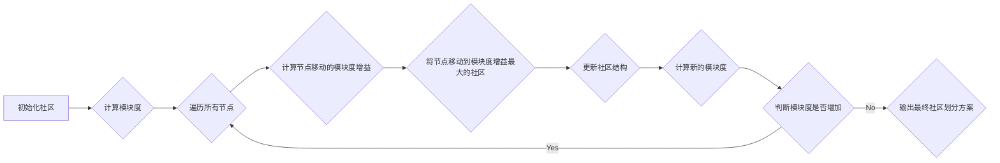

## 1. 背景介绍

### 1.1 社区发现问题的起源

在社交网络、生物网络、信息网络等复杂网络中，节点往往会形成一些紧密连接的群体，这些群体被称为“社区”。社区发现算法旨在将网络中的节点划分到不同的社区中，使得社区内部连接紧密，而社区之间连接稀疏。社区发现算法在社交网络分析、生物信息学、推荐系统等领域具有广泛的应用价值。

### 1.2 Louvain算法的优势

Louvain算法是一种基于模块度的启发式算法，其目标是找到网络中模块度最高的社区划分方案。模块度是衡量社区划分质量的一种指标，它反映了社区内部连接的紧密度和社区之间连接的稀疏程度。Louvain算法具有以下优势：

* **高效性:** Louvain算法的时间复杂度较低，能够处理大规模网络。
* **简单易懂:** Louvain算法的原理简单易懂，容易实现。
* **良好的性能:** Louvain算法在许多实际应用中表现出良好的性能，能够找到高质量的社区划分方案。

### 1.3 本文的组织结构

本文将深入探讨Louvain社区发现算法的原理、实现和应用。文章结构如下：

* **背景介绍:**  介绍社区发现问题的起源和Louvain算法的优势。
* **核心概念与联系:**  介绍Louvain算法的核心概念，包括模块度、社区结构和节点移动。
* **核心算法原理具体操作步骤:**  详细介绍Louvain算法的步骤，并给出算法流程图。
* **数学模型和公式详细讲解举例说明:**  给出Louvain算法的数学模型和公式，并通过实例说明算法的计算过程。
* **项目实践：代码实例和详细解释说明:**  提供Louvain算法的Python代码实现，并对代码进行详细解释说明。
* **实际应用场景:**  介绍Louvain算法在社交网络分析、生物信息学和推荐系统等领域的应用场景。
* **工具和资源推荐:**  推荐一些用于社区发现的工具和资源。
* **总结：未来发展趋势与挑战:**  总结Louvain算法的优缺点，并展望社区发现领域的未来发展趋势和挑战。
* **附录：常见问题与解答:**  解答一些关于Louvain算法的常见问题。

## 2. 核心概念与联系

### 2.1 模块度

**模块度 (Modularity)** 是衡量社区划分质量的一种指标，它反映了社区内部连接的紧密度和社区之间连接的稀疏程度。模块度定义为：

$$
Q = \frac{1}{2m} \sum_{i,j} \left( A_{ij} - \frac{k_i k_j}{2m} \right) \delta(c_i, c_j)
$$

其中：

* $m$ 是网络中边的总数。
* $A_{ij}$ 是网络的邻接矩阵，如果节点 $i$ 和节点 $j$ 之间存在边，则 $A_{ij} = 1$，否则 $A_{ij} = 0$。
* $k_i$ 是节点 $i$ 的度，即与节点 $i$ 相连的边的数量。
* $c_i$ 是节点 $i$ 所属的社区。
* $\delta(c_i, c_j)$ 是克罗内克函数，如果 $c_i = c_j$，则 $\delta(c_i, c_j) = 1$，否则 $\delta(c_i, c_j) = 0$。

模块度的取值范围为 $[-1, 1]$，模块度越高，表示社区划分方案越好。

### 2.2 社区结构

**社区结构 (Community Structure)**  是指网络中节点的聚类情况。一个良好的社区结构应该满足以下条件：

* 社区内部连接紧密。
* 社区之间连接稀疏。

### 2.3 节点移动

**节点移动 (Node Movement)** 是Louvain算法的核心操作。在Louvain算法中，节点可以从一个社区移动到另一个社区，以提高网络的模块度。节点移动的依据是模块度增益，即节点移动后模块度的变化量。

## 3. 核心算法原理具体操作步骤

### 3.1 算法流程图



### 3.2 算法步骤

Louvain算法的步骤如下：

1. **初始化社区:** 将每个节点都视为一个独立的社区。
2. **计算模块度:**  计算当前社区划分方案的模块度。
3. **遍历所有节点:** 
    * **计算节点移动的模块度增益:**  对于每个节点，计算将其移动到其他社区后模块度的变化量。
    * **将节点移动到模块度增益最大的社区:**  将节点移动到模块度增益最大的社区。
    * **更新社区结构:**  更新社区结构，将移动后的节点加入到新的社区中。
4. **计算新的模块度:**  计算新的社区划分方案的模块度。
5. **判断模块度是否增加:**  如果模块度增加，则返回步骤 3，继续迭代；否则，算法终止，输出最终的社区划分方案。

## 4. 数学模型和公式详细讲解举例说明

### 4.1 模块度增益的计算

将节点 $i$ 从社区 $C_i$ 移动到社区 $C_j$ 后，模块度的变化量 $\Delta Q$ 可以表示为：

$$
\Delta Q = \left[ \frac{\Sigma_{in} + k_{i,in}}{2m} - \left( \frac{\Sigma_{tot} + k_i}{2m} \right)^2 \right] - \left[ \frac{\Sigma_{in}}{2m} - \left( \frac{\Sigma_{tot}}{2m} \right)^2 - \left( \frac{k_i}{2m} \right)^2 \right]
$$

其中：

* $\Sigma_{in}$ 是社区 $C_j$ 内部边的权重之和。
* $k_{i,in}$ 是节点 $i$ 与社区 $C_j$ 内部节点之间的边权重之和。
* $\Sigma_{tot}$ 是网络中所有边的权重之和。
* $k_i$ 是节点 $i$ 的度。

### 4.2 举例说明

假设有一个网络，其邻接矩阵如下：

```
[[0, 1, 1, 0, 0],
 [1, 0, 1, 0, 0],
 [1, 1, 0, 1, 0],
 [0, 0, 1, 0, 1],
 [0, 0, 0, 1, 0]]
```

初始社区划分方案为：

* 社区 1: {1, 2}
* 社区 2: {3, 4, 5}

现在考虑将节点 3 从社区 2 移动到社区 1。

* $\Sigma_{in} = 2$ (社区 1 内部边的权重之和)
* $k_{3,in} = 2$ (节点 3 与社区 1 内部节点之间的边权重之和)
* $\Sigma_{tot} = 6$ (网络中所有边的权重之和)
* $k_3 = 3$ (节点 3 的度)

将上述值代入模块度增益公式，得到：

$$
\Delta Q = \left[ \frac{2 + 2}{2 \times 6} - \left( \frac{6 + 3}{2 \times 6} \right)^2 \right] - \left[ \frac{2}{2 \times 6} - \left( \frac{6}{2 \times 6} \right)^2 - \left( \frac{3}{2 \times 6} \right)^2 \right] = 0.0278
$$

由于 $\Delta Q > 0$，因此将节点 3 从社区 2 移动到社区 1 可以提高网络的模块度。

## 5. 项目实践：代码实例和详细解释说明

### 5.1 Python代码实现

```python
import networkx as nx

def louvain(G):
    """
    Louvain社区发现算法

    参数:
        G: NetworkX图对象

    返回值:
        communities: 社区划分方案，列表类型，每个元素是一个社区的节点列表
    """

    # 初始化社区
    communities = list(nx.connected_components(G))

    # 计算初始模块度
    m = G.number_of_edges()
    Q = nx.community.modularity(G, communities)

    # 迭代优化社区划分方案
    while True:
        # 遍历所有节点
        for node in G.nodes():
            # 获取节点当前所在的社区
            current_community = None
            for i, community in enumerate(communities):
                if node in community:
                    current_community = i
                    break

            # 计算节点移动到其他社区的模块度增益
            max_delta_Q = 0
            best_community = current_community
            for i, community in enumerate(communities):
                if i == current_community:
                    continue

                # 计算模块度增益
                delta_Q = calculate_delta_Q(G, communities, node, i)

                # 更新最大模块度增益和最佳社区
                if delta_Q > max_delta_Q:
                    max_delta_Q = delta_Q
                    best_community = i

            # 将节点移动到模块度增益最大的社区
            if best_community != current_community:
                communities[current_community].remove(node)
                communities[best_community].add(node)

                # 更新模块度
                Q += max_delta_Q

        # 判断模块度是否增加
        if max_delta_Q == 0:
            break

    return communities

def calculate_delta_Q(G, communities, node, target_community):
    """
    计算节点移动到目标社区后的模块度增益

    参数:
        G: NetworkX图对象
        communities: 社区划分方案
        node: 节点
        target_community: 目标社区

    返回值:
        delta_Q: 模块度增益
    """

    m = G.number_of_edges()
    k_i = G.degree(node)

    # 计算社区内部边的权重之和
    sigma_in = sum([G[u][v]['weight'] for u in communities[target_community] for v in communities[target_community] if u != v])

    # 计算节点与社区内部节点之间的边权重之和
    k_i_in = sum([G[node][v]['weight'] for v in communities[target_community]])

    # 计算网络中所有边的权重之和
    sigma_tot = sum([G[u][v]['weight'] for u in G.nodes() for v in G.nodes() if u != v])

    # 计算模块度增益
    delta_Q = ((sigma_in + k_i_in) / (2 * m) - ((sigma_tot + k_i) / (2 * m))**2) - (sigma_in / (2 * m) - (sigma_tot / (2 * m))**2 - (k_i / (2 * m))**2)

    return delta_Q
```

### 5.2 代码解释说明

* `louvain(G)` 函数是Louvain算法的实现，它接收一个NetworkX图对象 `G` 作为输入，返回社区划分方案 `communities`，`communities` 是一个列表，每个元素是一个社区的节点列表。
* `calculate_delta_Q(G, communities, node, target_community)` 函数用于计算节点移动到目标社区后的模块度增益，它接收NetworkX图对象 `G`、社区划分方案 `communities`、节点 `node` 和目标社区 `target_community` 作为输入，返回模块度增益 `delta_Q`。
* 代码中使用了NetworkX库来处理图数据，并使用了 `nx.community.modularity` 函数来计算模块度。

## 6. 实际应用场景

### 6.1 社交网络分析

Louvain算法可以用于分析社交网络中的社区结构，例如：

* **识别社交圈子:**  识别社交网络中的用户群体，例如朋友圈、兴趣小组等。
* **分析用户行为:**  分析不同社区用户的行为特征，例如兴趣爱好、消费习惯等。
* **进行用户推荐:**  根据用户的社区归属，向用户推荐相关的内容或好友。

### 6.2 生物信息学

Louvain算法可以用于分析生物网络中的社区结构，例如：

* **识别蛋白质复合物:**  识别蛋白质相互作用网络中的蛋白质复合物。
* **分析基因功能:**  分析基因共表达网络中的基因功能模块。
* **进行药物靶点预测:**  根据药物靶点网络中的社区结构，预测潜在的药物靶点。

### 6.3 推荐系统

Louvain算法可以用于构建基于社区的推荐系统，例如：

* **商品推荐:**  根据用户的社区归属，向用户推荐相关的商品。
* **好友推荐:**  根据用户的社区归属，向用户推荐相关的好友。
* **新闻推荐:**  根据用户的社区归属，向用户推荐相关的新闻。

## 7. 工具和资源推荐

### 7.1 NetworkX

NetworkX是一个用于创建、操作和研究复杂网络的Python库。它提供了丰富的功能，包括图生成、图分析、社区发现等。

### 7.2 Gephi

Gephi是一个用于可视化和分析网络的开源软件。它提供了友好的用户界面，支持多种图布局算法和社区发现算法。

### 7.3 igraph

igraph是一个用于网络分析的C库，它也提供了Python接口。igraph支持多种社区发现算法，包括Louvain算法。

## 8. 总结：未来发展趋势与挑战

### 8.1 算法的优缺点

Louvain算法的优点：

* 高效性
* 简单易懂
* 良好的性能

Louvain算法的缺点：

* 容易陷入局部最优解
* 对初始社区划分方案敏感

### 8.2 未来发展趋势

社区发现领域未来的发展趋势包括：

* **发展更精确的社区划分算法:**  研究新的社区划分指标，并开发更精确的社区划分算法。
* **处理动态网络:**  研究如何处理动态变化的网络，例如社交网络、生物网络等。
* **结合其他数据源:**  将社区发现算法与其他数据源结合，例如文本数据、地理位置数据等，以获得更全面的社区信息。

### 8.3 面临的挑战

社区发现领域面临的挑战包括：

* **大规模网络的处理:**  如何高效地处理大规模网络，例如包含数十亿节点和边的社交网络。
* **社区结构的评估:**  如何有效地评估社区划分方案的质量。
* **社区发现的应用:**  如何将社区发现算法应用到更广泛的领域，例如金融、医疗等。

## 8. 附录：常见问题与解答

### 8.1 Louvain算法的时间复杂度是多少？

Louvain算法的时间复杂度为 $O(n \log n)$，其中 $n$ 是网络中节点的数量。

### 8.2 Louvain算法如何处理加权网络？

Louvain算法可以处理加权网络，只需要在计算模块度增益时考虑边的权重即可。

### 8.3 Louvain算法如何处理有向网络？

Louvain算法可以处理有向网络，只需要将有向网络转换为无向网络即可。例如，可以使用以下方法将有向网络转换为无向网络：

* 将每条有向边转换为两条无向边，边的权重为原始有向边的权重。
* 将每条有向边转换为一条无向边，边的权重为原始有向边的权重的一半。

### 8.4 Louvain算法的应用有哪些？

Louvain算法在社交网络分析、生物信息学、推荐系统等领域具有广泛的应用价值。

### 8.5 Louvain算法的未来发展方向是什么？

Louvain算法未来的发展方向包括：

* 发展更精确的社区划分算法
* 处理动态网络
* 结合其他数据源