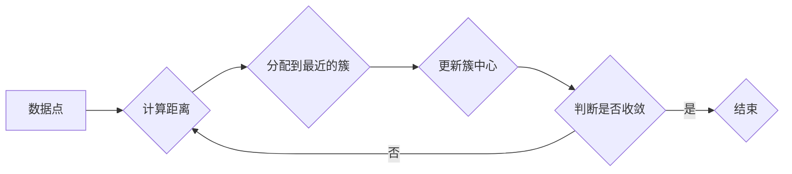

## 1. 背景介绍

### 1.1 聚类分析概述

聚类分析是一种无监督学习方法，旨在将数据集中的对象分组到不同的簇中，使得同一簇内的对象彼此相似，而不同簇之间的对象则彼此相异。它是数据挖掘、机器学习和模式识别领域中的一项重要任务，广泛应用于市场细分、图像分割、异常检测等领域。

### 1.2 Mahout简介

Apache Mahout是一个开源的机器学习库，提供了丰富的机器学习算法实现，包括聚类、分类、推荐和降维等。Mahout构建于Hadoop之上，能够处理大规模数据集，并利用MapReduce框架进行分布式计算。

### 1.3 Mahout聚类算法

Mahout提供了多种聚类算法，包括：

* **K-Means**：一种基于划分的聚类算法，将数据点分配到k个簇中，使得每个数据点都属于距离其最近的簇中心点所在的簇。
* **Fuzzy K-Means**：K-Means算法的变体，允许数据点属于多个簇，并为每个数据点分配一个隶属度值，表示其属于每个簇的程度。
* **Canopy Clustering**：一种快速、高效的聚类算法，用于生成初始簇中心，然后使用其他算法进行细化。
* **Spectral Clustering**：一种基于图论的聚类算法，将数据点视为图中的节点，并根据节点之间的相似性进行聚类。
* **Dirichlet Process Mixture Models**：一种非参数贝叶斯聚类算法，能够自动确定簇的数量。


## 2. 核心概念与联系

### 2.1 数据点、特征和距离

* **数据点**：聚类分析的对象，可以是文本、图像、用户行为等。
* **特征**：用于描述数据点的属性，例如身高、体重、年龄等。
* **距离**：用于衡量数据点之间相似性的度量，例如欧氏距离、曼哈顿距离、余弦相似度等。

### 2.2 簇、簇中心和簇半径

* **簇**：一组彼此相似的数据点的集合。
* **簇中心**：代表簇的中心点，通常是簇内数据点的平均值。
* **簇半径**：衡量簇的大小，通常是簇中心到簇内最远数据点的距离。

### 2.3 聚类算法的目标函数

聚类算法的目标是找到最佳的簇划分，使得簇内相似度最大化，簇间相似度最小化。常用的目标函数包括：

* **平方误差和（SSE）**：每个数据点到其所属簇中心的距离的平方和。
* **轮廓系数**：衡量簇的紧凑性和分离度，取值范围为[-1, 1]，值越大表示聚类效果越好。

## 3. 核心算法原理具体操作步骤

### 3.1 K-Means算法

#### 3.1.1 算法步骤

1. 随机选择k个数据点作为初始簇中心。
2. 将每个数据点分配到距离其最近的簇中心所在的簇。
3. 重新计算每个簇的中心点，作为新的簇中心。
4. 重复步骤2和3，直到簇中心不再发生变化或达到最大迭代次数。

#### 3.1.2 算法图解



### 3.2 Fuzzy K-Means算法

#### 3.2.1 算法步骤

1. 随机选择k个数据点作为初始簇中心。
2. 为每个数据点分配一个隶属度值，表示其属于每个簇的程度。
3. 根据隶属度值，重新计算每个簇的中心点。
4. 重复步骤2和3，直到簇中心不再发生变化或达到最大迭代次数。

#### 3.2.2 隶属度函数

Fuzzy K-Means算法使用隶属度函数来计算数据点属于每个簇的程度。常用的隶属度函数包括：

* **线性隶属度函数**
* **高斯隶属度函数**

### 3.3 Canopy Clustering算法

#### 3.3.1 算法步骤

1. 随机选择一个数据点作为初始Canopy。
2. 计算其他数据点到该Canopy的距离。
3. 如果距离小于T1，则将该数据点加入到Canopy中。
4. 如果距离小于T2，则将该数据点从数据集中移除。
5. 重复步骤1-4，直到所有数据点都被分配到Canopy中。
6. 使用其他聚类算法对Canopy进行细化。

#### 3.3.2 T1和T2

T1和T2是Canopy Clustering算法的两个参数，用于控制Canopy的大小。T1通常设置为T2的两倍。

## 4. 数学模型和公式详细讲解举例说明

### 4.1 K-Means算法的数学模型

K-Means算法的目标函数是平方误差和（SSE）：

$$
SSE = \sum_{i=1}^{k} \sum_{x \in C_i} ||x - \mu_i||^2
$$

其中，k是簇的数量，$C_i$表示第i个簇，$x$表示数据点，$\mu_i$表示第i个簇的中心点。

### 4.2 Fuzzy K-Means算法的数学模型

Fuzzy K-Means算法的目标函数是加权平方误差和：

$$
J = \sum_{i=1}^{k} \sum_{j=1}^{n} u_{ij}^m ||x_j - \mu_i||^2
$$

其中，$n$是数据点的数量，$u_{ij}$表示第j个数据点属于第i个簇的隶属度值，$m$是模糊系数，用于控制模糊程度。

### 4.3 举例说明

假设有一个数据集，包含5个数据点：

```
x1 = (1, 1)
x2 = (2, 2)
x3 = (3, 3)
x4 = (4, 4)
x5 = (5, 5)
```

使用K-Means算法将这些数据点聚类到2个簇中。

1. 随机选择x1和x5作为初始簇中心。
2. 计算每个数据点到两个簇中心的距离：

```
||x1 - x1|| = 0
||x1 - x5|| = 5.66
||x2 - x1|| = 1.41
||x2 - x5|| = 4.24
||x3 - x1|| = 2.83
||x3 - x5|| = 2.83
||x4 - x1|| = 4.24
||x4 - x5|| = 1.41
||x5 - x1|| = 5.66
||x5 - x5|| = 0
```

3. 将每个数据点分配到距离其最近的簇中心所在的簇：

```
C1 = {x1, x2}
C2 = {x3, x4, x5}
```

4. 重新计算每个簇的中心点：

```
mu1 = (1.5, 1.5)
mu2 = (4, 4)
```

5. 重复步骤2-4，直到簇中心不再发生变化。

最终的聚类结果为：

```
C1 = {x1, x2}
C2 = {x3, x4, x5}
```

## 5. 项目实践：代码实例和详细解释说明

### 5.1 数据集

本例使用Iris数据集进行演示。Iris数据集包含150个数据点，每个数据点包含4个特征：萼片长度、萼片宽度、花瓣长度和花瓣宽度。数据集分为3类：山鸢尾、变色鸢尾和维吉尼亚鸢尾。

### 5.2 代码实例

```java
import org.apache.mahout.clustering.kmeans.KMeansDriver;
import org.apache.mahout.common.distance.EuclideanDistanceMeasure;
import org.apache.mahout.math.Vector;
import org.apache.mahout.math.VectorWritable;
import org.apache.hadoop.conf.Configuration;
import org.apache.hadoop.fs.FileSystem;
import org.apache.hadoop.fs.Path;
import org.apache.hadoop.io.IntWritable;
import org.apache.hadoop.io.SequenceFile;
import java.io.IOException;
import java.util.List;

public class KMeansExample {

    public static void main(String[] args) throws Exception {

        // 数据集路径
        String inputPath = "/path/to/iris.csv";
        // 输出路径
        String outputPath = "/path/to/output";
        // 簇的数量
        int k = 3;
        // 最大迭代次数
        int maxIterations = 10;
        // 距离度量
        EuclideanDistanceMeasure distanceMeasure = new EuclideanDistanceMeasure();

        // 创建配置
        Configuration conf = new Configuration();

        // 加载数据集
        List<Vector> data = loadData(conf, inputPath);

        // 运行K-Means算法
        KMeansDriver.run(conf, new Path(inputPath), new Path(outputPath), distanceMeasure, k, maxIterations, true, 0.001, true);

        // 打印聚类结果
        printClusters(conf, outputPath);
    }

    // 加载数据集
    private static List<Vector> loadData(Configuration conf, String inputPath) throws IOException {
        // TODO: 实现加载数据集的逻辑
        return null;
    }

    // 打印聚类结果
    private static void printClusters(Configuration conf, String outputPath) throws IOException {
        // TODO: 实现打印聚类结果的逻辑
    }
}
```

### 5.3 代码解释

* `KMeansDriver.run()`方法用于运行K-Means算法。
* `distanceMeasure`参数指定距离度量，本例使用欧氏距离。
* `k`参数指定簇的数量。
* `maxIterations`参数指定最大迭代次数。
* `loadData()`方法用于加载数据集。
* `printClusters()`方法用于打印聚类结果。

## 6. 实际应用场景

### 6.1 市场细分

聚类分析可以用于将客户群体划分为不同的细分市场，以便企业针对不同的客户群体制定不同的营销策略。

### 6.2 图像分割

聚类分析可以用于将图像分割成不同的区域，例如前景和背景。

### 6.3 异常检测

聚类分析可以用于识别数据集中的异常点，例如信用卡欺诈交易。

## 7. 总结：未来发展趋势与挑战

### 7.1 未来发展趋势

* **深度聚类**：将深度学习技术应用于聚类分析，以提高聚类效果。
* **自动聚类**：开发能够自动确定最佳簇数量的聚类算法。
* **高维数据聚类**：开发能够处理高维数据的聚类算法。

### 7.2 挑战

* **数据噪声**：数据噪声会影响聚类效果。
* **高维数据**：高维数据会增加聚类算法的计算复杂度。
* **可解释性**：聚类结果的可解释性是一个挑战。

## 8. 附录：常见问题与解答

### 8.1 如何选择最佳的簇数量？

可以使用肘部法则或轮廓系数来确定最佳的簇数量。

### 8.2 如何评估聚类效果？

可以使用轮廓系数、Calinski-Harabasz指数等指标来评估聚类效果。

### 8.3 如何处理数据噪声？

可以使用数据预处理技术来去除数据噪声，例如数据清洗、数据标准化等。
