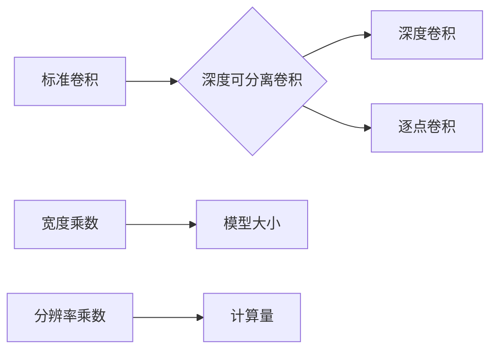

## 1. 背景介绍

### 1.1 移动设备视觉任务的挑战

近年来，随着移动设备的普及和计算能力的提升，在移动设备上运行深度学习模型的需求越来越大，例如图像分类、目标检测、人脸识别等。然而，移动设备的资源有限，包括计算能力、内存和电池寿命，这给深度学习模型的设计和部署带来了挑战。传统的深度神经网络模型，如VGG、ResNet，通常参数量巨大，计算复杂度高，难以直接部署到移动设备上。

### 1.2 MobileNet的诞生

为了解决移动设备视觉任务的挑战，谷歌团队在2017年提出了MobileNet模型。MobileNet是一种轻量级卷积神经网络，专为移动设备和嵌入式应用而设计。它在保持较高准确率的同时，显著减少了模型的参数量和计算量，使得模型能够高效地运行在移动设备上。

### 1.3 MobileNet的优势

* **轻量化:** MobileNet采用深度可分离卷积，大大减少了模型的参数量和计算量。
* **高效性:** MobileNet在移动设备上能够快速运行，满足实时应用的需求。
* **灵活性:** MobileNet可以通过宽度乘数和分辨率乘数来调整模型的大小和计算量，以适应不同的应用场景和设备。

## 2. 核心概念与联系

### 2.1 深度可分离卷积

MobileNet的核心是深度可分离卷积（Depthwise Separable Convolution），它将标准卷积分解为两个步骤：深度卷积（Depthwise Convolution）和逐点卷积（Pointwise Convolution）。

* **深度卷积:** 对每个输入通道单独应用一个卷积核，提取空间特征。
* **逐点卷积:** 使用1x1卷积核将深度卷积的输出通道进行线性组合，融合通道信息。

深度可分离卷积相比标准卷积，可以显著减少参数量和计算量。

### 2.2 宽度乘数

宽度乘数（Width Multiplier）是一个用于控制模型大小的超参数。它可以按比例缩放每层的通道数，从而减小模型的宽度。例如，宽度乘数为0.75时，每层的通道数将减少25%。

### 2.3 分辨率乘数

分辨率乘数（Resolution Multiplier）是一个用于控制输入图像分辨率的超参数。它可以按比例缩放输入图像的宽度和高度，从而减小模型的计算量。例如，分辨率乘数为0.75时，输入图像的宽度和高度将减少25%。

### 2.4 核心概念联系

深度可分离卷积、宽度乘数和分辨率乘数是MobileNet的核心概念，它们相互联系，共同作用，实现了模型的轻量化和高效性。



## 3. 核心算法原理具体操作步骤

### 3.1 深度可分离卷积操作步骤

1. 将输入张量按照通道维度切片成多个独立的通道。
2. 对每个通道应用一个独立的卷积核进行深度卷积，提取空间特征。
3. 将深度卷积的输出张量拼接起来。
4. 使用1x1卷积核对拼接后的张量进行逐点卷积，融合通道信息。

### 3.2 宽度乘数操作步骤

1. 根据宽度乘数计算每层的目标通道数。
2. 在模型构建过程中，将每层的通道数设置为目标通道数。

### 3.3 分辨率乘数操作步骤

1. 根据分辨率乘数计算输入图像的目标宽度和高度。
2. 在数据预处理过程中，将输入图像的宽度和高度缩放至目标尺寸。

## 4. 数学模型和公式详细讲解举例说明

### 4.1 深度可分离卷积计算量

假设输入张量的尺寸为 $D_F \times D_F \times M$，卷积核的尺寸为 $D_K \times D_K \times M \times N$，则标准卷积的计算量为：

$$
D_K \times D_K \times M \times N \times D_F \times D_F
$$

深度可分离卷积的计算量为：

$$
D_K \times D_K \times M \times D_F \times D_F + M \times N \times D_F \times D_F
$$

可以看出，深度可分离卷积的计算量远小于标准卷积。

### 4.2 宽度乘数计算公式

假设原始通道数为 $M$，宽度乘数为 $\alpha$，则目标通道数为：

$$
\alpha \times M
$$

### 4.3 分辨率乘数计算公式

假设原始图像宽度和高度为 $W$ 和 $H$，分辨率乘数为 $\rho$，则目标图像宽度和高度为：

$$
\rho \times W \quad \text{和} \quad \rho \times H
$$

## 5. 项目实践：代码实例和详细解释说明

### 5.1 TensorFlow实现MobileNetV1

```python
import tensorflow as tf

def depthwise_separable_conv(inputs, filters, kernel_size, strides, padding):
  """深度可分离卷积模块."""
  x = tf.keras.layers.DepthwiseConv2D(
      kernel_size=kernel_size,
      strides=strides,
      padding=padding,
      use_bias=False)(inputs)
  x = tf.keras.layers.BatchNormalization()(x)
  x = tf.keras.layers.ReLU()(x)
  x = tf.keras.layers.Conv2D(
      filters=filters,
      kernel_size=1,
      strides=1,
      padding='same',
      use_bias=False)(x)
  x = tf.keras.layers.BatchNormalization()(x)
  x = tf.keras.layers.ReLU()(x)
  return x

def MobileNetV1(input_shape, classes, width_multiplier=1.0):
  """MobileNetV1模型."""
  inputs = tf.keras.Input(shape=input_shape)
  x = tf.keras.layers.Conv2D(
      filters=int(32 * width_multiplier),
      kernel_size=3,
      strides=2,
      padding='same',
      use_bias=False)(inputs)
  x = tf.keras.layers.BatchNormalization()(x)
  x = tf.keras.layers.ReLU()(x)
  x = depthwise_separable_conv(x, int(64 * width_multiplier), 3, 1, 'same')
  x = depthwise_separable_conv(x, int(128 * width_multiplier), 3, 2, 'same')
  x = depthwise_separable_conv(x, int(128 * width_multiplier), 3, 1, 'same')
  x = depthwise_separable_conv(x, int(256 * width_multiplier), 3, 2, 'same')
  x = depthwise_separable_conv(x, int(256 * width_multiplier), 3, 1, 'same')
  x = depthwise_separable_conv(x, int(512 * width_multiplier), 3, 2, 'same')
  for _ in range(5):
    x = depthwise_separable_conv(x, int(512 * width_multiplier), 3, 1, 'same')
  x = depthwise_separable_conv(x, int(1024 * width_multiplier), 3, 2, 'same')
  x = depthwise_separable_conv(x, int(1024 * width_multiplier), 3, 1, 'same')
  x = tf.keras.layers.GlobalAveragePooling2D()(x)
  outputs = tf.keras.layers.Dense(classes, activation='softmax')(x)
  model = tf.keras.Model(inputs=inputs, outputs=outputs)
  return model
```

### 5.2 代码解释

* `depthwise_separable_conv`函数实现了深度可分离卷积模块，包括深度卷积、批归一化、ReLU激活函数、逐点卷积、批归一化和ReLU激活函数。
* `MobileNetV1`函数构建了MobileNetV1模型，包括一系列深度可分离卷积层、全局平均池化层和全连接层。
* `width_multiplier`参数用于控制模型的宽度，默认值为1.0。

## 6. 实际应用场景

### 6.1 图像分类

MobileNet可以用于图像分类任务，例如识别物体、场景、人物等。

### 6.2 目标检测

MobileNet可以作为目标检测模型的骨干网络，例如SSD、YOLO等。

### 6.3 人脸识别

MobileNet可以用于人脸识别任务，例如人脸验证、人脸识别等。

### 6.4 其他应用

MobileNet还可以应用于其他视觉任务，例如图像分割、姿态估计、图像生成等。

## 7. 工具和资源推荐

### 7.1 TensorFlow

TensorFlow是一个开源的机器学习平台，提供了丰富的工具和资源，可以用于构建、训练和部署MobileNet模型。

### 7.2 Keras

Keras是一个高级神经网络API，运行在TensorFlow之上，提供了简洁易用的接口，可以方便地构建MobileNet模型。

### 7.3 MobileNet官方网站

MobileNet官方网站提供了MobileNet模型的详细信息、代码示例和预训练模型。

## 8. 总结：未来发展趋势与挑战

### 8.1 未来发展趋势

* **更高效的模型架构:** 研究人员正在探索更高效的模型架构，以进一步提升模型的性能和效率。
* **更广泛的应用场景:** MobileNet的应用场景将不断扩展，涵盖更多的视觉任务和领域。
* **更智能的模型压缩技术:** 模型压缩技术将不断发展，以进一步减小模型的尺寸和计算量。

### 8.2 挑战

* **模型精度与效率的平衡:** 在追求更高效的同时，需要保持模型的精度，这是一个挑战。
* **模型部署的复杂性:** 将MobileNet模型部署到不同的移动设备上，需要解决兼容性、性能优化等问题。
* **数据隐私和安全:** 在移动设备上运行深度学习模型，需要关注数据隐私和安全问题。

## 9. 附录：常见问题与解答

### 9.1 MobileNet的版本区别

MobileNet有多个版本，包括MobileNetV1、MobileNetV2、MobileNetV3等。不同版本之间主要区别在于模型架构、性能和效率。

### 9.2 如何选择合适的MobileNet模型

选择合适的MobileNet模型需要考虑应用场景、设备资源、精度要求等因素。

### 9.3 如何优化MobileNet模型的性能

可以通过调整宽度乘数、分辨率乘数、量化等方法来优化MobileNet模型的性能。
