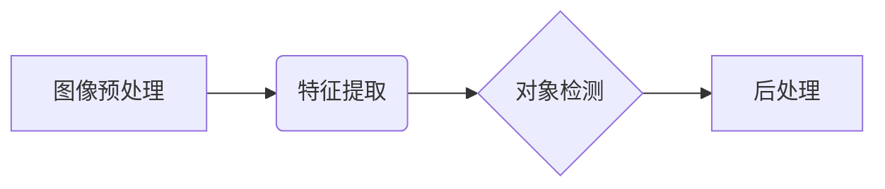

# Python深度学习实践：手把手教你利用YOLO进行对象检测

作者：禅与计算机程序设计艺术

## 1. 背景介绍

### 1.1 对象检测的意义

在计算机视觉领域，对象检测是一项基础且关键的任务，其目标是在图像或视频中定位并识别出特定类型的对象。这项技术在许多领域都有着广泛的应用，例如：

* **自动驾驶：**  检测车辆、行人、交通信号灯等，为车辆导航和安全行驶提供保障。
* **安防监控：**  识别可疑人员、物体，及时发出警报，保障公共安全。
* **医疗影像分析：**  辅助医生诊断疾病，例如识别肿瘤、病变区域等。
* **工业自动化：**  检测产品缺陷，提高生产效率和产品质量。

### 1.2 YOLO算法的优势

YOLO (You Only Look Once) 是一种高效且精确的对象检测算法，其主要优势在于：

* **速度快：**  YOLO 能够实时地处理图像和视频，因为它只需要对图像进行一次前向传播就可以完成检测。
* **精度高：**  YOLO 在保持高速度的同时，也能够达到很高的检测精度。
* **易于实现：**  YOLO 的算法结构相对简单，易于理解和实现。

## 2. 核心概念与联系

### 2.1 卷积神经网络 (CNN)

YOLO 算法的核心是卷积神经网络 (CNN)，它是一种专门用于处理图像数据的深度学习模型。CNN 通过卷积层、池化层等操作，能够有效地提取图像的特征，并将其用于对象检测。

### 2.2 边界框回归 (Bounding Box Regression)

YOLO 算法通过边界框回归来预测对象的位置和大小。边界框是一个矩形框，用于框住图像中的对象。YOLO 会预测边界框的中心坐标、宽度和高度，从而精确定位对象。

### 2.3 非极大值抑制 (Non-Maximum Suppression)

在进行对象检测时，可能会出现多个边界框重叠的情况。非极大值抑制 (NMS) 是一种用于消除重叠边界框的算法。NMS 会根据边界框的置信度得分，保留得分最高的边界框，并抑制其他重叠的边界框。

## 3. 核心算法原理具体操作步骤

### 3.1 图像预处理

在将图像输入 YOLO 模型之前，需要进行一些预处理操作，例如：

* **缩放：**  将图像缩放至 YOLO 模型的输入尺寸。
* **归一化：**  将图像的像素值归一化到 [0, 1] 范围内。

### 3.2 特征提取

YOLO 模型使用 CNN 来提取图像的特征。CNN 通过卷积层、池化层等操作，能够有效地捕捉图像的局部和全局特征。

### 3.3 对象检测

YOLO 模型将提取到的特征输入到检测层，检测层会预测边界框和类别概率。

### 3.4 后处理

YOLO 模型的输出结果需要进行一些后处理操作，例如：

* **非极大值抑制：**  消除重叠的边界框。
* **置信度阈值过滤：**  过滤掉置信度得分低于阈值的边界框。

## 4. 数学模型和公式详细讲解举例说明

### 4.1 边界框参数化

YOLO 使用四个参数来表示边界框：

* $b_x$：边界框中心点的 x 坐标
* $b_y$：边界框中心点的 y 坐标
* $b_w$：边界框的宽度
* $b_h$：边界框的高度

### 4.2 类别概率

YOLO 会为每个边界框预测一个类别概率向量，表示边界框属于每个类别的概率。

### 4.3 损失函数

YOLO 使用一个多任务损失函数来训练模型，该损失函数包含三个部分：

* **边界框定位损失：**  衡量预测边界框与真实边界框之间的差异。
* **置信度损失：**  衡量预测边界框的置信度得分与真实置信度得分之间的差异。
* **分类损失：**  衡量预测类别概率与真实类别概率之间的差异。

## 5. 项目实践：代码实例和详细解释说明

```python
import cv2
import numpy as np

# 加载 YOLO 模型
net = cv2.dnn.readNet("yolov3.weights", "yolov3.cfg")

# 加载类别名称
classes = []
with open("coco.names", "r") as f:
    classes = [line.strip() for line in f.readlines()]

# 加载图像
image = cv2.imread("image.jpg")

# 获取图像尺寸
height, width, _ = image.shape

# 创建 blob
blob = cv2.dnn.blobFromImage(image, 1/255, (416, 416), (0,0,0), True, crop=False)

# 将 blob 输入到 YOLO 模型
net.setInput(blob)

# 获取模型输出
outs = net.forward(net.getUnconnectedOutLayersNames())

# 初始化边界框、置信度得分和类别 ID 列表
boxes = []
confidences = []
class_ids = []

# 遍历模型输出
for out in outs:
    for detection in out:
        # 获取类别概率
        scores = detection[5:]
        class_id = np.argmax(scores)
        confidence = scores[class_id]

        # 过滤掉置信度得分低于阈值的边界框
        if confidence > 0.5:
            # 获取边界框坐标
            center_x = int(detection[0] * width)
            center_y = int(detection[1] * height)
            w = int(detection[2] * width)
            h = int(detection[3] * height)

            # 计算边界框左上角坐标
            x = int(center_x - w / 2)
            y = int(center_y - h / 2)

            # 将边界框、置信度得分和类别 ID 添加到列表中
            boxes.append([x, y, w, h])
            confidences.append(float(confidence))
            class_ids.append(class_id)

# 应用非极大值抑制
indices = cv2.dnn.NMSBoxes(boxes, confidences, 0.5, 0.4)

# 绘制边界框和类别标签
for i in indices:
    i = i[0]
    box = boxes[i]
    x, y, w, h = box
    label = str(classes[class_ids[i]])
    confidence = confidences[i]
    cv2.rectangle(image, (x, y), (x + w, y + h), (0, 255, 0), 2)
    cv2.putText(image, f"{label} {confidence:.2f}", (x, y - 10), cv2.FONT_HERSHEY_SIMPLEX, 0.5, (0, 255, 0), 2)

# 显示结果
cv2.imshow("Image", image)
cv2.waitKey(0)
```

**代码解释：**

1. **加载 YOLO 模型：**  使用 `cv2.dnn.readNet()` 函数加载 YOLO 模型的权重文件和配置文件。
2. **加载类别名称：**  从 `coco.names` 文件中读取类别名称。
3. **加载图像：**  使用 `cv2.imread()` 函数加载图像。
4. **创建 blob：**  使用 `cv2.dnn.blobFromImage()` 函数将图像转换为 YOLO 模型的输入格式。
5. **将 blob 输入到 YOLO 模型：**  使用 `net.setInput()` 函数将 blob 输入到 YOLO 模型。
6. **获取模型输出：**  使用 `net.forward()` 函数获取 YOLO 模型的输出。
7. **遍历模型输出：**  遍历模型输出，获取边界框、置信度得分和类别 ID。
8. **应用非极大值抑制：**  使用 `cv2.dnn.NMSBoxes()` 函数消除重叠的边界框。
9. **绘制边界框和类别标签：**  使用 `cv2.rectangle()` 函数绘制边界框，使用 `cv2.putText()` 函数绘制类别标签。
10. **显示结果：**  使用 `cv2.imshow()` 函数显示结果。

## 6. 实际应用场景

### 6.1 自动驾驶

YOLO 可以用于自动驾驶系统中，例如检测车辆、行人、交通信号灯等，为车辆导航和安全行驶提供保障。

### 6.2 安防监控

YOLO 可以用于安防监控系统中，例如识别可疑人员、物体，及时发出警报，保障公共安全。

### 6.3 医疗影像分析

YOLO 可以用于医疗影像分析中，例如识别肿瘤、病变区域等，辅助医生诊断疾病。

### 6.4 工业自动化

YOLO 可以用于工业自动化中，例如检测产品缺陷，提高生产效率和产品质量。

## 7. 工具和资源推荐

### 7.1 OpenCV

OpenCV 是一个开源的计算机视觉库，提供了许多用于图像处理和分析的函数，包括 YOLO 对象检测。

### 7.2 Darknet

Darknet 是 YOLO 算法的官方框架，提供了 YOLO 模型的训练和推理代码。

### 7.3 COCO 数据集

COCO (Common Objects in Context) 数据集是一个大型的图像数据集，包含 80 个类别，超过 330,000 张图像。

## 8. 总结：未来发展趋势与挑战

### 8.1 发展趋势

* **更高效的模型：**  研究人员正在不断努力开发更高效的 YOLO 模型，以提高检测速度和精度。
* **更广泛的应用：**  YOLO 算法的应用领域将继续扩展，例如机器人、无人机、增强现实等。
* **更智能的检测：**  YOLO 算法将与其他技术相结合，例如目标跟踪、行为识别等，实现更智能的检测。

### 8.2 挑战

* **小目标检测：**  YOLO 算法在检测小目标时仍然存在挑战。
* **遮挡问题：**  当目标被遮挡时，YOLO 算法的检测精度会下降。
* **实时性要求：**  在一些应用场景中，例如自动驾驶，需要 YOLO 算法能够实时地处理图像和视频。

## 9. 附录：常见问题与解答

### 9.1 如何提高 YOLO 的检测精度？

* 使用更大的数据集进行训练。
* 使用更深的网络结构。
* 调整模型的超参数。

### 9.2 如何解决 YOLO 的小目标检测问题？

* 使用更高分辨率的图像。
* 使用多尺度检测技术。

### 9.3 如何解决 YOLO 的遮挡问题？

* 使用上下文信息。
* 使用目标跟踪技术。


## 10. Mermaid 流程图


