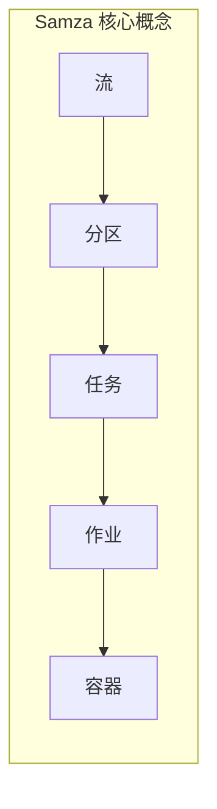

## 1. 背景介绍

### 1.1 流处理技术的兴起

近年来，随着大数据技术的快速发展，流处理技术也得到了越来越广泛的应用。与传统的批处理不同，流处理能够实时地处理持续不断产生的数据流，并及时地生成分析结果，这使得它在许多领域都具有重要的应用价值，例如：

* **实时监控:** 实时监控系统可以收集和分析来自各种来源的数据，例如传感器、网络设备和应用程序，以便及时发现异常情况并采取相应的措施。
* **欺诈检测:** 欺诈检测系统可以实时分析交易数据，识别潜在的欺诈行为，并及时采取措施防止损失。
* **个性化推荐:** 个性化推荐系统可以根据用户的实时行为和偏好，推荐最相关的产品或内容。

### 1.2 Samza的优势

Samza是LinkedIn开源的一款分布式流处理框架，它具有以下优势：

* **高吞吐量:** Samza能够处理高吞吐量的数据流，每秒可以处理数百万条消息。
* **低延迟:** Samza能够以低延迟处理数据流，通常延迟在毫秒级别。
* **容错性:** Samza具有高度的容错性，即使在某些节点发生故障的情况下，也能够继续正常运行。
* **易于使用:** Samza提供了一组简单的API，使得开发人员可以轻松地构建流处理应用程序。
* **可扩展性:** Samza可以轻松地扩展到大型集群，以处理更大的数据量。

### 1.3 Task在Samza中的作用

在Samza中，Task是处理数据流的基本单元。每个Task负责处理数据流的一部分，并将处理结果输出到下游的Task或外部系统。Task是Samza实现高吞吐量、低延迟和容错性的关键所在。

## 2. 核心概念与联系

### 2.1 流(Stream)

流是无限的、连续的数据序列。在Samza中，流被抽象为一个逻辑概念，它可以表示来自任何数据源的数据，例如Kafka、Flume或数据库。

### 2.2 分区(Partition)

分区是将流划分为多个子流的一种机制，它可以提高流处理的并行度和吞吐量。每个分区对应一个独立的Task，负责处理该分区的数据。

### 2.3 任务(Task)

任务是处理数据流的基本单元。每个Task负责处理一个分区的数据，并将处理结果输出到下游的Task或外部系统。

### 2.4 作业(Job)

作业是由多个Task组成的逻辑单元，它表示一个完整的流处理应用程序。一个作业可以包含多个输入流和输出流，以及多个中间处理步骤。

### 2.5 容器(Container)

容器是运行Task的物理单元。每个容器可以运行多个Task，并且容器之间可以进行通信。

### 2.6  概念联系图



## 3. 核心算法原理具体操作步骤

### 3.1 Task的执行流程

Samza Task的执行流程如下：

1. **初始化:** Task首先会初始化其状态，例如读取配置文件、连接到外部系统等。
2. **处理消息:** Task会从输入流中读取消息，并根据业务逻辑进行处理。
3. **输出结果:** Task会将处理结果输出到下游的Task或外部系统。
4. **提交偏移量:** Task会定期提交其处理的最新消息的偏移量，以便在发生故障时能够从上次提交的偏移量处恢复处理。

### 3.2 状态管理

Samza Task可以使用本地存储或外部存储来管理其状态。本地存储通常用于存储少量状态，例如计数器或缓存。外部存储通常用于存储大量状态，例如数据库或键值存储。

### 3.3 容错机制

Samza通过以下机制来实现容错：

* **检查点:** Task会定期将其状态保存到检查点，以便在发生故障时能够从检查点恢复。
* **偏移量管理:** Task会定期提交其处理的最新消息的偏移量，以便在发生故障时能够从上次提交的偏移量处恢复处理。
* **容器重启:** 当容器发生故障时，Samza会自动重启该容器，并从检查点恢复Task的状态。

## 4. 数学模型和公式详细讲解举例说明

### 4.1 吞吐量计算

Samza Task的吞吐量可以通过以下公式计算：

$$
吞吐量 = \frac{消息数量}{时间}
$$

例如，如果一个Task在一分钟内处理了1000条消息，则其吞吐量为16.67条消息/秒。

### 4.2 延迟计算

Samza Task的延迟可以通过以下公式计算：

$$
延迟 = 处理时间 - 消息创建时间
$$

例如，如果一条消息的创建时间是10:00:00，处理时间是10:00:01，则其延迟为1秒。

## 5. 项目实践：代码实例和详细解释说明

### 5.1 创建一个Samza项目

首先，我们需要创建一个Samza项目。可以使用Maven或Gradle来创建项目。

```
mvn archetype:generate -DarchetypeGroupId=org.apache.samza -DarchetypeArtifactId=samza-archetype-quickstart -DarchetypeVersion=0.14.0 -DgroupId=com.example -DartifactId=my-samza-job -Dversion=1.0.0-SNAPSHOT -Dpackage=com.example
```

### 5.2 编写Task代码

接下来，我们需要编写Task代码。以下是一个简单的WordCount Task的示例代码：

```java
public class WordCountTask extends StreamTask {

  private Counter wordCounts;

  @Override
  public void init(Config config, TaskContext context) {
    wordCounts = context.getStore("word-counts").as(KeyValueStore.class);
  }

  @Override
  public void process(IncomingMessageEnvelope envelope, MessageCollector collector, TaskCoordinator coordinator) {
    String message = (String) envelope.getMessage();
    String[] words = message.split("\\s+");
    for (String word : words) {
      wordCounts.put(word, wordCounts.getOrDefault(word, 0) + 1);
    }
  }
}
```

### 5.3 配置作业

最后，我们需要配置作业。以下是一个简单的WordCount作业的配置文件：

```yaml
job.name: word-count
job.default.system: kafka
task.class: com.example.WordCountTask
stores:
  - name: word-counts
    factory: org.apache.samza.storage.kv.RocksDbKeyValueStorageEngineFactory
systems:
  kafka:
    samza.factory: org.apache.samza.system.kafka.KafkaSystemFactory
    consumer.producer.shared.config:
      bootstrap.servers: kafka:9092
      security.protocol: PLAINTEXT
input.streams:
  - name: words
    system: kafka
    physical.topic: words
    samza.offset.default: oldest
```

### 5.4 运行作业

配置好作业后，我们可以使用Samza CLI来运行作业。

```
bin/run-app.sh --config-factory=org.apache.samza.config.factories.PropertiesConfigFactory --config-path=file://$PWD/config/word-count.properties
```

## 6. 实际应用场景

### 6.1 实时监控

Samza可以用于构建实时监控系统，例如监控网站流量、应用程序性能或服务器运行状况。

### 6.2 欺诈检测

Samza可以用于构建欺诈检测系统，例如检测信用卡欺诈、账户盗窃或网络钓鱼攻击。

### 6.3 个性化推荐

Samza可以用于构建个性化推荐系统，例如根据用户的浏览历史、购买记录或社交媒体活动推荐产品或内容。

## 7. 工具和资源推荐

### 7.1 Samza官网

Samza官网提供了丰富的文档、教程和示例代码，可以帮助你快速入门Samza。

### 7.2 Kafka官网

Kafka官网提供了Kafka的文档、教程和示例代码，可以帮助你了解Kafka的基本概念和使用方法。

### 7.3 Flume官网

Flume官网提供了Flume的文档、教程和示例代码，可以帮助你了解Flume的基本概念和使用方法。

## 8. 总结：未来发展趋势与挑战

### 8.1 未来发展趋势

* **流处理与机器学习的结合:** 流处理技术与机器学习技术的结合将成为未来发展的重要趋势，这将使得流处理系统能够更加智能地处理数据。
* **云原生流处理:** 云原生流处理将使得流处理系统更加易于部署和管理，并能够更好地利用云计算资源。
* **边缘计算:** 边缘计算将使得流处理能够在更靠近数据源的地方进行处理，从而降低延迟并提高效率。

### 8.2 挑战

* **数据质量:** 流处理系统需要处理大量的数据，因此数据质量是一个重要的挑战。
* **延迟:** 流处理系统需要以低延迟处理数据，因此延迟是一个重要的挑战。
* **可扩展性:** 流处理系统需要能够处理不断增长的数据量，因此可扩展性是一个重要的挑战。

## 9. 附录：常见问题与解答

### 9.1 如何提高Samza Task的吞吐量？

可以通过以下方法提高Samza Task的吞吐量：

* **增加分区数量:** 增加分区数量可以提高并行度，从而提高吞吐量。
* **优化Task代码:** 优化Task代码可以减少处理时间，从而提高吞吐量。
* **使用更高效的存储引擎:** 使用更高效的存储引擎可以减少状态管理的开销，从而提高吞吐量。

### 9.2 如何降低Samza Task的延迟？

可以通过以下方法降低Samza Task的延迟：

* **优化Task代码:** 优化Task代码可以减少处理时间，从而降低延迟。
* **使用本地存储:** 使用本地存储可以减少状态管理的开销，从而降低延迟。
* **减少网络传输:** 减少网络传输可以减少数据传输时间，从而降低延迟。

### 9.3 如何保证Samza Task的容错性？

可以通过以下方法保证Samza Task的容错性：

* **启用检查点:** 启用检查点可以定期保存Task的状态，以便在发生故障时能够从检查点恢复。
* **配置偏移量管理:** 配置偏移量管理可以定期提交Task处理的最新消息的偏移量，以便在发生故障时能够从上次提交的偏移量处恢复处理。
* **使用容器编排工具:** 使用容器编排工具可以自动重启发生故障的容器，并从检查点恢复Task的状态。
