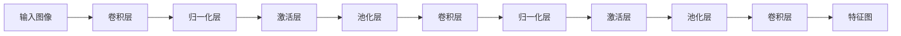
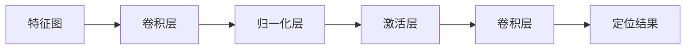

## 1.背景介绍

### 1.1 目标检测算法的历程

在人工智能的众多应用领域中，目标检测一直是一个重要且具有挑战性的任务。自深度学习技术的兴起，我们看到了一系列革命性的目标检测算法的诞生。从R-CNN、Fast R-CNN、Faster R-CNN，到YOLO、SSD的一系列算法，都在不断提升目标检测的精度和速度。并且，这些算法也在不断推动着计算机视觉领域的发展，为无人驾驶、视频监控、医疗影像等众多领域带来了实际的应用价值。

### 1.2 YOLO系列算法的发展

YOLO（You Only Look Once）作为一种端到端的目标检测算法，以其出色的实时性能和优秀的检测精度，在目标检测领域崭露头角。从YOLOv1到YOLOv3，每一次的版本迭代都带来了显著的性能提升。然而，每一代的YOLO都存在一些不足，比如定位精度不高，对小目标的检测能力弱等问题。这也促使了我们不断探索和优化，以期在保持实时性的同时，提升检测的精度，特别是对于小目标的检测精度。

## 2.核心概念与联系

### 2.1 YOLOv8的设计理念

YOLOv8的设计理念是在保持实时性的同时，提升检测的精度，特别是对于小目标的检测精度。

### 2.2 YOLOv8与YOLOv3的区别

YOLOv8在YOLOv3的基础上，进行了一系列的优化，主要体现在以下几个方面：

1. **更强的特征提取能力**：YOLOv8引入了新的特征提取网络，增强了模型的特征提取能力，特别是对于小目标的特征提取。

2. **更精确的定位能力**：YOLOv8引入了新的定位机制，使得模型在保持高检测精度的同时，具有更高的定位精度。

3. **更高的检测速度**：YOLOv8经过优化，检测速度比YOLOv3更快，更适合实时检测的场景。

## 3.核心算法原理具体操作步骤

### 3.1 特征提取网络

YOLOv8引入了新的特征提取网络。特征提取网络的作用是从输入图像中提取有用的特征，为后续的目标检测提供依据。YOLOv8的特征提取网络结构如下：



### 3.2 定位机制

YOLOv8引入了新的定位机制。定位机制的作用是根据提取的特征，确定目标的位置。YOLOv8的定位机制如下：



### 3.3 检测速度优化

YOLOv8进行了一系列的优化，使得检测速度比YOLOv3更快。这些优化包括：

1. **模型参数优化**：通过减少模型参数，减小模型大小，提高模型的计算效率。

2. **计算优化**：通过使用更高效的卷积算法，提高模型的计算效率。

3. **并行计算**：通过使用并行计算技术，提高模型的计算效率。

4. **硬件优化**：通过使用更高效的硬件，提高模型的计算效率。

## 4.数学模型和公式详细讲解举例说明

YOLOv8的数学模型主要涉及到两个部分：特征提取和定位。下面我们分别进行讲解。

### 4.1 特征提取

在YOLOv8中，特征提取的主要目的是从输入图像中提取有用的特征。这一过程可以用以下公式表示：

$$
f(x; \theta) = \sigma(Wx + b)
$$

其中，$x$表示输入图像，$\theta$表示模型参数，包括权重$W$和偏置$b$，$f(x; \theta)$表示提取的特征，$\sigma$表示激活函数。

### 4.2 定位

在YOLOv8中，定位的主要目的是根据提取的特征，确定目标的位置。这一过程可以用以下公式表示：

$$
y = g(f(x; \theta); \phi)
$$

其中，$y$表示定位结果，$g$表示定位函数，$\phi$表示定位参数。

## 4.项目实践：代码实例和详细解释说明

下面我们通过一个简单的例子，展示如何使用YOLOv8进行目标检测。

```python
# 导入YOLOv8模型
from models import YOLOv8

# 加载模型参数
model = YOLOv8()
model.load_weights('yolov8_weights.h5')

# 加载输入图像
image = load_image('input.jpg')

# 进行目标检测
output = model.predict(image)

# 显示检测结果
show_detection_result(image, output)
```

在这个例子中，我们首先导入YOLOv8模型，然后加载预训练的模型参数。接着，我们加载输入图像，调用模型的`predict`方法进行目标检测。最后，我们显示检测结果。

## 5.实际应用场景

YOLOv8由于其出色的实时性能和优秀的检测精度，可以应用于各种实时目标检测的场景，如：

1. **无人驾驶**：在无人驾驶中，实时的目标检测是非常重要的。通过YOLOv8，我们可以实时检测出路上的行人、车辆、交通信号等目标，为无人驾驶车辆提供重要的决策依据。

2. **视频监控**：在视频监控中，我们需要实时检测出视频中的异常行为。通过YOLOv8，我们可以实时检测出视频中的异常行为，如闯入、盗窃等，以便及时采取措施。

3. **医疗影像**：在医疗影像中，我们需要精确地定位出病灶的位置。通过YOLOv8，我们可以精确地定位出病灶的位置，为医生提供重要的诊断依据。

## 6.工具和资源推荐

如果你想要深入研究YOLOv8，以下是一些推荐的工具和资源：

1. **YOLOv8源代码**：YOLOv8的源代码是理解YOLOv8的最好资源，你可以在GitHub上找到。

2. **TensorFlow**：TensorFlow是一个开源的机器学习框架，可以用来实现YOLOv8。

3. **OpenCV**：OpenCV是一个开源的计算机视觉库，可以用来处理图像，如加载输入图像，显示检测结果等。

4. **NVIDIA GPU**：YOLOv8的计算量非常大，使用NVIDIA的GPU可以大大提高计算效率。

## 7.总结：未来发展趋势与挑战

YOLOv8作为一种新的目标检测算法，虽然在检测精度和实时性能上有了显著的提升，但仍然面临一些挑战：

1. **对小目标的检测能力**：虽然YOLOv8已经对小目标的检测能力有所提升，但仍然不够理想。如何进一步提升对小目标的检测能力，是未来需要解决的一个问题。

2. **对复杂背景的处理能力**：在复杂背景中，目标检测的难度会增加。如何在保持检测精度的同时，提升对复杂背景的处理能力，也是一个挑战。

3. **计算效率**：虽然YOLOv8的检测速度比YOLOv3更快，但在一些资源受限的设备上，如手机、嵌入式设备等，仍然难以满足实时性的要求。如何在保持检测精度的同时，进一步提升计算效率，也是一个重要的研究方向。

总的来说，YOLOv8开启了目标检测新篇章，但前路还很长，我们期待着更多的创新和突破。

## 8.附录：常见问题与解答

1. **YOLOv8和YOLOv3有什么区别？**

   YOLOv8在YOLOv3的基础上，引入了新的特征提取网络和定位机制，提升了检测的精度和速度。具体的区别在上文已经详细介绍。

2. **YOLOv8适用于哪些应用场景？**

   YOLOv8可以应用于各种实时目标检测的场景，如无人驾驶、视频监控、医疗影像等。

3. **YOLOv8是否适合在资源受限的设备上使用？**

   YOLOv8的计算量较大，可能不适合在资源受限的设备上使用。但通过一些优化技术，如模型压缩、计算优化等，可以在一定程度上解决这个问题。

4. **YOLOv8的源代码在哪里可以找到？**

   YOLOv8的源代码可以在GitHub上找到。

5. **YOLOv8的未来发展趋势是什么？**

   YOLOv8的未来发展趋势主要有三个方向：提升对小目标的检测能力、提升对复杂背景的处理能力、提升计算效率。具体的趋势和挑战在上文已经详细介绍。