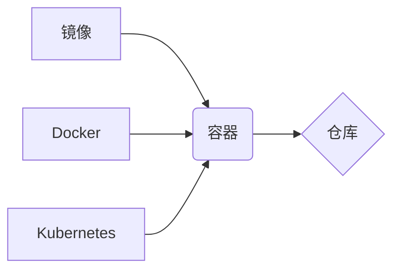

## 1. 背景介绍

### 1.1 大数据时代的计算挑战

随着互联网、物联网、移动互联网的快速发展，全球数据量呈现爆炸式增长，大数据时代已经到来。大数据的规模庞大、种类繁多、价值密度低、处理速度要求高，给传统的计算架构带来了巨大的挑战。传统的计算模式难以满足大数据处理的效率和成本要求，亟需新的计算模式来应对大数据的挑战。

### 1.2 容器技术的兴起

容器技术是一种轻量级的虚拟化技术，它可以将应用程序及其依赖项打包成一个独立的、可移植的单元，并在不同的环境中快速部署和运行。容器技术具有以下优点：

* **轻量级:** 容器比虚拟机更轻量级，启动速度更快，资源消耗更少。
* **可移植性:** 容器可以在不同的操作系统和平台上运行，提高了应用程序的可移植性。
* **易于管理:** 容器可以使用标准化的工具和流程进行管理，简化了应用程序的部署和运维。
* **安全性:** 容器提供了一定程度的隔离性，可以提高应用程序的安全性。

### 1.3 容器技术在大数据计算中的应用

容器技术在大数据计算领域得到了广泛的应用，它可以有效地解决大数据计算面临的挑战。容器技术可以将大数据应用程序及其依赖项打包成容器，并在分布式集群中快速部署和运行。容器技术还可以提高大数据应用程序的资源利用率、可扩展性和可靠性。

## 2. 核心概念与联系

### 2.1 容器

容器是一个可执行的软件包，包含了运行应用程序所需的所有内容，包括代码、运行时环境、系统工具、系统库和配置文件。容器是基于 Linux 容器技术（LXC）实现的，它利用 Linux 内核的 cgroups 和 namespaces 功能来实现资源隔离和环境隔离。

### 2.2 镜像

镜像是容器的模板，它包含了容器的文件系统和元数据。镜像是只读的，可以用来创建多个容器实例。

### 2.3 仓库

仓库是存储镜像的地方，可以是公共仓库或私有仓库。

### 2.4 Docker

Docker 是目前最流行的容器技术，它提供了一套完整的工具链，用于构建、发布、运行和管理容器。

### 2.5 Kubernetes

Kubernetes 是一个开源的容器编排系统，它可以自动化容器的部署、扩展和管理。

### 2.6 联系

容器、镜像、仓库、Docker 和 Kubernetes 之间的关系可以用下图表示：



## 3. 核心算法原理具体操作步骤

### 3.1 容器化大数据应用程序

容器化大数据应用程序的步骤如下：

1. **选择基础镜像:** 选择一个适合大数据应用程序的基础镜像，例如包含 Java 运行时环境的镜像。
2. **编写 Dockerfile:** 编写 Dockerfile 文件，定义容器的构建过程，包括基础镜像、应用程序代码、依赖项、环境变量等。
3. **构建镜像:** 使用 Docker 命令构建镜像。
4. **发布镜像:** 将镜像发布到仓库。

### 3.2 部署容器化大数据应用程序

部署容器化大数据应用程序的步骤如下：

1. **创建 Kubernetes 集群:** 创建一个 Kubernetes 集群，用于管理容器。
2. **编写 Kubernetes YAML 文件:** 编写 Kubernetes YAML 文件，定义容器的部署、服务、配置等。
3. **部署应用程序:** 使用 Kubernetes 命令部署应用程序。

## 4. 数学模型和公式详细讲解举例说明

### 4.1 资源限制

容器可以使用 cgroups 来限制容器的资源使用，例如 CPU、内存、磁盘 IO 等。cgroups 使用分层结构来管理资源限制，每个 cgroup 可以包含多个子 cgroup。

#### 4.1.1 CPU 资源限制

CPU 资源限制可以使用 `cpu.shares` 参数来设置，该参数表示容器可以使用的 CPU 时间比例。例如，如果将 `cpu.shares` 设置为 512，则容器可以使用 50% 的 CPU 时间。

#### 4.1.2 内存资源限制

内存资源限制可以使用 `memory.limit_in_bytes` 参数来设置，该参数表示容器可以使用的最大内存量。例如，如果将 `memory.limit_in_bytes` 设置为 1GB，则容器可以使用最大 1GB 的内存。

### 4.2 端口映射

容器可以使用端口映射将容器内部的端口映射到主机上的端口，以便外部可以访问容器内部的服务。端口映射可以使用 `docker run` 命令的 `-p` 参数来设置。例如，`-p 8080:80` 表示将容器内部的 80 端口映射到主机上的 8080 端口。

## 5. 项目实践：代码实例和详细解释说明

### 5.1 容器化 Spark 应用程序

以下是一个容器化 Spark 应用程序的 Dockerfile 文件示例：

```dockerfile
FROM openjdk:8-jdk-alpine

# 设置环境变量
ENV SPARK_HOME /opt/spark
ENV PATH $PATH:$SPARK_HOME/bin

# 复制 Spark 安装包
COPY spark-3.3.0-bin-hadoop3.tgz /opt

# 解压 Spark 安装包
RUN tar -xzvf /opt/spark-3.3.0-bin-hadoop3.tgz -C /opt

# 设置工作目录
WORKDIR $SPARK_HOME

# 暴露 Spark Master 和 Worker 端口
EXPOSE 7077 8080 8081

# 启动 Spark Master
CMD ["/opt/spark/sbin/start-master.sh"]
```

该 Dockerfile 文件定义了一个基于 OpenJDK 8 镜像的 Spark 容器。它首先设置环境变量，然后复制 Spark 安装包到容器中，并解压安装包。接着，它设置工作目录并暴露 Spark Master 和 Worker 端口。最后，它启动 Spark Master。

### 5.2 部署 Spark 应用程序到 Kubernetes

以下是一个部署 Spark 应用程序到 Kubernetes 的 YAML 文件示例：

```yaml
apiVersion: apps/v1
kind: Deployment
meta
  name: spark-deployment
spec:
  replicas: 1
  selector:
    matchLabels:
      app: spark
  template:
    meta
      labels:
        app: spark
    spec:
      containers:
      - name: spark-master
        image: spark-master:latest
        ports:
        - containerPort: 7077
      - name: spark-worker
        image: spark-worker:latest
        ports:
        - containerPort: 8081
```

该 YAML 文件定义了一个名为 `spark-deployment` 的 Deployment，它包含一个 Spark Master 容器和一个 Spark Worker 容器。Spark Master 容器的镜像为 `spark-master:latest`，Spark Worker 容器的镜像为 `spark-worker:latest`。

## 6. 实际应用场景

### 6.1 数据分析

容器技术可以用于构建数据分析平台，例如 Hadoop、Spark、Flink 等。容器可以将数据分析应用程序及其依赖项打包成容器，并在分布式集群中快速部署和运行。容器还可以提高数据分析应用程序的资源利用率、可扩展性和可靠性。

### 6.2 机器学习

容器技术可以用于构建机器学习平台，例如 TensorFlow、PyTorch、Scikit-learn 等。容器可以将机器学习应用程序及其依赖项打包成容器，并在分布式集群中快速部署和运行。容器还可以提高机器学习应用程序的资源利用率、可扩展性和可靠性。

### 6.3 云计算

容器技术是云计算的重要基础设施，它可以用于构建云原生应用程序。容器可以将应用程序及其依赖项打包成容器，并在云平台上快速部署和运行。容器还可以提高云原生应用程序的资源利用率、可扩展性和可靠性。

## 7. 工具和资源推荐

### 7.1 Docker

Docker 是目前最流行的容器技术，它提供了一套完整的工具链，用于构建、发布、运行和管理容器。Docker 的官方网站：https://www.docker.com/

### 7.2 Kubernetes

Kubernetes 是一个开源的容器编排系统，它可以自动化容器的部署、扩展和管理。Kubernetes 的官方网站：https://kubernetes.io/

### 7.3 Rancher

Rancher 是一个开源的企业级 Kubernetes 管理平台，它可以简化 Kubernetes 集群的部署和管理。Rancher 的官方网站：https://rancher.com/

## 8. 总结：未来发展趋势与挑战

### 8.1 未来发展趋势

* **容器技术的标准化:** 随着容器技术的不断发展，容器技术的标准化工作也在不断推进。
* **容器技术的安全性:** 容器技术的安全性是未来发展的重要方向。
* **容器技术的应用场景:** 容器技术的应用场景将不断扩展，例如边缘计算、物联网等。

### 8.2 挑战

* **容器技术的复杂性:** 容器技术涉及的概念和工具较多，学习曲线较陡峭。
* **容器技术的安全性:** 容器技术的安全性仍然存在一些挑战，例如镜像安全、网络安全等。
* **容器技术的管理:** 容器技术的管理需要一定的专业技能和经验。

## 9. 附录：常见问题与解答

### 9.1 容器和虚拟机的区别是什么？

容器和虚拟机都是虚拟化技术，但它们之间存在一些区别：

* **资源隔离:** 虚拟机使用硬件虚拟化来隔离资源，而容器使用操作系统级虚拟化来隔离资源。
* **性能:** 容器比虚拟机更轻量级，启动速度更快，资源消耗更少。
* **可移植性:** 容器可以在不同的操作系统和平台上运行，而虚拟机的可移植性较差。

### 9.2 Docker 和 Kubernetes 的关系是什么？

Docker 提供了一套完整的工具链，用于构建、发布、运行和管理容器，而 Kubernetes 是一个容器编排系统，它可以自动化容器的部署、扩展和管理。Docker 和 Kubernetes 可以配合使用，构建和管理容器化应用程序。
