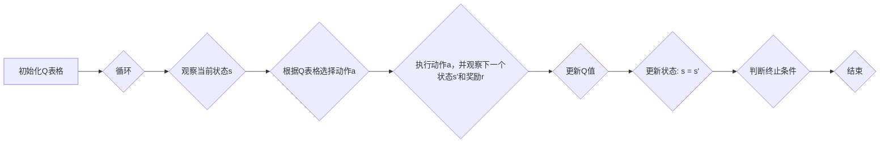

## 一切皆是映射：AI Q-learning在云计算中的实践

## 1. 背景介绍

### 1.1 云计算的挑战与机遇

云计算作为一种按需提供计算资源的模式，近年来得到了飞速发展。然而，云环境的动态性和复杂性也带来了诸多挑战，例如资源分配、任务调度、性能优化等。如何高效地管理和利用云资源，成为云计算领域亟待解决的关键问题。

### 1.2 AI赋能云计算

人工智能（AI）技术的快速发展为解决云计算难题提供了新的思路。近年来，机器学习、深度学习等AI技术被广泛应用于云计算领域，例如：

* **资源预测与优化**: 利用机器学习算法预测云资源需求，优化资源分配策略，提高资源利用率。
* **智能任务调度**: 基于深度强化学习算法，实现云平台上任务的智能调度，降低任务完成时间和成本。
* **自动化运维**: 利用AI技术实现云平台的自动化运维，提高运维效率和安全性。

### 1.3 Q-learning的优势与应用

Q-learning是一种经典的强化学习算法，具有以下优势：

* **模型无关**: 无需预先了解环境模型，能够直接从与环境的交互中学习。
* **在线学习**: 能够实时地更新策略，适应动态变化的环境。
* **泛化能力强**: 能够学习到适用于不同环境的策略。

Q-learning在云计算领域具有广泛的应用前景，例如：

* **动态资源分配**: 根据实时负载情况动态调整资源分配策略，提高资源利用率。
* **自适应任务调度**: 根据任务特征和资源状态，动态调整任务调度策略，降低任务完成时间。
* **智能负载均衡**: 实现云平台上负载的智能均衡，提高系统稳定性和可靠性。

## 2. 核心概念与联系

### 2.1 强化学习

强化学习是一种机器学习范式，其目标是让智能体通过与环境的交互学习到最优策略，从而最大化累积奖励。

#### 2.1.1 智能体

智能体是强化学习中的核心概念，它通过观察环境状态，选择动作，并从环境中获得奖励，不断学习和优化策略。

#### 2.1.2 环境

环境是指智能体所处的外部世界，它包含状态、动作和奖励等信息。

#### 2.1.3 状态

状态是描述环境当前情况的信息，例如云平台的资源使用情况、任务队列长度等。

#### 2.1.4 动作

动作是指智能体可以执行的操作，例如分配资源、调度任务等。

#### 2.1.5 奖励

奖励是环境反馈给智能体的信号，用于评价智能体选择的动作的好坏。

### 2.2 Q-learning

Q-learning是一种基于值函数的强化学习算法，其核心思想是学习一个状态-动作值函数，该函数表示在某个状态下采取某个动作的预期累积奖励。

#### 2.2.1 Q值

Q值表示在状态s下采取动作a的预期累积奖励。

#### 2.2.2 Q表格

Q表格是一个存储所有状态-动作值函数的表格。

#### 2.2.3 更新规则

Q-learning的更新规则如下：

$Q(s, a) \leftarrow (1 - \alpha)Q(s, a) + \alpha(r + \gamma \max_{a'} Q(s', a'))$

其中：

* $\alpha$ 是学习率，控制新信息对Q值的更新程度。
* $r$ 是在状态s下采取动作a获得的奖励。
* $\gamma$ 是折扣因子，控制未来奖励对当前Q值的影响程度。
* $s'$ 是采取动作a后的下一个状态。
* $a'$ 是在状态s'下可采取的动作。

### 2.3 云计算环境

云计算环境是一个典型的动态、复杂的环境，具有以下特点：

* **资源动态性**: 云资源的可用性和价格会随时间变化。
* **任务多样性**: 云平台上运行的任务类型多样，对资源的需求也各不相同。
* **负载波动性**: 云平台的负载会随时间波动，导致资源需求变化。

## 3. 核心算法原理具体操作步骤

### 3.1 问题定义

在云计算环境中，我们可以将资源分配问题定义为一个强化学习问题，其中：

* **智能体**: 云资源管理器。
* **环境**: 云平台。
* **状态**: 云平台的资源使用情况、任务队列长度等。
* **动作**: 分配资源、调度任务等。
* **奖励**: 资源利用率、任务完成时间等指标。

### 3.2 算法流程

Q-learning算法在云计算中的应用流程如下：

1. **初始化Q表格**: 为所有状态-动作对初始化Q值。
2. **循环**:
    * 观察当前状态s。
    * 根据Q表格选择动作a（例如ε-greedy策略）。
    * 执行动作a，并观察下一个状态s'和奖励r。
    * 更新Q值: $Q(s, a) \leftarrow (1 - \alpha)Q(s, a) + \alpha(r + \gamma \max_{a'} Q(s', a'))$。
    * 更新状态: s = s'。
3. **结束**: 直到满足终止条件（例如达到最大迭代次数）。

### 3.3 关键步骤详解

#### 3.3.1 状态空间设计

状态空间的设计应包含云平台的关键信息，例如：

* **资源使用情况**: CPU使用率、内存使用率、磁盘使用率等。
* **任务队列长度**: 待处理任务的数量。
* **任务特征**: 任务类型、任务优先级、任务资源需求等。

#### 3.3.2 动作空间设计

动作空间的设计应包含云资源管理器可执行的操作，例如：

* **分配资源**: 为任务分配CPU、内存、磁盘等资源。
* **调度任务**: 将任务调度到不同的计算节点上。
* **调整资源**: 动态调整资源分配策略。

#### 3.3.3 奖励函数设计

奖励函数的设计应反映云平台的优化目标，例如：

* **资源利用率**: 最大化资源利用率。
* **任务完成时间**: 最小化任务完成时间。
* **成本**: 最小化资源使用成本。

## 4. 数学模型和公式详细讲解举例说明

### 4.1 Q值更新公式

Q-learning的核心公式是Q值更新公式：

$Q(s, a) \leftarrow (1 - \alpha)Q(s, a) + \alpha(r + \gamma \max_{a'} Q(s', a'))$

该公式表示，当前状态-动作对的Q值是旧Q值和新信息的加权平均，其中新信息包括当前奖励和未来最大Q值。

**举例说明**:

假设当前状态s为CPU使用率80%，任务队列长度10，动作a为分配1个CPU核心，下一个状态s'为CPU使用率90%，任务队列长度9，奖励r为1，学习率α为0.1，折扣因子γ为0.9。

则Q值更新公式为：

$Q(s, a) \leftarrow (1 - 0.1)Q(s, a) + 0.1(1 + 0.9 \max_{a'} Q(s', a'))$

### 4.2 ε-greedy策略

ε-greedy策略是一种常用的动作选择策略，它以ε的概率随机选择动作，以1-ε的概率选择Q值最大的动作。

**举例说明**:

假设ε为0.1，当前状态s下有3个可选动作a1、a2、a3，其Q值分别为1、2、3。

则ε-greedy策略选择动作的概率为：

* 选择a1的概率: 0.1 * (1/3) + 0.9 * 0 = 0.033
* 选择a2的概率: 0.1 * (1/3) + 0.9 * 0 = 0.033
* 选择a3的概率: 0.1 * (1/3) + 0.9 * 1 = 0.933

## 5. 项目实践：代码实例和详细解释说明

```python
import numpy as np

# 定义状态空间
states = [(cpu_usage, queue_length) for cpu_usage in range(11) for queue_length in range(11)]

# 定义动作空间
actions = ['allocate_cpu', 'schedule_task', 'adjust_resources']

# 初始化Q表格
q_table = np.zeros((len(states), len(actions)))

# 定义学习率、折扣因子
alpha = 0.1
gamma = 0.9

# 定义ε-greedy策略
epsilon = 0.1

# 定义奖励函数
def reward_function(state, action):
    # 计算资源利用率、任务完成时间等指标
    # 返回奖励值
    pass

# Q-learning算法
for episode in range(1000):
    # 初始化状态
    state = (0, 0)

    # 循环
    while True:
        # 选择动作
        if np.random.rand() < epsilon:
            action = np.random.choice(actions)
        else:
            action = actions[np.argmax(q_table[states.index(state)])]

        # 执行动作，并观察下一个状态和奖励
        next_state, reward = reward_function(state, action)

        # 更新Q值
        q_table[states.index(state), actions.index(action)] = (1 - alpha) * q_table[states.index(state), actions.index(action)] + alpha * (reward + gamma * np.max(q_table[states.index(next_state)]))

        # 更新状态
        state = next_state

        # 判断终止条件
        if state == (10, 10):
            break

# 输出Q表格
print(q_table)
```

**代码解释**:

* 代码首先定义了状态空间、动作空间、Q表格、学习率、折扣因子、ε-greedy策略和奖励函数。
* 然后，代码使用循环实现Q-learning算法，每次循环对应一个episode。
* 在每个episode中，代码首先初始化状态，然后使用ε-greedy策略选择动作，执行动作并观察下一个状态和奖励，最后更新Q值。
* 循环结束后，代码输出Q表格，其中包含所有状态-动作对的Q值。

## 6. 实际应用场景

### 6.1 动态资源分配

Q-learning可以用于动态调整云资源分配策略，以适应实时负载变化。例如，可以根据CPU使用率、内存使用率等指标动态调整虚拟机规格，以最大化资源利用率。

### 6.2 自适应任务调度

Q-learning可以用于根据任务特征和资源状态动态调整任务调度策略，以降低任务完成时间。例如，可以根据任务优先级、任务资源需求等指标将任务调度到不同的计算节点上。

### 6.3 智能负载均衡

Q-learning可以用于实现云平台上负载的智能均衡，以提高系统稳定性和可靠性。例如，可以根据服务器负载情况动态调整负载均衡策略，将流量分配到负载较低的服务器上。

## 7. 总结：未来发展趋势与挑战

### 7.1 未来发展趋势

* **深度强化学习**: 将深度学习与强化学习结合，可以处理更复杂的状态空间和动作空间，提高Q-learning的性能。
* **多智能体强化学习**: 将多个智能体应用于云计算环境，可以实现更复杂的协作和竞争，进一步提高资源利用效率。
* **边缘计算**: 将Q-learning应用于边缘计算，可以实现资源的本地化管理和优化，降低网络延迟和带宽消耗。

### 7.2 面临的挑战

* **状态空间爆炸**: 云计算环境的状态空间非常庞大，如何有效地表示和处理状态空间是Q-learning面临的挑战之一。
* **奖励函数设计**: 设计合理的奖励函数是Q-learning成功的关键，如何设计能够反映云平台优化目标的奖励函数是一个难题。
* **探索与利用**: Q-learning需要平衡探索新策略和利用已有知识之间的关系，如何有效地平衡探索与利用是一个挑战。

## 8. 附录：常见问题与解答

### 8.1 Q-learning与其他强化学习算法的区别？

Q-learning是一种基于值函数的强化学习算法，而其他强化学习算法，例如策略梯度算法，是基于策略的算法。Q-learning学习的是状态-动作值函数，而策略梯度算法学习的是策略函数。

### 8.2 Q-learning的优缺点？

**优点**:

* 模型无关，无需预先了解环境模型。
* 在线学习，能够实时更新策略。
* 泛化能力强，能够学习到适用于不同环境的策略。

**缺点**:

* 状态空间爆炸问题。
* 奖励函数设计困难。
* 探索与利用平衡问题。

### 8.3 Q-learning在云计算中的应用案例？

* 阿里云的资源调度系统
* 腾讯云的负载均衡系统
* 亚马逊云的弹性计算服务

### 8.4 如何学习Q-learning？

* 阅读强化学习相关书籍和论文。
* 参加在线课程和培训。
* 实践Q-learning算法，例如使用Python实现Q-learning算法。


##  Mermaid流程图


