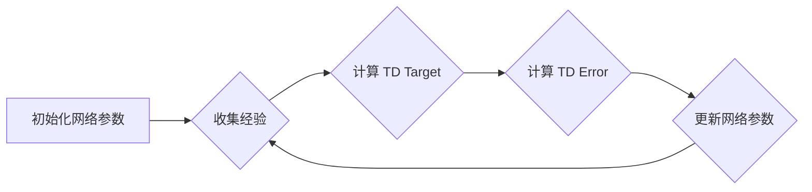

# 一切皆是映射：理解DQN的稳定性与收敛性问题

作者：禅与计算机程序设计艺术

## 1. 背景介绍

### 1.1 强化学习的兴起与挑战

近年来，强化学习 (Reinforcement Learning, RL) 作为机器学习的一个重要分支，在游戏、机器人控制、自动驾驶等领域取得了令人瞩目的成就。强化学习的核心思想是让智能体 (Agent) 通过与环境的交互学习最优策略，从而在特定任务中获得最大回报。然而，强化学习的训练过程往往面临着诸多挑战，其中稳定性和收敛性问题尤为突出。

### 1.2 DQN算法的突破与局限

Deep Q-Network (DQN) 算法作为深度强化学习的开山之作，成功地将深度学习与强化学习结合，在 Atari 游戏中取得了超越人类水平的成绩。DQN 利用深度神经网络来逼近状态-动作值函数 (Q-function)，通过最小化时序差分误差 (Temporal Difference Error, TD Error) 来更新网络参数。然而，DQN 算法本身也存在一些局限性，例如：

* **训练过程不稳定:** DQN 算法的训练过程容易出现震荡，导致学习效率低下，甚至无法收敛。
* **过估计问题:** DQN 算法容易过高估计动作值，导致选择次优动作。
* **泛化能力不足:** DQN 算法在训练环境之外的表现可能不尽如人意。

### 1.3 本文的研究目标

本文旨在深入探讨 DQN 算法的稳定性和收敛性问题，分析其根源，并介绍一些有效的改进方法。我们将从映射的角度来理解 DQN 算法，揭示其内在机制，并阐述如何通过优化映射关系来提升算法的性能。

## 2. 核心概念与联系

### 2.1 强化学习的基本要素

强化学习的核心要素包括：

* **智能体 (Agent):**  与环境交互并执行动作的主体。
* **环境 (Environment):**  智能体所处的外部世界。
* **状态 (State):**  描述环境当前状况的信息。
* **动作 (Action):**  智能体可以执行的操作。
* **奖励 (Reward):**  环境对智能体动作的反馈信号。
* **策略 (Policy):**  智能体根据当前状态选择动作的规则。
* **值函数 (Value Function):**  衡量某个状态或状态-动作对的长期价值。

### 2.2 DQN算法的核心思想

DQN 算法的核心思想是利用深度神经网络来逼近状态-动作值函数，并通过最小化时序差分误差来更新网络参数。具体来说，DQN 算法包括以下步骤：

1. **初始化:**  随机初始化深度神经网络的参数。
2. **收集经验:**  智能体与环境交互，收集一系列状态、动作、奖励和下一个状态的样本。
3. **计算目标值:**  根据收集到的样本计算目标 Q 值。
4. **更新网络参数:**  利用目标 Q 值和当前 Q 值之间的差值 (TD Error) 来更新神经网络的参数。
5. **重复步骤 2-4:**  不断收集经验并更新网络参数，直到算法收敛。

### 2.3 映射关系的本质

DQN 算法可以看作是一种映射关系，它将状态-动作对映射到对应的 Q 值。神经网络的参数决定了这种映射关系的具体形式。DQN 算法的目标是找到一种最优的映射关系，使得智能体能够根据当前状态选择最优动作，从而获得最大回报。

## 3. 核心算法原理具体操作步骤

### 3.1 时序差分学习

DQN 算法的核心是时序差分学习 (Temporal Difference Learning, TD Learning)。TD Learning 是一种基于采样的学习方法，它通过不断更新对未来奖励的估计来学习值函数。

**TD Target:**

$$
y_t = r_{t+1} + \gamma \max_{a'} Q(s_{t+1}, a'; \theta^-)
$$

其中：

* $y_t$ 是 TD Target，表示对当前状态-动作对的长期价值的估计。
* $r_{t+1}$ 是下一个状态的奖励。
* $\gamma$ 是折扣因子，用于平衡当前奖励和未来奖励的重要性。
* $Q(s_{t+1}, a'; \theta^-)$ 是目标网络对下一个状态-动作对的 Q 值估计。目标网络的参数 $\theta^-$ 是定期从在线网络复制过来的，用于提高算法的稳定性。

**TD Error:**

$$
\delta_t = y_t - Q(s_t, a_t; \theta)
$$

其中：

* $\delta_t$ 是 TD Error，表示目标 Q 值和当前 Q 值之间的差值。
* $Q(s_t, a_t; \theta)$ 是在线网络对当前状态-动作对的 Q 值估计。

### 3.2 经验回放

DQN 算法使用经验回放 (Experience Replay) 机制来提高样本利用效率和算法稳定性。经验回放机制将智能体与环境交互过程中收集到的样本存储在一个经验池中，并在训练过程中随机抽取样本进行学习。

### 3.3 目标网络

DQN 算法使用目标网络 (Target Network) 来提高算法的稳定性。目标网络的参数 $\theta^-$ 是定期从在线网络复制过来的，用于计算 TD Target。目标网络的更新频率比在线网络低，可以减少 TD Target 的波动，从而提高算法的稳定性。

### 3.4 算法流程

DQN 算法的流程图如下所示：



## 4. 数学模型和公式详细讲解举例说明

### 4.1 Bellman 方程

值函数满足 Bellman 方程：

$$
Q^*(s, a) = \mathbb{E}[r + \gamma \max_{a'} Q^*(s', a')]
$$

其中：

* $Q^*(s, a)$ 是最优状态-动作值函数。
* $r$ 是在状态 $s$ 下执行动作 $a$ 后获得的奖励。
* $s'$ 是下一个状态。
* $a'$ 是下一个动作。

### 4.2 时序差分误差

时序差分误差 (TD Error) 可以表示为：

$$
\delta_t = r_{t+1} + \gamma \max_{a'} Q(s_{t+1}, a'; \theta^-) - Q(s_t, a_t; \theta)
$$

### 4.3 损失函数

DQN 算法的损失函数是 TD Error 的平方：

$$
L(\theta) = \mathbb{E}[(y_t - Q(s_t, a_t; \theta))^2]
$$

### 4.4 梯度下降

DQN 算法使用梯度下降法来更新网络参数：

$$
\theta \leftarrow \theta - \alpha \nabla_\theta L(\theta)
$$

其中：

* $\alpha$ 是学习率。

### 4.5 举例说明

假设智能体在一个迷宫环境中探索，目标是找到出口。智能体可以执行的动作包括向上、向下、向左、向右移动。奖励函数定义为：

* 找到出口：+1
* 撞墙：-1
* 其他：0

智能体在迷宫中探索，收集到以下样本：

| 状态 | 动作 | 奖励 | 下一个状态 |
|---|---|---|---|
| (1, 1) | 向右 | 0 | (1, 2) |
| (1, 2) | 向上 | -1 | (1, 2) |
| (1, 2) | 向右 | 0 | (1, 3) |
| (1, 3) | 向上 | +1 | (0, 3) |

假设折扣因子 $\gamma = 0.9$，目标网络的参数 $\theta^- = \theta$。

**计算 TD Target:**

* 对于样本 (1, 1, 向右, 0, (1, 2))：
    * $y_1 = 0 + 0.9 \max_{a'} Q((1, 2), a'; \theta) = 0$
* 对于样本 (1, 2, 向上, -1, (1, 2))：
    * $y_2 = -1 + 0.9 \max_{a'} Q((1, 2), a'; \theta) = -1$
* 对于样本 (1, 2, 向右, 0, (1, 3))：
    * $y_3 = 0 + 0.9 \max_{a'} Q((1, 3), a'; \theta) = 0$
* 对于样本 (1, 3, 向上, +1, (0, 3))：
    * $y_4 = 1 + 0.9 \max_{a'} Q((0, 3), a'; \theta) = 1$

**计算 TD Error:**

* 对于样本 (1, 1, 向右, 0, (1, 2))：
    * $\delta_1 = 0 - Q((1, 1), 向右; \theta)$
* 对于样本 (1, 2, 向上, -1, (1, 2))：
    * $\delta_2 = -1 - Q((1, 2), 向上; \theta)$
* 对于样本 (1, 2, 向右, 0, (1, 3))：
    * $\delta_3 = 0 - Q((1, 2), 向右; \theta)$
* 对于样本 (1, 3, 向上, +1, (0, 3))：
    * $\delta_4 = 1 - Q((1, 3), 向上; \theta)$

**更新网络参数:**

利用 TD Error 来更新网络参数 $\theta$，使得损失函数最小化。

## 5. 项目实践：代码实例和详细解释说明

### 5.1 CartPole 游戏

CartPole 游戏是一个经典的控制问题，目标是控制一根杆子使其不倒。智能体可以执行的动作包括向左或向右移动小车。奖励函数定义为：

* 杆子保持直立：+1
* 杆子倒下：0

### 5.2 代码实例

```python
import gym
import tensorflow as tf
import numpy as np

# 创建 CartPole 环境
env = gym.make('CartPole-v1')

# 定义神经网络模型
model = tf.keras.models.Sequential([
  tf.keras.layers.Dense(24, activation='relu', input_shape=env.observation_space.shape),
  tf.keras.layers.Dense(24, activation='relu'),
  tf.keras.layers.Dense(env.action_space.n, activation='linear')
])

# 定义优化器
optimizer = tf.keras.optimizers.Adam(learning_rate=0.001)

# 定义经验池
class ReplayBuffer:
  def __init__(self, capacity):
    self.buffer = []
    self.capacity = capacity

  def add(self, experience):
    if len(self.buffer) == self.capacity:
      self.buffer.pop(0)
    self.buffer.append(experience)

  def sample(self, batch_size):
    indices = np.random.choice(len(self.buffer), batch_size, replace=False)
    return [self.buffer[i] for i in indices]

# 定义 DQN agent
class DQNAgent:
  def __init__(self, model, optimizer, replay_buffer, gamma=0.99, epsilon=1.0, epsilon_decay=0.995, epsilon_min=0.01):
    self.model = model
    self.optimizer = optimizer
    self.replay_buffer = replay_buffer
    self.gamma = gamma
    self.epsilon = epsilon
    self.epsilon_decay = epsilon_decay
    self.epsilon_min = epsilon_min

  def act(self, state):
    if np.random.rand() <= self.epsilon:
      return env.action_space.sample()
    else:
      return np.argmax(self.model.predict(state.reshape(1, -1)))

  def train(self, batch_size):
    if len(self.replay_buffer.buffer) < batch_size:
      return

    batch = self.replay_buffer.sample(batch_size)
    states = np.array([experience[0] for experience in batch])
    actions = np.array([experience[1] for experience in batch])
    rewards = np.array([experience[2] for experience in batch])
    next_states = np.array([experience[3] for experience in batch])
    dones = np.array([experience[4] for experience in batch])

    targets = self.model.predict(states)
    next_q_values = self.model.predict(next_states)
    targets[range(batch_size), actions] = rewards + self.gamma * np.max(next_q_values, axis=1) * (1 - dones)

    with tf.GradientTape() as tape:
      predictions = self.model(states)
      loss = tf.keras.losses.MSE(targets, predictions)

    gradients = tape.gradient(loss, self.model.trainable_variables)
    self.optimizer.apply_gradients(zip(gradients, self.model.trainable_variables))

    self.epsilon *= self.epsilon_decay
    self.epsilon = max(self.epsilon, self.epsilon_min)

# 创建 DQN agent
replay_buffer = ReplayBuffer(10000)
agent = DQNAgent(model, optimizer, replay_buffer)

# 训练 DQN agent
num_episodes = 1000
for episode in range(num_episodes):
  state = env.reset()
  done = False
  total_reward = 0

  while not done:
    action = agent.act(state)
    next_state, reward, done, _ = env.step(action)
    agent.replay_buffer.add((state, action, reward, next_state, done))
    agent.train(batch_size=32)
    total_reward += reward
    state = next_state

  print(f'Episode: {episode + 1}, Total Reward: {total_reward}')

# 测试 DQN agent
state = env.reset()
done = False
total_reward = 0

while not done:
  env.render()
  action = agent.act(state)
  next_state, reward, done, _ = env.step(action)
  total_reward += reward
  state = next_state

print(f'Total Reward: {total_reward}')
env.close()
```

### 5.3 代码解释

* **创建 CartPole 环境:** 使用 `gym.make('CartPole-v1')` 创建 CartPole 环境。
* **定义神经网络模型:** 使用 `tf.keras.models.Sequential` 创建一个简单的神经网络模型，包含两个隐藏层，每个隐藏层有 24 个神经元，激活函数为 ReLU。输出层有 2 个神经元，对应两个动作，激活函数为线性函数。
* **定义优化器:** 使用 `tf.keras.optimizers.Adam` 创建 Adam 优化器，学习率为 0.001。
* **定义经验池:** 创建 `ReplayBuffer` 类来存储经验。经验池的容量为 10000。
* **定义 DQN agent:** 创建 `DQNAgent` 类来实现 DQN 算法。DQN agent 的参数包括神经网络模型、优化器、经验池、折扣因子、epsilon、epsilon 衰减率和 epsilon 最小值。
* **训练 DQN agent:** 训练 DQN agent 1000 个 episode。每个 episode，智能体与环境交互，收集经验并存储到经验池中。然后，智能体从经验池中随机抽取样本进行训练。
* **测试 DQN agent:** 测试训练好的 DQN agent 的性能。

## 6. 实际应用场景

### 6.1 游戏

DQN 算法在游戏领域取得了巨大的成功，例如：

* Atari 游戏：DQN 算法在 Atari 游戏中取得了超越人类水平的成绩。
* 围棋：AlphaGo 和 AlphaZero 等基于 DQN 算法的围棋程序战胜了世界顶级棋手。

### 6.2 机器人控制

DQN 算法可以用于机器人控制，例如：

* 机械臂控制：DQN 算法可以控制机械臂完成抓取、放置等任务。
* 无人机控制：DQN 算法可以控制无人机完成导航、避障等任务。

### 6.3 自动驾驶

DQN 算法可以用于自动驾驶，例如：

* 车道保持：DQN 算法可以控制车辆保持在车道内行驶。
* 自适应巡航控制：DQN 算法可以控制车辆与前车保持安全距离。

## 7. 工具和资源推荐

### 7.1 TensorFlow

TensorFlow 是一个开源的机器学习框架，提供了丰富的 API 用于构建和训练深度学习模型。

### 7.2 PyTorch

PyTorch 是另一个开源的机器学习框架，提供了动态计算图和灵活的编程接口。

### 7.3 OpenAI Gym

OpenAI Gym 是一个用于开发和比较强化学习算法的工具包，提供了各种各样的环境。

## 8. 总结：未来发展趋势与挑战

### 8.1 未来发展趋势

DQN 算法作为