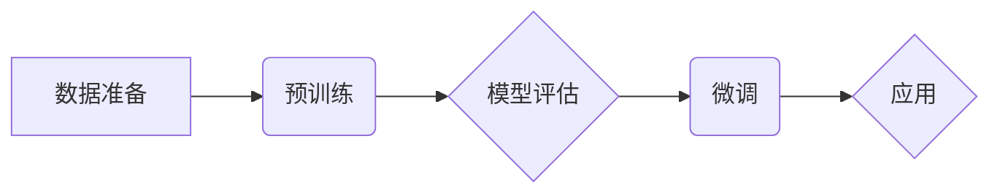

# 从零开始大模型开发与微调：选择PyTorch 2.0实战框架

作者：禅与计算机程序设计艺术

## 1. 背景介绍

### 1.1 大模型的兴起与挑战

近年来，随着深度学习技术的快速发展，大模型（Large Language Models，LLMs）逐渐成为人工智能领域的研究热点。这些模型拥有庞大的参数量和复杂的结构，能够在自然语言处理、计算机视觉等领域取得突破性进展。然而，大模型的开发和应用也面临着诸多挑战：

* **计算资源需求高:** 训练大模型需要大量的计算资源，包括高性能GPU、大容量内存和高速网络。
* **数据规模庞大:** 训练大模型需要海量的训练数据，数据的质量和多样性直接影响模型的性能。
* **模型训练时间长:** 训练大模型需要耗费大量的时间，即使使用最先进的硬件设备，也可能需要数周甚至数月才能完成。
* **模型部署难度大:** 大模型的部署需要专门的硬件设备和软件环境，对技术人员的要求较高。

### 1.2 PyTorch 2.0：为大模型开发而生

为了应对这些挑战，PyTorch 2.0应运而生。作为一款流行的深度学习框架，PyTorch 2.0针对大模型开发进行了多项优化，包括：

* **更快的训练速度:** PyTorch 2.0引入了新的编译器和运行时，可以大幅提升模型训练速度。
* **更高的内存效率:** PyTorch 2.0支持动态形状和分布式训练，可以更有效地利用内存资源。
* **更易用的API:** PyTorch 2.0提供了更简洁易用的API，方便开发者构建和训练大模型。

## 2. 核心概念与联系

### 2.1 大模型的基本概念

* **Transformer:** Transformer是一种基于自注意力机制的神经网络架构，是目前大模型的主流架构。
* **自注意力机制:** 自注意力机制允许模型关注输入序列中不同位置的信息，并学习它们之间的关系。
* **预训练:** 预训练是指在大规模数据集上训练模型，使其学习通用的语言表示。
* **微调:** 微调是指在预训练模型的基础上，针对特定任务进行进一步训练。

### 2.2 PyTorch 2.0的关键特性

* **TorchDynamo:** TorchDynamo是一个新的编译器，可以将PyTorch代码转换为更高效的中间表示。
* **AOTAutograd:** AOTAutograd是一个新的自动微分引擎，可以预先计算梯度，从而提升训练速度。
* **FSDP:** FSDP (Fully Sharded Data Parallel)是一种新的分布式训练技术，可以将模型参数和数据分布到多个GPU上进行训练。

## 3. 核心算法原理具体操作步骤

### 3.1 Transformer架构

Transformer架构的核心是自注意力机制，其具体操作步骤如下：

1. **计算查询、键和值向量:** 将输入序列中的每个词 embedding 成向量，然后分别计算查询向量 $Q$、键向量 $K$ 和值向量 $V$。
2. **计算注意力权重:** 计算查询向量 $Q$ 与所有键向量 $K$ 的点积，然后通过softmax函数将点积转换为注意力权重。
3. **加权求和:** 使用注意力权重对值向量 $V$ 进行加权求和，得到最终的输出向量。

### 3.2 预训练

预训练是指在大规模数据集上训练模型，使其学习通用的语言表示。常用的预训练任务包括：

* **语言模型:** 预测下一个词的概率。
* **掩码语言模型:** 预测被掩盖词的概率。
* **下一句预测:** 预测两个句子是否相邻。

### 3.3 微调

微调是指在预训练模型的基础上，针对特定任务进行进一步训练。微调可以使模型更好地适应特定任务的数据分布和目标。

## 4. 数学模型和公式详细讲解举例说明

### 4.1 自注意力机制的数学模型

自注意力机制的数学模型可以表示为：

$$
Attention(Q, K, V) = softmax(\frac{QK^T}{\sqrt{d_k}})V
$$

其中：

* $Q$ 是查询向量矩阵。
* $K$ 是键向量矩阵。
* $V$ 是值向量矩阵。
* $d_k$ 是键向量维度。

### 4.2 举例说明

假设输入序列为 "The quick brown fox jumps over the lazy dog"，我们将其 embedding 成向量矩阵 $X$。然后，我们分别计算查询向量矩阵 $Q$、键向量矩阵 $K$ 和值向量矩阵 $V$：

```
Q = XW_Q
K = XW_K
V = XW_V
```

其中：

* $W_Q$、$W_K$ 和 $W_V$ 是可学习的参数矩阵。

接下来，我们计算注意力权重矩阵：

```
A = softmax(\frac{QK^T}{\sqrt{d_k}})
```

最后，我们使用注意力权重矩阵对值向量矩阵 $V$ 进行加权求和，得到最终的输出向量矩阵 $Z$：

```
Z = AV
```

## 5. 项目实践：代码实例和详细解释说明

### 5.1 使用 PyTorch 2.0 构建 Transformer 模型

```python
import torch
import torch.nn as nn

class Transformer(nn.Module):
    def __init__(self, vocab_size, embedding_dim, hidden_dim, num_heads, num_layers):
        super().__init__()
        self.embedding = nn.Embedding(vocab_size, embedding_dim)
        self.encoder = nn.TransformerEncoder(
            nn.TransformerEncoderLayer(embedding_dim, num_heads, hidden_dim),
            num_layers
        )
        self.decoder = nn.TransformerDecoder(
            nn.TransformerDecoderLayer(embedding_dim, num_heads, hidden_dim),
            num_layers
        )
        self.fc = nn.Linear(embedding_dim, vocab_size)

    def forward(self, src, tgt, src_mask, tgt_mask):
        src = self.embedding(src)
        tgt = self.embedding(tgt)
        src = self.encoder(src, src_mask)
        tgt = self.decoder(tgt, src, tgt_mask, src_mask)
        output = self.fc(tgt)
        return output
```

### 5.2 使用 PyTorch 2.0 进行预训练

```python
# 定义模型
model = Transformer(vocab_size, embedding_dim, hidden_dim, num_heads, num_layers)

# 定义优化器
optimizer = torch.optim.Adam(model.parameters())

# 定义损失函数
loss_fn = nn.CrossEntropyLoss()

# 加载预训练数据集
train_dataset = ...

# 定义数据加载器
train_dataloader = torch.utils.data.DataLoader(train_dataset, batch_size=batch_size)

# 预训练循环
for epoch in range(num_epochs):
    for src, tgt, src_mask, tgt_mask in train_dataloader:
        # 前向传播
        output = model(src, tgt, src_mask, tgt_mask)

        # 计算损失
        loss = loss_fn(output.view(-1, vocab_size), tgt.view(-1))

        # 反向传播
        optimizer.zero_grad()
        loss.backward()

        # 更新参数
        optimizer.step()
```

### 5.3 使用 PyTorch 2.0 进行微调

```python
# 加载预训练模型
model = ...

# 定义优化器
optimizer = torch.optim.Adam(model.parameters())

# 定义损失函数
loss_fn = ...

# 加载微调数据集
fine_tune_dataset = ...

# 定义数据加载器
fine_tune_dataloader = torch.utils.data.DataLoader(fine_tune_dataset, batch_size=batch_size)

# 微调循环
for epoch in range(num_epochs):
    for src, tgt, src_mask, tgt_mask in fine_tune_dataloader:
        # 前向传播
        output = model(src, tgt, src_mask, tgt_mask)

        # 计算损失
        loss = loss_fn(output, tgt)

        # 反向传播
        optimizer.zero_grad()
        loss.backward()

        # 更新参数
        optimizer.step()
```

## 6. 实际应用场景

### 6.1 自然语言处理

* 文本生成
* 机器翻译
* 问答系统
* 情感分析

### 6.2 计算机视觉

* 图像分类
* 对象检测
* 图像描述

### 6.3 其他领域

* 生物信息学
* 金融分析
* 医疗诊断

## 7. 工具和资源推荐

### 7.1 PyTorch 官方文档

[https://pytorch.org/docs/stable/](https://pytorch.org/docs/stable/)

### 7.2 Hugging Face Transformers

[https://huggingface.co/docs/transformers/](https://huggingface.co/docs/transformers/)

### 7.3 Paperswithcode

[https://paperswithcode.com/](https://paperswithcode.com/)

## 8. 总结：未来发展趋势与挑战

### 8.1 未来发展趋势

* **更大规模的模型:** 随着计算资源的不断提升，未来将会出现更大规模的大模型。
* **更强大的模型架构:** 研究人员将不断探索更强大的模型架构，以提升模型的性能。
* **更广泛的应用场景:** 大模型将会被应用到更广泛的领域，解决更复杂的问题。

### 8.2 挑战

* **模型可解释性:** 大模型的决策过程难以解释，这限制了其在某些领域的应用。
* **模型安全性:** 大模型容易受到攻击，例如对抗样本攻击。
* **模型伦理问题:** 大模型的应用可能会引发伦理问题，例如数据隐私和算法歧视。

## 9. 附录：常见问题与解答

### 9.1 如何选择合适的预训练模型？

选择预训练模型需要考虑以下因素：

* **任务类型:** 不同的预训练模型适用于不同的任务类型。
* **模型规模:** 模型规模越大，性能越好，但计算资源需求也越高。
* **数据集:** 预训练模型的数据集应该与目标任务的数据集相似。

### 9.2 如何进行有效的微调？

进行有效的微调需要考虑以下因素：

* **学习率:** 微调时应该使用较小的学习率。
* **训练数据:** 微调数据集应该与目标任务的数据集相似。
* **正则化:** 微调时可以使用正则化技术，例如 dropout 和 weight decay。


## 10. 大模型开发与微调流程图



**图例:**

* A: 数据准备，包括数据收集、清洗和预处理。
* B: 预训练，使用大规模数据集训练模型。
* C: 模型评估，评估模型在特定任务上的性能。
* D: 微调，针对特定任务进行模型微调。
* E: 应用，将微调后的模型应用到实际场景中。
