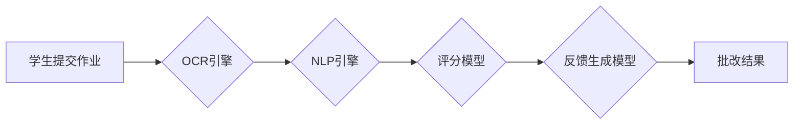

## 1. 背景介绍

### 1.1 教育信息化发展趋势

随着信息技术的快速发展和教育理念的不断更新，教育信息化已经成为现代教育发展的重要趋势。在线教育平台、学习管理系统等信息化工具的普及，为学生提供了更加便捷、高效的学习方式。然而，传统的作业批改方式效率低下，教师负担沉重，难以满足个性化学习的需求。

### 1.2 自动化作业批改系统的优势

自动化作业批改系统利用人工智能技术，可以自动识别、分析学生的作业内容，并给出评分和反馈。相较于传统的人工批改方式，自动化作业批改系统具有以下优势：

* **提高效率：** 自动化批改系统可以快速处理大量作业，节省教师时间，提高批改效率。
* **客观公正：** 系统根据预设的评分标准进行批改，避免了人为因素的干扰，保证了评分的客观公正。
* **个性化反馈：** 系统可以根据学生的作业情况，提供个性化的反馈和指导，帮助学生更好地理解和掌握知识。

### 1.3 本文的目的和意义

本文旨在介绍一种基于深度学习的自动化作业批改系统的详细设计方案和具体代码实现，为教育信息化发展提供参考。

## 2. 核心概念与联系

### 2.1 光学字符识别 (OCR)

OCR 技术可以将图像中的文字转换为可编辑的文本格式，是自动化作业批改系统的基础。

### 2.2 自然语言处理 (NLP)

NLP 技术可以对文本进行分析和理解，例如分词、词性标注、句法分析等，为作业内容的自动评分和反馈提供支持。

### 2.3 深度学习 (Deep Learning)

深度学习是一种强大的机器学习技术，可以用于构建高精度的 OCR 和 NLP 模型。

### 2.4 作业批改系统架构



## 3. 核心算法原理具体操作步骤

### 3.1 OCR 引擎

* **图像预处理：** 对输入的作业图像进行去噪、二值化等预处理操作，提高 OCR 准确率。
* **字符分割：** 将预处理后的图像分割成单个字符，为字符识别做准备。
* **字符识别：** 使用深度学习模型识别分割后的字符，并将其转换为文本格式。

### 3.2 NLP 引擎

* **分词：** 将 OCR 识别的文本分割成单个词语。
* **词性标注：** 对每个词语进行词性标注，例如名词、动词、形容词等。
* **句法分析：** 分析句子结构，识别主谓宾等语法成分。

### 3.3 评分模型

* **特征提取：** 从 NLP 引擎的输出结果中提取与评分相关的特征，例如关键词、语法错误数量等。
* **模型训练：** 使用深度学习模型对评分特征进行训练，构建评分模型。
* **评分预测：** 使用训练好的评分模型对新的作业进行评分预测。

### 3.4 反馈生成模型

* **错误类型识别：** 根据评分模型的输出结果，识别作业中的错误类型，例如语法错误、拼写错误等。
* **反馈内容生成：** 根据错误类型生成相应的反馈内容，例如语法规则解释、拼写建议等。

## 4. 数学模型和公式详细讲解举例说明

### 4.1 OCR 字符识别模型

OCR 字符识别模型可以使用卷积神经网络 (CNN) 实现。CNN 可以有效地提取图像中的特征，并将其用于字符识别。

**公式：**

$$
f(x) = \sigma(W * x + b)
$$

其中：

* $x$ 表示输入的图像数据。
* $W$ 表示卷积核权重。
* $b$ 表示偏置项。
* $*$ 表示卷积操作。
* $\sigma$ 表示激活函数，例如 ReLU 函数。

**举例说明：**

假设输入的图像数据为一个手写数字 "3" 的图像，CNN 模型可以提取图像中的特征，例如数字的形状、笔画粗细等，并将其用于识别字符 "3"。

### 4.2 NLP 句法分析模型

NLP 句法分析模型可以使用循环神经网络 (RNN) 实现。RNN 可以有效地处理序列数据，例如文本数据。

**公式：**

$$
h_t = \sigma(W_h * h_{t-1} + W_x * x_t + b)
$$

其中：

* $h_t$ 表示当前时刻的隐藏状态。
* $h_{t-1}$ 表示上一时刻的隐藏状态。
* $x_t$ 表示当前时刻的输入数据。
* $W_h$ 表示隐藏状态权重。
* $W_x$ 表示输入数据权重。
* $b$ 表示偏置项。
* $\sigma$ 表示激活函数，例如 tanh 函数。

**举例说明：**

假设输入的文本数据为 "The quick brown fox jumps over the lazy dog."，RNN 模型可以分析句子结构，识别主语 "fox"、谓语 "jumps"、宾语 "dog" 等语法成分。

## 5. 项目实践：代码实例和详细解释说明

### 5.1 OCR 引擎代码实现

```python
import pytesseract
from PIL import Image

# 加载图像
image = Image.open("homework.jpg")

# OCR 识别
text = pytesseract.image_to_string(image)

# 打印识别结果
print(text)
```

### 5.2 NLP 引擎代码实现

```python
import spacy

# 加载 NLP 模型
nlp = spacy.load("en_core_web_sm")

# 处理文本
doc = nlp("The quick brown fox jumps over the lazy dog.")

# 打印句法分析结果
for token in doc:
    print(token.text, token.pos_, token.dep_)
```

### 5.3 评分模型代码实现

```python
import tensorflow as tf

# 定义评分模型
model = tf.keras.Sequential([
    tf.keras.layers.Dense(64, activation="relu", input_shape=(10,)),
    tf.keras.layers.Dense(1)
])

# 编译模型
model.compile(loss="mse", optimizer="adam")

# 训练模型
model.fit(X_train, y_train, epochs=10)

# 预测评分
y_pred = model.predict(X_test)
```

## 6. 实际应用场景

### 6.1 在线教育平台

自动化作业批改系统可以集成到在线教育平台中，为学生提供自动批改和反馈服务，提高学习效率。

### 6.2 学校课堂

教师可以使用自动化作业批改系统批改学生的课堂作业，节省时间，提高教学效率。

### 6.3 标准化考试

自动化作业批改系统可以用于标准化考试的自动评分，保证评分的客观公正。

## 7. 总结：未来发展趋势与挑战

### 7.1 未来发展趋势

* **更加精准的 OCR 和 NLP 技术：** 随着深度学习技术的不断发展，OCR 和 NLP 技术的准确率将不断提高。
* **更加个性化的反馈：** 未来，自动化作业批改系统将能够提供更加个性化的反馈，例如针对学生的薄弱环节进行 targeted feedback。
* **多模态作业批改：** 未来，自动化作业批改系统将能够处理多种类型的作业，例如文本、图像、音频等。

### 7.2 挑战

* **数据安全和隐私保护：** 自动化作业批改系统需要处理大量的学生数据，数据安全和隐私保护是一个重要挑战。
* **模型的泛化能力：** 自动化作业批改系统需要能够处理不同学科、不同难度等级的作业，模型的泛化能力是一个重要挑战。
* **伦理问题：** 自动化作业批改系统可能会对学生的学习动机和创造力产生影响，伦理问题需要引起重视。

## 8. 附录：常见问题与解答

### 8.1 OCR 识别错误怎么办？

OCR 识别错误可能会导致评分不准确。可以尝试以下方法解决：

* 提高图像质量：确保输入的作业图像清晰、无噪点。
* 使用更精准的 OCR 引擎：选择性能更优的 OCR 引擎，例如 Google Cloud Vision API。

### 8.2 如何提高评分模型的准确率？

可以通过以下方法提高评分模型的准确率：

* 收集更多高质量的训练数据：使用更多高质量的作业数据训练评分模型。
* 选择合适的模型架构：根据作业内容和评分标准，选择合适的深度学习模型架构。
* 对模型进行调参：对模型的超参数进行调整，例如学习率、迭代次数等。

### 8.3 如何保证评分的客观公正？

可以通过以下方法保证评分的客观公正：

* 使用预设的评分标准：制定明确的评分标准，并将其用于模型训练和评分预测。
* 避免人为因素的干扰：避免人为修改评分结果。
* 定期评估模型性能：定期评估评分模型的性能，确保其准确性和公平性。