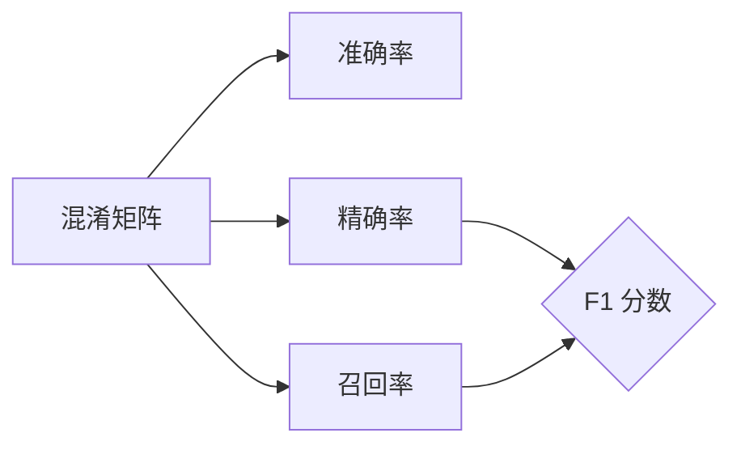

## 1. 背景介绍

### 1.1 准确率的重要性

在机器学习和数据科学领域，准确率是评估模型性能的核心指标之一。简单来说，准确率衡量的是模型做出正确预测的比例。 准确率越高，模型的预测能力就越强，其在实际应用中的价值也就越大。

### 1.2  准确率的应用领域

准确率在众多领域中都扮演着至关重要的角色，例如：

* **图像识别:**  准确率可以用来评估图像分类模型的性能，例如识别图像中的物体、人脸识别等。
* **自然语言处理:** 准确率可以用来评估文本分类模型的性能，例如情感分析、垃圾邮件过滤等。
* **医疗诊断:** 准确率可以用来评估医疗诊断模型的性能，例如预测疾病的发生概率、诊断疾病的类型等。
* **金融风控:** 准确率可以用来评估金融风控模型的性能，例如预测客户的信用风险、欺诈风险等。

## 2. 核心概念与联系

### 2.1 混淆矩阵

混淆矩阵是理解准确率及其相关概念的基础。混淆矩阵是一个表格，用于可视化分类模型的性能。它将实际类别与模型预测类别进行交叉对比，从而展示模型的预测结果。

|                  | 预测为正例 | 预测为负例 |
|------------------|------------|------------|
| **实际为正例** | TP         | FN         |
| **实际为负例** | FP         | TN         |

* **TP (True Positive):**  模型正确地将正例预测为正例。
* **TN (True Negative):**  模型正确地将负例预测为负例。
* **FP (False Positive):**  模型错误地将负例预测为正例 (Type I error)。
* **FN (False Negative):**  模型错误地将正例预测为负例 (Type II error)。

### 2.2 准确率的定义

准确率 (Accuracy) 的定义如下：

$$
Accuracy = \frac{TP + TN}{TP + TN + FP + FN}
$$

准确率表示模型正确预测的样本数占总样本数的比例。

### 2.3 精确率、召回率与 F1 分数

除了准确率之外，精确率 (Precision)、召回率 (Recall) 和 F1 分数也是评估分类模型性能的重要指标。

* **精确率 (Precision):** 
$$
Precision = \frac{TP}{TP + FP}
$$
精确率表示模型预测为正例的样本中，真正为正例的比例。

* **召回率 (Recall):** 
$$
Recall = \frac{TP}{TP + FN}
$$
召回率表示所有实际为正例的样本中，被模型正确预测为正例的比例。

* **F1 分数:** 
$$
F1 = 2 \cdot \frac{Precision \cdot Recall}{Precision + Recall}
$$
F1 分数是精确率和召回率的调和平均数，它综合考虑了精确率和召回率的影响。

### 2.4 核心概念联系

下图展示了混淆矩阵、准确率、精确率、召回率和 F1 分数之间的联系：



## 3. 核心算法原理具体操作步骤

### 3.1 计算混淆矩阵

计算混淆矩阵是计算准确率的第一步。 具体步骤如下:

1. 使用训练好的模型对测试集进行预测。
2. 将预测结果与实际类别进行比较。
3. 根据比较结果，统计 TP、TN、FP 和 FN 的数量。
4. 将统计结果填入混淆矩阵。

### 3.2  计算准确率

得到混淆矩阵后，就可以根据公式计算准确率:

```
Accuracy = (TP + TN) / (TP + TN + FP + FN)
```

## 4. 数学模型和公式详细讲解举例说明

### 4.1  二分类问题示例

假设我们有一个二分类模型，用于预测邮件是否为垃圾邮件。 我们使用该模型对 100 封邮件进行预测，得到如下混淆矩阵:

|                  | 预测为垃圾邮件 | 预测为正常邮件 |
|------------------|----------------|----------------|
| **实际为垃圾邮件** | 80              | 10              |
| **实际为正常邮件** | 5               | 5               |

根据混淆矩阵，我们可以计算出:

* **准确率:** (80 + 5) / (80 + 10 + 5 + 5) = 0.85
* **精确率:** 80 / (80 + 5) = 0.94
* **召回率:** 80 / (80 + 10) = 0.89
* **F1 分数:** 2 * (0.94 * 0.89) / (0.94 + 0.89) = 0.91

### 4.2 多分类问题示例

对于多分类问题，混淆矩阵会更大，但计算准确率的原理相同。

## 5. 项目实践：代码实例和详细解释说明

### 5.1 Python 代码示例

以下 Python 代码演示了如何使用 scikit-learn 库计算模型的准确率:

```python
from sklearn.metrics import accuracy_score

# 假设 y_true 是实际类别，y_pred 是模型预测类别
accuracy = accuracy_score(y_true, y_pred)

print(f"Accuracy: {accuracy}")
```

### 5.2 代码解释

* `accuracy_score` 函数用于计算准确率。
* `y_true` 是实际类别数组，`y_pred` 是模型预测类别数组。
*  `print` 函数用于打印计算得到的准确率。

## 6. 实际应用场景

### 6.1  图像识别

在图像识别领域，准确率是评估图像分类模型性能的重要指标。 例如，在人脸识别系统中，准确率可以用来衡量系统识别正确人脸的比例。

### 6.2 自然语言处理

在自然语言处理领域，准确率可以用来评估文本分类模型的性能。 例如，在垃圾邮件过滤系统中，准确率可以用来衡量系统正确识别垃圾邮件的比例。

### 6.3 医疗诊断

在医疗诊断领域，准确率可以用来评估医疗诊断模型的性能。 例如，在癌症诊断系统中，准确率可以用来衡量系统正确诊断癌症的比例。

## 7. 工具和资源推荐

### 7.1 Scikit-learn

Scikit-learn 是一个流行的 Python 机器学习库，提供了丰富的工具用于计算模型的准确率和其他评估指标。

### 7.2 TensorFlow

TensorFlow 是一个开源机器学习平台，提供了丰富的 API 用于构建和评估机器学习模型，包括计算准确率。

### 7.3 PyTorch

PyTorch 是另一个开源机器学习平台，提供了类似于 TensorFlow 的功能，包括计算准确率。

## 8. 总结：未来发展趋势与挑战

### 8.1 提升模型的准确率

随着机器学习技术的不断发展，研究人员一直在探索新的方法来提升模型的准确率。 例如，深度学习模型的出现极大地提高了图像识别和自然语言处理任务的准确率。

### 8.2  平衡准确率和其他指标

在实际应用中，仅仅关注准确率是不够的。 需要综合考虑精确率、召回率和 F1 分数等指标，才能全面评估模型的性能。

### 8.3  应对数据偏差

数据偏差是影响模型准确率的重要因素。 研究人员需要开发新的方法来应对数据偏差，例如数据增强、迁移学习等。

## 9. 附录：常见问题与解答

### 9.1  准确率高就代表模型性能好吗？

不一定。 准确率高只是模型性能好的一个方面，还需要考虑其他指标，例如精确率、召回率和 F1 分数等。

### 9.2  如何选择合适的评估指标？

选择合适的评估指标取决于具体的应用场景。 例如，在垃圾邮件过滤系统中，召回率比精确率更重要，因为我们希望尽可能多地识别出垃圾邮件，即使会误判一些正常邮件。

### 9.3  如何提高模型的准确率？

提高模型准确率的方法有很多，例如:

* 使用更多的数据进行训练。
* 使用更复杂的模型。
* 对数据进行预处理。
* 使用正则化技术。
* 使用集成学习方法。
