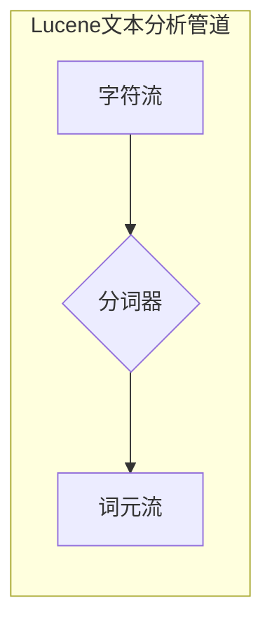

## 1. 背景介绍

### 1.1 信息检索的基石：文本分析

在信息爆炸的时代，如何从海量文本数据中快速准确地找到所需信息成为了至关重要的课题。信息检索（Information Retrieval）技术应运而生，而文本分析则是其不可或缺的基石。文本分析的目标是将非结构化的文本数据转化为结构化数据，以便于计算机进行处理和理解。

### 1.2 分词器：文本分析的核心

分词器（Tokenizer）是文本分析流程中的关键环节，它负责将文本流分割成一个个独立的词元（Token），为后续的分析和处理奠定基础。词元可以是单词、数字、标点符号，甚至是特殊的字符组合。

### 1.3 Lucene：高性能的搜索引擎库

Lucene是一个基于Java的高性能、全功能的文本搜索引擎库，它提供了一套完整的文本分析工具，包括各种类型的分词器。Lucene被广泛应用于各种搜索引擎、文本挖掘和信息检索系统中。

## 2. 核心概念与联系

### 2.1 词元（Token）：文本分析的基本单元

词元是文本分析的基本单元，它代表了文本中具有语义意义的最小单位。词元的类型可以是单词、数字、标点符号、特殊字符组合等。

### 2.2 词典（Lexicon）：词元的集合

词典是词元的集合，它包含了所有可能出现在文本中的词元。词典可以是静态的，也可以是动态生成的。

### 2.3 分词算法：词元化的实现方法

分词算法是实现词元化的具体方法，不同的分词算法适用于不同的语言和文本类型。常见的分词算法包括：

* 基于规则的分词算法：根据预先定义的规则进行分词，例如正向最大匹配法、逆向最大匹配法等。
* 基于统计的分词算法：根据词频、互信息等统计信息进行分词，例如N-gram模型、隐马尔可夫模型等。
* 基于机器学习的分词算法：利用机器学习算法训练分词模型，例如条件随机场模型、深度学习模型等。

### 2.4 Lucene分词器架构

Lucene的文本分析架构采用了管道模式，由多个组件组成，每个组件负责特定的任务。分词器是其中一个重要的组件，它接收字符流作为输入，输出词元流。



## 3. 核心算法原理具体操作步骤

### 3.1 基于规则的分词算法

#### 3.1.1 正向最大匹配法

正向最大匹配法从文本的开头开始，逐个匹配词典中最长的词，直到匹配到一个词为止。然后将该词作为一个词元，从文本中移除，继续匹配剩余的文本。

**操作步骤：**

1. 从文本的开头开始，取最大长度的词作为候选词。
2. 判断候选词是否在词典中。
3. 如果候选词在词典中，则将其作为一个词元，从文本中移除，继续匹配剩余的文本。
4. 如果候选词不在词典中，则缩短候选词的长度，重复步骤2和3，直到匹配到一个词为止。

**示例：**

```
文本： "我是中国人"
词典： ["我", "是", "中国人"]

分词结果： ["我", "是", "中国人"]
```

#### 3.1.2 逆向最大匹配法

逆向最大匹配法与正向最大匹配法类似，只是从文本的结尾开始匹配。

### 3.2 基于统计的分词算法

#### 3.2.1 N-gram模型

N-gram模型是一种基于统计的语言模型，它利用前N-1个词预测下一个词的概率。在分词中，N-gram模型可以用于计算相邻词语的共现概率，从而判断哪些词语应该合并成一个词元。

**操作步骤：**

1. 统计文本中所有N-gram的频率。
2. 计算相邻词语的共现概率。
3. 根据共现概率，将共现概率高的词语合并成一个词元。

**示例：**

```
文本： "我爱北京天安门"
N-gram： ["我爱", "爱北京", "北京天安门"]

分词结果： ["我爱", "北京天安门"]
```

#### 3.2.2 隐马尔可夫模型

隐马尔可夫模型（Hidden Markov Model，HMM）是一种用于建模时间序列数据的统计模型，它可以用于预测隐藏状态的序列。在分词中，HMM可以用于预测每个词语的词性，从而判断哪些词语应该合并成一个词元.

**操作步骤:**

1. 定义隐藏状态集合，例如{B, M, E, S},分别代表一个词的开始、中间、结尾和单个字。
2. 定义观察状态集合，例如所有汉字的集合。
3. 训练HMM模型，学习状态转移概率和发射概率。
4. 利用训练好的HMM模型预测每个词语的词性序列。
5. 根据词性序列，将相邻的词语合并成一个词元。

**示例:**

```
文本: "我爱北京天安门"
HMM预测词性序列: BMESBE
分词结果: ["我爱", "北京天安门"]
```

## 4. 数学模型和公式详细讲解举例说明

### 4.1 N-gram模型的数学模型

N-gram模型的数学模型可以用条件概率表示：

$$
P(w_n|w_{n-1},...,w_1) = \frac{Count(w_1,w_2,...,w_n)}{Count(w_1,w_2,...,w_{n-1})}
$$

其中，$w_i$表示第i个词，$Count(w_1,w_2,...,w_n)$表示词序列$(w_1,w_2,...,w_n)$出现的次数。

**举例说明：**

假设有一个文本："我爱北京天安门"，我们想要计算"北京天安门"出现的概率。

1. 统计2-gram的频率：

```
"我爱"：1次
"爱北京"：1次
"北京天安门"：1次
```

2. 计算"北京天安门"出现的概率：

$$
P(北京天安门|爱北京) = \frac{Count(爱北京,北京天安门)}{Count(爱北京)} = \frac{1}{1} = 1
$$

### 4.2 隐马尔可夫模型的数学模型

HMM模型由以下三要素组成：

* 隐藏状态集合：Q
* 观察状态集合：V
* 模型参数：

    * 状态转移概率矩阵：A
    * 发射概率矩阵：B
    * 初始状态概率分布：π

HMM模型的数学模型可以用以下公式表示：

$$
P(O,S|\lambda) = \pi_{s_1}b_{s_1}(o_1)\prod_{t=2}^Ta_{s_{t-1}s_t}b_{s_t}(o_t)
$$

其中，O表示观察序列，S表示隐藏状态序列，λ表示模型参数。

**举例说明：**

假设有一个文本："我爱北京天安门"，我们想要利用HMM模型预测其词性序列。

1. 定义隐藏状态集合：{B, M, E, S}
2. 定义观察状态集合：所有汉字的集合
3. 训练HMM模型，学习状态转移概率矩阵A、发射概率矩阵B和初始状态概率分布π。
4. 利用训练好的HMM模型预测"我爱北京天安门"的词性序列：BMESBE

## 5. 项目实践：代码实例和详细解释说明

### 5.1 Lucene分词器API

Lucene提供了一套丰富的API用于创建和使用分词器。

#### 5.1.1 创建分词器

```java
// 创建标准分词器
Analyzer analyzer = new StandardAnalyzer();

// 创建空白分词器
Analyzer analyzer = new WhitespaceAnalyzer();

// 创建自定义分词器
Analyzer analyzer = new MyAnalyzer();
```

#### 5.1.2 使用分词器

```java
// 创建分词器
Analyzer analyzer = new StandardAnalyzer();

// 创建字符串读取器
StringReader reader = new StringReader("我是中国人");

// 创建词元流
TokenStream tokenStream = analyzer.tokenStream("field", reader);

// 遍历词元流
while (tokenStream.incrementToken()) {
  // 获取词元文本
  String term = tokenStream.getAttribute(CharTermAttribute.class).toString();

  // 打印词元文本
  System.out.println(term);
}
```

### 5.2 自定义分词器

我们可以通过继承`Analyzer`类并重写`createComponents`方法来创建自定义分词器。

```java
public class MyAnalyzer extends Analyzer {

  @Override
  protected TokenStreamComponents createComponents(String fieldName) {
    // 创建词元生成器
    Tokenizer source = new MyTokenizer();

    // 创建词元过滤器
    TokenStream filter = new LowerCaseFilter(source);

    // 返回词元流组件
    return new TokenStreamComponents(source, filter);
  }
}
```

## 6. 实际应用场景

### 6.1 搜索引擎

分词器是搜索引擎的核心组件之一，它负责将用户输入的查询词语分割成词元，以便于匹配索引中的文档。

### 6.2 文本挖掘

在文本挖掘中，分词器用于将文本数据分割成词元，以便于进行后续的分析和处理，例如词频统计、情感分析、主题模型等。

### 6.3 自然语言处理

分词器是自然语言处理（Natural Language Processing，NLP）中不可或缺的工具，它用于将文本数据分割成词元，以便于进行后续的语法分析、语义分析等任务。

## 7. 总结：未来发展趋势与挑战

### 7.1 深度学习技术应用于分词

深度学习技术的快速发展为分词带来了新的机遇，例如利用循环神经网络（Recurrent Neural Network，RNN）和长短期记忆网络（Long Short-Term Memory，LSTM）等模型进行分词，可以有效提高分词的准确率。

### 7.2 多语言分词

随着全球化的发展，多语言分词成为了一个重要的研究方向，例如利用跨语言迁移学习技术进行分词，可以有效解决不同语言之间的差异问题。

### 7.3 分词效率

随着文本数据规模的不断增长，分词效率成为了一个重要的挑战，例如利用分布式计算技术进行分词，可以有效提高分词的速度。

## 8. 附录：常见问题与解答

### 8.1 如何选择合适的中文分词器？

选择合适的中文分词器需要考虑以下因素：

* 分词算法：不同的分词算法适用于不同的文本类型，例如基于规则的分词算法适用于规范的文本，而基于统计的分词算法适用于口语化的文本。
* 词典：词典的质量直接影响分词的准确率，建议选择专业机构维护的词典。
* 分词效率：对于大规模文本数据，需要选择效率较高的分词器。

### 8.2 如何评估分词器的性能？

评估分词器的性能可以使用以下指标：

* 准确率：分词结果与人工标注结果的吻合程度。
* 召回率：分词结果中正确词语的比例。
* F1值：准确率和召回率的调和平均值。

### 8.3 如何处理未登录词？

未登录词是指词典中不存在的词语，例如新词、专业术语等。处理未登录词可以使用以下方法：

* 基于规则的方法：根据词语的构成规则进行识别，例如识别数字、日期、时间等。
* 基于统计的方法：根据词语的上下文信息进行识别，例如利用N-gram模型预测未登录词的概率。
* 基于机器学习的方法：利用机器学习算法训练未登录词识别模型。
