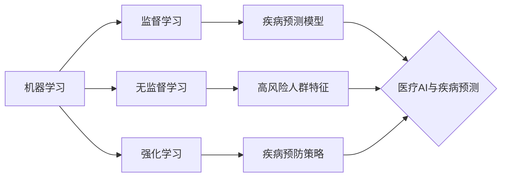

## 1. 背景介绍

### 1.1 疾病预测的必要性

在医疗领域，疾病的早期诊断和治疗至关重要。许多疾病，例如癌症、心脏病和糖尿病，如果能在早期阶段被发现，治疗成功的可能性会大大增加。然而，传统的诊断方法往往依赖于症状的出现，而此时疾病可能已经发展到了一定程度。因此，迫切需要一种能够在疾病症状出现之前就进行预测的方法，以便尽早采取预防措施或进行早期干预。

### 1.2 人工智能的兴起

近年来，人工智能（AI）技术取得了突飞猛进的发展，并在各个领域展现出巨大的应用潜力。AI系统能够从海量数据中学习，识别复杂的模式，并进行准确的预测。在医疗领域，AI已经被应用于医学影像分析、药物研发、疾病诊断等方面，并取得了令人瞩目的成果。

### 1.3 医疗AI与疾病预测

医疗AI与疾病预测的结合为疾病的防患于未然提供了新的可能性。通过分析患者的医疗记录、基因数据、生活方式等信息，AI系统可以识别出潜在的疾病风险因素，并预测个体在未来患上特定疾病的可能性。这种预测能力可以帮助医生进行更精准的疾病筛查，制定个性化的预防方案，并提高患者的健康管理意识。

## 2. 核心概念与联系

### 2.1 机器学习

机器学习是人工智能的一个分支，其核心思想是让计算机从数据中学习，并根据学习到的知识进行预测或决策。在医疗AI与疾病预测中，常用的机器学习方法包括：

- 监督学习：利用已知疾病状态的样本数据训练模型，然后用模型预测新样本的疾病风险。
- 无监督学习：从未标记的样本数据中发现隐藏的模式，例如识别高风险人群的特征。
- 强化学习：通过与环境的交互，让模型学习最佳的疾病预防策略。

### 2.2 深度学习

深度学习是机器学习的一个子领域，其特点是使用多层神经网络来学习数据的复杂表示。深度学习在图像识别、自然语言处理等领域取得了突破性进展，也逐渐被应用于医疗AI与疾病预测。

### 2.3 数据挖掘

数据挖掘是从大量数据中提取有价值信息的过程。在医疗AI与疾病预测中，数据挖掘可以用于识别疾病风险因素、发现疾病发展规律、预测疾病趋势等。

### 2.4 核心概念联系图



## 3. 核心算法原理具体操作步骤

### 3.1 数据预处理

- 数据清洗：去除数据中的噪声、缺失值和异常值。
- 数据转换：将数据转换为适合机器学习算法的格式，例如将类别变量转换为数值变量。
- 特征工程：从原始数据中提取有用的特征，例如计算患者的BMI指数、血脂水平等。

### 3.2 模型训练

- 选择合适的机器学习算法，例如逻辑回归、支持向量机、随机森林等。
- 将预处理后的数据分为训练集和测试集。
- 使用训练集训练模型，并调整模型参数以获得最佳性能。

### 3.3 模型评估

- 使用测试集评估模型的预测准确率、召回率、F1值等指标。
- 使用交叉验证等方法评估模型的泛化能力，即模型在未见过的数据上的预测能力。

### 3.4 疾病预测

- 使用训练好的模型预测新患者的疾病风险。
- 根据预测结果，制定个性化的预防方案或进行早期干预。

## 4. 数学模型和公式详细讲解举例说明

### 4.1 逻辑回归

逻辑回归是一种常用的监督学习算法，用于预测二分类问题，例如患者是否患有某种疾病。逻辑回归模型的数学表达式为：

$$
P(y=1|x) = \frac{1}{1 + e^{-(\beta_0 + \beta_1 x_1 + ... + \beta_n x_n)}}
$$

其中：

- $P(y=1|x)$ 表示在给定特征 $x$ 的情况下，患者患病的概率。
- $x_1, ..., x_n$ 表示患者的特征，例如年龄、性别、血压等。
- $\beta_0, \beta_1, ..., \beta_n$ 表示模型参数，通过训练集学习得到。

### 4.2 举例说明

假设我们要预测患者是否患有心脏病，患者的特征包括年龄、性别、血压、胆固醇水平等。我们可以使用逻辑回归模型来进行预测。首先，我们需要收集大量已知心脏病状态的患者数据，并将其分为训练集和测试集。然后，我们使用训练集训练逻辑回归模型，并调整模型参数以获得最佳性能。最后，我们使用测试集评估模型的预测准确率。

## 5. 项目实践：代码实例和详细解释说明

### 5.1 代码实例

```python
import pandas as pd
from sklearn.linear_model import LogisticRegression
from sklearn.model_selection import train_test_split
from sklearn.metrics import accuracy_score

# 加载数据
data = pd.read_csv('heart_disease_data.csv')

# 划分特征和标签
X = data.drop('target', axis=1)
y = data['target']

# 划分训练集和测试集
X_train, X_test, y_train, y_test = train_test_split(X, y, test_size=0.2)

# 创建逻辑回归模型
model = LogisticRegression()

# 训练模型
model.fit(X_train, y_train)

# 预测测试集
y_pred = model.predict(X_test)

# 评估模型
accuracy = accuracy_score(y_test, y_pred)
print(f'Accuracy: {accuracy}')
```

### 5.2 代码解释

- `pandas` 用于加载和处理数据。
- `sklearn` 提供了机器学习算法和模型评估工具。
- `train_test_split` 用于将数据划分为训练集和测试集。
- `LogisticRegression` 创建逻辑回归模型。
- `fit` 方法用于训练模型。
- `predict` 方法用于预测新样本。
- `accuracy_score` 用于评估模型的预测准确率。

## 6. 实际应用场景

### 6.1 疾病风险评估

医疗AI可以分析患者的医疗记录、基因数据、生活方式等信息，识别出潜在的疾病风险因素，并预测个体在未来患上特定疾病的可能性。例如，AI可以预测患者患心脏病、癌症、糖尿病等的风险。

### 6.2 个性化预防方案

根据患者的疾病风险评估结果，医疗AI可以制定个性化的预防方案，例如建议患者改变生活方式、定期进行体检、服用预防药物等。

### 6.3 早期干预

如果医疗AI预测患者患病的风险较高，可以建议患者进行进一步的检查，以便尽早确诊并进行治疗。

## 7. 工具和资源推荐

### 7.1 TensorFlow

TensorFlow 是一个开源的机器学习平台，提供了丰富的工具和资源，用于构建和训练医疗AI模型。

### 7.2 PyTorch

PyTorch 是另一个开源的机器学习平台，以其灵活性和易用性而闻名，也适用于医疗AI应用。

### 7.3 scikit-learn

scikit-learn 是一个 Python 机器学习库，提供了各种机器学习算法和模型评估工具。

## 8. 总结：未来发展趋势与挑战

### 8.1 未来发展趋势

- 随着数据量的不断增加和算法的不断改进，医疗AI的疾病预测能力将会越来越强。
- 医疗AI将会与其他技术，例如物联网、云计算等相结合，为患者提供更全面、更精准的健康管理服务。

### 8.2 挑战

- 数据隐私和安全问题。
- 算法的透明度和可解释性。
- 医疗AI的伦理问题。

## 9. 附录：常见问题与解答

### 9.1 医疗AI的预测准确率有多高？

医疗AI的预测准确率取决于多种因素，例如数据的质量、算法的选择、模型的训练程度等。一般来说，医疗AI的预测准确率可以达到80%以上。

### 9.2 医疗AI可以取代医生吗？

医疗AI不能取代医生，但可以作为医生的辅助工具，帮助医生进行更精准的诊断和治疗。

### 9.3 医疗AI的应用有哪些风险？

医疗AI的应用存在一些风险，例如数据泄露、算法偏差、误诊等。因此，在应用医疗AI时，需要充分考虑这些风险，并采取相应的防范措施。
