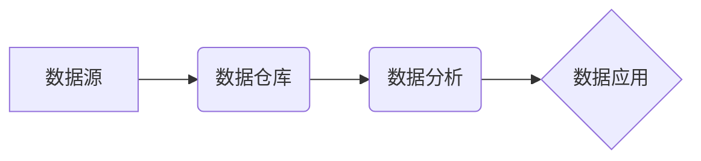

## 1. 背景介绍

### 1.1 园区企业的现状与挑战

随着经济全球化和信息技术的快速发展，园区经济已成为推动区域经济发展的重要引擎。园区内企业数量众多，行业分布广泛，业务模式复杂，对高效、精细化的管理提出了更高的要求。传统的管理模式已无法满足现代园区企业发展的需求，面临着以下挑战：

* **信息孤岛：** 各部门、企业之间数据缺乏共享和协同，导致信息流通不畅，决策效率低下。
* **管理粗放：** 缺乏精细化的管理手段，难以实时掌握企业运营状况，资源配置效率低下。
* **服务滞后：** 难以提供及时、个性化的服务，无法满足企业多元化需求。

### 1.2 数据化管理的必要性

为了应对上述挑战，园区企业亟需进行数据化转型，构建数据驱动的管理体系。数据化管理系统可以实现以下目标：

* **打破信息孤岛，实现数据共享与协同。**
* **提升管理精细化水平，实现资源优化配置。**
* **提供精准化服务，提升企业满意度。**

### 1.3 数据化管理系统的设计目标

园区企业数据化管理系统的设计目标是构建一个集数据采集、存储、分析、应用于一体的综合性平台，为园区管理者、企业提供全方位的数据服务，提升园区管理效率和服务水平。

## 2. 核心概念与联系

### 2.1 数据源

数据源是指数据化管理系统所采集数据的来源，包括：

* **企业内部数据：** 企业自身的生产经营数据，如财务数据、人事数据、生产数据等。
* **园区公共数据：** 园区提供的公共服务数据，如政策法规、招商信息、基础设施数据等。
* **外部数据：** 来自互联网、第三方机构等外部数据，如市场行情、行业资讯等。

### 2.2 数据仓库

数据仓库是指用于存储和管理数据化管理系统所采集数据的数据库系统，其特点是：

* **数据量大：** 数据仓库需要存储海量的结构化和非结构化数据。
* **数据结构复杂：** 数据仓库需要支持多种数据模型，如关系型数据库、文档数据库、键值数据库等。
* **数据分析能力强：** 数据仓库需要支持复杂的数据分析操作，如数据挖掘、机器学习等。

### 2.3 数据分析

数据分析是指对数据仓库中的数据进行加工、分析，提取有价值的信息，为决策提供支持。常用的数据分析方法包括：

* **统计分析：** 对数据进行统计汇总、对比分析，发现数据规律。
* **数据挖掘：** 利用机器学习算法，从数据中发现隐藏的模式和规律。
* **预测分析：** 基于历史数据和模型，预测未来趋势。

### 2.4 数据应用

数据应用是指将数据分析结果应用于实际业务场景，提升管理效率和服务水平。数据应用场景包括：

* **企业运营管理：** 利用数据分析结果，优化生产流程、提高产品质量、降低成本。
* **园区招商引资：** 利用数据分析结果，精准定位目标企业，提高招商成功率。
* **园区公共服务：** 利用数据分析结果，提供个性化的公共服务，提升企业满意度。

### 2.5 核心概念关系图



## 3. 核心算法原理具体操作步骤

### 3.1 数据采集

数据采集是指从数据源获取数据的过程，其操作步骤包括：

* **数据源识别：** 确定需要采集的数据源类型和数据范围。
* **数据采集方式选择：** 根据数据源特点，选择合适的采集方式，如数据库同步、API接口调用、网络爬虫等。
* **数据清洗和转换：** 对采集到的数据进行清洗、转换，使其符合数据仓库的规范要求。

### 3.2 数据存储

数据存储是指将采集到的数据存储到数据仓库中的过程，其操作步骤包括：

* **数据模型设计：** 根据数据特点和分析需求，设计数据仓库的数据模型。
* **数据加载：** 将清洗和转换后的数据加载到数据仓库中。
* **数据备份和恢复：** 定期备份数据仓库数据，并制定数据恢复方案，确保数据安全。

### 3.3 数据分析

数据分析是指对数据仓库中的数据进行加工、分析，提取有价值的信息的过程，其操作步骤包括：

* **数据预处理：** 对数据进行清洗、转换、降维等操作，为数据分析做好准备。
* **模型选择：** 根据分析目标和数据特点，选择合适的分析模型，如统计分析模型、机器学习模型等。
* **模型训练和评估：** 利用历史数据训练模型，并评估模型的准确性和有效性。
* **结果解释和应用：** 对分析结果进行解释，并应用于实际业务场景。

### 3.4 数据应用

数据应用是指将数据分析结果应用于实际业务场景，提升管理效率和服务水平的过程，其操作步骤包括：

* **需求分析：** 确定数据应用场景和目标。
* **数据可视化：** 将数据分析结果以图表、报表等形式展示，方便用户理解。
* **系统集成：** 将数据分析结果集成到现有业务系统中，实现数据驱动决策。

## 4. 数学模型和公式详细讲解举例说明

### 4.1 线性回归模型

线性回归模型是一种常用的统计分析模型，用于分析自变量与因变量之间的线性关系。其数学模型如下：

$$
y = \beta_0 + \beta_1 x_1 + \beta_2 x_2 + ... + \beta_n x_n + \epsilon
$$

其中：

* $y$ 是因变量
* $x_1, x_2, ..., x_n$ 是自变量
* $\beta_0, \beta_1, \beta_2, ..., \beta_n$ 是回归系数
* $\epsilon$ 是误差项

**举例说明：**

假设我们想分析企业产值与员工数量、研发投入之间的关系，可以使用线性回归模型。收集历史数据后，利用最小二乘法估计回归系数，得到如下模型：

$$
产值 = 100 + 2 * 员工数量 + 5 * 研发投入
$$

该模型表明，员工数量每增加1人，产值增加2万元；研发投入每增加1万元，产值增加5万元。

### 4.2 K-Means聚类算法

K-Means聚类算法是一种常用的机器学习算法，用于将数据点划分为不同的簇。其操作步骤如下：

1. 随机选择 K 个点作为初始聚类中心。
2. 计算每个数据点到 K 个聚类中心的距离，并将数据点分配到距离最近的聚类中心所属的簇。
3. 重新计算每个簇的中心点。
4. 重复步骤 2 和 3，直到聚类中心不再变化或达到最大迭代次数。

**举例说明：**

假设我们想将园区企业按照行业类型进行聚类，可以使用 K-Means 算法。首先，根据行业分类标准，确定 K 值，例如 K=5。然后，随机选择 5 家企业作为初始聚类中心。接下来，计算每家企业与 5 个聚类中心的距离，并将企业分配到距离最近的聚类中心所属的簇。最后，重新计算每个簇的中心点，直到聚类中心不再变化或达到最大迭代次数。

## 5. 项目实践：代码实例和详细解释说明

### 5.1 数据采集模块

```python
import requests

def get_data_from_api(api_url, headers):
  """
  从 API 接口获取数据

  Args:
    api_url: API 接口地址
    headers: 请求头

  Returns:
    JSON 格式的数据
  """

  response = requests.get(api_url, headers=headers)
  response.raise_for_status()
  return response.json()

# 示例：获取企业财务数据
api_url = "https://api.example.com/finance"
headers = {"Authorization": "Bearer your_api_token"}
finance_data = get_data_from_api(api_url, headers)

# 将数据存储到数据仓库
# ...
```

### 5.2 数据分析模块

```python
import pandas as pd
from sklearn.linear_model import LinearRegression

def analyze_data(data):
  """
  分析数据

  Args:
     DataFrame 格式的数据

  Returns:
    分析结果
  """

  # 创建线性回归模型
  model = LinearRegression()

  # 训练模型
  model.fit(data[["员工数量", "研发投入"]], data["产值"])

  # 获取回归系数
  coefficients = model.coef_

  # 返回分析结果
  return coefficients

# 示例：分析企业产值与员工数量、研发投入之间的关系
data = pd.DataFrame({
  "员工数量": [10, 20, 30, 40, 50],
  "研发投入": [100, 200, 300, 400, 500],
  "产值": [120, 240, 360, 480, 600]
})

coefficients = analyze_data(data)

# 输出回归系数
print(coefficients)
```

## 6. 实际应用场景

### 6.1 企业运营管理

* **生产效率分析：** 利用数据分析结果，识别生产瓶颈，优化生产流程，提高生产效率。
* **成本控制：** 利用数据分析结果，识别成本高企环节，制定成本控制措施，降低生产成本。
* **产品质量管理：** 利用数据分析结果，识别产品质量问题，制定质量改进措施，提高产品质量。

### 6.2 园区招商引资

* **目标企业画像：** 利用数据分析结果，构建目标企业画像，精准定位招商目标。
* **招商策略制定：** 利用数据分析结果，制定差异化的招商策略，提高招商成功率。
* **招商效果评估：** 利用数据分析结果，评估招商效果，优化招商策略。

### 6.3 园区公共服务

* **企业服务精准化：** 利用数据分析结果，提供个性化的企业服务，提升企业满意度。
* **园区资源优化配置：** 利用数据分析结果，优化园区资源配置，提高资源利用效率。
* **园区安全管理：** 利用数据分析结果，识别安全隐患，制定安全防范措施，保障园区安全。

## 7. 工具和资源推荐

### 7.1 数据采集工具

* **Apache Kafka：** 分布式流处理平台，用于实时采集和处理数据。
* **Apache Nifi：** 数据流管理工具，用于自动化数据采集和处理流程。
* **Fluentd：** 开源数据采集器，用于收集各种数据源的数据。

### 7.2 数据仓库工具

* **Apache Hadoop：** 分布式存储和计算平台，用于存储和处理大规模数据。
* **Apache Spark：** 分布式计算框架，用于快速处理大规模数据。
* **Amazon Redshift：** 云数据仓库服务，提供高性能、可扩展的数据存储和分析能力。

### 7.3 数据分析工具

* **Python：** 编程语言，拥有丰富的數據分析库，如 Pandas、NumPy、Scikit-learn 等。
* **R：** 统计分析软件，拥有丰富的统计分析和数据可视化功能。
* **Tableau：** 数据可视化工具，用于创建交互式仪表板和报表。

## 8. 总结：未来发展趋势与挑战

### 8.1 未来发展趋势

* **数据智能化：** 利用人工智能技术，提升数据分析的自动化和智能化水平。
* **数据融合：** 将不同来源的数据进行融合，构建更 comprehensive 的数据视图。
* **数据安全：** 加强数据安全保障，防范数据泄露和滥用。

### 8.2 面临的挑战

* **数据质量：** 确保数据的准确性和可靠性。
* **数据治理：** 建立完善的数据治理体系，确保数据合规使用。
* **人才队伍建设：** 培养数据分析和应用人才，满足数据化管理需求。

## 9. 附录：常见问题与解答

### 9.1 如何保障数据安全？

* 建立完善的数据安全管理制度，明确数据安全责任。
* 采用数据加密、访问控制等技术手段，保护数据安全。
* 定期进行数据安全审计，及时发现和解决安全隐患。

### 9.2 如何提升数据分析效率？

* 采用分布式计算技术，加速数据分析过程。
* 利用机器学习算法，自动化数据分析过程。
* 优化数据分析模型，提高分析效率。
