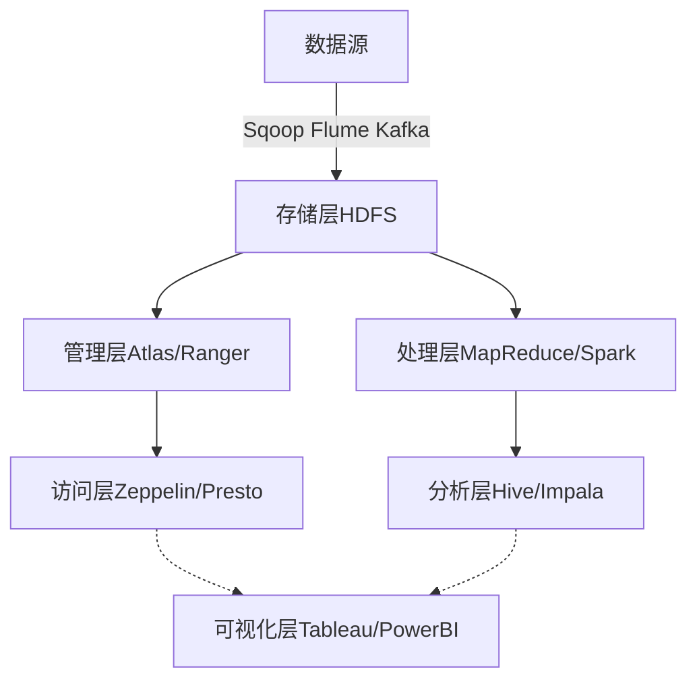
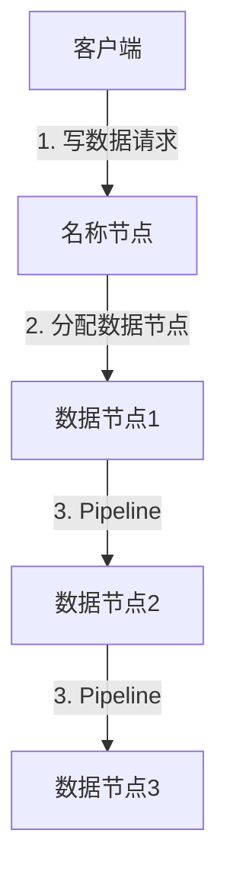

# 基于Hadoop构建数据湖：企业级解决方案

## 1.背景介绍

### 1.1 数据湖的兴起

在当今的数字时代,数据被认为是企业的新型战略资产。随着数据量的快速增长和多样化,传统的数据仓库架构面临着诸多挑战,例如:

- 数据种类繁多,结构多变
- 存储和计算成本高昂
- 数据处理流程复杂,难以满足业务灵活性需求

为了更好地管理和利用海量的结构化、半结构化和非结构化数据,数据湖(Data Lake)应运而生。

### 1.2 什么是数据湖?

数据湖是一种能够存储各种格式数据的集中式存储库,旨在高效捕获、处理、保护和分析所有类型的数据。它具有以下特点:

- 存储所有原始数据,而非仅存储加工过的数据
- 支持各种数据格式,包括结构化、半结构化和非结构化数据
- 提供低成本的横向扩展能力
- 支持批处理和流处理等多种数据处理模式

数据湖使数据民主化,使企业内外的各种用户都可以访问和分析所需数据,从而提高数据资产的价值。

## 2.核心概念与联系

### 2.1 Hadoop生态系统

Apache Hadoop是构建数据湖的核心技术,它是一个开源的分布式系统基础架构,由以下几个核心组件组成:

1. **HDFS** - 分布式文件系统,用于存储海量数据
2. **YARN** - 作业调度和集群资源管理系统
3. **MapReduce** - 分布式数据处理模型和编程框架

除了核心组件,Hadoop还有一系列生态系统工具,用于数据采集、处理、分析和访问等各个环节。


### 2.2 数据湖架构

基于Hadoop构建的数据湖通常包含以下几个核心层:

1. **存储层** - 使用HDFS作为数据的持久存储介质
2. **处理层** - 利用MapReduce、Spark等框架进行批处理和流处理
3. **管理层** - 提供数据治理、元数据管理、安全访问控制等功能
4. **访问层** - 支持OLAP、SQL、机器学习等多种数据分析方式

5. **可视化层** - 提供数据可视化和商业智能工具,助力数据驱动决策



## 3.核心算法原理具体操作步骤

### 3.1 HDFS原理

HDFS的设计理念是"一次写入,多次读取",适合于吞吐量大于延迟的大数据场景。其核心原理包括:

1. **数据块** - 文件被分割为多个数据块(默认128MB),并在不同节点上存储多个副本
2. **名称节点** - 管理文件系统元数据,如文件与数据块的映射关系
3. **数据节点** - 存储实际数据块,并定期向名称节点发送心跳和块报告
4. **Pipeline复制** - 当写入新数据块时,首先由客户端与若干数据节点建立管道,然后将数据流式传输并存储多个副本



### 3.2 MapReduce原理

MapReduce是Hadoop的核心计算框架,适用于批处理大数据分析场景。它将计算过程分为两个阶段:Map和Reduce。

**Map阶段**

1. 输入文件被切分为数据块,每个块由一个Map任务处理
2. Map任务并行运行,对每个输入键值对调用用户自定义的Map函数
3. Map函数的输出被缓存在环形内存缓冲区中

**Reduce阶段**

4. MapReduce库对Map输出进行分区和排序
5. 将排序好的数据传输给Reduce任务
6. Reduce任务并行运行,对每个键值对调用用户自定义的Reduce函数
7. Reduce函数的输出被写入HDFS文件

$$
\begin{aligned}
Map(k_1,v_1) &\rightarrow \text{list}(k_2,v_2) \\
Reduce(k_2,\text{list}(v_2)) &\rightarrow \text{list}(k_3,v_3)
\end{aligned}
$$

## 4.数学模型和公式详细讲解举例说明

在大数据处理中,常常需要进行数据采样和近似计算,以提高计算效率。这里介绍两个常用的数学模型:

### 4.1 reservoir sampling 蓄水池采样

蓄水池采样是一种无偏概率抽样算法,可用于从海量数据流中随机选取k个样本。算法步骤如下:

1. 初始化一个大小为k的reservoir(蓄水池)
2. 对于前k个数据元素,全部存入reservoir
3. 对于第i个数据元素(i>k):
    - 以k/i的概率决定是否将其存入reservoir
    - 若存入,则以等概率(1/k)随机替换掉reservoir中的一个元素

证明该算法是无偏的:

令X为reservoir中包含第i个元素的随机指示变量:
$$
\begin{aligned}
P(X=1) &= \frac{k}{i} \cdot \frac{1}{k} = \frac{1}{i} \\
E[X] &= \sum_{i=k+1}^{n} P(X=1) \\
     &= \sum_{i=k+1}^{n} \frac{1}{i} = k
\end{aligned}
$$

因此,每个数据元素被选中的期望为k,算法是无偏的。

### 4.2 HyperLogLog 基数估计

在大规模数据集中,统计基数(不重复元素个数)是一个常见需求,但完全遍历会带来高昂的计算和存储开销。HyperLogLog利用概率统计进行基数估计,其误差率在1%左右,计算量和空间复杂度都较小。

算法原理:

1. 初始化一个长度为m的位向量,所有位初始化为0
2. 对于每个输入元素x:
    - 计算x的哈希值h(x)
    - 找到h(x)的前缀0的个数:ρ = 最小的正整数,使得h(x)的最高ρ位为0
    - 令j = h(x)的后面(32-ρ)位的值,更新M[j] = max(M[j], ρ)
3. 估计基数为: $\hat{n} = \alpha_m \cdot m^2 / \Sigma_{j=1}^{m} 2^{-M[j]}$

其中$\alpha_m$是一个常数,用于对小值估计进行纠正。

HyperLogLog通过最大前缀0位长度的极值估计来估算基数,极大节省了存储空间。它在许多系统(Redis、Spark等)中得到广泛应用。

## 4.项目实践:代码实例和详细解释说明

这里以WordCount作为MapReduce编程实例进行讲解。WordCount是统计给定文本文件中每个单词出现频率的经典示例。

### 4.1 Map阶段

Map函数将每行文本切分为单词,并输出`<word, 1>`这样的键值对:

```java
public static class WordCountMapper extends Mapper<LongWritable, Text, Text, IntWritable> {
    private final static IntWritable one = new IntWritable(1);
    private Text word = new Text();

    public void map(LongWritable key, Text value, Context context) throws IOException, InterruptedException {
        String line = value.toString();
        StringTokenizer tokenizer = new StringTokenizer(line);
        while (tokenizer.hasMoreTokens()) {
            word.set(tokenizer.nextToken());
            context.write(word, one);
        }
    }
}
```

### 4.2 Reduce阶段

Reduce函数对每个单词汇总出现次数:

```java
public static class WordCountReducer extends Reducer<Text, IntWritable, Text, IntWritable> {
    private IntWritable result = new IntWritable();

    public void reduce(Text key, Iterable<IntWritable> values, Context context) throws IOException, InterruptedException {
        int sum = 0;
        for (IntWritable val : values) {
            sum += val.get();
        }
        result.set(sum);
        context.write(key, result);
    }
}
```

### 4.3 作业提交

用户需编写一个驱动程序来提交MapReduce作业:

```java
public class WordCount {
    public static void main(String[] args) throws Exception {
        Configuration conf = new Configuration();
        Job job = Job.getInstance(conf, "word count");
        job.setJarByClass(WordCount.class);
        job.setMapperClass(WordCountMapper.class);
        job.setCombinerClass(WordCountReducer.class);
        job.setReducerClass(WordCountReducer.class);
        job.setOutputKeyClass(Text.class);
        job.setOutputValueClass(IntWritable.class);
        FileInputFormat.addInputPath(job, new Path(args[0]));
        FileOutputFormat.setOutputPath(job, new Path(args[1]));
        System.exit(job.waitForCompletion(true) ? 0 : 1);
    }
}
```

上述代码展示了MapReduce编程的基本流程:设置作业参数、指定Map/Reduce类、配置输入输出路径,最后提交作业运行。

## 5.实际应用场景

数据湖广泛应用于各个行业,如电信、金融、制造、医疗等。以电信运营商为例,可以通过建立数据湖实现以下应用:

1. **网络优化** - 分析用户位置、网络状况等数据,优化基站部署和网络容量
2. **营销分析** - 整合用户画像、消费行为等数据,进行精准营销和个性化推荐
3. **客户服务** - 分析客户投诉、呼叫记录等数据,提高服务质量和客户体验
4. **欺诈检测** - 分析通话详单、上网记录等数据,识别恶意欺诈行为
5. **物联网分析** - 采集和分析海量物联网设备数据,优化运营和设备维护

## 6. 工具和资源推荐

构建企业级数据湖涉及诸多工具和资源,这里推荐一些常用的:

### 6.1 Hadoop发行版

- **Cloudera** - 提供全面的Hadoop发行版CDH
- **Hortonworks** - 提供100%开源的Hortonworks数据平台HDP  
- **Amazon EMR** - AWS上的托管Hadoop服务
- **Azure HDInsight** - Microsoft Azure上的Hadoop云服务

### 6.2 数据湖管理平台

- **AWS Lake Formation** - 在AWS上构建、安全和管理数据湖
- **Azure Data Lake** - 适用于企业的分析数据湖服务
- **Cloudera Data Platform** - 基于Kubernetes的数据湖平台

### 6.3 学习资源

- **Hadoop官方网站** - https://hadoop.apache.org/
- **数据湖在线课程** - https://www.coursera.org/learn/data-lakes-big-data
- **技术书籍** - 《Data Lake for Enterprises》, 《Data Pipelines with Apache Airflow》等

## 7.总结:未来发展趋势与挑战

数据湖是大数据时代的必然产物,它为企业带来了数据民主化和更大的业务价值。但在实施过程中,仍面临一些挑战:

1. **数据治理** - 如何对数据湖中的海量数据实施标准化、版本控制、访问控制等治理
2. **元数据管理** - 如何高效管理和查询数据元数据,提高数据可发现性和可理解性
3. **数据安全** - 如何保护敏感数据,防止数据泄露和未经授权的访问
4. **性能优化** - 如何优化数据湖的查询性能,满足低延迟的实时分析需求

未来,数据湖将朝着以下方向发展:

1. **融合数据仓库** - 数据湖与数据仓库的融合,形成统一的数据分析平台
2. **云原生** - 完全基于云构建数据湖,利用云的弹性和按需付费优势
3. **AI/ML集成** - 将人工智能/机器学习能力深度集成到数据湖中
4. **开放数据生态** - 打造数据共享和交换的开放生态系统

## 8