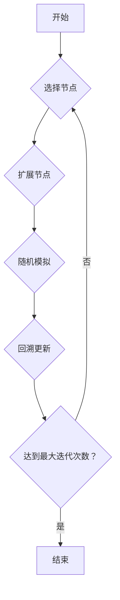

## 1. 背景介绍

### 1.1 对抗性搜索的本质

对抗性搜索（Adversarial Search）是人工智能领域中一种重要的搜索方法，它主要应用于双方竞争的场景，例如棋类游戏、电子竞技、自动驾驶等。在这种场景下，智能体需要在考虑对手行动的情况下，选择最优的行动策略，以最大化自身的利益。

### 1.2 传统对抗性搜索方法的局限性

传统的对抗性搜索方法，例如 Minimax 算法和 Alpha-Beta 剪枝，通常依赖于对搜索空间的完整遍历，这在实际应用中往往面临着巨大的计算量和时间成本。尤其是在状态空间庞大、动作选择多样化的场景下，传统方法的效率会受到严重制约。

### 1.3 蒙特卡洛树搜索的优势

蒙特卡洛树搜索（Monte Carlo Tree Search，MCTS）是一种基于随机模拟的搜索方法，它通过对游戏进行多次模拟，并根据模拟结果评估不同行动的价值，从而选择最优的行动策略。相比于传统方法，MCTS 具有以下优势：

* **无需完整遍历搜索空间：** MCTS 通过随机模拟的方式，可以有效地探索搜索空间，并快速找到具有较高价值的行动。
* **适应性强：** MCTS 对游戏的先验知识要求较低，可以适应各种不同的游戏规则和环境。
* **可扩展性好：** MCTS 可以通过并行计算的方式，提升搜索效率，并应用于大规模的搜索问题。

## 2. 核心概念与联系

### 2.1 蒙特卡洛树

蒙特卡洛树（Monte Carlo Tree）是 MCTS 算法的核心数据结构，它以树的形式组织了游戏的不同状态和行动。树的每个节点代表一个游戏状态，节点的边代表从当前状态可以采取的行动。每个节点都包含以下信息：

* **状态值：** 表示当前状态的价值，通常用模拟结果的平均值来估计。
* **访问次数：** 表示该节点被访问的次数，用于衡量节点的可靠性。
* **子节点：** 表示从当前状态可以到达的下一级状态。

### 2.2 选择、扩展、模拟、回溯

MCTS 算法的核心流程可以概括为四个步骤：

1. **选择（Selection）：** 从根节点开始，根据一定的策略，选择最具有探索价值的节点进行扩展。
2. **扩展（Expansion）：** 为选中的节点添加新的子节点，表示新的游戏状态和行动。
3. **模拟（Simulation）：** 从扩展的节点开始，进行随机模拟，直到游戏结束，并获得模拟结果。
4. **回溯（Backpropagation）：** 将模拟结果回溯到树的根节点，更新节点的状态值和访问次数。

### 2.3 探索与利用的平衡

MCTS 算法需要在探索新的状态和利用已知信息之间取得平衡。探索是指选择访问次数较少的节点，以发现潜在的更优行动；利用是指选择状态值较高的节点，以选择当前认为最优的行动。

## 3. 核心算法原理具体操作步骤

### 3.1 UCB1 算法

UCB1（Upper Confidence Bound 1）算法是一种常用的节点选择策略，它在探索和利用之间取得了较好的平衡。该算法的公式如下：

$$
UCB1(s) = Q(s) + C * \sqrt{\frac{\ln{N(parent(s))}}{N(s)}}
$$

其中：

* $s$ 表示当前节点
* $Q(s)$ 表示节点 $s$ 的状态值
* $N(s)$ 表示节点 $s$ 的访问次数
* $parent(s)$ 表示节点 $s$ 的父节点
* $C$ 是一个常数，用于控制探索的程度

UCB1 算法选择 UCB1 值最高的节点进行扩展。

### 3.2 随机模拟

随机模拟是指从扩展的节点开始，随机选择行动，直到游戏结束，并获得模拟结果。模拟结果通常用游戏得分或胜负来表示。

### 3.3 回溯更新

回溯更新是指将模拟结果回溯到树的根节点，更新节点的状态值和访问次数。更新方法如下：

* **状态值更新：** 节点的状态值更新为所有模拟结果的平均值。
* **访问次数更新：** 节点的访问次数增加 1。

### 3.4 算法流程图



## 4. 数学模型和公式详细讲解举例说明

### 4.1 状态值估计

MCTS 算法使用模拟结果的平均值来估计节点的状态值。假设节点 $s$ 已经进行了 $N(s)$ 次模拟，模拟结果分别为 $r_1, r_2, ..., r_{N(s)}$，则节点 $s$ 的状态值 $Q(s)$ 可以估计为：

$$
Q(s) = \frac{1}{N(s)} \sum_{i=1}^{N(s)} r_i
$$

### 4.2 UCB1 算法的数学原理

UCB1 算法的数学原理是基于 Hoeffding 不等式。Hoeffding 不等式指出，对于独立同分布的随机变量，其样本均值与真实均值之间的差距可以用一个置信区间来界定。UCB1 算法利用 Hoeffding 不等式，构造了一个置信上界，并选择置信上界最高的节点进行扩展。

### 4.3 举例说明

假设有一个简单的棋类游戏，游戏规则如下：

* 棋盘大小为 3x3。
* 玩家轮流下棋，每次只能在一个空位上下棋。
* 当一个玩家连成三个棋子时，该玩家获胜。

现在使用 MCTS 算法来解决这个游戏。假设当前游戏状态如下：

```
X O .
. . .
. . .
```

其中，X 表示先手玩家的棋子，O 表示后手玩家的棋子，. 表示空位。

使用 UCB1 算法选择节点进行扩展。假设常数 $C$ 设置为 1.414。

1. **计算根节点的 UCB1 值：** 根节点的状态值为 0，访问次数为 0，因此 UCB1 值为 $+\infty$。
2. **选择 UCB1 值最高的节点：** 根节点的 UCB1 值最高，因此选择根节点进行扩展。
3. **扩展根节点：** 根节点可以扩展出 7 个子节点，分别对应于 7 个空位。
4. **随机模拟：** 从每个子节点开始，进行随机模拟，直到游戏结束，并获得模拟结果。
5. **回溯更新：** 将模拟结果回溯到根节点，更新节点的状态值和访问次数。

经过多次迭代后，MCTS 算法可以找到最优的行动策略。

## 5. 项目实践：代码实例和详细解释说明

### 5.1 Python 代码实例

```python
import math
import random

class Node:
    def __init__(self, state, parent=None, action=None):
        self.state = state
        self.parent = parent
        self.action = action
        self.children = []
        self.visits = 0
        self.value = 0

    def select_child(self, c=1.414):
        """
        使用 UCB1 算法选择子节点。
        """
        return max(self.children, key=lambda child: child.value + c * math.sqrt(math.log(self.visits) / child.visits))

    def expand(self):
        """
        扩展节点，添加新的子节点。
        """
        for action in self.state.get_legal_actions():
            next_state = self.state.get_next_state(action)
            child = Node(next_state, self, action)
            self.children.append(child)

    def simulate(self):
        """
        进行随机模拟，直到游戏结束，并返回模拟结果。
        """
        state = self.state.clone()
        while not state.is_terminal():
            action = random.choice(state.get_legal_actions())
            state = state.get_next_state(action)
        return state.get_reward()

    def backpropagate(self, reward):
        """
        回溯更新节点的状态值和访问次数。
        """
        self.visits += 1
        self.value += (reward - self.value) / self.visits
        if self.parent:
            self.parent.backpropagate(reward)

def mcts(root, iterations):
    """
    蒙特卡洛树搜索算法。
    """
    for _ in range(iterations):
        node = root
        while node.children:
            node = node.select_child()
        if not node.visits:
            reward = node.simulate()
        else:
            node.expand()
            reward = node.children[0].simulate()
        node.backpropagate(reward)
    return root.select_child(c=0).action
```

### 5.2 代码解释

* `Node` 类表示蒙特卡洛树的节点。
* `select_child()` 方法使用 UCB1 算法选择子节点。
* `expand()` 方法扩展节点，添加新的子节点。
* `simulate()` 方法进行随机模拟，直到游戏结束，并返回模拟结果。
* `backpropagate()` 方法回溯更新节点的状态值和访问次数。
* `mcts()` 函数实现蒙特卡洛树搜索算法。

## 6. 实际应用场景

### 6.1 游戏 AI

MCTS 算法在游戏 AI 领域有着广泛的应用，例如：

* **AlphaGo：** AlphaGo 是 DeepMind 开发的围棋 AI，它使用 MCTS 算法作为核心搜索算法，并结合深度学习技术，实现了对人类顶尖棋手的超越。
* **OpenAI Five：** OpenAI Five 是 OpenAI 开发的 Dota 2 AI，它使用 MCTS 算法作为核心搜索算法，并结合强化学习技术，实现了对人类职业战队的胜利。

### 6.2 自动驾驶

MCTS 算法也可以应用于自动驾驶领域，例如：

* **路径规划：** MCTS 算法可以用于规划车辆的行驶路径，并在考虑交通状况、路况等因素的情况下，选择最优的路径。
* **决策控制：** MCTS 算法可以用于控制车辆的行为，例如加速、减速、转向等，并在考虑周围环境的情况下，做出安全的决策。

### 6.3 其他应用

MCTS 算法还可以应用于其他领域，例如：

* **推荐系统：** MCTS 算法可以用于推荐商品或服务，并在考虑用户的历史行为、偏好等因素的情况下，推荐最符合用户需求的商品或服务。
* **金融交易：** MCTS 算法可以用于预测股票价格走势，并在考虑市场行情、公司业绩等因素的情况下，做出最优的投资决策。

## 7. 工具和资源推荐

### 7.1 软件库

* **Python：**
    * `pymcts`：一个 Python 的 MCTS 库。
    * `alphago`：一个 AlphaGo 的 Python 实现。
* **C++：**
    * `MCTS`：一个 C++ 的 MCTS 库。

### 7.2 在线资源

* **MCTS.net：** 一个关于 MCTS 的网站，包含了 MCTS 的介绍、算法、应用等信息。
* **Wikipedia：** Wikipedia 上有关于 MCTS 的详细介绍。

## 8. 总结：未来发展趋势与挑战

### 8.1 未来发展趋势

MCTS 算法作为一种强大的对抗性搜索方法，未来将继续在人工智能领域发挥重要作用。未来发展趋势包括：

* **与深度学习的结合：** 将 MCTS 算法与深度学习技术相结合，可以提升 MCTS 算法的效率和精度。
* **应用于更复杂的场景：** 将 MCTS 算法应用于更复杂的场景，例如多智能体系统、不完美信息博弈等。
* **理论研究的深入：** 对 MCTS 算法的理论研究进行深入，例如探索新的节点选择策略、模拟方法等。

### 8.2 挑战

MCTS 算法也面临着一些挑战，例如：

* **计算量大：** MCTS 算法需要进行大量的模拟，计算量较大。
* **参数调节困难：** MCTS 算法的参数较多，调节难度较大。
* **可解释性差：** MCTS 算法的决策过程难以解释，不利于理解算法的行为。

## 9. 附录：常见问题与解答

### 9.1 MCTS 算法与 Minimax 算法的区别是什么？

MCTS 算法和 Minimax 算法都是对抗性搜索算法，但它们之间存在一些区别：

* **搜索方式：** Minimax 算法采用深度优先搜索，MCTS 算法采用随机模拟。
* **计算量：** Minimax 算法需要遍历整个搜索空间，计算量较大，MCTS 算法只需要模拟部分状态，计算量较小。
* **先验知识：** Minimax 算法需要对游戏规则有完整的了解，MCTS 算法对游戏规则的了解程度要求较低。

### 9.2 如何选择 MCTS 算法的参数？

MCTS 算法的参数主要包括 UCB1 算法的常数 $C$ 和模拟次数。参数的选择需要根据具体的应用场景进行调整。

* **$C$ 值：** $C$ 值控制着探索的程度，$C$ 值越大，探索程度越高。
* **模拟次数：** 模拟次数越多，算法的精度越高，但计算量也会越大。

### 9.3 MCTS 算法的应用有哪些？

MCTS 算法的应用包括：

* **游戏 AI：** 例如 AlphaGo、OpenAI Five。
* **自动驾驶：** 例如路径规划、决策控制。
* **推荐系统：** 例如商品推荐、服务推荐。
* **金融交易：** 例如股票预测、投资决策。