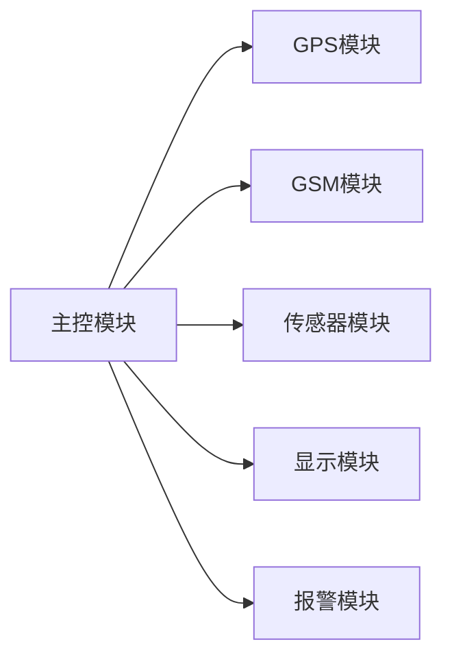

## 基于单片机校车安保设计的设计与实现

作者：禅与计算机程序设计艺术

## 1. 背景介绍

### 1.1 校车安全问题现状

近年来，校车安全事故频发，引起了社会各界的广泛关注。校车作为学生往返学校的主要交通工具，其安全问题直接关系到学生的生命安全。据统计，近年来校车事故发生率呈逐年上升趋势，事故原因主要包括超载、超速、疲劳驾驶、车辆故障等。

### 1.2 校车安保设计的必要性

为了保障学生乘车安全，提高校车安全管理水平，迫切需要设计一套安全可靠的校车安保系统。该系统应具备以下功能：

* **实时监控车辆状态:** 包括车速、位置、行驶路线等信息，以便及时发现异常情况。
* **驾驶员行为监测:**  监测驾驶员是否疲劳驾驶、超速行驶等违规行为，并及时发出警报。
* **学生上下车管理:**  记录学生上下车时间和地点，防止学生遗漏或走失。
* **紧急情况处理:**  在发生事故或紧急情况时，能够及时报警并提供救援信息。

### 1.3 单片机在校车安保设计中的优势

单片机具有体积小、功耗低、成本低、易于集成等优点，非常适合应用于校车安保系统的设计。利用单片机可以实现对车辆状态、驾驶员行为、学生上下车情况等信息的采集、处理和传输，并通过与 GPS、GSM、传感器等外围设备的连接，实现对校车的实时监控和管理。

## 2. 核心概念与联系

### 2.1 系统架构

本校车安保系统采用模块化设计，主要包括以下模块:

* **主控模块:** 采用单片机作为核心控制器，负责接收传感器数据、处理信息、控制外围设备等。
* **GPS模块:**  用于获取车辆位置信息。
* **GSM模块:**  用于与监控中心进行通信。
* **传感器模块:**  包括车速传感器、温度传感器、烟雾传感器等，用于采集车辆状态信息。
* **显示模块:**  用于显示车辆状态信息和报警信息。
* **报警模块:**  用于在发生异常情况时发出声光报警。

### 2.2 模块间联系

各模块之间通过串口、I2C、SPI等通信接口进行数据交互。主控模块接收传感器模块采集的车辆状态信息，并通过GPS模块获取车辆位置信息。当发现异常情况时，主控模块通过GSM模块向监控中心发送报警信息，同时启动报警模块发出声光报警。



## 3. 核心算法原理具体操作步骤

### 3.1 车速监测算法

采用霍尔传感器检测车轮转速，并根据车轮周长计算车速。具体步骤如下:

1. 霍尔传感器输出脉冲信号，每个脉冲代表车轮转动一圈。
2. 单片机定时器记录脉冲个数，并计算单位时间内脉冲个数，即车轮转速。
3. 根据车轮周长计算车速，公式如下：

$$车速 = 车轮转速 \times 车轮周长$$

### 3.2 疲劳驾驶监测算法

通过监测驾驶员眨眼频率、头部姿态等信息判断驾驶员是否疲劳驾驶。具体步骤如下:

1. 摄像头采集驾驶员面部图像。
2. 图像处理算法识别驾驶员眼睛和头部。
3. 统计驾驶员眨眼频率和头部姿态变化频率。
4. 当眨眼频率低于阈值或头部姿态变化频率过高时，判定驾驶员疲劳驾驶。

### 3.3 学生上下车管理算法

采用RFID技术记录学生上下车时间和地点。具体步骤如下:

1. 学生佩戴RFID卡。
2. 校车安装RFID读卡器。
3. 当学生上下车时，RFID读卡器读取RFID卡信息。
4. 单片机记录学生上下车时间和地点，并将信息上传至监控中心。

## 4. 数学模型和公式详细讲解举例说明

### 4.1 车速计算公式

$$车速 = 车轮转速 \times 车轮周长$$

其中：

* 车速：单位为 km/h。
* 车轮转速：单位为 r/min。
* 车轮周长：单位为 m。

例如：假设车轮转速为 100 r/min，车轮周长为 2 m，则车速为：

$$车速 = 100 \times 2 = 200 m/min = 12 km/h$$

### 4.2 疲劳驾驶判定阈值

眨眼频率低于 10 次/分钟 或 头部姿态变化频率高于 2 次/分钟，判定驾驶员疲劳驾驶。

### 4.3 RFID数据格式

RFID卡存储学生姓名、学号、班级等信息。RFID读卡器读取RFID卡信息后，将信息转换为 ASCII码，并通过串口发送至单片机。

## 5. 项目实践：代码实例和详细解释说明

### 5.1 主程序代码

```c
#include <reg52.h>

sbit LED = P1^0;

void main()
{
    // 初始化串口
    TMOD = 0x20;
    TH1 = 0xfd;
    TL1 = 0xfd;
    TR1 = 1;
    SCON = 0x50;

    while (1)
    {
        // 读取传感器数据
        // 处理数据
        // 控制外围设备
        // 发送数据至监控中心

        // 闪烁 LED 灯
        LED = ~LED;
        delay(500);
    }
}
```

### 5.2 延时函数

```c
void delay(unsigned int time)
{
    unsigned int i, j;
    for (i = 0; i < time; i++)
    {
        for (j = 0; j < 125; j++);
    }
}
```

## 6. 实际应用场景

本校车安保系统可应用于各类校车，包括幼儿园校车、小学校车、中学校车等。

## 7. 工具和资源推荐

* **Keil C51:** 单片机开发工具。
* **Altium Designer:** 电路板设计软件。
* **STC89C52:** 8位单片机。
* **GPS模块:**  Ublox NEO-6M。
* **GSM模块:**  SIM800C。
* **传感器:**  霍尔传感器、温度传感器、烟雾传感器等。

## 8. 总结：未来发展趋势与挑战

### 8.1 未来发展趋势

* **智能化:**  未来校车安保系统将更加智能化，例如采用人脸识别技术识别学生身份、利用人工智能算法分析驾驶员行为等。
* **集成化:**  系统将更加集成化，将多种功能集成到一个平台上，例如将校车安保系统与学校管理系统整合。
* **网络化:**  系统将更加网络化，实现校车与监控中心、学校、家长之间的实时信息交互。

### 8.2  挑战

* **技术挑战:**  如何提高系统可靠性、安全性、实时性等方面仍面临挑战。
* **成本挑战:**  如何降低系统成本，使其能够被更多学校采用也是一个挑战。
* **管理挑战:**  如何建立健全的校车安全管理制度，确保系统有效运行也是一个挑战。

## 9. 附录：常见问题与解答

### 9.1 如何解决 GPS 信号丢失问题？

* 采用高精度 GPS 模块，并合理安装 GPS 天线。
* 采用多模 GPS 模块，例如 GPS+北斗。
* 采用惯性导航技术辅助定位。

### 9.2 如何提高系统安全性？

* 采用加密算法保护数据传输。
* 设置用户权限，防止 unauthorized access。
* 定期进行安全测试和漏洞修复。

### 9.3 如何降低系统成本？

* 采用低成本单片机和外围设备。
* 优化系统设计，减少硬件成本。
* 采用开源软件，降低软件成本。
