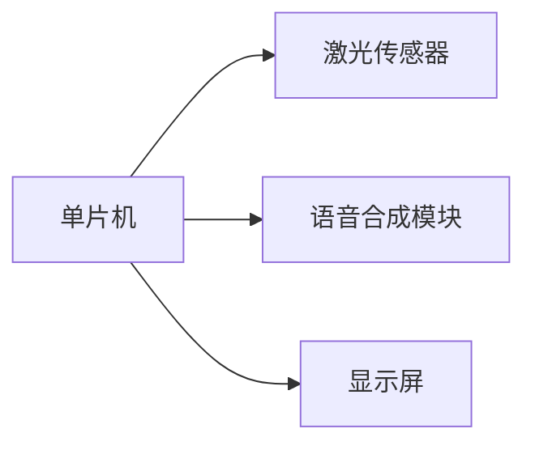
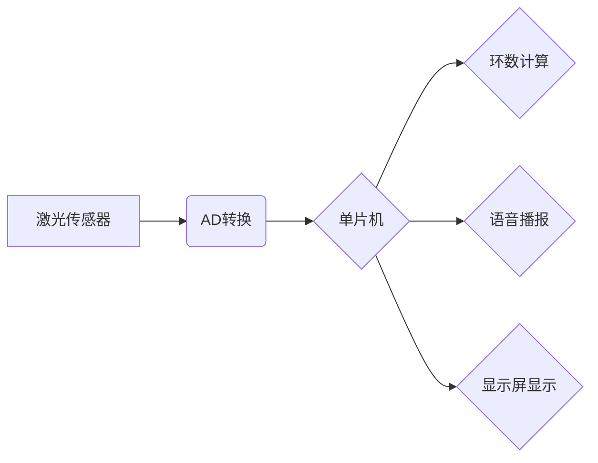

# 基于单片机激光打靶语音播报系统的设计与实现

作者：禅与计算机程序设计艺术

## 1. 背景介绍

### 1.1 激光打靶系统的应用

激光打靶系统是一种利用激光技术进行射击训练和比赛的系统，具有安全、环保、经济等优点，广泛应用于军事、公安、射击运动等领域。传统的激光打靶系统通常采用电子靶面，只能显示简单的环数信息，缺乏实时语音播报功能，不利于射手及时了解射击结果，影响训练效果。

### 1.2 语音播报系统的意义

语音播报系统能够将打靶结果以语音的形式实时播报出来，为射手提供更直观、便捷的信息反馈，有助于提高训练效率和射击水平。同时，语音播报系统还可以增加打靶过程的趣味性和互动性，提升用户体验。

### 1.3 本文研究内容

本文研究基于单片机设计实现一种激光打靶语音播报系统，该系统能够实时采集靶面信息，并通过语音合成技术将打靶结果播报出来，为用户提供更加完善的打靶体验。

## 2. 核心概念与联系

### 2.1 单片机

单片机是一种集成电路芯片，包含中央处理器、存储器、输入/输出接口等部件，能够独立完成各种控制任务。在本系统中，单片机作为核心控制器，负责接收传感器数据、控制语音合成模块、驱动显示屏等功能。

### 2.2 激光传感器

激光传感器用于检测激光束的位置信息，常用的激光传感器有PSD（位置敏感探测器）和CCD（电荷耦合器件）。PSD传感器能够直接输出激光光斑的位置坐标，而CCD传感器需要通过图像处理算法计算光斑位置。

### 2.3 语音合成模块

语音合成模块用于将文本信息转换为语音信号，常用的语音合成技术有拼接合成和参数合成。拼接合成技术将预先录制好的语音片段拼接起来生成语音，而参数合成技术通过调整语音参数生成语音。

### 2.4 显示屏

显示屏用于显示打靶结果、系统状态等信息，常用的显示屏有LCD（液晶显示屏）和OLED（有机发光二极管显示屏）。LCD显示屏功耗低、成本低，而OLED显示屏具有更高的对比度和更快的响应速度。

### 2.5 核心概念联系图



## 3. 核心算法原理具体操作步骤

### 3.1 激光光斑位置检测

激光传感器接收激光束照射后，输出电压信号，通过AD转换器将电压信号转换为数字信号，单片机读取数字信号，并根据传感器特性计算激光光斑的位置坐标。

### 3.2 环数计算

根据激光光斑的位置坐标，计算其与靶心的距离，并根据靶面分区规则确定环数。

### 3.3 语音播报

将环数信息转换为文本信息，并发送给语音合成模块，语音合成模块将文本信息转换为语音信号，通过扬声器播放出来。

### 3.4 显示屏显示

将环数信息、系统状态等信息显示在显示屏上。

### 3.5 核心算法流程图



## 4. 数学模型和公式详细讲解举例说明

### 4.1 激光光斑位置计算

假设激光传感器输出电压信号为 $V$，传感器灵敏度为 $k$，激光光斑位置坐标为 $(x, y)$，则有：

$$
\begin{cases}
x = kV_x \\
y = kV_y
\end{cases}
$$

其中，$V_x$ 和 $V_y$ 分别为传感器在 $x$ 轴和 $y$ 轴方向输出的电压信号。

### 4.2 环数计算

假设靶心坐标为 $(x_0, y_0)$，激光光斑位置坐标为 $(x, y)$，则激光光斑与靶心的距离为：

$$
d = \sqrt{(x-x_0)^2 + (y-y_0)^2}
$$

根据靶面分区规则，将距离 $d$ 转换为环数。

### 4.3 举例说明

假设激光传感器灵敏度为 $k=0.1$ mm/V，传感器在 $x$ 轴和 $y$ 轴方向输出的电压信号分别为 $V_x=2$ V 和 $V_y=3$ V，靶心坐标为 $(x_0, y_0)=(0, 0)$，则激光光斑位置坐标为：

$$
\begin{cases}
x = 0.1 \times 2 = 0.2 \text{ mm} \\
y = 0.1 \times 3 = 0.3 \text{ mm}
\end{cases}
$$

激光光斑与靶心的距离为：

$$
d = \sqrt{(0.2-0)^2 + (0.3-0)^2} = 0.36 \text{ mm}
$$

假设靶面分区规则为：

| 环数 | 距离 (mm) |
|---|---|
| 10 | 0-0.5 |
| 9 | 0.5-1 |
| 8 | 1-1.5 |
| ... | ... |

则激光光斑的环数为 10 环。

## 5. 项目实践：代码实例和详细解释说明

### 5.1 硬件平台

* 单片机：STM32F103C8T6
* 激光传感器：PSD传感器
* 语音合成模块：SYN6288
* 显示屏：LCD1602

### 5.2 软件设计

#### 5.2.1 初始化

* 初始化单片机外设，包括AD转换器、串口、GPIO等。
* 初始化语音合成模块，设置语音参数。
* 初始化显示屏，显示欢迎信息。

#### 5.2.2 循环检测

* 读取激光传感器输出的电压信号，并转换为数字信号。
* 根据传感器特性计算激光光斑的位置坐标。
* 根据激光光斑位置坐标计算环数。
* 将环数信息转换为文本信息，并发送给语音合成模块进行播报。
* 将环数信息、系统状态等信息显示在显示屏上。

### 5.3 代码实例

```c
#include "stm32f10x.h"
#include "syn6288.h"
#include "lcd1602.h"

// 定义传感器引脚
#define SENSOR_X_PIN GPIO_Pin_0
#define SENSOR_Y_PIN GPIO_Pin_1

// 定义语音合成模块引脚
#define SYN6288_TX_PIN GPIO_Pin_9

// 定义显示屏引脚
#define LCD1602_RS_PIN GPIO_Pin_2
#define LCD1602_RW_PIN GPIO_Pin_3
#define LCD1602_EN_PIN GPIO_Pin_4
#define LCD1602_D4_PIN GPIO_Pin_5
#define LCD1602_D5_PIN GPIO_Pin_6
#define LCD1602_D6_PIN GPIO_Pin_7
#define LCD1602_D7_PIN GPIO_Pin_8

// 定义传感器灵敏度
#define SENSOR_SENSITIVITY 0.1

// 定义靶心坐标
#define TARGET_CENTER_X 0
#define TARGET_CENTER_Y 0

// 定义环数分区规则
const float RING_DISTANCE[] = {0.5, 1, 1.5, 2, 2.5, 3, 3.5, 4, 4.5, 5};

int main(void)
{
  // 初始化
  init_system();
  init_syn6288();
  init_lcd1602();

  // 显示欢迎信息
  lcd1602_puts(0, 0, "Laser Target");
  lcd1602_puts(1, 0, "Welcome!");

  while (1)
  {
    // 读取传感器数据
    uint16_t sensor_x = get_adc_value(SENSOR_X_PIN);
    uint16_t sensor_y = get_adc_value(SENSOR_Y_PIN);

    // 计算激光光斑位置坐标
    float x = SENSOR_SENSITIVITY * sensor_x;
    float y = SENSOR_SENSITIVITY * sensor_y;

    // 计算激光光斑与靶心的距离
    float distance = sqrt(pow(x - TARGET_CENTER_X, 2) + pow(y - TARGET_CENTER_Y, 2));

    // 计算环数
    int ring = 0;
    for (int i = 0; i < sizeof(RING_DISTANCE) / sizeof(RING_DISTANCE[0]); i++)
    {
      if (distance <= RING_DISTANCE[i])
      {
        ring = 10 - i;
        break;
      }
    }

    // 语音播报环数
    char ring_str[10];
    sprintf(ring_str, "%d", ring);
    syn6288_speak(ring_str);

    // 显示环数
    lcd1602_puts(0, 0, "Ring:");
    lcd1602_puts(0, 6, ring_str);
  }
}
```

## 6. 实际应用场景

### 6.1 射击训练

激光打靶语音播报系统可以应用于射击训练，为射手提供实时语音反馈，帮助射手及时调整射击动作，提高训练效率。

### 6.2 射击比赛

激光打靶语音播报系统可以应用于射击比赛，为观众提供更加直观的比赛信息，增加比赛的观赏性和趣味性。

### 6.3 娱乐场所

激光打靶语音播报系统可以应用于娱乐场所，为用户提供更加刺激、有趣的娱乐体验。

## 7. 总结：未来发展趋势与挑战

### 7.1 未来发展趋势

* 更加智能化的语音播报：未来激光打靶语音播报系统将更加智能化，能够根据射手的射击水平、训练目标等信息，提供更加个性化的语音反馈。
* 更加丰富的语音内容：未来激光打靶语音播报系统将提供更加丰富的语音内容，例如射击技巧、比赛规则等信息，为用户提供更加全面的服务。
* 更加便捷的操作方式：未来激光打靶语音播报系统将支持更加便捷的操作方式，例如语音控制、手势控制等，提升用户体验。

### 7.2 挑战

* 语音识别技术的准确性：激光打靶语音播报系统需要识别射手的语音指令，语音识别技术的准确性将直接影响系统的实用性。
* 语音合成技术的自然度：激光打靶语音播报系统需要合成自然流畅的语音，语音合成技术的自然度将直接影响用户体验。
* 系统成本控制：激光打靶语音播报系统需要集成多种硬件和软件技术，系统成本控制将是一个挑战。

## 8. 附录：常见问题与解答

### 8.1 语音播报延迟问题

语音播报延迟是指从射手射击到语音播报之间的时间差。语音播报延迟主要受语音合成模块的处理速度和数据传输速度的影响。

**解决方法：**

* 选择处理速度更快的语音合成模块。
* 优化数据传输方式，提高数据传输速度。

### 8.2 语音播报音量问题

语音播报音量是指语音播报的声音大小。语音播报音量过低会导致射手听不清播报内容，音量过高则会影响他人。

**解决方法：**

* 调整语音合成模块的音量参数。
* 使用功率更大的扬声器。

### 8.3 语音播报内容错误问题

语音播报内容错误是指语音播报的内容与实际射击结果不符。语音播报内容错误主要受激光传感器精度、环数计算算法等因素的影响。

**解决方法：**

* 选择精度更高的激光传感器。
* 优化环数计算算法，提高计算精度。
