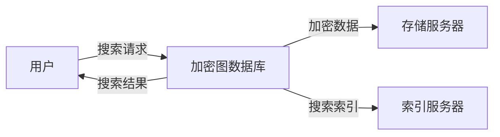

## 1. 背景介绍

### 1.1 数据安全与隐私保护的挑战

随着互联网的快速发展，数据安全和隐私保护问题日益突出。数据泄露、非法访问、隐私侵犯等事件屡见不鲜，给个人、企业和社会带来了巨大的损失和风险。为了应对这些挑战，人们不断探索新的数据安全技术，其中可搜索加密技术备受关注。

### 1.2 可搜索加密技术概述

可搜索加密技术 (Searchable Encryption, SE) 是一种允许用户在加密数据上进行搜索的技术，它能够在保护数据安全的同时，实现对加密数据的有效检索。传统的加密技术只能对数据进行整体加密，无法实现对加密数据的选择性检索。而可搜索加密技术通过对数据进行特殊的加密处理，使得用户可以在不解密数据的情况下，根据关键词或其他条件进行搜索，并获取相关的加密数据。

### 1.3 图数据库的优势

图数据库是一种 NoSQL 数据库，它使用图结构来存储数据，并通过节点和边来表示数据之间的关系。与传统的关系型数据库相比，图数据库具有以下优势：

* **更直观的数据模型:** 图数据库使用图结构来表示数据，更加直观易懂，更符合人类的思维方式。
* **更高的查询效率:** 图数据库能够高效地处理复杂的关系查询，在社交网络、推荐系统、知识图谱等领域具有广泛应用。
* **更灵活的数据结构:** 图数据库支持灵活的数据结构，可以方便地添加、删除节点和边，以及修改节点和边的属性。

### 1.4 基于图数据库的可搜索加密系统的意义

将可搜索加密技术与图数据库相结合，可以构建基于图数据库的可搜索加密系统，从而实现对加密图数据的安全检索。这种系统能够在保护数据安全的同时，充分发挥图数据库的优势，为用户提供高效、灵活的数据查询服务。

## 2. 核心概念与联系

### 2.1 图数据库基本概念

* **节点 (Node):**  表示实体，例如用户、商品、地点等。
* **边 (Edge):**  表示节点之间的关系，例如用户之间的朋友关系、用户对商品的购买关系等。
* **属性 (Property):**  节点和边的属性，例如用户的姓名、年龄、商品的价格、名称等。
* **标签 (Label):**  节点和边的类型，例如用户节点、商品节点、朋友关系边等。

### 2.2 可搜索加密基本概念

* **明文 (Plaintext):**  未加密的数据。
* **密文 (Ciphertext):**  加密后的数据。
* **加密算法 (Encryption Algorithm):**  用于将明文转换为密文的算法。
* **解密算法 (Decryption Algorithm):**  用于将密文转换为明文的算法。
* **密钥 (Key):**  用于加密和解密数据的参数。
* **搜索索引 (Search Index):**  用于支持对加密数据进行搜索的数据结构。

### 2.3 基于图数据库的可搜索加密系统架构



**系统架构说明:**

* **用户:**  发起搜索请求的用户。
* **加密图数据库:**  存储加密图数据和搜索索引的数据库。
* **存储服务器:**  存储加密数据的服务器。
* **索引服务器:**  存储搜索索引的服务器。

## 3. 核心算法原理具体操作步骤

### 3.1 对称可搜索加密算法

对称可搜索加密算法使用相同的密钥进行加密和解密。常见的对称可搜索加密算法包括：

* **确定性加密 (Deterministic Encryption):**  相同的明文总是加密成相同的密文。
* **顺序保持加密 (Order-Preserving Encryption):**  明文的顺序关系在密文中得到保留。

### 3.2 非对称可搜索加密算法

非对称可搜索加密算法使用不同的密钥进行加密和解密。常见的非对称可搜索加密算法包括：

* **公钥加密 (Public-Key Encryption):**  使用公钥加密数据，使用私钥解密数据。
* **身份基加密 (Identity-Based Encryption):**  用户的身份信息作为公钥。

### 3.3 构建搜索索引

为了支持对加密图数据进行搜索，需要构建搜索索引。搜索索引可以基于节点属性、边属性、标签等信息构建。常见的搜索索引构建方法包括：

* **倒排索引 (Inverted Index):**  将关键词映射到包含该关键词的文档列表。
* **布隆过滤器 (Bloom Filter):**  一种概率数据结构，用于判断元素是否在集合中。

### 3.4 搜索操作

当用户发起搜索请求时，系统会根据搜索关键词查询搜索索引，并获取相关的加密图数据。系统可以使用解密算法对加密数据进行解密，并将解密后的数据返回给用户。

## 4. 数学模型和公式详细讲解举例说明

### 4.1 确定性加密

**加密函数:**

$$
E(k, m) = c
$$

其中:

* $k$ 是密钥
* $m$ 是明文
* $c$ 是密文

**解密函数:**

$$
D(k, c) = m
$$

**例子:**

假设密钥 $k = "secret"$，明文 $m = "hello"$，则密文 $c$ 为:

$$
E("secret", "hello") = "c7b8f74436b3f49c"
$$

### 4.2 顺序保持加密

**加密函数:**

$$
E(k, m_1) < E(k, m_2) \iff m_1 < m_2
$$

其中:

* $k$ 是密钥
* $m_1$ 和 $m_2$ 是明文

**例子:**

假设密钥 $k = "secret"$，明文 $m_1 = "apple"$，$m_2 = "banana"$，则密文 $c_1$ 和 $c_2$ 满足:

$$
E("secret", "apple") < E("secret", "banana")
$$

## 5. 项目实践：代码实例和详细解释说明

### 5.1 Python 代码示例

```python
from cryptography.fernet import Fernet

# 生成密钥
key = Fernet.generate_key()

# 创建 Fernet 对象
cipher = Fernet(key)

# 加密数据
plaintext = b"hello world"
ciphertext = cipher.encrypt(plaintext)

# 解密数据
decrypted_text = cipher.decrypt(ciphertext)

# 打印结果
print(f"Plaintext: {plaintext}")
print(f"Ciphertext: {ciphertext}")
print(f"Decrypted text: {decrypted_text}")
```

**代码解释:**

* `cryptography.fernet` 模块提供了对称加密功能。
* `Fernet.generate_key()` 函数用于生成密钥。
* `Fernet(key)` 函数用于创建 Fernet 对象。
* `cipher.encrypt(plaintext)` 函数用于加密数据。
* `cipher.decrypt(ciphertext)` 函数用于解密数据。

### 5.2 Java 代码示例

```java
import javax.crypto.Cipher;
import javax.crypto.KeyGenerator;
import javax.crypto.SecretKey;
import javax.crypto.spec.SecretKeySpec;
import java.security.NoSuchAlgorithmException;
import java.util.Base64;

public class EncryptionExample {

    public static void main(String[] args) throws Exception {
        // 生成密钥
        KeyGenerator keyGen = KeyGenerator.getInstance("AES");
        keyGen.init(128);
        SecretKey secretKey = keyGen.generateKey();

        // 创建 Cipher 对象
        Cipher cipher = Cipher.getInstance("AES");

        // 加密数据
        String plaintext = "hello world";
        cipher.init(Cipher.ENCRYPT_MODE, secretKey);
        byte[] ciphertext = cipher.doFinal(plaintext.getBytes());

        // 解密数据
        cipher.init(Cipher.DECRYPT_MODE, secretKey);
        byte[] decryptedText = cipher.doFinal(ciphertext);

        // 打印结果
        System.out.println("Plaintext: " + plaintext);
        System.out.println("Ciphertext: " + Base64.getEncoder().encodeToString(ciphertext));
        System.out.println("Decrypted text: " + new String(decryptedText));
    }
}
```

**代码解释:**

* `javax.crypto` 包提供了加密和解密功能。
* `KeyGenerator.getInstance("AES")` 函数用于创建 AES 密钥生成器。
* `keyGen.init(128)` 函数用于初始化密钥生成器。
* `keyGen.generateKey()` 函数用于生成密钥。
* `Cipher.getInstance("AES")` 函数用于创建 AES Cipher 对象。
* `cipher.init(Cipher.ENCRYPT_MODE, secretKey)` 函数用于初始化 Cipher 对象为加密模式。
* `cipher.doFinal(plaintext.getBytes())` 函数用于加密数据。
* `cipher.init(Cipher.DECRYPT_MODE, secretKey)` 函数用于初始化 Cipher 对象为解密模式。
* `cipher.doFinal(ciphertext)` 函数用于解密数据。

## 6. 实际应用场景

### 6.1 社交网络

在社交网络中，用户可以将自己的个人信息、好友关系等数据存储在加密图数据库中，并使用可搜索加密技术实现对加密数据的安全检索。例如，用户可以搜索自己的好友，或查找具有特定兴趣爱好的用户。

### 6.2 金融行业

在金融行业中，可以使用加密图数据库来存储用户的交易记录、账户信息等敏感数据，并使用可搜索加密技术实现对加密数据的安全检索。例如，银行可以根据用户的交易记录进行风险评估，或根据用户的账户信息进行身份验证。

### 6.3 医疗保健

在医疗保健领域，可以使用加密图数据库来存储患者的医疗记录、病史等敏感数据，并使用可搜索加密技术实现对加密数据的安全检索。例如，医生可以根据患者的医疗记录进行诊断，或根据患者的病史进行治疗方案制定。

## 7. 工具和资源推荐

### 7.1 Neo4j

Neo4j 是一款流行的图数据库，它提供了丰富的功能和工具，支持可搜索加密技术。

### 7.2 JanusGraph

JanusGraph 是一款可扩展的图数据库，它支持多种存储后端，包括 Apache Cassandra、Apache HBase 等，并提供可搜索加密功能。

### 7.3 CryptDB

CryptDB 是一款关系型数据库加密工具，它可以将 SQL 查询转换为对加密数据的操作，并支持多种加密方案。

## 8. 总结：未来发展趋势与挑战

### 8.1 发展趋势

* **更高效的加密算法:**  研究人员正在不断探索更高效的可搜索加密算法，以提高加密数据的搜索效率。
* **更灵活的搜索索引:**  研究人员正在探索更灵活的搜索索引构建方法，以支持更复杂的搜索查询。
* **更安全的系统架构:**  研究人员正在探索更安全的系统架构，以提高系统的安全性。

### 8.2 挑战

* **性能瓶颈:**  可搜索加密技术会带来一定的性能开销，如何提高系统的性能是一个挑战。
* **安全性问题:**  可搜索加密技术仍然存在一些安全性问题，例如侧信道攻击、推理攻击等。
* **可用性问题:**  可搜索加密技术的使用方法相对复杂，如何提高系统的可用性是一个挑战。

## 9. 附录：常见问题与解答

### 9.1 如何选择合适的可搜索加密算法？

选择合适的可搜索加密算法需要考虑以下因素：

* **安全性:**  算法的安全性应该足够高，能够有效抵御各种攻击。
* **效率:**  算法的效率应该足够高，能够满足实际应用的需求。
* **功能:**  算法的功能应该满足实际应用的需求，例如支持不同的搜索类型、支持不同的数据类型等。

### 9.2 如何提高系统的性能？

提高系统的性能可以考虑以下方法：

* **优化搜索索引:**  使用更高效的搜索索引构建方法，例如倒排索引、布隆过滤器等。
* **优化加密算法:**  使用更高效的加密算法，例如确定性加密、顺序保持加密等。
* **优化系统架构:**  使用更合理的系统架构，例如分布式存储、缓存等。

### 9.3 如何提高系统的安全性？

提高系统的安全性可以考虑以下方法：

* **使用更安全的加密算法:**  使用更安全的加密算法，例如非对称可搜索加密算法。
* **加强访问控制:**  对用户进行身份验证，并根据用户的权限控制对数据的访问。
* **定期更新密钥:**  定期更新加密密钥，以降低密钥泄露的风险。