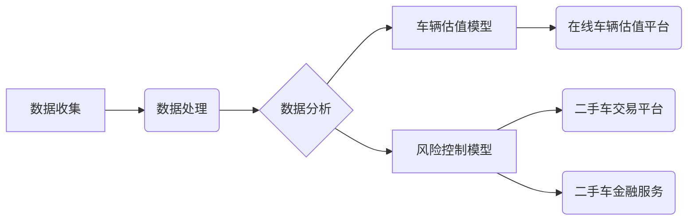

## 1. 背景介绍

### 1.1 二手车市场的兴起

近年来，随着人们消费观念的转变和经济水平的提高，二手车市场呈现出蓬勃发展的态势。与新车相比，二手车价格更低，性价比更高，对于预算有限的消费者来说更具吸引力。同时，二手车市场也为消费者提供了更多车型选择，满足了不同人群的个性化需求。

### 1.2 大数据时代的到来

随着互联网、移动互联网、物联网等技术的快速发展，我们进入了大数据时代。海量的数据蕴藏着巨大的价值，通过对数据的采集、存储、分析和挖掘，可以揭示事物发展的规律，预测未来趋势。

### 1.3 大数据分析助力二手车市场发展

大数据分析技术可以应用于二手车市场的各个环节，例如：

* **车辆估值:** 通过分析海量车辆交易数据、车辆配置信息、市场行情等，建立精准的车辆估值模型，为买卖双方提供参考。
* **风险控制:** 通过分析用户行为数据、车辆历史数据等，识别潜在的欺诈风险，保障交易安全。
* **精准营销:** 通过分析用户画像、消费行为等，实现精准营销，提高营销效率。
* **市场预测:** 通过分析市场趋势、政策变化等，预测二手车市场未来的发展方向，为行业发展提供决策支持。

## 2. 核心概念与联系

### 2.1 数据来源

二手车市场数据来源广泛，主要包括：

* **车辆交易平台数据:** 包括车辆信息、交易价格、交易时间等。
* **车辆检测机构数据:** 包括车辆检测报告、维修保养记录等。
* **政府公开数据:** 包括车辆登记信息、交通违章信息等。
* **互联网数据:** 包括用户搜索记录、浏览记录、评论数据等。

### 2.2 数据处理

收集到的原始数据需要进行清洗、转换、整合等处理，才能用于分析和建模。

* **数据清洗:** 去除重复数据、缺失数据、异常数据等。
* **数据转换:** 将不同格式的数据转换为统一格式，例如将日期数据转换为时间戳。
* **数据整合:** 将来自不同来源的数据整合到一起，形成完整的数据集。

### 2.3 数据分析

数据分析方法主要包括：

* **描述性分析:** 统计数据的基本特征，例如平均值、中位数、标准差等。
* **探索性分析:** 探索数据之间的关系，例如相关性分析、回归分析等。
* **预测性分析:** 建立预测模型，预测未来趋势，例如时间序列分析、机器学习等。

## 3. 核心算法原理具体操作步骤

### 3.1 车辆估值模型

#### 3.1.1 线性回归模型

线性回归模型是一种经典的预测模型，它假设目标变量与特征变量之间存在线性关系。

**操作步骤:**

1. 收集车辆交易数据，包括车辆特征（例如品牌、型号、年份、里程等）和交易价格。
2. 将数据划分为训练集和测试集。
3. 使用训练集数据训练线性回归模型，得到模型参数。
4. 使用测试集数据评估模型性能，例如计算均方误差（MSE）。

#### 3.1.2 决策树模型

决策树模型是一种树形结构的预测模型，它通过一系列规则对数据进行分类或回归预测。

**操作步骤:**

1. 收集车辆交易数据，包括车辆特征和交易价格。
2. 将数据划分为训练集和测试集。
3. 使用训练集数据构建决策树模型，选择最佳的特征和分裂规则。
4. 使用测试集数据评估模型性能，例如计算准确率或MSE。

### 3.2 风险控制模型

#### 3.2.1 逻辑回归模型

逻辑回归模型是一种用于二分类的预测模型，它可以预测某个事件发生的概率。

**操作步骤:**

1. 收集用户行为数据、车辆历史数据等，并标注是否存在欺诈风险。
2. 将数据划分为训练集和测试集。
3. 使用训练集数据训练逻辑回归模型，得到模型参数。
4. 使用测试集数据评估模型性能，例如计算 AUC 值。

#### 3.2.2 支持向量机模型

支持向量机模型是一种用于分类或回归预测的模型，它可以找到数据集中最优的分割超平面。

**操作步骤:**

1. 收集用户行为数据、车辆历史数据等，并标注是否存在欺诈风险。
2. 将数据划分为训练集和测试集。
3. 使用训练集数据训练支持向量机模型，选择最佳的核函数和参数。
4. 使用测试集数据评估模型性能，例如计算准确率或MSE。

## 4. 数学模型和公式详细讲解举例说明

### 4.1 线性回归模型

线性回归模型的公式如下：

$$ y = \beta_0 + \beta_1 x_1 + \beta_2 x_2 + ... + \beta_n x_n + \epsilon $$

其中：

* $y$ 是目标变量，例如车辆交易价格。
* $x_1, x_2, ..., x_n$ 是特征变量，例如车辆品牌、型号、年份、里程等。
* $\beta_0, \beta_1, \beta_2, ..., \beta_n$ 是模型参数，表示特征变量对目标变量的影响程度。
* $\epsilon$ 是误差项，表示模型无法解释的部分。

**举例说明:**

假设我们收集了 100 辆二手车的交易数据，包括车辆品牌、型号、年份、里程和交易价格。我们想建立一个线性回归模型来预测二手车的交易价格。

首先，我们将数据划分为训练集和测试集，例如 80% 的数据用于训练，20% 的数据用于测试。

然后，我们使用训练集数据训练线性回归模型，得到模型参数。

最后，我们使用测试集数据评估模型性能，例如计算 MSE。

### 4.2 逻辑回归模型

逻辑回归模型的公式如下：

$$ P(y=1|x) = \frac{1}{1 + e^{-(\beta_0 + \beta_1 x_1 + \beta_2 x_2 + ... + \beta_n x_n)}} $$

其中：

* $P(y=1|x)$ 是在给定特征变量 $x$ 的情况下，目标变量 $y$ 等于 1 的概率。
* $x_1, x_2, ..., x_n$ 是特征变量，例如用户行为数据、车辆历史数据等。
* $\beta_0, \beta_1, \beta_2, ..., \beta_n$ 是模型参数，表示特征变量对目标变量的影响程度。

**举例说明:**

假设我们收集了 1000 个用户的行为数据和车辆历史数据，并标注是否存在欺诈风险。我们想建立一个逻辑回归模型来预测用户是否存在欺诈风险。

首先，我们将数据划分为训练集和测试集，例如 80% 的数据用于训练，20% 的数据用于测试。

然后，我们使用训练集数据训练逻辑回归模型，得到模型参数。

最后，我们使用测试集数据评估模型性能，例如计算 AUC 值。

## 5. 项目实践：代码实例和详细解释说明

### 5.1 车辆估值模型

```python
import pandas as pd
from sklearn.linear_model import LinearRegression
from sklearn.model_selection import train_test_split
from sklearn.metrics import mean_squared_error

# 加载数据
data = pd.read_csv('used_car_data.csv')

# 选择特征变量和目标变量
features = ['brand', 'model', 'year', 'mileage']
target = 'price'

# 将数据划分为训练集和测试集
X_train, X_test, y_train, y_test = train_test_split(
    data[features], data[target], test_size=0.2, random_state=42
)

# 创建线性回归模型
model = LinearRegression()

# 训练模型
model.fit(X_train, y_train)

# 预测测试集数据
y_pred = model.predict(X_test)

# 评估模型性能
mse = mean_squared_error(y_test, y_pred)
print('MSE:', mse)
```

**代码解释:**

1. 首先，我们使用 pandas 库加载二手车交易数据。
2. 然后，我们选择特征变量和目标变量。
3. 接着，我们使用 `train_test_split` 函数将数据划分为训练集和测试集。
4. 然后，我们创建线性回归模型，并使用 `fit` 方法训练模型。
5. 训练完成后，我们使用 `predict` 方法预测测试集数据。
6. 最后，我们使用 `mean_squared_error` 函数计算 MSE，评估模型性能。

### 5.2 风险控制模型

```python
import pandas as pd
from sklearn.linear_model import LogisticRegression
from sklearn.model_selection import train_test_split
from sklearn.metrics import roc_auc_score

# 加载数据
data = pd.read_csv('user_behavior_data.csv')

# 选择特征变量和目标变量
features = ['user_age', 'vehicle_age', 'transaction_amount']
target = 'fraud'

# 将数据划分为训练集和测试集
X_train, X_test, y_train, y_test = train_test_split(
    data[features], data[target], test_size=0.2, random_state=42
)

# 创建逻辑回归模型
model = LogisticRegression()

# 训练模型
model.fit(X_train, y_train)

# 预测测试集数据
y_pred_proba = model.predict_proba(X_test)[:, 1]

# 评估模型性能
auc = roc_auc_score(y_test, y_pred_proba)
print('AUC:', auc)
```

**代码解释:**

1. 首先，我们使用 pandas 库加载用户行为数据和车辆历史数据。
2. 然后，我们选择特征变量和目标变量。
3. 接着，我们使用 `train_test_split` 函数将数据划分为训练集和测试集。
4. 然后，我们创建逻辑回归模型，并使用 `fit` 方法训练模型。
5. 训练完成后，我们使用 `predict_proba` 方法预测测试集数据，得到每个样本属于正类的概率。
6. 最后，我们使用 `roc_auc_score` 函数计算 AUC 值，评估模型性能。

## 6. 实际应用场景

### 6.1 在线车辆估值平台

在线车辆估值平台可以利用大数据分析技术，为用户提供精准的车辆估值服务。用户只需输入车辆信息，平台就可以根据历史交易数据、车辆配置信息、市场行情等，快速计算出车辆的估值价格。

### 6.2 二手车交易平台

二手车交易平台可以利用大数据分析技术，识别潜在的欺诈风险，保障交易安全。例如，平台可以分析用户的行为数据、车辆历史数据等，识别虚假信息、恶意刷单等行为。

### 6.3 二手车金融服务

二手车金融服务机构可以利用大数据分析技术，评估借款人的信用风险，制定合理的贷款方案。例如，机构可以分析借款人的收入水平、债务情况、消费习惯等，预测借款人是否会按时还款。

## 7. 工具和资源推荐

### 7.1 Python 数据分析库

* **Pandas:** 用于数据处理和分析。
* **NumPy:** 用于数值计算。
* **Scikit-learn:** 用于机器学习。

### 7.2 大数据平台

* **Hadoop:** 用于分布式存储和处理大规模数据集。
* **Spark:** 用于快速、通用的大数据处理。

## 8. 总结：未来发展趋势与挑战

### 8.1 未来发展趋势

* **数据量持续增长:** 随着物联网、车联网等技术的快速发展，二手车市场数据量将持续增长，为大数据分析提供了更丰富的素材。
* **算法模型不断优化:** 随着人工智能技术的不断发展，车辆估值模型、风险控制模型等将不断优化，提高预测精度和效率。
* **应用场景不断拓展:** 大数据分析技术将应用于二手车市场的更多环节，例如售后服务、保险等。

### 8.2 挑战

* **数据质量问题:** 二手车市场数据来源广泛，数据质量参差不齐，需要进行有效的数据清洗和处理。
* **数据安全问题:** 二手车市场数据涉及用户隐私信息，需要加强数据安全保护，防止数据泄露。
* **人才缺口:** 大数据分析需要专业的技术人才，目前市场上存在一定的人才缺口。

## 9. 附录：常见问题与解答

### 9.1 如何提高车辆估值模型的精度？

提高车辆估值模型的精度可以从以下几个方面入手：

* **收集更多数据:** 数据量越大，模型的预测精度越高。
* **选择合适的特征变量:** 特征变量的选择对模型的精度有很大影响。
* **优化算法模型:** 可以尝试不同的算法模型，例如神经网络、支持向量机等，选择最优的模型。
* **调整模型参数:** 可以通过调整模型参数来提高模型的精度。

### 9.2 如何识别二手车交易中的欺诈行为？

识别二手车交易中的欺诈行为可以从以下几个方面入手：

* **分析用户行为数据:** 例如用户的注册时间、登录频率、浏览记录、交易记录等。
* **分析车辆历史数据:** 例如车辆的维修保养记录、事故记录等。
* **核实用户信息:** 例如用户的身份信息、联系方式等。
* **建立风险控制模型:** 利用机器学习算法建立风险控制模型，识别潜在的欺诈风险。


## 10. 核心概念原理和架构的Mermaid流程图




希望这篇文章能够帮助你更好地了解基于大数据分析二手车市场前景。