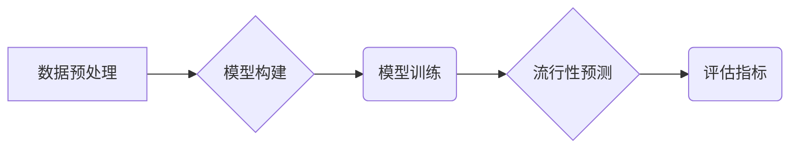

## 1. 背景介绍

### 1.1 商品流行性预测的意义

在电子商务领域，准确预测商品的流行性对于提升用户体验、优化库存管理、制定营销策略至关重要。 准确的流行性预测可以帮助电商平台：

* **个性化推荐:**  根据用户的兴趣和商品的流行度，为用户推荐更可能感兴趣的商品，提升用户购物体验。
* **库存优化:**  预测商品的未来需求，提前做好库存准备，避免缺货或库存积压，降低运营成本。
* **精准营销:**  针对不同流行度的商品采取不同的营销策略，提高营销活动的效率和效益。

### 1.2 传统预测方法的局限性

传统的商品流行性预测方法，例如时间序列分析、统计模型等，往往依赖于历史销售数据，难以捕捉到用户行为变化、市场趋势等复杂因素的影响，预测精度有限。

### 1.3 推荐算法的优势

推荐算法可以利用用户的历史行为数据，例如浏览记录、购买记录、评分等，以及商品的属性信息，例如价格、类别、品牌等，建立用户与商品之间的关联关系，从而更准确地预测商品的流行性。

## 2. 核心概念与联系

### 2.1 推荐算法

推荐算法是指利用用户和商品的信息，预测用户对商品的偏好程度，并向用户推荐可能感兴趣的商品的算法。常见的推荐算法包括：

* **协同过滤算法:**  基于用户之间的相似性或商品之间的相似性进行推荐。
* **内容过滤算法:**  根据用户过去喜欢的商品的属性信息，推荐类似的商品。
* **混合推荐算法:**  结合协同过滤和内容过滤的优势，提高推荐精度。

### 2.2 商品流行性

商品流行性是指商品在一段时间内被用户关注、购买、评价的程度。

### 2.3 推荐算法与商品流行性的联系

推荐算法可以通过分析用户的行为数据，识别出哪些商品更受用户欢迎，从而预测商品的流行性。

## 3. 核心算法原理具体操作步骤

### 3.1 数据预处理

* **数据清洗:**  去除数据中的噪声和异常值。
* **数据转换:**  将原始数据转换为适合算法处理的格式，例如用户-商品评分矩阵。
* **特征提取:**  从用户和商品信息中提取有用的特征，例如用户的年龄、性别、职业，商品的价格、类别、品牌等。

### 3.2 模型构建

选择合适的推荐算法，例如协同过滤算法、内容过滤算法、混合推荐算法等，并根据具体应用场景进行参数调整。

### 3.3 模型训练

利用预处理后的数据对模型进行训练，使模型能够学习到用户与商品之间的关联关系。

### 3.4 流行性预测

利用训练好的模型，对新商品或未来一段时间内的商品流行性进行预测。

### 3.5 评估指标

使用一些指标来评估模型的预测精度，例如：

* **准确率:**  预测正确的商品数量占总预测商品数量的比例。
* **召回率:**  预测正确的商品数量占实际流行商品数量的比例。
* **F1值:**  准确率和召回率的调和平均值。

## 4. 数学模型和公式详细讲解举例说明

### 4.1 协同过滤算法

#### 4.1.1 用户相似度

用户相似度是指两个用户之间共同评分的商品数量或评分相似程度。常用的用户相似度计算方法包括：

* **余弦相似度:**  
$$ sim(u,v) = \frac{\sum_{i=1}^{n}r_{ui}r_{vi}}{\sqrt{\sum_{i=1}^{n}r_{ui}^2}\sqrt{\sum_{i=1}^{n}r_{vi}^2}} $$
其中，$u$ 和 $v$ 代表两个用户，$r_{ui}$ 和 $r_{vi}$ 分别代表用户 $u$ 和 $v$ 对商品 $i$ 的评分，$n$ 代表商品总数。

* **皮尔逊相关系数:**  
$$ sim(u,v) = \frac{\sum_{i=1}^{n}(r_{ui}-\bar{r_u})(r_{vi}-\bar{r_v})}{\sqrt{\sum_{i=1}^{n}(r_{ui}-\bar{r_u})^2}\sqrt{\sum_{i=1}^{n}(r_{vi}-\bar{r_v})^2}} $$
其中，$\bar{r_u}$ 和 $\bar{r_v}$ 分别代表用户 $u$ 和 $v$ 的平均评分。

#### 4.1.2 预测评分

预测用户 $u$ 对商品 $i$ 的评分，可以通过用户 $u$ 的邻居用户的评分加权平均得到：

$$ \hat{r_{ui}} = \frac{\sum_{v \in N(u)}sim(u,v)r_{vi}}{\sum_{v \in N(u)}|sim(u,v)|} $$
其中，$N(u)$ 代表用户 $u$ 的邻居用户集合，即与用户 $u$ 相似度较高的一部分用户。

#### 4.1.3 举例说明

假设有两个用户 A 和 B，他们对三个商品的评分如下表所示：

| 用户 | 商品1 | 商品2 | 商品3 |
|---|---|---|---|
| A | 5 | 3 | 4 |
| B | 4 | 2 | 3 |

使用余弦相似度计算用户 A 和 B 的相似度：

```
sim(A,B) = (5*4 + 3*2 + 4*3) / (sqrt(5^2 + 3^2 + 4^2) * sqrt(4^2 + 2^2 + 3^2)) = 0.96
```

假设用户 A 的邻居用户集合为 {B}，则预测用户 A 对商品 4 的评分为：

```
r_hat(A,4) = (0.96 * 3) / 0.96 = 3
```

### 4.2 内容过滤算法

#### 4.2.1 商品特征向量

将每个商品表示为一个特征向量，例如：

```
商品1: [价格=100, 类别=电子产品, 品牌=苹果]
商品2: [价格=50, 类别=服装, 品牌=耐克]
```

#### 4.2.2 用户偏好向量

根据用户过去喜欢的商品的特征向量，构建用户的偏好向量，例如：

```
用户A: [价格=高, 类别=电子产品, 品牌=苹果]
```

#### 4.2.3 预测评分

计算用户偏好向量与商品特征向量的相似度，作为预测评分，例如：

```
sim(用户A, 商品1) = 高
sim(用户A, 商品2) = 低
```

#### 4.2.4 举例说明

假设用户 A 过去喜欢购买价格高、类别为电子产品、品牌为苹果的商品，则用户 A 的偏好向量为 [价格=高, 类别=电子产品, 品牌=苹果]。

对于商品1 [价格=100, 类别=电子产品, 品牌=苹果]，其与用户 A 的偏好向量的相似度较高，因此预测用户 A 对商品1 的评分较高。

对于商品2 [价格=50, 类别=服装, 品牌=耐克]，其与用户 A 的偏好向量的相似度较低，因此预测用户 A 对商品2 的评分较低。

## 5. 项目实践：代码实例和详细解释说明

### 5.1 数据集

使用 MovieLens 数据集，该数据集包含用户对电影的评分数据。

### 5.2 代码实现

```python
import pandas as pd
from sklearn.metrics.pairwise import cosine_similarity

# 读取数据
ratings = pd.read_csv('ratings.csv')

# 构建用户-商品评分矩阵
ratings_matrix = ratings.pivot_table(index='userId', columns='movieId', values='rating')

# 计算用户相似度矩阵
user_similarity = cosine_similarity(ratings_matrix.fillna(0))

# 预测用户评分
def predict_rating(user_id, movie_id):
    # 找到用户id的邻居用户
    neighbors = user_similarity[user_id].argsort()[::-1][1:11]
    
    # 计算预测评分
    rating_sum = 0
    similarity_sum = 0
    for neighbor in neighbors:
        if not pd.isnull(ratings_matrix.loc[neighbor, movie_id]):
            rating_sum += user_similarity[user_id, neighbor] * ratings_matrix.loc[neighbor, movie_id]
            similarity_sum += abs(user_similarity[user_id, neighbor])
    
    if similarity_sum == 0:
        return 0
    else:
        return rating_sum / similarity_sum

# 预测用户1对电影1的评分
predict_rating(1, 1)
```

### 5.3 解释说明

代码首先读取 MovieLens 数据集，并构建用户-商品评分矩阵。然后，使用余弦相似度计算用户相似度矩阵。最后，定义了一个预测评分函数，该函数根据用户id和电影id，找到用户的邻居用户，并计算预测评分。

## 6. 实际应用场景

### 6.1 电商平台

* **个性化推荐:**  根据用户的历史购买记录和商品的流行度，为用户推荐更可能感兴趣的商品。
* **库存优化:**  预测商品的未来需求，提前做好库存准备，避免缺货或库存积压。
* **精准营销:**  针对不同流行度的商品采取不同的营销策略，提高营销活动的效率和效益。

### 6.2 社交媒体

* **内容推荐:**  根据用户的兴趣和内容的流行度，为用户推荐更可能感兴趣的内容。
* **话题发现:**  识别出当前流行的话题，帮助用户了解最新的趋势和热点。

### 6.3 金融领域

* **风险预测:**  预测股票、基金等金融产品的未来走势，帮助投资者做出更明智的投资决策。

## 7. 工具和资源推荐

### 7.1 Python库

* **Scikit-learn:**  机器学习库，包含各种推荐算法的实现。
* **Surprise:**  专门用于推荐系统的 Python 库，提供了多种推荐算法和评估指标。
* **TensorFlow:**  深度学习库，可以用于构建更复杂的推荐模型。

### 7.2 数据集

* **MovieLens:**  电影评分数据集。
* **Netflix Prize:**  Netflix 电影评分数据集。
* **Amazon Reviews:**  亚马逊商品评论数据集。

### 7.3 学习资源

* **推荐系统实战:**  项亮著，介绍推荐系统基本概念、算法和应用。
* **集体智慧编程:**  Toby Segaran著，介绍推荐算法的 Python 实现。

## 8. 总结：未来发展趋势与挑战

### 8.1 未来发展趋势

* **深度学习:**  深度学习技术可以用于构建更复杂的推荐模型，提高预测精度。
* **强化学习:**  强化学习技术可以用于优化推荐策略，提高用户满意度。
* **多模态推荐:**  结合文本、图像、视频等多种信息进行推荐，提高推荐的个性化程度。

### 8.2 挑战

* **数据稀疏性:**  用户-商品评分矩阵往往非常稀疏，导致推荐算法难以学习到准确的用户偏好。
* **冷启动问题:**  对于新用户或新商品，由于缺乏历史数据，推荐算法难以进行准确的预测。
* **可解释性:**  深度学习模型的可解释性较差，难以理解模型的预测结果。

## 9. 附录：常见问题与解答

### 9.1 如何选择合适的推荐算法？

选择推荐算法需要考虑以下因素：

* **数据集特点:**  数据集的大小、稀疏程度、用户和商品特征等。
* **应用场景:**  推荐的目标、用户需求、系统性能要求等。
* **算法复杂度:**  算法的训练时间、预测速度、可解释性等。

### 9.2 如何解决数据稀疏性问题？

解决数据稀疏性问题的方法包括：

* **数据增强:**  利用其他数据源补充用户-商品评分矩阵，例如用户属性信息、商品评论等。
* **降维:**  使用降维技术减少数据维度，提高算法效率。
* **矩阵分解:**  将用户-商品评分矩阵分解为低秩矩阵，填充缺失值。

### 9.3 如何解决冷启动问题？

解决冷启动问题的方法包括：

* **利用用户属性信息:**  根据用户的年龄、性别、职业等属性信息进行推荐。
* **利用商品内容信息:**  根据商品的名称、描述、图片等内容信息进行推荐。
* **利用专家知识:**  人工推荐一些高质量的商品或内容。


## 10.  核心概念原理和架构的 Mermaid流程图

