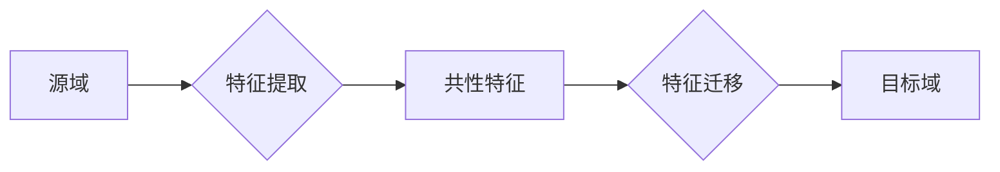

## 1. 背景介绍

### 1.1. 机器学习的局限性

传统的机器学习方法通常需要大量的标记数据才能训练出有效的模型。然而，在许多实际应用中，获取大量的标记数据往往是昂贵且耗时的。例如，在医学图像分析领域，获取大量的带有专家标注的医学图像数据需要花费大量的时间和人力成本。

### 1.2. 迁移学习的引入

迁移学习是一种机器学习方法，旨在利用源域中已有的知识来提高目标域中模型的性能。其核心思想是将源域中学习到的知识迁移到目标域，从而减少目标域中所需的标记数据量。

### 1.3. 基于特征的迁移学习

基于特征的迁移学习是一种常见的迁移学习方法，其核心思想是提取源域和目标域中的共性特征，并将这些特征用于目标域的模型训练。这种方法可以有效地减少目标域中所需的标记数据量，并提高模型的性能。

## 2. 核心概念与联系

### 2.1. 源域和目标域

* **源域 (Source Domain):** 拥有大量标记数据的领域。
* **目标域 (Target Domain):** 缺乏标记数据的领域，需要利用源域的知识来提高模型性能。

### 2.2. 特征提取

* **特征 (Feature):** 用于描述数据的属性或特征。
* **特征提取 (Feature Extraction):** 从原始数据中提取有意义特征的过程。

### 2.3. 特征迁移

* **特征迁移 (Feature Transfer):** 将源域中学习到的特征应用于目标域的过程。

### 2.4. 核心概念联系图



## 3. 核心算法原理具体操作步骤

### 3.1. 特征提取方法

常见的特征提取方法包括：

* **主成分分析 (PCA):** 一种线性降维方法，通过找到数据方差最大的方向来提取主要特征。
* **线性判别分析 (LDA):** 一种监督学习方法，通过找到最能区分不同类别数据的特征来提取特征。
* **卷积神经网络 (CNN):** 一种深度学习方法，通过多层卷积和池化操作来提取图像特征。

### 3.2. 特征迁移方法

常见的特征迁移方法包括：

* **特征变换 (Feature Transformation):** 将源域的特征映射到目标域的特征空间。
* **特征选择 (Feature Selection):** 从源域的特征中选择与目标域相关的特征。
* **特征增强 (Feature Augmentation):** 将源域的特征与目标域的特征结合起来，形成新的特征。

### 3.3. 具体操作步骤

1. **选择合适的特征提取方法:** 根据源域和目标域数据的特点选择合适的特征提取方法。
2. **提取源域特征:** 使用选择的特征提取方法提取源域的特征。
3. **选择合适的特征迁移方法:** 根据源域和目标域数据的特点选择合适的特征迁移方法。
4. **迁移源域特征:** 使用选择的特征迁移方法将源域的特征迁移到目标域。
5. **训练目标域模型:** 使用迁移后的特征训练目标域的模型。

## 4. 数学模型和公式详细讲解举例说明

### 4.1. 主成分分析 (PCA)

PCA 的目标是找到数据方差最大的方向，并将数据投影到这些方向上，从而降低数据的维度。

**数学模型:**

$$
\mathbf{X} = \mathbf{U}\mathbf{\Sigma}\mathbf{V}^T
$$

其中，$\mathbf{X}$ 是原始数据矩阵，$\mathbf{U}$ 是特征向量矩阵，$\mathbf{\Sigma}$ 是奇异值矩阵，$\mathbf{V}$ 是特征向量矩阵的转置。

**举例说明:**

假设我们有一个包含 100 个样本的数据集，每个样本有 10 个特征。我们可以使用 PCA 将数据降维到 2 维。

1. 计算数据矩阵的协方差矩阵。
2. 计算协方差矩阵的特征值和特征向量。
3. 选择特征值最大的两个特征向量，并将数据投影到这两个特征向量上。

### 4.2. 线性判别分析 (LDA)

LDA 的目标是找到最能区分不同类别数据的特征，并将数据投影到这些特征上，从而提高分类器的性能。

**数学模型:**

$$
\mathbf{S}_W^{-1}\mathbf{S}_B\mathbf{w} = \lambda\mathbf{w}
$$

其中，$\mathbf{S}_W$ 是类内散度矩阵，$\mathbf{S}_B$ 是类间散度矩阵，$\mathbf{w}$ 是特征向量，$\lambda$ 是特征值。

**举例说明:**

假设我们有一个包含 100 个样本的数据集，每个样本有 10 个特征，并且数据分为两类。我们可以使用 LDA 将数据降维到 1 维。

1. 计算类内散度矩阵和类间散度矩阵。
2. 计算 $\mathbf{S}_W^{-1}\mathbf{S}_B$ 的特征值和特征向量。
3. 选择特征值最大的特征向量，并将数据投影到这个特征向量上。

## 5. 项目实践：代码实例和详细解释说明

### 5.1. 使用 Python 实现基于特征的迁移学习

```python
import numpy as np
from sklearn.decomposition import PCA
from sklearn.discriminant_analysis import LinearDiscriminantAnalysis

# 加载源域和目标域数据
source_data = np.load("source_data.npy")
target_data = np.load("target_data.npy")

# 提取源域特征
pca = PCA(n_components=2)
source_features = pca.fit_transform(source_data)

# 迁移源域特征
lda = LinearDiscriminantAnalysis(n_components=1)
target_features = lda.fit_transform(source_features, target_data)

# 训练目标域模型
# ...
```

### 5.2. 代码解释

1. **加载数据:** 使用 `np.load()` 函数加载源域和目标域数据。
2. **提取特征:** 使用 `PCA()` 类提取源域特征，并将维度降至 2 维。
3. **迁移特征:** 使用 `LinearDiscriminantAnalysis()` 类将源域特征迁移到目标域，并将维度降至 1 维。
4. **训练模型:** 使用迁移后的特征训练目标域模型。

## 6. 实际应用场景

### 6.1. 图像分类

* **源域:** ImageNet 数据集
* **目标域:** 医学图像数据集
* **应用:** 使用 ImageNet 数据集训练的 CNN 模型提取图像特征，并将这些特征迁移到医学图像数据集，从而提高医学图像分类器的性能。

### 6.2. 自然语言处理

* **源域:** 维基百科语料库
* **目标域:** 新闻文章数据集
* **应用:** 使用维基百科语料库训练的词向量模型提取文本特征，并将这些特征迁移到新闻文章数据集，从而提高文本分类器的性能。

### 6.3. 语音识别

* **源域:** LibriSpeech 语音数据集
* **目标域:** 会议录音数据集
* **应用:** 使用 LibriSpeech 语音数据集训练的声学模型提取语音特征，并将这些特征迁移到会议录音数据集，从而提高语音识别器的性能。

## 7. 总结：未来发展趋势与挑战

### 7.1. 未来发展趋势

* **深度迁移学习:** 使用深度学习模型进行特征提取和迁移。
* **无监督迁移学习:** 在没有目标域标签的情况下进行迁移学习。
* **多源域迁移学习:** 利用多个源域的知识来提高目标域模型的性能。

### 7.2. 挑战

* **负迁移:** 源域的知识可能对目标域产生负面影响。
* **领域差异:** 源域和目标域之间可能存在较大的差异，导致迁移效果不佳。
* **可解释性:** 迁移学习模型的可解释性较差，难以理解模型的决策过程。

## 8. 附录：常见问题与解答

### 8.1. 什么是迁移学习？

迁移学习是一种机器学习方法，旨在利用源域中已有的知识来提高目标域中模型的性能。

### 8.2. 基于特征的迁移学习有哪些优点？

* 可以有效地减少目标域中所需的标记数据量。
* 可以提高模型的性能。

### 8.3. 基于特征的迁移学习有哪些缺点？

* 负迁移的风险。
* 领域差异的影响。
* 可解释性较差。
