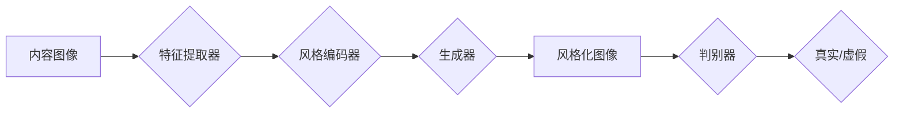

## 1. 背景介绍

### 1.1 数字化历史档案的意义与挑战

历史档案是人类文明的珍贵遗产，承载着丰富的文化信息和历史记忆。随着数字化时代的到来，数字化历史档案构建成为保护和传承历史文化的重要手段。然而，传统的历史档案数字化方法存在着效率低、成本高、信息丢失等问题，难以满足日益增长的档案数字化需求。

### 1.2 图像风格迁移技术的应用前景

图像风格迁移技术作为一种新兴的计算机视觉技术，能够将一种图像的艺术风格迁移到另一种图像上，生成全新的艺术作品。近年来，随着深度学习技术的快速发展，基于生成对抗网络（Generative Adversarial Networks，GANs）的图像风格迁移技术取得了显著的成果，为数字化历史档案构建提供了新的思路和方法。

### 1.3 本文的出发点和研究目标

本文旨在探讨基于生成对抗网络的数字化图像风格迁移技术在历史档案构建中的应用，通过将历史照片的风格迁移到现代照片上，实现历史场景的数字化重建，为历史研究、文化传承和教育普及提供新的途径。

## 2. 核心概念与联系

### 2.1 生成对抗网络（GANs）

#### 2.1.1 GANs的基本原理

生成对抗网络由两个神经网络组成：生成器（Generator）和判别器（Discriminator）。生成器的目标是生成逼真的数据，而判别器的目标是区分真实数据和生成器生成的数据。这两个网络相互对抗，通过不断优化自身的参数，最终生成器能够生成以假乱真的数据。

#### 2.1.2 GANs的应用领域

GANs在图像生成、图像修复、图像超分辨率、文本生成等领域有着广泛的应用。

### 2.2 图像风格迁移

#### 2.2.1 图像风格迁移的定义

图像风格迁移是指将一种图像的艺术风格迁移到另一种图像上，生成全新的艺术作品。

#### 2.2.2 图像风格迁移的分类

根据实现方法的不同，图像风格迁移可以分为基于优化的方法和基于模型的方法。

### 2.3 核心概念之间的联系

基于生成对抗网络的图像风格迁移技术将GANs应用于图像风格迁移任务，通过训练生成器和判别器，实现图像风格的自动迁移。

## 3. 核心算法原理具体操作步骤

### 3.1 基于GANs的图像风格迁移算法

#### 3.1.1 算法流程图



#### 3.1.2 算法步骤

1. 将内容图像和风格图像输入到特征提取器中，提取图像的特征表示。
2. 将内容图像的特征表示输入到风格编码器中，学习风格图像的风格表示。
3. 将内容图像的特征表示和风格图像的风格表示输入到生成器中，生成风格化图像。
4. 将风格化图像和真实图像输入到判别器中，判断图像的真假。
5. 根据判别器的输出，更新生成器和判别器的参数。
6. 重复步骤3-5，直到生成器能够生成以假乱真的风格化图像。

### 3.2 损失函数设计

#### 3.2.1 内容损失

内容损失用于衡量生成图像与内容图像之间的内容相似度，可以使用均方误差（MSE）或感知损失（Perceptual Loss）来计算。

#### 3.2.2 风格损失

风格损失用于衡量生成图像与风格图像之间的风格相似度，可以使用Gram矩阵来计算。

#### 3.2.3 对抗损失

对抗损失用于衡量判别器区分真实图像和生成图像的能力，可以使用交叉熵损失来计算。

## 4. 数学模型和公式详细讲解举例说明

### 4.1 生成器

生成器通常采用编码器-解码器结构，将内容图像的特征表示和风格图像的风格表示作为输入，生成风格化图像。

### 4.2 判别器

判别器通常采用卷积神经网络结构，将图像作为输入，输出图像的真假概率。

### 4.3 损失函数

#### 4.3.1 内容损失

$$L_{content} = \frac{1}{N} \sum_{i=1}^{N} (F_l(x_i) - F_l(g(x_i)))^2$$

其中，$F_l(x)$ 表示图像 $x$ 在第 $l$ 层的特征表示，$g(x)$ 表示生成器生成的图像。

#### 4.3.2 风格损失

$$L_{style} = \frac{1}{N} \sum_{l=1}^{L} \frac{1}{M_l H_l W_l} \sum_{i=1}^{M_l} \sum_{j=1}^{M_l} (G_l(x)_{ij} - G_l(g(x))_{ij})^2$$

其中，$G_l(x)$ 表示图像 $x$ 在第 $l$ 层的Gram矩阵。

#### 4.3.3 对抗损失

$$L_{adv} = -E_{x \sim p_{data}(x)}[\log D(x)] - E_{z \sim p_z(z)}[\log(1 - D(g(z)))]$$

其中，$D(x)$ 表示判别器输出的图像 $x$ 的真假概率，$g(z)$ 表示生成器生成的图像。

## 5. 项目实践：代码实例和详细解释说明

### 5.1 环境搭建

* Python 3.7
* TensorFlow 2.4
* Keras 2.4

### 5.2 数据集准备

* 内容图像数据集：COCO2014
* 风格图像数据集：WikiArt

### 5.3 模型构建

```python
from tensorflow.keras.layers import Input, Conv2D, UpSampling2D, BatchNormalization, Activation, Add, concatenate
from tensorflow.keras.models import Model

def residual_block(x, filters):
    shortcut = x
    x = Conv2D(filters, (3, 3), padding='same')(x)
    x = BatchNormalization()(x)
    x = Activation('relu')(x)
    x = Conv2D(filters, (3, 3), padding='same')(x)
    x = BatchNormalization()(x)
    x = Add()([x, shortcut])
    x = Activation('relu')(x)
    return x

def encoder(x):
    x = Conv2D(64, (9, 9), strides=1, padding='same')(x)
    x = BatchNormalization()(x)
    x = Activation('relu')(x)
    x = residual_block(x, 64)
    x = residual_block(x, 64)
    x = residual_block(x, 64)
    x = residual_block(x, 64)
    return x

def decoder(x):
    x = UpSampling2D()(x)
    x = Conv2D(64, (3, 3), padding='same')(x)
    x = BatchNormalization()(x)
    x = Activation('relu')(x)
    x = UpSampling2D()(x)
    x = Conv2D(32, (3, 3), padding='same')(x)
    x = BatchNormalization()(x)
    x = Activation('relu')(x)
    x = Conv2D(3, (9, 9), strides=1, padding='same')(x)
    x = Activation('tanh')(x)
    return x

def style_encoder(x):
    x = Conv2D(64, (3, 3), strides=2, padding='same')(x)
    x = BatchNormalization()(x)
    x = Activation('relu')(x)
    x = Conv2D(128, (3, 3), strides=2, padding='same')(x)
    x = BatchNormalization()(x)
    x = Activation('relu')(x)
    x = Conv2D(256, (3, 3), strides=2, padding='same')(x)
    x = BatchNormalization()(x)
    x = Activation('relu')(x)
    return x

def generator(content_input, style_input):
    content_features = encoder(content_input)
    style_features = style_encoder(style_input)
    x = concatenate([content_features, style_features])
    x = decoder(x)
    return x

def discriminator(x):
    x = Conv2D(64, (4, 4), strides=2, padding='same')(x)
    x = LeakyReLU(alpha=0.2)(x)
    x = Conv2D(128, (4, 4), strides=2, padding='same')(x)
    x = LeakyReLU(alpha=0.2)(x)
    x = Conv2D(256, (4, 4), strides=2, padding='same')(x)
    x = LeakyReLU(alpha=0.2)(x)
    x = Flatten()(x)
    x = Dense(1, activation='sigmoid')(x)
    return x

content_input = Input(shape=(256, 256, 3))
style_input = Input(shape=(256, 256, 3))
generated_image = generator(content_input, style_input)
discriminator_output = discriminator(generated_image)

generator_model = Model([content_input, style_input], generated_image)
discriminator_model = Model(generated_image, discriminator_output)
```

### 5.4 模型训练

```python
from tensorflow.keras.optimizers import Adam
from tensorflow.keras.losses import BinaryCrossentropy, MeanSquaredError

# 定义优化器
generator_optimizer = Adam(learning_rate=0.0002, beta_1=0.5)
discriminator_optimizer = Adam(learning_rate=0.0002, beta_1=0.5)

# 定义损失函数
bce = BinaryCrossentropy()
mse = MeanSquaredError()

# 定义训练步骤
def train_step(content_images, style_images):
    with tf.GradientTape() as gen_tape, tf.GradientTape() as disc_tape:
        # 生成风格化图像
        generated_images = generator_model([content_images, style_images])

        # 判别真实图像和生成图像
        real_output = discriminator_model(style_images)
        fake_output = discriminator_model(generated_images)

        # 计算损失函数
        gen_loss = bce(tf.ones_like(fake_output), fake_output) + mse(content_images, generated_images)
        disc_loss = bce(tf.ones_like(real_output), real_output) + bce(tf.zeros_like(fake_output), fake_output)

    # 计算梯度
    generator_gradients = gen_tape.gradient(gen_loss, generator_model.trainable_variables)
    discriminator_gradients = disc_tape.gradient(disc_loss, discriminator_model.trainable_variables)

    # 更新模型参数
    generator_optimizer.apply_gradients(zip(generator_gradients, generator_model.trainable_variables))
    discriminator_optimizer.apply_gradients(zip(discriminator_gradients, discriminator_model.trainable_variables))

# 开始训练
for epoch in range(epochs):
    for batch in range(steps_per_epoch):
        # 获取一批数据
        content_images, style_images = get_batch(batch_size)

        # 训练模型
        train_step(content_images, style_images)
```

### 5.5 模型评估

使用峰值信噪比（PSNR）和结构相似性指数（SSIM）来评估生成图像的质量。

## 6. 实际应用场景

### 6.1 历史照片修复

将破损的历史照片作为内容图像，将完整的历史照片或艺术作品作为风格图像，生成修复后的历史照片。

### 6.2 历史场景重建

将现代照片作为内容图像，将历史照片作为风格图像，生成具有历史风格的现代场景图像，实现历史场景的数字化重建。

### 6.3 虚拟博物馆

将博物馆展品的照片作为内容图像，将不同艺术风格的图像作为风格图像，生成具有不同艺术风格的展品图像，构建虚拟博物馆。

## 7. 工具和资源推荐

### 7.1 TensorFlow

TensorFlow是一个开源的机器学习平台，提供了丰富的API和工具，可以用于构建和训练GANs模型。

### 7.2 Keras

Keras是一个高级神经网络API，可以运行在TensorFlow、CNTK和Theano之上，提供了简洁易用的接口，可以方便地构建和训练GANs模型。

### 7.3 WikiArt

WikiArt是一个在线艺术百科全书，包含了大量的艺术作品图像，可以作为风格图像数据集。

## 8. 总结：未来发展趋势与挑战

### 8.1 未来发展趋势

* 提高生成图像的质量和分辨率
* 探索新的GANs模型和算法
* 将图像风格迁移技术应用于更广泛的领域

### 8.2 挑战

* 数据集的获取和标注
* 模型的训练和优化
* 生成图像的评估和应用

## 9. 附录：常见问题与解答

### 9.1 如何选择合适的GANs模型？

选择GANs模型需要根据具体应用场景和数据集的特点进行选择。常见的GANs模型包括DCGAN、WGAN、CycleGAN、Pix2Pix等。

### 9.2 如何提高生成图像的质量？

提高生成图像的质量可以通过以下方法：

* 使用更高分辨率的图像数据集
* 采用更深的网络结构
* 使用更有效的损失函数
* 对模型进行精细的调参

### 9.3 如何评估生成图像的质量？

可以使用峰值信噪比（PSNR）和结构相似性指数（SSIM）来评估生成图像的质量。