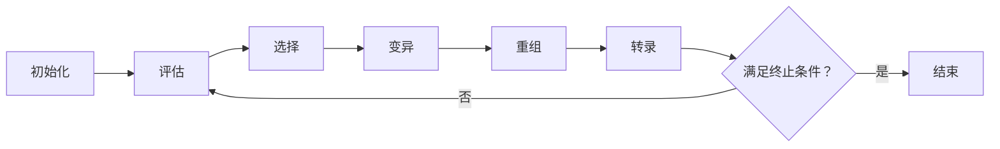

## 1. 背景介绍

在生物科学中，“基因表达”一词用于描述从基因到功能蛋白质的过程。这个过程包括两个主要步骤：转录（DNA转换为RNA）和翻译（RNA转换为蛋白质）。然而，在计算生物学和人工智能领域，基因表达编程（Gene Expression Programming, GEP）则是一种不同的概念，它是一种强大的基于基因的演化算法。

基因表达编程由Cândida Ferreira在2001年首次提出，它结合了遗传算法和遗传编程的优点，同时克服了它们的一些局限性。遗传算法在解决优化问题方面表现出色，但对于符号回归问题和其他涉及“程序”的问题，遗传编程更为适合。然而，遗传编程的一大挑战在于，它需要维护“解”的树形结构，这在处理复杂问题时可能会变得非常困难。GEP通过使用线性染色体来编码“解”的树形结构，成功地克服了这个问题。

## 2. 核心概念与联系

### 2.1. 基因表达编程的核心概念

基因表达编程的核心概念是将基因（代表问题解的编码）映射到表达式树（代表解的结构）。这个过程被称为“基因表达”。

基因在GEP中被表示为一个线性字符串，每个字符（也被称为基因元）代表一个操作（例如加、减、乘、除）或一个变量。表达式树则是一个二叉树，每个节点都是一个操作，每个叶节点都是一个变量。

### 2.2. 基因和表达式树的关系

基因和表达式树之间的关系是GEP的核心。基因的线性结构使得它可以被轻易地复制、突变和重组（这是遗传算法的主要操作），而表达式树的结构则决定了解的形式。

这种关系通过一个“解码”过程来建立。在解码过程中，基因（线性字符串）被转化为表达式树。这个过程根据基因元的类型（操作或变量）和操作的元数（需要的变量数）顺序进行。例如，基因“+-*abc”会被解码为以下表达式树：

```
    +
   / \
  -   *
 / \ / \
a  b c
```

## 3. 核心算法原理具体操作步骤

基因表达编程的一般过程如下：

1. **初始化**：创建一个初始种群。每个个体都是一个随机生成的基因。

2. **评估**：将每个个体（基因）解码为一个表达式树，然后根据问题的特性评估其适应度。

3. **选择**：根据个体的适应度进行选择。适应度高的个体有更高的机会被选择进入下一代。

4. **变异**：随机改变基因的一部分。

5. **重组**：交换两个基因的一部分。

6. **转录**：将基因复制到下一代。

7. **终止**：如果满足终止条件（例如达到最大代数或找到满意的解），则停止；否则，回到第2步。

这个过程可以被表示为以下 mermaid 流程图：



## 4. 数学模型和公式详细讲解举例说明

在基因表达编程中，一个重要的问题是如何评估个体的适应度。对于许多问题，适应度函数可以被定义为个体解的质量的度量。

例如，对于符号回归问题，适应度函数通常被定义为数据点和由个体表达的函数预测的值之间的误差的负值。具体来说，如果我们有$n$个数据点$(x_i, y_i)$，$i=1,2,\ldots,n$，并且个体表达的函数为$f$，那么适应度可以被定义为：

$$
fitness = -\frac{1}{n}\sum_{i=1}^{n}(y_i - f(x_i))^2
$$

这个函数表示的是均方误差，它是预测误差的常用度量。值得注意的是，我们取了负值，因为在遗传算法中，我们通常希望最大化适应度，而在这个问题中，我们希望最小化误差。

## 4. 项目实践：代码实例和详细解释说明

在这个部分，我们将使用Python的deap库来实现基因表达编程。我们的任务是找到一个函数，这个函数可以很好地拟合给定的数据点。我们首先生成一些数据：

```python
import numpy as np

# 生成数据
x = np.linspace(-1, 1, 100)
y = x**2 + np.sin(5 * x)
```

然后，我们定义适应度函数和其他必要的函数：

```python
from deap import base, creator, tools, gp

# 定义适应度函数
def fitness(individual, points):
    # 转化为可执行函数
    func = toolbox.compile(expr=individual)
    # 计算均方误差
    mse = ((func(x) - y)**2).mean()
    return mse,

# 定义随机生成函数和操作
pset = gp.PrimitiveSet("MAIN", 1)
pset.addPrimitive(np.add, 2)
pset.addPrimitive(np.subtract, 2)
pset.addPrimitive(np.multiply, 2)
pset.addPrimitive(np.negative, 1)
pset.addPrimitive(np.sin, 1)
pset.addPrimitive(np.cos, 1)
pset.addEphemeralConstant("rand", lambda: np.random.rand()*2-1)
```

最后，我们定义遗传算法的主要部分：

```python
creator.create("FitnessMin", base.Fitness, weights=(-1.0,))
creator.create("Individual", gp.PrimitiveTree, fitness=creator.FitnessMin)

toolbox = base.Toolbox()
toolbox.register("expr", gp.genHalfAndHalf, pset=pset, min_=1, max_=2)
toolbox.register("individual", tools.initIterate, creator.Individual, toolbox.expr)
toolbox.register("population", tools.initRepeat, list, toolbox.individual)
toolbox.register("compile", gp.compile, pset=pset)
toolbox.register("evaluate", fitness, points=[x, y])
toolbox.register("select", tools.selTournament, tournsize=3)
toolbox.register("mate", gp.cxOnePoint)
toolbox.register("expr_mut", gp.genFull, min_=0, max_=2)
toolbox.register("mutate", gp.mutUniform, expr=toolbox.expr_mut, pset=pset)

pop = toolbox.population(n=100)
hof = tools.HallOfFame(1)

stats_fit = tools.Statistics(lambda ind: ind.fitness.values)
stats_size = tools.Statistics(len)
mstats = tools.MultiStatistics(fitness=stats_fit, size=stats_size)
mstats.register("avg", np.mean)
mstats.register("std", np.std)
mstats.register("min", np.min)
mstats.register("max", np.max)

pop, log = algorithms.eaSimple(pop, toolbox, 0.5, 0.1, 40, stats=mstats,
                                halloffame=hof, verbose=True)
```

在这个代码中，我们创建了一个适应度函数，它计算均方误差。我们还定义了一个基元集，它包含了我们可以使用的操作和常数。然后，我们创建了一个遗传算法，它使用了我们之前定义的适应度函数和基元集。

## 5. 实际应用场景

基因表达编程在许多领域都有应用，包括但不限于：

* **符号回归**：在这种情况下，我们的目标是找到一个函数，这个函数可以很好地拟合给定的数据点。这是一种常见的机器学习任务，它可以用于预测或者揭示数据背后的结构。

* **分类**：基因表达编程可以用于创建分类器。在这种情况下，我们的目标是找到一个函数，这个函数可以将输入数据分配到正确的类别。

* **优化问题**：基于遗传的算法，如基因表达编程，已被证明在解决一些优化问题时非常有效。

* **机器学习和人工智能**：由于其能力在搜索大量的解空间中找到有效的解，基因表达编程被广泛用于机器学习和人工智能领域。

## 6. 工具和资源推荐

对于那些希望自己尝试基因表达编程的读者，以下是一些可用的工具和资源：

* [deap](https://deap.readthedocs.io/en/master/)：这是一个Python库，它提供了创建遗传算法的工具，包括基因表达编程。

* [gplearn](https://gplearn.readthedocs.io/en/stable/)：这是一个Python库，专门用于遗传编程，包括基因表达编程。

* [ECJ](https://cs.gmu.edu/~eclab/projects/ecj/)：这是一个Java库，它提供了创建各种演化计算算法的工具，包括基因表达编程。

* [Cândida Ferreira's book](http://www.gene-expression-programming.com/webpapers/Ferreira-Vanneschi-2011.pdf)：这本书由基因表达编程的发明者Cândida Ferreira撰写，详细介绍了基因表达编程。

## 7.总结：未来发展趋势与挑战

基因表达编程是一种强大的演化算法，它有许多潜在的应用。然而，像所有的算法一样，它也有一些挑战和限制。

首先，基因表达编程依赖于随机搜索，这使得它在解决一些问题时可能需要大量的计算资源。虽然这在一些情况下是可以接受的（例如，当问题的解空间小或者我们有大量的计算资源时），但在其他情况下，这可能是一个问题。

其次，基因表达编程需要一个适应度函数来指导搜索。在一些问题上，找到一个好的适应度函数可能是一个挑战。

尽管有这些挑战，基因表达编程仍然是一个有前景的研究领域。随着计算能力的提高和新的适应度函数的发现，我们可以期待在未来看到更多基于基因表达编程的应用。

## 8. 附录：常见问题与解答

**问：基因表达编程和遗传编程有什么区别？**

答：基因表达编程和遗传编程都是演化算法，但它们的主要区别在于如何表示和操作“解”。在遗传编程中，解被表示为树形结构，并通过树形的操作进行变异和重组。在基因表达编程中，解被表示为线性的基因，并通过线性的操作进行变异和重组。这使得基因表达编程在处理复杂问题时更加灵活和高效。

**问：基因表达编程可以用于解决哪些类型的问题？**

答：基因表达编程可以用于解决许多类型的问题，包括符号回归、分类和优化问题。它也被用于机器学习和人工智能领域。

**问：基因表达编程需要什么样的计算资源？**

答：基因表达编程的计算资源需求取决于问题的复杂性和解空间的大小。对于小规模的问题，一台普通的个人电脑可能就足够了。对于大规模的问题，可能需要更强大的计算资源，例如高性能计算集群。

**问：我可以在哪里找到更多关于基因表达编程的信息？**

答：有许多关于基因表达编程的优秀资源，其中一些已经在“工具和资源推荐”部分提供。此外，你也可以查阅基因表达编程的原始论文和相关的学术文章。