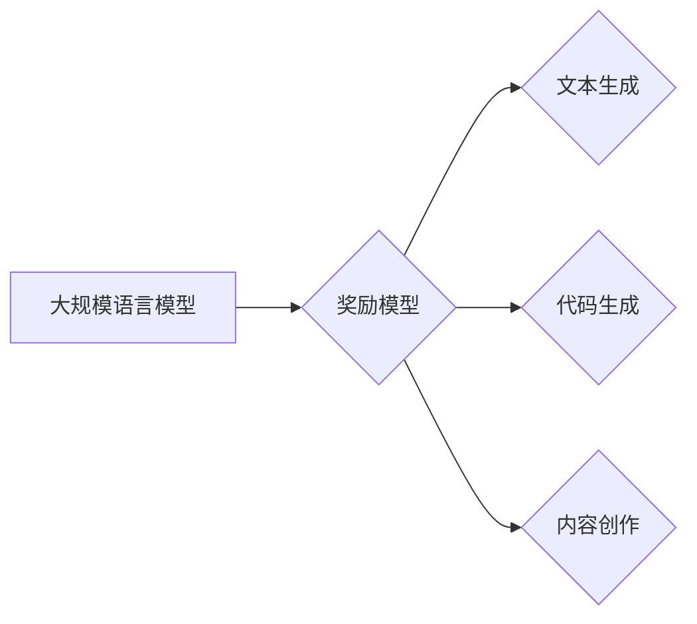

##  大规模语言模型从理论到实践 奖励模型

作者：禅与计算机程序设计艺术

## 1. 背景介绍

### 1.1 大规模语言模型的崛起

近年来，随着计算能力的提升和数据量的爆炸式增长，大规模语言模型（LLM）取得了显著的进展，在自然语言处理领域掀起了一场革命。从 GPT-3 到 BERT，再到 ChatGPT，LLM 不断刷新着人们对人工智能的认知，展现出惊人的语言理解和生成能力。

### 1.2  奖励模型的重要性

然而，LLM 的训练过程并非一帆风顺。传统的监督学习方法需要大量的标注数据，成本高昂且效率低下。为了解决这个问题，研究者们引入了**奖励模型（Reward Model）**，通过对模型生成的文本进行评估和打分，引导模型朝着更优的方向发展。奖励模型的出现，使得 LLM 的训练效率和效果得到了显著提升，也为 LLM 的应用落地开辟了新的道路。

### 1.3 本文的意义

本文旨在深入探讨 LLM 奖励模型的理论基础、算法原理、实践应用以及未来发展趋势，帮助读者全面了解 LLM 奖励模型的最新进展，并为相关研究和应用提供参考。

## 2. 核心概念与联系

### 2.1  什么是奖励模型？

奖励模型本质上是一个函数，它接受 LLM 生成的文本作为输入，输出一个标量值，表示该文本的质量。这个标量值可以理解为对文本的“奖励”或“惩罚”，引导 LLM 生成更符合预期目标的文本。

### 2.2  奖励模型与强化学习

奖励模型与强化学习（Reinforcement Learning）有着密切的联系。在强化学习中，智能体通过与环境交互，根据环境的反馈（即奖励）不断调整自身的策略，以获得最大的累积奖励。奖励模型可以看作是强化学习中的奖励函数，为 LLM 提供了一种有效的学习信号。

### 2.3  奖励模型的类型

根据不同的设计思路，奖励模型可以分为以下几种类型：

* **基于规则的奖励模型:**  根据预先定义的规则对文本进行评估，例如语法、流畅度、逻辑性等。
* **基于学习的奖励模型:** 利用机器学习算法，从标注数据中学习复杂的评估标准。
* **人工评估奖励模型:** 由人工对文本进行评估和打分，成本较高但准确性更高。

## 3. 核心算法原理具体操作步骤

### 3.1  基于规则的奖励模型

基于规则的奖励模型通常采用一系列人工制定的规则来评估文本质量。例如，可以根据文本的语法错误数量、句子长度、词汇丰富度等指标进行打分。

**操作步骤:**

1. 定义评估规则：确定用于评估文本质量的具体指标和规则。
2. 提取文本特征：根据定义的规则，从文本中提取相应的特征。
3. 计算奖励值：根据提取的特征和规则，计算文本的奖励值。

**示例:**

假设我们定义以下规则来评估文本质量：

* 语法错误数量：每出现一个语法错误，扣除 0.1 分。
* 句子平均长度：句子平均长度在 10 到 20 个单词之间，奖励 0.1 分。
* 词汇丰富度：使用 Type-Token Ratio (TTR) 指标衡量词汇丰富度，TTR 越高，奖励越高。

对于一段文本，我们可以提取相应的特征，并根据上述规则计算其奖励值。

### 3.2  基于学习的奖励模型

基于学习的奖励模型利用机器学习算法，从标注数据中学习评估文本质量的标准。常见的算法包括线性回归、支持向量机、神经网络等。

**操作步骤:**

1. 收集标注数据：收集大量带有质量评分的文本数据，作为训练集。
2. 特征工程：将文本转化为数值特征向量，例如词袋模型、TF-IDF 等。
3. 模型训练：使用机器学习算法，根据训练数据学习评估模型的参数。
4. 模型评估：使用测试集评估模型的性能，例如准确率、召回率等指标。

**示例:**

我们可以使用 BERT 模型作为特征提取器，将文本转化为向量表示。然后，使用线性回归模型，根据标注数据学习评估模型的参数。

### 3.3 人工评估奖励模型

人工评估奖励模型由人工对文本进行评估和打分。这种方法成本较高，但准确性更高，适用于对文本质量要求较高的场景。

**操作步骤:**

1. 制定评估标准：明确评估文本质量的具体指标和评分标准。
2. 招募评估人员：招募一批具备相关专业知识和经验的评估人员。
3. 进行评估：评估人员根据评估标准对文本进行评分。
4. 数据汇总：汇总所有评估人员的评分结果，计算平均得分作为最终奖励值。

**示例:**

我们可以招募一批语言学家对 LLM 生成的文本进行评估，根据文本的语法、流畅度、逻辑性等指标进行打分。

## 4. 数学模型和公式详细讲解举例说明

### 4.1  线性回归模型

线性回归模型是一种简单但有效的机器学习算法，可以用于构建基于学习的奖励模型。线性回归模型假设奖励值与文本特征之间存在线性关系。

**数学模型:**

$$
R = w_1x_1 + w_2x_2 + ... + w_nx_n + b
$$

其中：

* $R$ 表示奖励值
* $x_1, x_2, ..., x_n$ 表示文本特征
* $w_1, w_2, ..., w_n$ 表示模型参数
* $b$ 表示偏置项

**举例说明:**

假设我们使用词袋模型提取文本特征，并使用线性回归模型构建奖励模型。模型的输入是一个文本，输出是一个奖励值。例如，对于文本 "The quick brown fox jumps over the lazy dog"，我们可以将其转化为一个特征向量 [1, 1, 1, ..., 0, 0]，其中每个元素表示对应单词的出现次数。

### 4.2  支持向量机模型

支持向量机（SVM）是一种强大的机器学习算法，可以用于构建非线性奖励模型。SVM 的目标是找到一个最优的超平面，将不同质量的文本分开。

**数学模型:**

$$
\min_{w, b} \frac{1}{2} ||w||^2 + C \sum_{i=1}^{n} \max(0, 1 - y_i(w^Tx_i + b))
$$

其中：

* $w$ 表示超平面的法向量
* $b$ 表示超平面的截距
* $x_i$ 表示第 $i$ 个文本的特征向量
* $y_i$ 表示第 $i$ 个文本的真实奖励值
* $C$ 表示惩罚系数

**举例说明:**

我们可以使用 BERT 模型提取文本特征，并使用 SVM 模型构建奖励模型。SVM 模型会学习一个超平面，将高质量的文本和低质量的文本分开。

## 5. 项目实践：代码实例和详细解释说明

### 5.1  使用 Transformers 库构建奖励模型

```python
from transformers import AutoModelForSequenceClassification, AutoTokenizer

# 加载预训练模型和分词器
model_name = "bert-base-uncased"
tokenizer = AutoTokenizer.from_pretrained(model_name)
model = AutoModelForSequenceClassification.from_pretrained(model_name, num_labels=1)

# 定义奖励函数
def reward_fn(text):
  """
  计算文本的奖励值。

  Args:
    text: 文本字符串。

  Returns:
    奖励值，范围为 [0, 1]。
  """
  inputs = tokenizer(text, return_tensors="pt")
  outputs = model(**inputs)
  reward = outputs.logits.sigmoid().item()
  return reward

# 示例用法
text = "This is a good example."
reward = reward_fn(text)
print(f"Reward: {reward}")
```

**代码解释:**

* 首先，我们使用 Transformers 库加载预训练的 BERT 模型和分词器。
* 然后，我们定义了一个奖励函数 `reward_fn`，该函数接收一个文本字符串作为输入，并返回一个奖励值。
* 在奖励函数中，我们首先使用分词器将文本转化为模型输入。
* 然后，我们将输入传递给 BERT 模型，并获取模型的输出 logits。
* 最后，我们将 logits 转换为 sigmoid 函数，并返回结果作为奖励值。

### 5.2  使用强化学习训练 LLM

```python
from transformers import pipeline

# 加载 LLM
generator = pipeline("text-generation", model="gpt2")

# 定义强化学习环境
class RewardEnvironment:
  def __init__(self, reward_fn):
    self.reward_fn = reward_fn

  def step(self, text):
    reward = self.reward_fn(text)
    return reward

# 创建强化学习环境
env = RewardEnvironment(reward_fn)

# 初始化 LLM
text = "Once upon a time"

# 强化学习循环
for i in range(100):
  # 生成文本
  generated_text = generator(text, max_length=100, num_return_sequences=1)[0]["generated_text"]

  # 计算奖励
  reward = env.step(generated_text)

  # 更新 LLM
  # ...

  # 更新文本
  text = generated_text

  # 打印结果
  print(f"Iteration: {i}, Reward: {reward}, Text: {generated_text}")
```

**代码解释:**

* 首先，我们使用 Transformers 库加载 GPT-2 模型作为 LLM。
* 然后，我们定义了一个强化学习环境 `RewardEnvironment`，该环境接收一个奖励函数作为输入。
* `step` 方法接收一个文本字符串作为输入，并使用奖励函数计算奖励值。
* 我们创建了一个强化学习环境，并使用之前定义的奖励函数初始化它。
* 我们初始化 LLM，并设置初始文本。
* 在强化学习循环中，我们重复以下步骤：
    * 使用 LLM 生成文本。
    * 使用强化学习环境计算奖励值。
    * 使用奖励值更新 LLM。
    * 更新文本。
    * 打印结果。

## 6. 实际应用场景

### 6.1  文本生成

奖励模型可以用于改进文本生成任务，例如机器翻译、文本摘要、对话生成等。通过使用奖励模型，可以引导 LLM 生成更流畅、更准确、更符合预期目标的文本。

### 6.2  代码生成

奖励模型也可以用于改进代码生成任务。通过使用奖励模型，可以引导 LLM 生成更简洁、更高效、更符合代码规范的代码。

### 6.3  内容创作

奖励模型还可以用于改进内容创作任务，例如写作、诗歌创作、音乐创作等。通过使用奖励模型，可以引导 LLM 生成更具创意、更富感染力、更符合审美标准的内容。

## 7. 工具和资源推荐

### 7.1  Transformers 库

Transformers 库是一个强大的自然语言处理库，提供了丰富的预训练模型和工具，可以用于构建奖励模型和训练 LLM。

### 7.2  OpenAI Gym

OpenAI Gym 是一个用于开发和比较强化学习算法的工具包，可以用于构建强化学习环境和训练 LLM。

### 7.3  Hugging Face Hub

Hugging Face Hub 是一个用于分享和探索机器学习模型的平台，可以找到各种预训练的奖励模型和 LLM。

## 8. 总结：未来发展趋势与挑战

### 8.1  未来发展趋势

* **更精准的评估标准:**  未来的奖励模型将更加注重文本的语义理解和逻辑推理能力，以更精准地评估文本质量。
* **更个性化的奖励模型:** 未来的奖励模型将更加注重用户的个性化需求，例如写作风格、内容偏好等，以生成更符合用户需求的文本。
* **更自动化的奖励模型训练:** 未来的奖励模型训练将更加自动化，减少人工干预，提高效率和可扩展性。

### 8.2  挑战

* **数据偏差:** 奖励模型的训练数据可能存在偏差，导致模型产生不公平或不准确的评估结果。
* **可解释性:** 奖励模型的决策过程通常难以解释，这限制了其应用范围和可信度。
* **安全性:** 恶意攻击者可能会利用奖励模型的漏洞，引导 LLM 生成有害或误导性的内容。

## 9. 附录：常见问题与解答

### 9.1  如何选择合适的奖励模型？

选择合适的奖励模型取决于具体的应用场景和需求。例如，对于文本生成任务，可以选择基于学习的奖励模型，而对于代码生成任务，可以选择基于规则的奖励模型。

### 9.2  如何评估奖励模型的性能？

可以使用测试集评估奖励模型的性能，例如准确率、召回率等指标。此外，还可以进行人工评估，以验证模型的评估结果是否符合预期。

### 9.3  如何解决奖励模型的数据偏差问题？

可以使用多种方法解决奖励模型的数据偏差问题，例如数据增强、对抗训练、公平性约束等。


## 10.  Mermaid流程图


