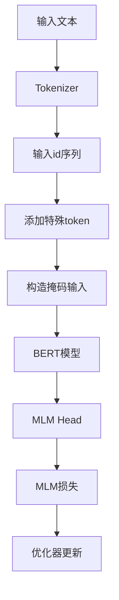

# 大规模语言模型从理论到实践 模型训练

## 1.背景介绍

### 1.1 语言模型的重要性

在自然语言处理(NLP)领域,语言模型扮演着至关重要的角色。它们是一种概率模型,旨在捕捉语言的统计规律,并预测下一个词或字符的可能性。通过对海量文本数据进行训练,语言模型能够学习语言的内在结构和模式,为诸如机器翻译、文本生成、语音识别等各种下游任务提供强大的支持。

随着深度学习技术的不断进步,特别是transformer模型的出现,大规模语言模型已成为NLP领域的主导力量。这些庞大的神经网络模型通过在大量文本数据上进行预训练,获得了广博的知识和语言理解能力,为各种下游任务提供了强大的语义表示和迁移学习能力。

### 1.2 大规模语言模型的兴起

近年来,大型科技公司和研究机构投入了大量资源开发大规模语言模型,例如GPT-3、PaLM、Megatron-Turing NLG等。这些模型在参数规模和训练数据量上都达到了前所未有的水平,模型参数数量高达数十亿甚至上万亿,训练语料规模高达数万亿个token。

大规模语言模型展现出了令人惊叹的语言理解和生成能力,在各种下游任务上取得了超越人类的性能表现。然而,训练如此庞大的模型也带来了巨大的计算和存储开销,对算力、内存和存储的需求都是一个巨大的挑战。因此,高效地训练这些大规模模型成为了当前研究的重点课题之一。

## 2.核心概念与联系  

### 2.1 语言模型的基本概念

语言模型的目标是估计一个句子或文本序列的概率。形式上,对于一个长度为T的token序列 $\boldsymbol{x} = (x_1, x_2, \dots, x_T)$,语言模型需要计算该序列的概率:

$$P(\boldsymbol{x}) = \prod_{t=1}^{T} P(x_t | x_1, \dots, x_{t-1})$$

其中 $P(x_t | x_1, \dots, x_{t-1})$ 表示已知前 $t-1$ 个token的情况下,预测第 $t$ 个token的条件概率。

语言模型可以采用多种不同的架构,如n-gram模型、神经网络模型等。近年来,transformer模型因其强大的长距离依赖建模能力而成为主流选择。

### 2.2 自回归语言模型

常见的语言模型采用自回归(auto-regressive)的方式,即按照从左到右的顺序逐个预测每个token。这种方式虽然高效,但也存在一些缺陷,比如无法并行化预测、路径开销较大等。

### 2.3 BERT及其改进模型  

BERT采用掩码语言模型(Masked Language Model)的思路,通过随机掩码部分输入token,并预测被掩码的token,从而实现了高效的并行训练。BERT的出现极大地推动了NLP领域的发展,并衍生出了诸如RoBERTa、ALBERT等改进模型。

### 2.4 生成式预训练模型

GPT模型则采用标准的自回归语言模型,通过最大化序列的条件概率进行训练。GPT-2和GPT-3等大规模模型展现出了强大的文本生成能力。PaLM、Megatron等更进一步,在规模和性能上都有了突破。

## 3.核心算法原理具体操作步骤

在本节中,我们将介绍训练大规模语言模型的核心算法原理和具体操作步骤。

### 3.1 数据预处理

训练大规模语言模型需要大量高质量的文本数据。常见的数据来源包括网页数据、书籍数据、维基百科等。数据预处理是训练的重要环节,主要包括:

1. **数据清洗**:去除HTML标签、清理格式错误等
2. **标记化**:将文本按字符/词/子词等粒度切分为token序列
3. **构建词表**:统计token频率,构建词表(vocabulary)
4. **数据分片**:将整个数据集分片,方便并行处理

### 3.2 模型输入构造

大多数模型采用transformer编码器或解码器作为骨干网络。输入序列需要进行适当的构造:

- **添加特殊token**:如[CLS]表示序列起始,[SEP]表示序列终止等
- **位置编码**:赋予每个token其在序列中的位置信息
- **注意力掩码**:为自回归模型设置三角形注意力掩码

### 3.3 模型并行训练

由于模型参数巨大,通常需要采用模型并行或/和数据并行的方式进行训练:

1. **数据并行**:将batch数据分散到多个GPU/TPU上进行前向/后向计算
2. **模型并行**:将模型各层切分到多个设备上,通过通信合并梯度
3. **流水线并行**:将不同层的前向/后向计算交错执行,提高并行度

常见的并行库有DeepSpeed、FairScale、Megatron-LM等。

### 3.4 优化算法

训练大规模模型对优化算法有着特殊的要求:

- **大批量训练**:提高训练吞吐量,但可能影响模型收敛性
- **学习率warmup**:前期使用较小学习率,后期增大以加速收敛  
- **梯度裁剪**:防止梯度爆炸,保证训练稳定性
- **混合精度训练**:利用半精度/低精度加速训练

Adam、LAMB等优化器被广泛使用。

### 3.5 模型并行推理

对于部署的大规模模型,也需要采用并行推理的策略:

1. **流水线并行**:不同层在不同设备并行执行
2. **张量并行**:单层内的矩阵乘法并行执行
3. **序列并行**:同时推理多个样本序列  

智能缓存和优化的内存管理也是关键。

## 4.数学模型和公式详细讲解举例说明

在这一节中,我们将深入探讨大规模语言模型中使用的一些核心数学模型和公式。

### 4.1 Transformer模型

Transformer模型是当前主流的序列建模架构,其基于自注意力(Self-Attention)机制,能够有效捕捉长距离依赖。对于一个长度为T的序列 $\boldsymbol{x} = (x_1, x_2, \dots, x_T)$,transformer的自注意力计算公式为:

$$\textrm{Attention}(Q, K, V) = \textrm{softmax}(\frac{QK^T}{\sqrt{d_k}})V$$

其中 $Q$、$K$、$V$ 分别为 Query、Key 和 Value,它们都是序列 $\boldsymbol{x}$ 通过不同的线性投影得到的。$d_k$ 为 Query 和 Key 的维度。

多头注意力(Multi-Head Attention)则是将多个注意力头的结果拼接:

$$\textrm{MultiHead}(Q, K, V) = \textrm{Concat}(head_1, \dots, head_h)W^O$$
$$\textrm{where } head_i = \textrm{Attention}(QW_i^Q, KW_i^K, VW_i^V)$$

其中 $W_i^Q$、$W_i^K$、$W_i^V$ 和 $W^O$ 都是可学习的投影矩阵。

### 4.2 掩码语言模型(Masked Language Model)

BERT采用了掩码语言模型的预训练目标,其思想是在输入序列中随机掩码部分token,然后让模型去预测被掩码的token。对于掩码后的序列 $\boldsymbol{x}$,其损失函数为:

$$\mathcal{L}_{\textrm{MLM}} = -\sum_{t \in \textrm{Masked}} \log P(x_t | \boldsymbol{x}_{\\mask})$$

其中 $\boldsymbol{x}_{\\mask}$ 表示将 $\boldsymbol{x}$ 中的部分token用特殊的[MASK]标记替换后的序列。

### 4.3 自回归语言模型(Auto-Regressive Language Model)

GPT等模型采用标准的自回归语言模型,其损失函数为:

$$\mathcal{L}_{\textrm{LM}} = -\sum_{t=1}^T \log P(x_t | x_1, \dots, x_{t-1})$$

即最大化给定前 $t-1$ 个token的条件概率下,预测第 $t$ 个token的概率。

### 4.4 示例:BERT的Masked LM训练

我们以BERT的Masked LM为例,详细解释一下训练过程。假设输入序列为:

```
The dog chased the [MASK] cat.
```

1. 将 "cat" 随机替换为特殊标记 [MASK]:

```
The dog chased the [MASK] [MASK].
```

2. 输入替换后的序列到BERT模型,得到每个位置的输出向量表示
3. 将[MASK]位置的输出向量与词表进行点积,得到词表上每个token的打分
4. 将打分通过softmax归一化,得到[MASK]位置的词的概率分布
5. 计算真实词"cat"在该分布上的概率的对数似然,作为该位置的损失
6. 对所有[MASK]位置的损失求平均,作为最终的MLM损失

通过最小化该损失函数,BERT可以学习到良好的掩码词预测能力。

## 5.项目实践: 代码实例和详细解释说明

在这一节中,我们将提供一些基于PyTorch和Hugging Face Transformers库的代码示例,帮助读者更好地理解大规模语言模型的训练过程。

### 5.1 定义Transformer模型

```python
import torch
from transformers import BertConfig, BertModel

# 加载预训练BERT配置
config = BertConfig.from_pretrained('bert-base-uncased')

# 定义BERT模型
model = BertModel(config)
```

上面的代码加载了预训练的BERT基础模型配置,并构建了一个BERT模型实例。我们可以使用该模型进行下游任务的微调。

### 5.2 构造输入数据

```python
from transformers import BertTokenizer

tokenizer = BertTokenizer.from_pretrained('bert-base-uncased')

text = "This is a sample sentence."
encoded = tokenizer.encode_plus(
    text,
    add_special_tokens=True,
    return_tensors='pt'
)

input_ids = encoded['input_ids']
```

这里我们使用BERT的tokenizer将文本序列转换为模型可接受的输入id。`encode_plus`函数会自动添加特殊token并对输入进行必要的padding。

### 5.3 前向传播

```python
outputs = model(input_ids)
last_hidden_state = outputs.last_hidden_state
```

将输入传入模型,即可获得对应的最终隐层表示`last_hidden_state`。对于BERT,这个张量的每一行对应输入序列中的一个token位置。

### 5.4 Masked LM训练示例

```python
import torch.nn.functional as F

# 手动构造掩码位置
masked_index = 8
flat_input_ids = input_ids.view(-1)  # 将batch展平
flat_input_ids[masked_index] = tokenizer.mask_token_id

# 获取[MASK]位置的logits和label 
logits = model(input_ids)[0]
masked_logits = logits[0, masked_index]
masked_label = flat_input_ids[masked_index]

# 计算MLM损失
mlm_loss = F.cross_entropy(masked_logits.unsqueeze(0), masked_label.unsqueeze(0))
```

上面的代码演示了如何计算单个[MASK]位置的MLM损失。我们首先将输入中的某个token位置替换为[MASK]标记,然后前向传播获取该位置的logits输出,再与真实label计算交叉熵损失。在实际训练中,我们需要对batch中的所有[MASK]位置求平均得到最终的MLM损失。

### 5.5 流程图

以下是BERT的Masked LM训练流程的Mermaid流程图:



## 6.实际应用场景

大规模语言模型在自然语言处理领域有着广泛的应用,下面列举了一些典型场景:

### 6.1