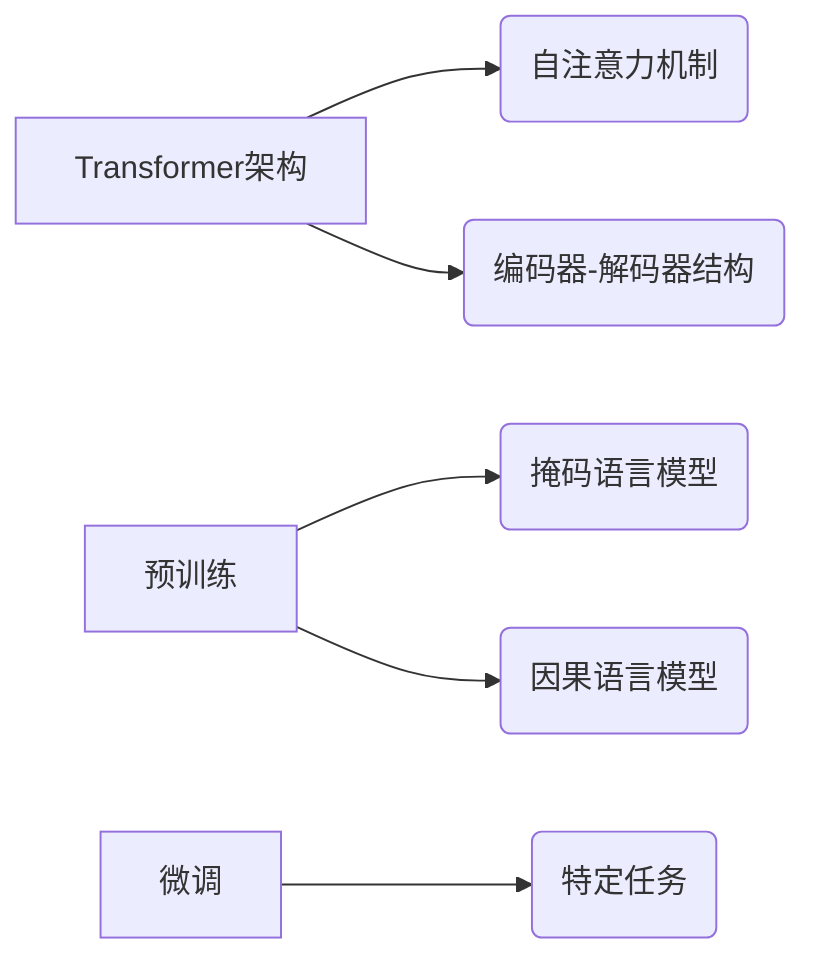

## 1. 背景介绍

### 1.1 大语言模型的兴起

近年来，随着深度学习技术的飞速发展，大语言模型（LLM，Large Language Model）逐渐成为人工智能领域的研究热点。LLM是指参数量巨大的神经网络模型，通常包含数十亿甚至数万亿个参数，并在海量文本数据上进行训练。这些模型展现出惊人的语言理解和生成能力，能够执行各种自然语言处理任务，例如：

* 文本生成：创作故事、诗歌、新闻报道等
* 机器翻译：将一种语言翻译成另一种语言
* 问答系统：回答用户提出的问题
* 代码生成：根据指令生成代码
* 聊天机器人：与用户进行自然流畅的对话

### 1.2 大语言模型的应用

LLM的强大能力使其在各个领域得到广泛应用，例如：

* **搜索引擎**: 提供更精准、更智能的搜索结果
* **智能客服**: 实现更自然、更人性化的客户服务
* **教育**: 提供个性化学习体验，辅助教学
* **医疗**: 辅助诊断、提供医疗咨询
* **金融**: 风险评估、欺诈检测

### 1.3 大语言模型的挑战

虽然LLM取得了巨大成功，但其训练和应用仍然面临诸多挑战，例如：

* **计算资源需求高**: LLM的训练需要大量的计算资源，成本高昂
* **数据需求大**: LLM需要海量文本数据进行训练，数据收集和清洗成本高
* **模型解释性**: LLM的决策过程难以解释，存在“黑盒”问题
* **伦理和社会影响**: LLM的应用可能带来伦理和社会问题，例如数据隐私、偏见等

## 2. 核心概念与联系

### 2.1 Transformer架构

Transformer是一种神经网络架构，是目前大多数LLM的基础。它由编码器和解码器两部分组成，通过自注意力机制捕捉文本中的长距离依赖关系。

#### 2.1.1 自注意力机制

自注意力机制允许模型关注输入序列中所有位置的信息，并学习它们之间的关系。这使得Transformer能够有效地处理长文本序列，并捕捉到句子内部和句子之间的语义联系。

#### 2.1.2 编码器-解码器结构

编码器将输入文本序列转换为隐藏状态表示，解码器则根据隐藏状态生成目标文本序列。编码器和解码器之间通过注意力机制进行交互，解码器可以访问编码器输出的所有信息。

### 2.2 预训练和微调

大多数LLM采用预训练-微调的训练方式。

#### 2.2.1 预训练

预训练是指在大规模文本数据上训练模型，使其学习通用的语言表示。预训练通常采用自监督学习方法，例如：

* **掩码语言模型**: 随机遮蔽输入文本中的某些词，并训练模型预测被遮蔽的词
* **因果语言模型**: 训练模型根据前面的词预测下一个词

#### 2.2.2 微调

微调是指在预训练模型的基础上，针对特定任务进行进一步训练。微调可以使模型更好地适应特定任务的数据分布和目标。

### 2.3 核心概念联系图



## 3. 核心算法原理具体操作步骤

### 3.1 Transformer架构详解

#### 3.1.1 编码器

编码器由多个相同的层堆叠而成，每个层包含两个子层：

* **多头自注意力层**: 计算输入序列中所有位置之间的注意力权重，并生成新的隐藏状态表示
* **前馈神经网络**: 对每个位置的隐藏状态进行非线性变换

#### 3.1.2 解码器

解码器与编码器结构类似，也由多个相同的层堆叠而成。不同之处在于解码器包含一个额外的注意力层，用于关注编码器的输出。

#### 3.1.3 操作步骤

1. 将输入文本序列转换为词嵌入向量
2. 将词嵌入向量输入编码器，生成隐藏状态表示
3. 将隐藏状态表示输入解码器，生成目标文本序列
4. 计算模型输出与目标序列之间的损失函数
5. 使用反向传播算法更新模型参数

### 3.2 预训练操作步骤

1. 准备大规模文本数据集
2. 随机遮蔽输入文本中的某些词
3. 训练模型预测被遮蔽的词
4. 使用反向传播算法更新模型参数

### 3.3 微调操作步骤

1. 准备特定任务数据集
2. 将预训练模型的参数作为初始参数
3. 在特定任务数据集上训练模型
4. 使用反向传播算法更新模型参数

## 4. 数学模型和公式详细讲解举例说明

### 4.1 自注意力机制

自注意力机制的核心是计算注意力权重，用于衡量输入序列中不同位置之间的相关性。注意力权重由查询向量、键向量和值向量计算得到。

#### 4.1.1 查询向量、键向量和值向量

* 查询向量：表示当前位置的信息
* 键向量：表示其他位置的信息
* 值向量：表示其他位置的特征

#### 4.1.2 注意力权重计算公式

$$
Attention(Q, K, V) = softmax(\frac{QK^T}{\sqrt{d_k}})V
$$

其中：

* Q：查询向量矩阵
* K：键向量矩阵
* V：值向量矩阵
* $d_k$：键向量维度

#### 4.1.3 举例说明

假设输入序列为 "The quick brown fox jumps over the lazy dog"，当前位置为 "fox"。则：

* 查询向量：fox 的词嵌入向量
* 键向量：所有词的词嵌入向量
* 值向量：所有词的词嵌入向量

计算注意力权重后，模型会更加关注与 "fox" 相关的词，例如 "quick"、"brown"、"jumps" 等。

### 4.2 损失函数

LLM通常使用交叉熵损失函数来衡量模型输出与目标序列之间的差异。

#### 4.2.1 交叉熵损失函数公式

$$
L = -\frac{1}{N}\sum_{i=1}^{N}\sum_{j=1}^{C}y_{ij}log(p_{ij})
$$

其中：

* N：样本数量
* C：类别数量
* $y_{ij}$：样本 i 的真实标签，如果样本 i 属于类别 j，则 $y_{ij}=1$，否则 $y_{ij}=0$
* $p_{ij}$：模型预测样本 i 属于类别 j 的概率

#### 4.2.2 举例说明

假设目标序列为 "The quick brown fox"，模型输出为 "The quick brown fox jumps"。则交叉熵损失函数会惩罚模型预测错误的词 "jumps"。

## 5. 项目实践：代码实例和详细解释说明

```python
import torch
import torch.nn as nn

class Transformer(nn.Module):
    def __init__(self, vocab_size, embedding_dim, hidden_dim, num_heads, num_layers):
        super().__init__()

        # 词嵌入层
        self.embedding = nn.Embedding(vocab_size, embedding_dim)

        # 编码器
        self.encoder = nn.TransformerEncoder(
            nn.TransformerEncoderLayer(embedding_dim, num_heads, hidden_dim),
            num_layers
        )

        # 解码器
        self.decoder = nn.TransformerDecoder(
            nn.TransformerDecoderLayer(embedding_dim, num_heads, hidden_dim),
            num_layers
        )

        # 线性层
        self.linear = nn.Linear(embedding_dim, vocab_size)

    def forward(self, src, tgt, src_mask, tgt_mask):
        # 词嵌入
        src = self.embedding(src)
        tgt = self.embedding(tgt)

        # 编码器
        encoder_output = self.encoder(src, src_mask)

        # 解码器
        decoder_output = self.decoder(tgt, encoder_output, tgt_mask, src_mask)

        # 线性层
        output = self.linear(decoder_output)

        return output
```

**代码解释:**

* `vocab_size`: 词汇表大小
* `embedding_dim`: 词嵌入维度
* `hidden_dim`: 隐藏状态维度
* `num_heads`: 多头注意力机制的头数
* `num_layers`: 编码器和解码器的层数

**模型训练:**

1. 实例化模型
2. 定义优化器和损失函数
3. 迭代训练数据
4. 计算损失函数
5. 使用反向传播算法更新模型参数

## 6. 实际应用场景

### 6.1 文本生成

LLM可以用于生成各种类型的文本，例如：

* **故事创作**: 根据给定的主题或开头，生成完整的故事
* **诗歌创作**: 生成符合特定韵律和格律的诗歌
* **新闻报道**: 根据事件信息，生成新闻报道

### 6.2 机器翻译

LLM可以用于将一种语言翻译成另一种语言，例如：

* **英汉翻译**: 将英语文本翻译成汉语
* **汉英翻译**: 将汉语文本翻译成英语

### 6.3 问答系统

LLM可以用于构建问答系统，回答用户提出的问题，例如：

* **客服机器人**: 回答客户关于产品或服务的问题
* **知识库问答**: 回答用户关于特定领域知识的问题

## 7. 工具和资源推荐

### 7.1 Hugging Face Transformers

Hugging Face Transformers 是一个开源库，提供了预训练的 LLM 模型和代码，方便用户进行 LLM 的开发和应用。

### 7.2 Google Colab

Google Colab 提供免费的 GPU 资源，可以用于 LLM 的训练和实验。

### 7.3 OpenAI API

OpenAI API 提供访问 GPT-3 等 LLM 的接口，用户可以通过 API 调用 LLM 的功能。

## 8. 总结：未来发展趋势与挑战

### 8.1 未来发展趋势

* **模型规模更大**: LLM 的规模将继续增长，参数量将达到更高的水平
* **多模态**: LLM 将整合图像、音频等多模态信息，实现更丰富的功能
* **个性化**: LLM 将根据用户偏好和需求提供个性化服务
* **伦理和安全**: LLM 的伦理和安全问题将得到更多关注

### 8.2 挑战

* **计算资源**: LLM 的训练和应用需要大量的计算资源，成本高昂
* **数据**: LLM 需要海量数据进行训练，数据收集和清洗成本高
* **解释性**: LLM 的决策过程难以解释，存在“黑盒”问题
* **伦理和社会影响**: LLM 的应用可能带来伦理和社会问题，例如数据隐私、偏见等

## 9. 附录：常见问题与解答

### 9.1 LLM 和传统 NLP 模型的区别？

LLM 是基于深度学习的模型，参数量巨大，需要海量数据进行训练。传统 NLP 模型通常基于统计方法，参数量较小，训练数据量也较小。

### 9.2 如何选择合适的 LLM？

选择 LLM 需要考虑任务需求、计算资源、数据规模等因素。Hugging Face Transformers 提供了各种预训练的 LLM 模型，用户可以根据需求进行选择。

### 9.3 如何解决 LLM 的伦理和社会问题？

解决 LLM 的伦理和社会问题需要多方面的努力，例如：

* **数据隐私**: 采用差分隐私等技术保护用户数据隐私
* **偏见**: 使用公平性指标评估模型的偏见，并采取措施 mitigate 偏见
* **可解释性**: 研究 LLM 的可解释性方法，提高模型的透明度
