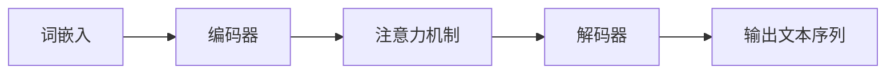

## 1. 背景介绍

### 1.1 大语言模型的兴起

近年来，自然语言处理领域取得了显著的进展，特别是大语言模型（LLM）的出现，例如 GPT-3、BERT 和 XLNet，它们在各种任务中表现出惊人的能力，包括：

- 文本生成：创作故事、诗歌、文章等。
- 语言理解：分析文本情感、提取关键信息等。
- 机器翻译：将一种语言翻译成另一种语言。
- 问答系统：回答用户提出的问题。

这些模型的成功得益于深度学习技术的进步、大规模数据集的可用性以及强大的计算能力。

### 1.2 工具设计的必要性

随着大语言模型的普及，对易于使用、功能强大的工具的需求也日益增长。这些工具可以帮助开发者和研究人员：

- 更轻松地构建、训练和部署大语言模型。
- 探索和理解这些模型的内部工作机制。
- 将大语言模型应用于实际场景，解决现实世界的问题。

### 1.3 本文的结构

本文将深入探讨大语言模型的原理和工程实践，重点关注工具设计方面。我们将涵盖以下内容：

- 核心概念与联系
- 核心算法原理和具体操作步骤
- 数学模型和公式详细讲解举例说明
- 项目实践：代码实例和详细解释说明
- 实际应用场景
- 工具和资源推荐
- 总结：未来发展趋势与挑战
- 附录：常见问题与解答


## 2. 核心概念与联系

### 2.1 大语言模型的定义

大语言模型是指基于深度学习技术训练的、具有大量参数的自然语言处理模型。这些模型通常使用 Transformer 架构，通过学习大量文本数据，掌握语言的语法、语义和上下文信息。

### 2.2 核心组件

大语言模型的核心组件包括：

- **词嵌入（Word Embeddings）：** 将单词或词语转换为向量表示，捕捉其语义信息。
- **编码器（Encoder）：** 将输入文本序列转换为上下文表示。
- **解码器（Decoder）：** 基于上下文表示生成输出文本序列。
- **注意力机制（Attention Mechanism）：** 允许模型在处理文本序列时关注特定部分。

### 2.3 关系图



## 3. 核心算法原理具体操作步骤

### 3.1 Transformer 架构

Transformer 架构是当前大语言模型的主流架构，其核心是自注意力机制（Self-Attention Mechanism）。自注意力机制允许模型在处理文本序列时，关注序列中所有位置的信息，从而捕捉长距离依赖关系。

#### 3.1.1 自注意力机制

自注意力机制通过计算输入序列中每个位置与其他位置的相似度，生成注意力权重。这些权重用于加权平均输入序列，得到每个位置的上下文表示。

#### 3.1.2 多头注意力机制

多头注意力机制使用多个自注意力模块，每个模块关注不同的方面，从而捕捉更丰富的上下文信息。

### 3.2 训练过程

大语言模型的训练过程通常采用自监督学习方法，即使用大量无标注文本数据进行训练。训练目标是预测文本序列中的下一个词语。

#### 3.2.1 损失函数

训练过程中使用的损失函数通常是交叉熵损失函数，用于衡量模型预测的概率分布与真实概率分布之间的差异。

#### 3.2.2 优化算法

优化算法用于更新模型参数，使其最小化损失函数。常用的优化算法包括 Adam、SGD 等。


## 4. 数学模型和公式详细讲解举例说明

### 4.1 自注意力机制

自注意力机制的计算过程可以表示为：

$$
Attention(Q, K, V) = softmax(\frac{QK^T}{\sqrt{d_k}})V
$$

其中：

- $Q$ 是查询矩阵，表示当前位置的信息。
- $K$ 是键矩阵，表示所有位置的信息。
- $V$ 是值矩阵，表示所有位置的值。
- $d_k$ 是键矩阵的维度。
- $softmax$ 函数用于将注意力权重归一化。

#### 4.1.1 示例

假设输入序列为 "I love natural language processing"，当前位置为 "love"，则：

- $Q$ 为 "love" 的词嵌入向量。
- $K$ 为所有词语的词嵌入向量组成的矩阵。
- $V$ 为所有词语的词嵌入向量组成的矩阵。

通过计算 $QK^T$，可以得到 "love" 与其他词语的相似度。经过 $softmax$ 函数归一化后，得到注意力权重。最后，将注意力权重与 $V$ 相乘，得到 "love" 的上下文表示。

### 4.2 交叉熵损失函数

交叉熵损失函数的公式为：

$$
L = -\sum_{i=1}^N y_i log(p_i)
$$

其中：

- $N$ 是样本数量。
- $y_i$ 是第 $i$ 个样本的真实标签。
- $p_i$ 是模型预测的第 $i$ 个样本属于真实标签的概率。


## 5. 项目实践：代码实例和详细解释说明

### 5.1 使用 Hugging Face Transformers 库构建大语言模型

Hugging Face Transformers 库提供了丰富的预训练大语言模型和工具，可以方便地构建、训练和部署大语言模型。

```python
from transformers import pipeline

# 加载预训练模型
generator = pipeline('text-generation', model='gpt2')

# 生成文本
text = generator("The quick brown fox jumps over the lazy", max_length=30, num_return_sequences=3)

# 打印结果
print(text)
```

### 5.2 使用 TensorFlow/PyTorch 构建自定义大语言模型

开发者可以使用 TensorFlow 或 PyTorch 框架构建自定义的大语言模型。

```python
import tensorflow as tf

# 定义模型架构
model = tf.keras.Sequential([
    tf.keras.layers.Embedding(vocab_size, embedding_dim),
    tf.keras.layers.LSTM(units),
    tf.keras.layers.Dense(vocab_size, activation='softmax')
])

# 定义损失函数和优化算法
loss_fn = tf.keras.losses.CategoricalCrossentropy()
optimizer = tf.keras.optimizers.Adam()

# 训练模型
model.compile(optimizer=optimizer, loss=loss_fn)
model.fit(x_train, y_train, epochs=epochs)
```


## 6. 实际应用场景

### 6.1 文本生成

大语言模型可以用于生成各种类型的文本，例如：

- 创作故事、诗歌、文章
- 生成代码、脚本
- 撰写电子邮件、社交媒体帖子

### 6.2 语言理解

大语言模型可以用于分析文本情感、提取关键信息、回答问题等。

### 6.3 机器翻译

大语言模型可以用于将一种语言翻译成另一种语言。

### 6.4 对话系统

大语言模型可以用于构建聊天机器人、虚拟助手等对话系统。


## 7. 工具和资源推荐

### 7.1 Hugging Face Transformers

Hugging Face Transformers 库提供了丰富的预训练大语言模型和工具，是构建、训练和部署大语言模型的理想选择。

### 7.2 TensorFlow/PyTorch

TensorFlow 和 PyTorch 是流行的深度学习框架，可以用于构建自定义的大语言模型。

### 7.3 OpenAI API

OpenAI API 提供了访问 GPT-3 等大语言模型的接口，可以用于各种应用场景。


## 8. 总结：未来发展趋势与挑战

### 8.1 未来发展趋势

- 更大、更强大的大语言模型
- 多模态大语言模型，整合文本、图像、音频等多种信息
- 更高效的训练和推理方法
- 更广泛的应用场景

### 8.2 挑战

- 模型偏差和公平性
- 数据安全和隐私
- 计算成本和环境影响


## 9. 附录：常见问题与解答

### 9.1 如何选择合适的预训练大语言模型？

选择预训练大语言模型需要考虑以下因素：

- 任务需求
- 模型规模和性能
- 可用资源

### 9.2 如何微调预训练大语言模型？

微调预训练大语言模型可以使用少量特定领域的数据进行训练，以提高模型在特定任务上的性能。

### 9.3 如何评估大语言模型的性能？

评估大语言模型的性能可以使用各种指标，例如：

- perplexity
- BLEU score
- ROUGE score
