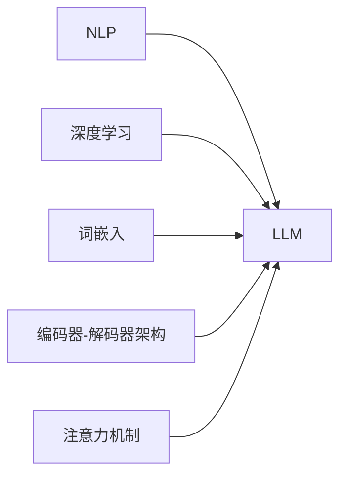

## 1. 背景介绍

### 1.1 大语言模型的兴起

近年来，随着深度学习技术的快速发展，大语言模型（LLM）逐渐成为人工智能领域的研究热点。LLM指的是基于海量文本数据训练的深度神经网络模型，能够理解和生成自然语言，并在各种任务中展现出强大的能力，例如：

* **文本生成**: 写作故事、诗歌、新闻报道等
* **机器翻译**: 将一种语言翻译成另一种语言
* **问答系统**: 回答用户提出的问题
* **代码生成**: 根据指令生成代码
* **情感分析**: 分析文本的情感倾向

### 1.2 BeeBot: 新一代智能助手

BeeBot是一款基于LLM技术构建的新一代智能助手，旨在为用户提供更智能、更便捷、更人性化的服务。BeeBot拥有以下特点：

* **强大的语言理解能力**: BeeBot能够准确理解用户的意图，并进行多轮对话，提供精准的信息和服务。
* **丰富的知识储备**: BeeBot基于海量数据训练，拥有丰富的知识储备，能够回答各种领域的问题，提供专业的建议。
* **个性化定制**: BeeBot支持用户自定义设置，根据用户的喜好和需求，提供个性化的服务。
* **多平台支持**: BeeBot支持多种平台，包括网页、移动应用、智能音箱等，方便用户随时随地使用。

## 2. 核心概念与联系

### 2.1  自然语言处理 (NLP)

自然语言处理（NLP）是人工智能领域的一个重要分支，旨在让计算机理解和生成人类语言。NLP涵盖了许多任务，例如：

* **分词**: 将文本分割成单词或词组
* **词性标注**: 标注每个单词的词性，例如名词、动词、形容词等
* **句法分析**: 分析句子的语法结构
* **语义分析**: 理解句子的含义

### 2.2 深度学习

深度学习是一种机器学习方法，使用多层神经网络来学习数据的复杂模式。深度学习在NLP领域取得了巨大成功，例如：

* **循环神经网络 (RNN)**: 能够处理序列数据，例如文本、语音等
* **长短期记忆网络 (LSTM)**: 是一种特殊的RNN，能够更好地处理长序列数据
* **Transformer**: 一种新的神经网络架构，在NLP任务中取得了 state-of-the-art 的结果

### 2.3 LLM的核心概念

LLM的核心概念包括：

* **词嵌入**: 将单词映射到高维向量空间，捕捉单词的语义信息
* **编码器-解码器架构**: 编码器将输入文本编码成向量表示，解码器根据向量表示生成输出文本
* **注意力机制**: 允许模型关注输入文本的不同部分，提高模型的理解能力

### 2.4 核心概念联系图



## 3. 核心算法原理具体操作步骤

### 3.1 数据预处理

LLM的训练需要大量的文本数据。在训练模型之前，需要对数据进行预处理，包括：

* **数据清洗**: 清除文本中的噪声，例如HTML标签、特殊字符等
* **分词**: 将文本分割成单词或词组
* **构建词汇表**: 统计文本中出现的单词，构建词汇表
* **编码**: 将单词转换为数字编码，例如one-hot编码、词嵌入等

### 3.2 模型训练

LLM的训练过程通常使用**随机梯度下降 (SGD)** 算法。训练过程包括以下步骤：

* **前向传播**: 将输入文本编码成向量表示，并通过神经网络进行计算，得到输出结果
* **计算损失函数**: 比较输出结果和目标结果，计算损失函数
* **反向传播**: 根据损失函数计算梯度，并更新模型参数
* **迭代训练**: 重复上述步骤，直到模型收敛

### 3.3 模型评估

训练完成后，需要对模型进行评估，以衡量模型的性能。常用的评估指标包括：

* **困惑度 (Perplexity)**: 衡量模型预测下一个单词的准确性
* **BLEU**: 衡量机器翻译结果的质量
* **ROUGE**: 衡量文本摘要结果的质量

## 4. 数学模型和公式详细讲解举例说明

### 4.1 Transformer 模型

Transformer 是一种基于注意力机制的神经网络架构，在NLP任务中取得了 state-of-the-art 的结果。Transformer 的核心组件包括：

* **多头注意力机制**: 允许模型关注输入文本的不同部分，提高模型的理解能力
* **位置编码**: 为每个单词添加位置信息，帮助模型理解单词的顺序
* **层归一化**: 稳定模型训练过程，加速模型收敛

### 4.2 注意力机制

注意力机制允许模型关注输入文本的不同部分，提高模型的理解能力。注意力机制的计算公式如下：

$$
Attention(Q, K, V) = softmax(\frac{QK^T}{\sqrt{d_k}})V
$$

其中：

* Q: 查询向量
* K: 键向量
* V: 值向量
* $d_k$: 键向量的维度

### 4.3 举例说明

假设输入文本为 "The quick brown fox jumps over the lazy dog"，使用 Transformer 模型进行编码。

1. **词嵌入**: 将每个单词转换为词向量。
2. **位置编码**: 为每个单词添加位置信息。
3. **多头注意力机制**: 计算每个单词与其他单词之间的注意力权重。
4. **层归一化**: 稳定模型训练过程。

最终，模型将输入文本编码成一个向量表示，捕捉了文本的语义信息。

## 5. 项目实践：代码实例和详细解释说明

### 5.1 BeeBot 的代码实现

BeeBot 的代码实现基于 Python 和 PyTorch 深度学习框架。以下是一个简单的 BeeBot 问答系统的代码示例：

```python
import torch
from transformers import AutoModelForQuestionAnswering, AutoTokenizer

# 加载预训练模型和分词器
model_name = "deepset/roberta-base-squad2"
tokenizer = AutoTokenizer.from_pretrained(model_name)
model = AutoModelForQuestionAnswering.from_pretrained(model_name)

# 输入问题和文本
question = "What is the capital of France?"
text = "Paris is the capital of France."

# 对问题和文本进行编码
inputs = tokenizer(question, text, return_tensors="pt")

# 使用模型进行预测
outputs = model(**inputs)

# 获取答案
answer_start = torch.argmax(outputs.start_logits)
answer_end = torch.argmax(outputs.end_logits)
answer = tokenizer.decode(inputs.input_ids[0][answer_start:answer_end+1])

# 打印答案
print(f"Answer: {answer}")
```

### 5.2 代码解释

* 首先，加载预训练的问答模型和分词器。
* 然后，输入问题和文本，并使用分词器对其进行编码。
* 接下来，使用模型进行预测，得到答案的起始和结束位置。
* 最后，使用分词器将答案解码成文本，并打印答案。

## 6. 实际应用场景

### 6.1 智能客服

BeeBot 可以应用于智能客服领域，为用户提供 24/7 在线客服服务。BeeBot 能够准确理解用户的意图，并提供精准的信息和服务，帮助用户解决问题。

### 6.2 智能助手

BeeBot 可以作为智能助手，为用户提供日程管理、信息查询、娱乐等服务。BeeBot 能够根据用户的喜好和需求，提供个性化的服务。

### 6.3 教育

BeeBot 可以应用于教育领域，为学生提供个性化学习辅导。BeeBot 能够根据学生的学习情况，提供针对性的学习建议和练习题。

## 7. 总结：未来发展趋势与挑战

### 7.1 未来发展趋势

* **模型规模**: LLM 的规模将会越来越大，能够处理更复杂的任务。
* **多模态**: LLM 将会支持多种模态，例如文本、图像、语音等，提供更丰富的服务。
* **个性化**: LLM 将会更加个性化，能够根据用户的喜好和需求，提供定制化的服务。

### 7.2 挑战

* **数据**: LLM 的训练需要大量的文本数据，数据的质量和数量对模型的性能至关重要。
* **计算资源**: LLM 的训练需要大量的计算资源，这限制了 LLM 的应用范围。
* **伦理**: LLM 的应用需要考虑伦理问题，例如数据隐私、模型偏差等。

## 8. 附录：常见问题与解答

### 8.1 BeeBot 支持哪些语言?

BeeBot 目前支持英语、中文、法语、西班牙语等多种语言。

### 8.2 如何使用 BeeBot?

用户可以通过网页、移动应用、智能音箱等多种平台使用 BeeBot。

### 8.3 BeeBot 的收费标准?

BeeBot 的收费标准取决于用户的具体需求，例如使用频率、服务内容等。
