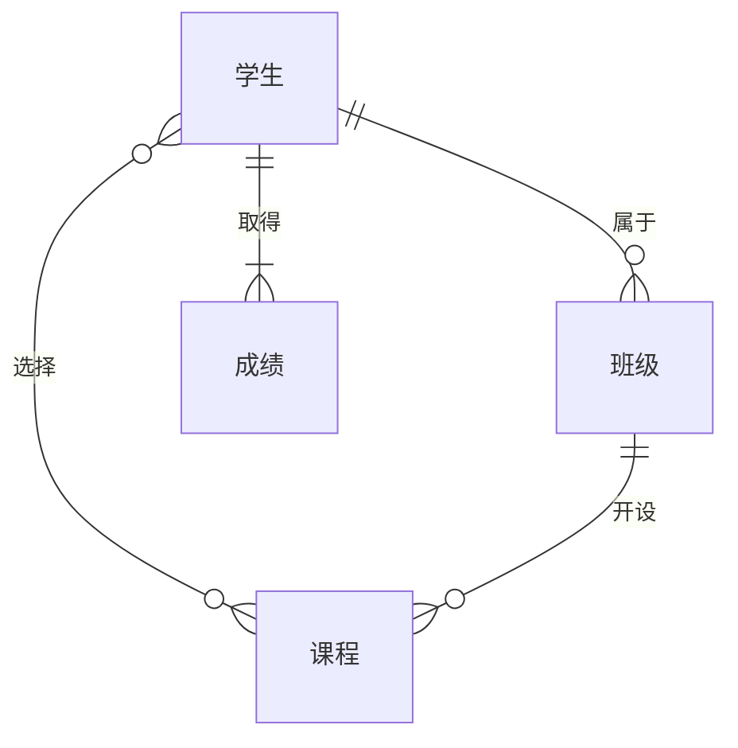

## 1. 背景介绍

### 1.1 学籍管理系统的意义

学籍管理系统是学校信息化建设的重要组成部分，它承担着学生信息的采集、存储、管理和分析等重要功能，是学校进行教学管理、学生管理、决策分析的重要依据。随着教育信息化的不断发展，学籍管理系统也在不断地更新和完善，以满足学校日益增长的管理需求。

### 1.2  系统设计目标

本系统的设计目标是构建一个功能完善、安全可靠、易于维护的学籍管理系统，以满足学校对学生信息管理的各项需求。具体目标如下：

*   **功能完备性**: 系统应涵盖学生信息的各个方面，包括基本信息、学籍信息、成绩信息、奖惩信息等，并提供相应的管理功能。
*   **安全性**: 系统应具备完善的安全机制，保障学生信息的安全性，防止信息泄露和篡改。
*   **可靠性**: 系统应具备高可用性和容错能力，确保系统稳定运行，防止数据丢失。
*   **易用性**: 系统应具备友好的用户界面和操作流程，方便用户使用。
*   **可维护性**: 系统应采用模块化设计，易于维护和扩展。

## 2. 核心概念与联系

### 2.1 实体关系图 (ERD)

学籍管理系统主要涉及以下实体：

*   学生：学生是系统的核心实体，包含学号、姓名、性别、出生日期、家庭住址、联系电话等信息。
*   班级：班级是学生的组织单位，包含班级编号、班级名称、班主任等信息。
*   课程：课程是学生学习的科目，包含课程编号、课程名称、学分等信息。
*   成绩：成绩是学生学习课程的评价结果，包含学号、课程编号、成绩等信息。

这些实体之间的关系如下：

*   学生与班级之间是多对一关系，一个学生只能属于一个班级，一个班级可以有多个学生。
*   学生与课程之间是多对多关系，一个学生可以选择多门课程，一门课程可以被多个学生选择。
*   学生与成绩之间是一对多关系，一个学生可以有多门课程的成绩，一门课程的成绩只能属于一个学生。



### 2.2  系统功能模块

根据系统设计目标，学籍管理系统应包含以下功能模块：

*   **学生管理模块**: 包括学生信息的新增、修改、删除、查询等功能。
*   **班级管理模块**: 包括班级信息的新增、修改、删除、查询等功能。
*   **课程管理模块**: 包括课程信息的新增、修改、删除、查询等功能。
*   **成绩管理模块**: 包括成绩信息的录入、修改、删除、查询、统计分析等功能。
*   **用户管理模块**: 包括用户的添加、删除、权限设置等功能。
*   **系统设置模块**: 包括系统参数设置、数据备份和恢复等功能。

## 3. 核心算法原理具体操作步骤

### 3.1  学生信息管理

#### 3.1.1  添加学生信息

1.  用户输入学生的基本信息，包括学号、姓名、性别、出生日期、家庭住址、联系电话等。
2.  系统检查学号是否已存在，如果已存在，则提示用户重新输入。
3.  系统将学生信息保存到数据库中。

#### 3.1.2  修改学生信息

1.  用户选择要修改的学生信息。
2.  用户修改学生信息。
3.  系统将修改后的学生信息保存到数据库中。

#### 3.1.3  删除学生信息

1.  用户选择要删除的学生信息。
2.  系统提示用户确认删除操作。
3.  系统将学生信息从数据库中删除。

#### 3.1.4  查询学生信息

1.  用户输入查询条件，例如学号、姓名、班级等。
2.  系统根据查询条件从数据库中检索学生信息。
3.  系统将查询结果展示给用户。

### 3.2  成绩信息管理

#### 3.2.1  录入成绩信息

1.  用户选择要录入成绩的班级和课程。
2.  用户输入学生的成绩。
3.  系统将成绩信息保存到数据库中。

#### 3.2.2  修改成绩信息

1.  用户选择要修改的成绩信息。
2.  用户修改成绩信息。
3.  系统将修改后的成绩信息保存到数据库中。

#### 3.2.3  删除成绩信息

1.  用户选择要删除的成绩信息。
2.  系统提示用户确认删除操作。
3.  系统将成绩信息从数据库中删除。

#### 3.2.4  查询成绩信息

1.  用户输入查询条件，例如学号、姓名、班级、课程等。
2.  系统根据查询条件从数据库中检索成绩信息。
3.  系统将查询结果展示给用户。

#### 3.2.5  统计分析成绩信息

1.  用户选择要统计分析的班级、课程、学年等。
2.  系统根据统计条件从数据库中检索成绩信息。
3.  系统对成绩信息进行统计分析，例如计算平均分、最高分、最低分等。
4.  系统将统计分析结果展示给用户。

## 4. 数学模型和公式详细讲解举例说明

学籍管理系统中涉及的数学模型和公式主要用于成绩信息的统计分析，例如计算平均分、最高分、最低分等。

### 4.1  平均分

平均分的计算公式如下：

$$
\bar{x} = \frac{\sum_{i=1}^{n} x_i}{n}
$$

其中，$\bar{x}$ 表示平均分，$x_i$ 表示第 $i$ 个学生的成绩，$n$ 表示学生总数。

**举例说明:**

假设某班级有 5 名学生，他们的数学成绩分别为 80、90、70、85、95，则该班级数学平均分为：

$$
\bar{x} = \frac{80 + 90 + 70 + 85 + 95}{5} = 84
$$

### 4.2  最高分

最高分的计算公式如下：

$$
\max(x_1, x_2, ..., x_n)
$$

其中，$\max$ 表示取最大值，$x_i$ 表示第 $i$ 个学生的成绩。

**举例说明:**

假设某班级有 5 名学生，他们的数学成绩分别为 80、90、70、85、95，则该班级数学最高分为：

$$
\max(80, 90, 70, 85, 95) = 95
$$

### 4.3  最低分

最低分的计算公式如下：

$$
\min(x_1, x_2, ..., x_n)
$$

其中，$\min$ 表示取最小值，$x_i$ 表示第 $i$ 个学生的成绩。

**举例说明:**

假设某班级有 5 名学生，他们的数学成绩分别为 80、90、70、85、95，则该班级数学最低分为：

$$
\min(80, 90, 70, 85, 95) = 70
$$

## 5. 项目实践：代码实例和详细解释说明

### 5.1  技术选型

本系统采用以下技术进行开发：

*   **编程语言**: Python
*   **Web框架**: Django
*   **数据库**: MySQL
*   **前端框架**: Bootstrap

### 5.2  代码实例

#### 5.2.1  学生模型

```python
from django.db import models

class Student(models.Model):
    """学生模型"""
    
    # 学号
    student_id = models.CharField(max_length=20, unique=True)
    
    # 姓名
    name = models.CharField(max_length=50)
    
    # 性别
    gender = models.CharField(max_length=10)
    
    # 出生日期
    birthdate = models.DateField()
    
    # 家庭住址
    address = models.CharField(max_length=200)
    
    # 联系电话
    phone = models.CharField(max_length=20)
    
    # 班级
    clazz = models.ForeignKey('Clazz', on_delete=models.CASCADE)

    def __str__(self):
        return self.name
```

#### 5.2.2  学生信息添加视图

```python
from django.shortcuts import render, redirect
from .models import Student
from .forms import StudentForm

def add_student(request):
    """添加学生信息"""
    
    if request.method == 'POST':
        form = StudentForm(request.POST)
        if form.is_valid():
            form.save()
            return redirect('student_list')
    else:
        form = StudentForm()
    
    return render(request, 'add_student.html', {'form': form})
```

### 5.3  详细解释说明

*   学生模型定义了学生的各个属性，包括学号、姓名、性别、出生日期、家庭住址、联系电话、班级等。
*   学生信息添加视图处理学生信息添加的逻辑，包括表单验证、数据保存等。

## 6. 实际应用场景

学籍管理系统可以应用于各种类型的学校，包括小学、中学、大学等。

### 6.1  小学

小学的学籍管理系统主要用于管理学生的学籍信息、成绩信息、奖惩信息等，方便学校进行教学管理和学生管理。

### 6.2  中学

中学的学籍管理系统除了具备小学的功能外，还需要管理学生的选课信息、考试信息等，方便学校进行课程安排和考试管理。

### 6.3  大学

大学的学籍管理系统除了具备中学的功能外，还需要管理学生的学分信息、毕业信息等，方便学校进行学籍管理和毕业审核。

## 7. 工具和资源推荐

### 7.1  Django

Django 是一个高级 Python Web 框架，它鼓励快速开发和简洁、实用的设计。

### 7.2  MySQL

MySQL 是一个开源的关系型数据库管理系统，它被广泛应用于 Web 应用程序中。

### 7.3  Bootstrap

Bootstrap 是一个开源的前端框架，它提供了 HTML、CSS 和 JavaScript 组件，用于构建响应式、移动优先的网站。

## 8. 总结：未来发展趋势与挑战

### 8.1  未来发展趋势

随着教育信息化的不断发展，学籍管理系统将朝着以下方向发展：

*   **智能化**: 利用人工智能技术，实现学生信息自动采集、成绩自动分析等功能。
*   **个性化**: 为学生提供个性化的学习服务，例如推荐课程、制定学习计划等。
*   **移动化**: 支持学生使用移动设备访问学籍管理系统，随时随地查询信息。

### 8.2  挑战

学籍管理系统在发展过程中也面临着一些挑战：

*   **数据安全**: 随着学生信息量的不断增加，如何保障数据安全是一个重要问题。
*   **系统性能**: 如何提高系统性能，满足学校日益增长的管理需求是一个挑战。
*   **用户体验**: 如何提升用户体验，方便用户使用系统是一个重要问题。

## 9. 附录：常见问题与解答

### 9.1  如何添加新学生？

1.  登录学籍管理系统。
2.  进入学生管理模块。
3.  点击“添加学生”按钮。
4.  输入学生的基本信息。
5.  点击“保存”按钮。

### 9.2  如何修改学生信息？

1.  登录学籍管理系统。
2.  进入学生管理模块。
3.  选择要修改的学生信息。
4.  修改学生信息。
5.  点击“保存”按钮。

### 9.3  如何删除学生信息？

1.  登录学籍管理系统。
2.  进入学生管理模块。
3.  选择要删除的学生信息。
4.  点击“删除”按钮。
5.  确认删除操作。

### 9.4  如何查询学生信息？

1.  登录学籍管理系统。
2.  进入学生管理模块。
3.  输入查询条件。
4.  点击“查询”按钮。

### 9.5  如何录入成绩信息？

1.  登录学籍管理系统。
2.  进入成绩管理模块。
3.  选择要录入成绩的班级和课程。
4.  输入学生的成绩。
5.  点击“保存”按钮。
