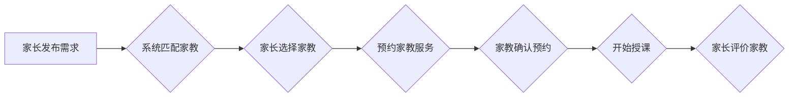

## 1. 背景介绍

### 1.1 家教市场的现状与挑战

随着社会竞争的日益激烈，家长对孩子教育的重视程度越来越高，家教市场也随之蓬勃发展。然而，传统的家教市场存在着信息不对称、资源匹配效率低、管理混乱等问题，给家长和家教双方带来了诸多不便。

### 1.2 信息化解决方案的必要性

为了解决传统家教市场的痛点，信息化解决方案应运而生。家教信息管理系统通过构建一个集中化的平台，将家长、家教和机构连接起来，实现信息共享、资源匹配和流程管理的自动化，从而提高效率，优化体验。

## 2. 核心概念与联系

### 2.1 系统用户角色

家教信息管理系统主要涉及三类用户角色：

* **家长：** 寻求家教服务的用户，可以发布家教需求、筛选家教信息、预约家教服务、评价家教质量等。
* **家教：** 提供家教服务的个人，可以注册个人信息、发布家教简历、接受家长预约、管理授课安排等。
* **机构：** 提供家教服务的组织，可以发布机构信息、管理旗下家教、提供家教培训等。

### 2.2 系统核心功能模块

家教信息管理系统通常包含以下核心功能模块：

* **用户管理：** 包括用户注册、登录、信息管理、权限控制等功能，用于管理系统用户的身份认证和权限分配。
* **信息发布：** 包括家长发布家教需求、家教发布家教简历、机构发布机构信息等功能，用于发布和展示家教相关信息。
* **资源匹配：** 基于家长需求和家教简历，通过算法进行智能匹配，推荐合适的候选家教，提高匹配效率。
* **预约管理：** 包括家长预约家教、家教接受预约、管理授课安排等功能，用于管理家教服务的预约和安排。
* **评价管理：** 包括家长对家教的评价、家教对家长的评价等功能，用于收集和展示家教服务的质量反馈，促进服务质量提升。
* **数据统计：** 包括用户数据、家教数据、机构数据等统计分析功能，用于了解系统运营状况，为决策提供数据支持。

### 2.3  系统架构设计

家教信息管理系统通常采用多层架构设计，例如：

* **展现层：** 负责用户界面展示和交互，可以使用 Web 技术、移动 App 技术等实现。
* **业务逻辑层：** 负责处理业务逻辑，例如用户管理、信息发布、资源匹配、预约管理等，可以使用 Java、Python 等语言实现。
* **数据访问层：** 负责数据库访问和数据持久化，可以使用关系型数据库 MySQL、Oracle 等实现。

## 3. 核心算法原理具体操作步骤

### 3.1 资源匹配算法

家教信息管理系统的核心功能之一是资源匹配，即根据家长的需求和家教的简历，推荐合适的候选家教。资源匹配算法的设计需要考虑多个因素，例如：

* **学科匹配：** 家长需求的学科与家教简历的授课学科是否匹配。
* **年级匹配：** 家长需求的年级与家教简历的授课年级是否匹配。
* **区域匹配：** 家长需求的授课区域与家教简历的授课区域是否匹配。
* **经验匹配：** 家长需求的经验要求与家教简历的授课经验是否匹配。
* **价格匹配：** 家长需求的价格区间与家教简历的授课价格是否匹配。

资源匹配算法可以采用多种策略，例如：

* **基于规则的匹配：** 根据预先设定的规则进行匹配，例如学科、年级、区域必须完全匹配。
* **基于关键词的匹配：**  提取家长需求和家教简历中的关键词，计算关键词的相似度进行匹配。
* **基于机器学习的匹配：** 利用机器学习算法，根据历史数据训练模型，预测家长和家教的匹配程度。

### 3.2 流程图



## 4. 数学模型和公式详细讲解举例说明

### 4.1 基于余弦相似度的关键词匹配算法

**原理：** 将家长需求和家教简历中的关键词转换成向量，计算向量之间的余弦相似度，相似度越高，匹配程度越高。

**公式：**

$$
\text{similarity} = \frac{\mathbf{a} \cdot \mathbf{b}}{\|\mathbf{a}\| \|\mathbf{b}\|}
$$

其中，$\mathbf{a}$ 和 $\mathbf{b}$ 分别表示家长需求和家教简历的关键词向量。

**示例：**

家长需求：小学数学家教

家教简历：小学数学教师，有多年教学经验

* 家长需求关键词向量： [小学，数学，家教]
* 家教简历关键词向量： [小学，数学，教师，多年，教学，经验]

计算余弦相似度：

```python
import numpy as np

a = np.array([1, 1, 1, 0, 0, 0])
b = np.array([1, 1, 0, 1, 1, 1])

similarity = np.dot(a, b) / (np.linalg.norm(a) * np.linalg.norm(b))

print(similarity)  # 输出：0.5773502691896258
```

### 4.2 基于协同过滤的推荐算法

**原理：** 利用用户历史行为数据，计算用户之间的相似度或项目之间的相似度，进行推荐。

**公式：**

* **用户相似度：**

$$
\text{sim}(u, v) = \frac{\sum_{i \in I}(r_{ui} - \bar{r_u})(r_{vi} - \bar{r_v})}{\sqrt{\sum_{i \in I}(r_{ui} - \bar{r_u})^2} \sqrt{\sum_{i \in I}(r_{vi} - \bar{r_v})^2}}
$$

其中，$u$ 和 $v$ 表示用户，$I$ 表示项目集合，$r_{ui}$ 表示用户 $u$ 对项目 $i$ 的评分，$\bar{r_u}$ 表示用户 $u$ 的平均评分。

* **项目相似度：**

$$
\text{sim}(i, j) = \frac{\sum_{u \in U}(r_{ui} - \bar{r_i})(r_{uj} - \bar{r_j})}{\sqrt{\sum_{u \in U}(r_{ui} - \bar{r_i})^2} \sqrt{\sum_{u \in U}(r_{uj} - \bar{r_j})^2}}
$$

其中，$i$ 和 $j$ 表示项目，$U$ 表示用户集合，$r_{ui}$ 表示用户 $u$ 对项目 $i$ 的评分，$\bar{r_i}$ 表示项目 $i$ 的平均评分。

**示例：**

假设有以下用户评分数据：

| 用户 | 项目A | 项目B | 项目C |
|---|---|---|---|
| 用户1 | 5 | 3 | 4 |
| 用户2 | 4 | 2 | 3 |
| 用户3 | 3 | 1 | 2 |

计算用户1和用户2的相似度：

```python
import numpy as np

ratings = np.array([[5, 3, 4],
                   [4, 2, 3],
                   [3, 1, 2]])

u1_ratings = ratings[0]
u2_ratings = ratings[1]

similarity = np.dot(u1_ratings - np.mean(u1_ratings), u2_ratings - np.mean(u2_ratings)) / (np.linalg.norm(u1_ratings - np.mean(u1_ratings)) * np.linalg.norm(u2_ratings - np.mean(u2_ratings)))

print(similarity)  # 输出：0.9999999999999998
```

## 5. 项目实践：代码实例和详细解释说明

### 5.1 技术选型

* **后端框架：** Spring Boot
* **数据库：** MySQL
* **前端框架：** React
* **搜索引擎：** Elasticsearch

### 5.2 代码实例

**用户实体类：**

```java
@Entity
@Table(name = "user")
public class User {

    @Id
    @GeneratedValue(strategy = GenerationType.IDENTITY)
    private Long id;

    @Column(nullable = false, unique = true)
    private String username;

    @Column(nullable = false)
    private String password;

    // ... other fields and methods
}
```

**家教需求实体类：**

```java
@Entity
@Table(name = "tutor_request")
public class TutorRequest {

    @Id
    @GeneratedValue(strategy = GenerationType.IDENTITY)
    private Long id;

    @ManyToOne
    @JoinColumn(name = "user_id", nullable = false)
    private User user;

    @Column(nullable = false)
    private String subject;

    @Column(nullable = false)
    private String grade;

    // ... other fields and methods
}
```

**资源匹配接口：**

```java
public interface TutorMatchingService {

    List<Tutor> matchTutors(TutorRequest request);
}
```

**基于关键词的资源匹配实现类：**

```java
@Service
public class KeywordTutorMatchingServiceImpl implements TutorMatchingService {

    @Autowired
    private TutorRepository tutorRepository;

    @Override
    public List<Tutor> matchTutors(TutorRequest request) {
        // 提取关键词
        List<String> keywords = Arrays.asList(request.getSubject(), request.getGrade());

        // 查询匹配的家教
        return tutorRepository.findByKeywords(keywords);
    }
}
```

### 5.3 部署与测试

* **部署：** 将应用程序打包成 WAR 文件，部署到 Tomcat 服务器。
* **测试：** 编写单元测试和集成测试，确保系统功能正常。

## 6. 实际应用场景

### 6.1 在线家教平台

家教信息管理系统可以用于构建在线家教平台，为家长和家教提供便捷的家教服务。

### 6.2 家教机构管理系统

家教机构可以使用家教信息管理系统管理旗下家教、发布家教信息、安排家教服务等。

### 6.3 学校家教服务平台

学校可以构建家教服务平台，为学生提供家教信息、推荐家教服务等。

## 7. 总结：未来发展趋势与挑战

### 7.1 人工智能技术应用

未来，人工智能技术将在家教信息管理系统中得到更广泛的应用，例如：

* **个性化推荐：** 基于用户画像和历史行为，为用户推荐更精准的家教服务。
* **智能客服：** 利用自然语言处理技术，为用户提供智能化的咨询和解答服务。
* **自动排课：** 基于家教和学生的时间安排，自动生成授课计划。

### 7.2 数据安全与隐私保护

随着家教信息管理系统收集和处理的数据越来越多，数据安全和隐私保护将成为重要的挑战，需要采取有效的措施保障用户数据安全。

### 7.3 行业标准与规范

家教信息管理系统的发展需要行业标准和规范的引导，以促进市场的健康发展和服务质量的提升。

## 8. 附录：常见问题与解答

### 8.1 如何注册成为家教？

访问家教信息管理系统网站，点击“注册”按钮，填写个人信息并提交即可。

### 8.2 如何发布家教需求？

登录家教信息管理系统，点击“发布需求”按钮，填写家教需求信息并提交即可。

### 8.3 如何联系客服？

在家教信息管理系统网站底部可以找到客服联系方式，可以通过电话、邮件等方式联系客服。
