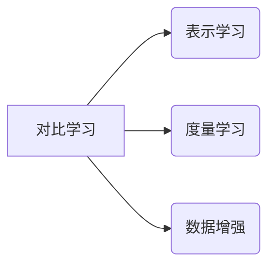
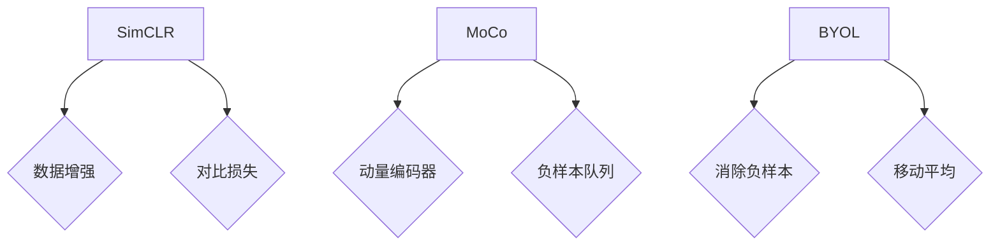

# 对比学习原理与代码实战案例讲解

作者：禅与计算机程序设计艺术

## 1. 背景介绍

### 1.1 对比学习的兴起
#### 1.1.1 深度学习的局限性
#### 1.1.2 无监督学习的重要性
#### 1.1.3 对比学习的优势

### 1.2 对比学习的发展历程 
#### 1.2.1 早期对比学习方法
#### 1.2.2 基于Siamese网络的对比学习
#### 1.2.3 最新的对比学习算法

### 1.3 对比学习的应用领域
#### 1.3.1 计算机视觉中的应用
#### 1.3.2 自然语言处理中的应用
#### 1.3.3 跨领域的应用拓展

## 2. 核心概念与联系

### 2.1 表示学习
#### 2.1.1 什么是表示学习
#### 2.1.2 表示学习的目标
#### 2.1.3 对比学习与表示学习的关系

### 2.2 度量学习
#### 2.2.1 度量学习的定义
#### 2.2.2 度量学习的损失函数
#### 2.2.3 对比学习与度量学习的联系

### 2.3 数据增强
#### 2.3.1 数据增强的意义
#### 2.3.2 常见的数据增强方法
#### 2.3.3 数据增强在对比学习中的应用



## 3. 核心算法原理具体操作步骤

### 3.1 SimCLR算法
#### 3.1.1 数据增强策略
#### 3.1.2 对比损失函数
#### 3.1.3 算法流程

### 3.2 MoCo算法
#### 3.2.1 动量编码器
#### 3.2.2 负样本队列
#### 3.2.3 算法流程

### 3.3 BYOL算法
#### 3.3.1 消除负样本
#### 3.3.2 引入移动平均
#### 3.3.3 算法流程



## 4. 数学模型和公式详细讲解举例说明

### 4.1 InfoNCE损失函数
#### 4.1.1 互信息最大化
#### 4.1.2 噪声对比估计
#### 4.1.3 公式推导与例子

$$
\mathcal{L}_{NCE}=-\log \frac{e^{f(x,y^+)/\tau}}{\sum_{k=1}^N e^{f(x,y_k)/\tau}}
$$

### 4.2 Triplet Loss三元组损失
#### 4.2.1 Anchor-Positive-Negtive
#### 4.2.2 距离度量与边际
#### 4.2.3 公式推导与例子

$$
\mathcal{L}_{triplet} = \max(d(x_a,x_p) - d(x_a,x_n) + m, 0)
$$

### 4.3 Normalized Temperature-scaled Cross Entropy Loss
#### 4.3.1 交叉熵损失
#### 4.3.2 温度参数的作用
#### 4.3.3 公式推导与例子

$$
\mathcal{L}_{NTXent} = -\log \frac{\exp(\text{sim}(z_i, z_j)/\tau)}{\sum_{k=1}^{2N} \mathbbm{1}_{k \neq i} \exp(\text{sim}(z_i, z_k)/\tau)}
$$

## 5. 项目实践：代码实例和详细解释说明

### 5.1 基于PyTorch的SimCLR实现
#### 5.1.1 数据预处理与增强
#### 5.1.2 ResNet编码器
#### 5.1.3 对比损失与训练过程

### 5.2 基于TensorFlow的MoCo实现
#### 5.2.1 数据流水线构建
#### 5.2.2 动量编码器与字典队列
#### 5.2.3 对比损失与训练过程

### 5.3 基于Keras的BYOL实现
#### 5.3.1 数据生成器
#### 5.3.2 在线网络与目标网络
#### 5.3.3 BYOL损失与训练过程

```python
# SimCLR的PyTorch代码片段
class ContrastiveLoss(nn.Module):
    def __init__(self, temperature=0.5):
        super().__init__()
        self.temperature = temperature

    def forward(self, features):
        batch_size = features.shape[0]
        labels = torch.cat([torch.arange(batch_size) for i in range(2)], dim=0)
        labels = (labels.unsqueeze(0) == labels.unsqueeze(1)).float()
        features = F.normalize(features, dim=1)

        similarity_matrix = torch.matmul(features, features.T)
        mask = torch.eye(labels.shape[0], dtype=torch.bool)
        labels = labels[~mask].view(labels.shape[0], -1)
        similarity_matrix = similarity_matrix[~mask].view(similarity_matrix.shape[0], -1)
        
        positives = similarity_matrix[labels.bool()].view(labels.shape[0], -1)
        negatives = similarity_matrix[~labels.bool()].view(similarity_matrix.shape[0], -1)

        logits = torch.cat([positives, negatives], dim=1)
        labels = torch.zeros(logits.shape[0], dtype=torch.long)
        logits = logits / self.temperature

        return logits, labels
```

## 6. 实际应用场景

### 6.1 图像检索
#### 6.1.1 基于内容的图像检索 
#### 6.1.2 对比学习在图像检索中的优势
#### 6.1.3 案例分析

### 6.2 人脸识别
#### 6.2.1 人脸验证与识别任务
#### 6.2.2 对比学习提取判别性特征
#### 6.2.3 案例分析

### 6.3 医学图像分析  
#### 6.3.1 医学图像的特殊性
#### 6.3.2 对比学习处理医学图像的优势
#### 6.3.3 案例分析

## 7. 工具和资源推荐

### 7.1 深度学习框架
#### 7.1.1 PyTorch
#### 7.1.2 TensorFlow
#### 7.1.3 Keras

### 7.2 预训练模型库
#### 7.2.1 TorchVision
#### 7.2.2 TensorFlow Hub
#### 7.2.3 Keras Application

### 7.3 开源实现
#### 7.3.1 SimCLR
#### 7.3.2 MoCo
#### 7.3.3 BYOL

## 8. 总结：未来发展趋势与挑战

### 8.1 对比学习的优势总结
#### 8.1.1 减少有标注数据的依赖
#### 8.1.2 提高模型的泛化能力
#### 8.1.3 可应用于多个领域

### 8.2 对比学习的局限性
#### 8.2.1 对数据增强的依赖
#### 8.2.2 负样本的选择问题 
#### 8.2.3 大规模训练的计算开销

### 8.3 对比学习的未来方向
#### 8.3.1 更高效的训练方式
#### 8.3.2 对抗性学习的结合
#### 8.3.3 多模态对比学习

## 9. 附录：常见问题与解答

### 9.1 对比学习与监督学习的区别？
### 9.2 对比学习需要多少无标签数据？
### 9.3 如何评估对比学习模型的效果？
### 9.4 对比学习训练需要注意哪些问题？ 
### 9.5 对比学习能否应用于时间序列数据？

以上是一个对比学习原理与代码实战讲解的技术博客框架，涵盖了背景知识、核心概念、算法原理、数学模型、代码实践、应用场景、工具推荐、未来展望等内容。在实际撰写中，需要对每个部分进行更详细的阐述和举例说明，同时插入必要的图表、代码片段、数学公式，让读者可以更直观地理解对比学习的原理和实现。撰写过程中要始终以读者为中心，用通俗易懂的语言解释复杂的概念，力求内容的准确性、逻辑性和可读性。