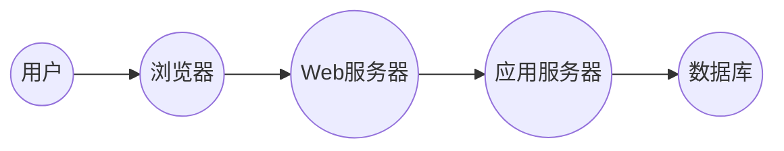

## 1. 背景介绍

### 1.1. 小区电费管理的痛点

传统的电费管理方式存在诸多弊端，例如人工抄表效率低下、易出错，缴费方式单一不便捷，数据统计分析困难等。这些问题不仅增加了管理成本，也给居民生活带来不便。

### 1.2. 系统设计的必要性

为了解决上述问题，小区电费管理系统应运而生。该系统旨在实现电费管理的信息化、自动化和智能化，提高管理效率，方便居民生活，并为决策提供数据支持。

## 2. 核心概念与联系

### 2.1. 用户角色

* **管理员:** 负责系统管理、用户管理、电费设置、数据统计等。
* **业主:** 查看电费信息、在线缴费、历史账单查询等。
* **抄表员:** 使用移动设备录入电表读数。

### 2.2. 功能模块

* **用户管理:**  包括用户注册、登录、信息修改、权限管理等。
* **电表管理:**  包括电表信息录入、修改、删除等。
* **抄表管理:**  包括抄表计划制定、抄表数据录入、异常数据处理等。
* **计费管理:**  包括电费标准设置、阶梯电价计算、电费账单生成等。
* **缴费管理:**  支持多种在线缴费方式，如支付宝、微信支付等。
* **数据统计:**  提供电费收入统计、用电量分析、异常用电监测等功能。

### 2.3. 系统架构

本系统采用B/S架构，前端使用HTML、CSS、JavaScript等技术实现，后端使用Python语言和Django框架，数据库采用MySQL。



## 3. 核心算法原理具体操作步骤

### 3.1. 阶梯电价计算

阶梯电价是指将用电量划分为若干个阶梯，每个阶梯对应不同的电价。本系统采用三级阶梯电价，具体计算方法如下：

* **第一阶梯:** 月用电量小于等于180度的部分，按照0.4883元/度计费。
* **第二阶梯:** 月用电量在181度到400度之间的部分，按照0.5383元/度计费。
* **第三阶梯:** 月用电量超过400度的部分，按照0.7883元/度计费。

### 3.2. 电费账单生成

系统根据抄表数据和阶梯电价计算方法，自动生成每个用户的电费账单，账单内容包括：

* 用户姓名
* 用户地址
* 电表编号
* 上期读数
* 本期读数
* 用电量
* 电费金额
* 缴费状态

## 4. 数学模型和公式详细讲解举例说明

### 4.1. 电费计算公式

$$ 电费 = \sum_{i=1}^{n} (用电量_i \times 电价_i) $$

其中，$n$表示阶梯电价的级数，$用电量_i$表示第$i$阶梯的用电量，$电价_i$表示第$i$阶梯的电价。

### 4.2. 举例说明

假设某用户本月用电量为300度，则其电费计算如下：

* 第一阶梯用电量：180度，电费：180 * 0.4883 = 87.89元
* 第二阶梯用电量：300 - 180 = 120度，电费：120 * 0.5383 = 64.596元
* 总电费：87.89 + 64.596 = 152.486元

## 5. 项目实践：代码实例和详细解释说明

### 5.1. Django模型定义

```python
from django.db import models

class User(models.Model):
    username = models.CharField(max_length=50, unique=True)
    password = models.CharField(max_length=128)
    is_staff = models.BooleanField(default=False)

class Meter(models.Model):
    meter_id = models.CharField(max_length=50, unique=True)
    user = models.ForeignKey(User, on_delete=models.CASCADE)

class Reading(models.Model):
    meter = models.ForeignKey(Meter, on_delete=models.CASCADE)
    reading_date = models.DateField()
    reading_value = models.FloatField()

class Bill(models.Model):
    user = models.ForeignKey(User, on_delete=models.CASCADE)
    bill_date = models.DateField()
    previous_reading = models.FloatField()
    current_reading = models.FloatField()
    consumption = models.FloatField()
    amount = models.FloatField()
    status = models.CharField(max_length=20, default='unpaid')
```

### 5.2. 阶梯电价计算函数

```python
def calculate_bill(consumption):
    """
    根据用电量计算电费
    """
    if consumption <= 180:
        amount = consumption * 0.4883
    elif consumption <= 400:
        amount = 180 * 0.4883 + (consumption - 180) * 0.5383
    else:
        amount = 180 * 0.4883 + 220 * 0.5383 + (consumption - 400) * 0.7883
    return amount
```

### 5.3. 电费账单生成函数

```python
def generate_bill(user, bill_date):
    """
    生成用户电费账单
    """
    meter = Meter.objects.get(user=user)
    readings = Reading.objects.filter(meter=meter).order_by('-reading_date')
    if readings.count() >= 2:
        previous_reading = readings[1].reading_value
        current_reading = readings[0].reading_value
        consumption = current_reading - previous_reading
        amount = calculate_bill(consumption)
        bill = Bill.objects.create(
            user=user,
            bill_date=bill_date,
            previous_reading=previous_reading,
            current_reading=current_reading,
            consumption=consumption,
            amount=amount
        )
        return bill
    else:
        return None
```

## 6. 实际应用场景

### 6.1. 住宅小区

小区电费管理系统可以有效解决传统电费管理方式的弊端，提高管理效率，方便居民生活。

### 6.2. 商业楼宇

系统可以帮助商业楼宇管理者实时监控用电情况，优化用电策略，降低运营成本。

### 6.3. 工业园区

系统可以为工业园区提供精准的用电数据分析，帮助企业优化生产流程，提高能源利用效率。

## 7. 工具和资源推荐

### 7.1. Django框架

Django是一个高级Python Web框架，可以快速开发安全、可维护的网站。

### 7.2. MySQL数据库

MySQL是一个开源的关系型数据库管理系统，性能稳定，功能强大。

### 7.3. Bootstrap前端框架

Bootstrap是一个流行的前端框架，可以快速构建响应式网站。

## 8. 总结：未来发展趋势与挑战

### 8.1. 智能化

未来小区电费管理系统将更加智能化，例如利用人工智能技术实现自动抄表、异常用电检测等功能。

### 8.2. 数据化

系统将更加注重数据分析，为决策提供更精准的数据支持。

### 8.3. 安全性

随着系统功能的不断丰富，安全问题将更加突出，需要加强安全防护措施。

## 9. 附录：常见问题与解答

### 9.1. 如何修改电表信息？

管理员登录系统后，在“电表管理”模块可以修改电表信息。

### 9.2. 如何查看历史账单？

业主登录系统后，在“我的账单”模块可以查看历史账单。

### 9.3. 如何在线缴费？

业主登录系统后，在“缴费”模块可以选择支付宝、微信支付等方式进行在线缴费。
