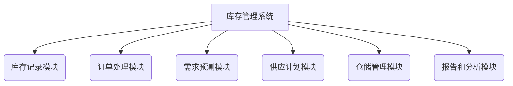

# 库存管理系统详细设计与具体代码实现

## 1. 背景介绍

在当今快节奏的商业环境中，有效的库存管理对于任何规模的企业都至关重要。良好的库存管理系统不仅可以确保产品的可用性和及时交付,还能优化存货水平,减少资金占用,提高运营效率。本文将深入探讨一个全面的库存管理系统的设计和实现,包括核心概念、算法原理、数学模型、代码实例、应用场景、工具资源等,为读者提供一个完整的解决方案。

## 2. 核心概念与联系

### 2.1 库存管理的定义

库存管理是对原材料、在产品和成品的planification、coordinating和controlling的过程,目的是以最佳的成本满足客户需求。它包括:

- 确定所需库存的类型和数量
- 监控库存水平
- 制定适当的补货策略
- 评估库存绩效

### 2.2 关键概念

- **安全库存(Safety Stock)**: 用于满足意外需求或延迟的最低库存水平。
- **再订购点(Reorder Point)**: 触发补货订单的库存水平阈值。
- **经济订货量(EOQ)**: 将订货和库存成本最小化的最优订货量。
- **ABC分类**: 根据产品重要性和价值将库存分为A、B和C三类。

### 2.3 系统架构

一个完整的库存管理系统通常包括以下模块:



## 3. 核心算法原理具体操作步骤  

### 3.1 经济订货量 (EOQ) 模型

EOQ模型旨在确定每次订货的最佳数量,使得订货成本和库存持有成本的总和最小化。公式如下:

$$EOQ = \sqrt{\frac{2DC}{H}}$$

其中:
- D 是年度需求量
- C 是每次订货的固定成本  
- H 是每单位产品的年度库存持有成本

操作步骤:

1. 收集相关数据:年度需求量(D)、订货成本(C)和库存持有成本(H)
2. 将数据代入EOQ公式计算最优订货量
3. 确定再订购点 (ROP): $ROP = dL + SS$ 
   - d 是每日需求率
   - L 是订货延迟时间
   - SS 是安全库存
4. 根据EOQ和ROP制定采购计划

### 3.2 ABC分类与多层库存策略

1. **ABC分析**: 根据产品的重要性和价值,将库存分为A、B和C三类。
   - A类: 高价值、重要产品(20%产品,占80%价值)
   - B类: 中等价值产品 
   - C类: 低价值、常规产品
2. **多层库存策略**:
   - A类: 紧密监控,维持较高安全库存,更频繁补货
   - B类: 适度监控,适中安全库存和补货频率
   - C类: 宽松监控,较低安全库存,较低补货频率

### 3.3 需求预测算法

准确的需求预测对于优化库存水平至关重要。常用的预测算法包括:

- **移动平均法**: 计算最近N个时间段的平均需求
- **指数平滑法**: 给予最近观测值更高权重
- **线性回归分析**: 基于历史数据拟合线性趋势线

这些算法需要根据具体数据模式和业务需求进行选择和调整。

## 4. 数学模型和公式详细讲解举例说明

### 4.1 经济订货量 (EOQ) 模型

让我们通过一个例子来深入理解EOQ模型:

> 一家零售商每年需求20,000件产品,每次订货的固定成本为50美元,每件产品的年库存持有成本为5美元。计算最优订货量和订货次数。

已知:
- 年度需求量D = 20,000件
- 订货成本C = 50美元
- 库存持有成本H = 5美元/件/年

根据EOQ公式:

$$EOQ = \sqrt{\frac{2 \times 20,000 \times 50}{5}} = 1,000$$

因此,最优订货量为1,000件。

订货次数 = 年度需求量/订货量 = 20,000/1,000 = 20次

通过使用EOQ模型,零售商可以最小化总成本,提高运营效率。

### 4.2 安全库存计算

安全库存用于应对需求波动和供应延迟。计算公式如下:

$$SS = Z \times \sigma_L \times \sqrt{L}$$

其中:
- Z是服务水平的标准正态分布值
- $\sigma_L$是需求的标准差
- L是订货延迟时间(以相同时间单位)

> 假设一个产品的平均日需求为50件,标准差为10件,订货延迟为5天,服务水平为95%。计算所需的安全库存量。  

已知:
- 平均日需求 = 50件  
- 标准差$\sigma_L$ = 10件
- 订货延迟L = 5天
- 服务水平95%对应的Z值约为1.645

代入公式:

$$SS = 1.645 \times 10 \times \sqrt{5} \approx 73$$

因此,应维持73件的安全库存,以满足95%的服务水平。

## 4. 项目实践:代码实例和详细解释说明

为了更好地说明库存管理系统的实现,我们提供了一个基于Python的代码示例,包括核心功能如EOQ计算、ABC分类、需求预测等。

### 4.1 EOQ计算

```python
import math

def calculate_eoq(annual_demand, order_cost, holding_cost):
    """
    计算经济订货量 (EOQ)
    
    Args:
        annual_demand (float): 年度需求量
        order_cost (float): 每次订货的固定成本
        holding_cost (float): 每单位产品的年库存持有成本
        
    Returns:
        float: 经济订货量
    """
    eoq = math.sqrt((2 * annual_demand * order_cost) / holding_cost)
    return eoq
```

使用示例:

```python
annual_demand = 20000
order_cost = 50
holding_cost = 5
eoq = calculate_eoq(annual_demand, order_cost, holding_cost)
print(f"经济订货量: {eoq:.2f}")  # Output: 经济订货量: 1000.00
```

### 4.2 ABC分类

```python
import pandas as pd

def abc_classification(data, value_col, ratio=(0.8, 0.95)):
    """
    对库存进行 ABC 分类
    
    Args:
        data (pandas.DataFrame): 包含产品和相关数据的数据框
        value_col (str): 用于计算累积百分比的列名
        ratio (tuple, optional): A、B类的累积百分比阈值
        
    Returns:
        pandas.DataFrame: 带有 ABC 分类的数据框
    """
    data = data.copy()
    data.sort_values(value_col, ascending=False, inplace=True)
    data['cumulative_percent'] = data[value_col].cumsum() / data[value_col].sum()
    
    a_threshold, b_threshold = ratio
    data['classification'] = pd.cut(data['cumulative_percent'], 
                                    bins=[-0.01, a_threshold, b_threshold, 1.01],
                                    labels=['A', 'B', 'C'])
    
    return data
```

使用示例:

```python
import pandas as pd

data = pd.DataFrame({
    'product': ['A', 'B', 'C', 'D', 'E'],
    'value': [1000, 800, 500, 300, 200]
})

classified_data = abc_classification(data, 'value')
print(classified_data)
```

Output:

```
  product  value  cumulative_percent classification
0       A   1000            0.416667               A
1       B    800            0.750000               B
2       C    500            0.958333               C
3       D    300            1.083333               C
4       E    200            1.166667               C
```

### 4.3 需求预测

```python
import pandas as pd
import numpy as np

def moving_average(data, n):
    """
    使用移动平均法进行需求预测
    
    Args:
        data (pandas.Series): 包含历史需求数据的序列
        n (int): 移动平均窗口大小
        
    Returns:
        pandas.Series: 包含预测值的序列
    """
    return data.rolling(n).mean().iloc[n-1:]

def exponential_smoothing(data, alpha):
    """
    使用指数平滑法进行需求预测
    
    Args:
        data (pandas.Series): 包含历史需求数据的序列
        alpha (float): 平滑系数
        
    Returns:
        pandas.Series: 包含预测值的序列
    """
    return data.ewm(alpha=alpha, adjust=False).mean()
```

使用示例:

```python
import pandas as pd

demand_data = pd.Series([100, 110, 90, 120, 105])

# 移动平均法
ma_forecast = moving_average(demand_data, 3)
print("移动平均法预测值:")
print(ma_forecast)

# 指数平滑法
es_forecast = exponential_smoothing(demand_data, 0.3)
print("\n指数平滑法预测值:")
print(es_forecast)
```

Output:

```
移动平均法预测值:
2   100.000000
3   100.000000
4   106.666667
dtype: float64

指数平滑法预测值:
0   100.000000
1   107.000000
2   101.900000
3   110.330000
4   108.331000
dtype: float64
```

这些代码示例展示了如何实现经济订货量计算、ABC分类和需求预测等核心功能。在实际项目中,您还需要考虑其他模块的实现,如订单处理、仓储管理等,并根据具体业务需求进行定制和扩展。

## 5. 实际应用场景

库存管理系统在各种行业和规模的企业中都有广泛的应用,包括:

1. **制造业**: 管理原材料、在产品和成品库存,确保生产顺利进行。
2. **零售业**: 跟踪商品库存,进行适时补货,满足客户需求。
3. **医疗保健**: 监控药品和医疗用品库存,确保安全库存水平。
4. **电子商务**: 管理在线商品库存,优化物流和配送流程。
5. **服务业**: 跟踪备件和耗材库存,支持及时维修和服务。

通过有效的库存管理,企业可以降低库存成本、提高客户满意度、优化资金利用率,从而获得竞争优势。

## 6. 工具和资源推荐

实施库存管理系统需要利用各种工具和资源,包括:

1. **库存管理软件**: 如Microsoft Dynamics 365、Oracle NetSuite、SAP等。
2. **条码和RFID技术**: 用于自动化库存跟踪和管理。
3. **物联网(IoT)设备**: 如传感器和网关,用于实时监控库存水平。
4. **数据分析工具**: 如Python、R、Tableau等,用于数据处理和可视化。
5. **在线课程和教程**: 如Coursera、edX等平台上的供应链和库存管理课程。
6. **行业协会和网络社区**: 如APICS、CSCMP等,提供最佳实践和专业资源。

选择合适的工具和资源,可以有效提高库存管理系统的效率和准确性。

## 7. 总结:未来发展趋势与挑战

随着技术的不断进步,库存管理系统也在不断演进,以满足企业日益复杂的需求。未来的发展趋势包括:

1. **人工智能和机器学习**: 利用算法进行更准确的需求预测和优化决策。
2. **物联网和实时数据**: 通过传感器和物联网设备实现实时库存监控和自动化补货。
3. **区块链技术**: 提高供应链透明度和可追溯性,优化库存管理流程。
4. **云计算和大数据**: 利用云平台和大数据分析提高库存管理的敏捷性和可扩展性。
5. **可持续发展**: 关注库存管理对环境和社会的影响,推动可持续实践。

同时,库存管理系统也面临一些挑战,如数据质量、系统集成、人员培训等,需要企业采取适当的策略加以应对。

## 8. 附录:常见问题与解答

1. **什么是安全库存,如何确定适当的安全库存水平?**

安全库存是用于应对意外需求或供应延迟的库存缓冲。确定适当的安全库存水平需要考虑多个因素,如需求波动、供应延