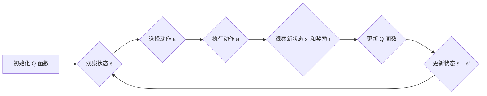

## 1. 背景介绍

### 1.1 强化学习概述

强化学习（Reinforcement Learning，RL）是一种机器学习范式，其中智能体通过与环境交互学习最佳行为策略。与监督学习不同，强化学习不需要预先标记的数据，而是通过试错和奖励机制来学习。智能体在环境中执行动作，并根据动作的结果获得奖励或惩罚，从而逐步优化其行为策略。

### 1.2 Q-learning 的起源与发展

Q-learning 是一种经典的强化学习算法，由 Watkins 于 1989 年提出。它是一种基于值的学习方法，通过学习状态-动作值函数（Q 函数）来评估在特定状态下采取特定动作的价值。Q-learning 算法简单、易于实现，并且在许多应用中取得了成功，例如游戏、机器人控制、推荐系统等。

## 2. 核心概念与联系

### 2.1 智能体与环境

强化学习的核心要素是智能体（Agent）和环境（Environment）。智能体是学习者和决策者，它通过与环境交互来学习最佳行为策略。环境是智能体所处的外部世界，它包含状态、动作和奖励。

### 2.2 状态、动作和奖励

* **状态（State）**：描述环境当前状况的信息，例如游戏中的棋盘布局、机器人所在的位置等。
* **动作（Action）**：智能体可以执行的操作，例如游戏中的移动棋子、机器人移动的方向等。
* **奖励（Reward）**：环境对智能体动作的反馈，可以是正面的（奖励）或负面的（惩罚）。

### 2.3 状态-动作值函数（Q 函数）

Q 函数是 Q-learning 算法的核心，它是一个映射，将状态-动作对映射到预期累积奖励。Q(s, a) 表示在状态 s 下采取动作 a 的预期累积奖励。

### 2.4 策略

策略是智能体根据当前状态选择动作的规则。最优策略是指能够最大化预期累积奖励的策略。

## 3. 核心算法原理具体操作步骤

### 3.1 Q-learning 算法流程

Q-learning 算法的基本流程如下：

1. 初始化 Q 函数，通常将所有 Q 值初始化为 0。
2. 循环执行以下步骤，直到达到终止条件：
    * 观察当前状态 s。
    * 根据当前策略选择动作 a。
    * 执行动作 a，并观察新的状态 s' 和奖励 r。
    * 更新 Q 函数：
        $$Q(s, a) \leftarrow Q(s, a) + \alpha [r + \gamma \max_{a'} Q(s', a') - Q(s, a)]$$
    * 更新状态：s = s'。

### 3.2 参数说明

* $\alpha$：学习率，控制 Q 函数更新的速度。
* $\gamma$：折扣因子，用于平衡当前奖励和未来奖励的重要性。

### 3.3 算法流程图



## 4. 数学模型和公式详细讲解举例说明

### 4.1 Q 函数更新公式

Q-learning 算法的核心是 Q 函数更新公式：

$$Q(s, a) \leftarrow Q(s, a) + \alpha [r + \gamma \max_{a'} Q(s', a') - Q(s, a)]$$

该公式表示，在状态 s 下采取动作 a 后，Q(s, a) 的更新值由以下三部分组成：

* **当前 Q 值**：Q(s, a)
* **学习率**：$\alpha$
* **时间差项**：[r + \gamma \max_{a'} Q(s', a') - Q(s, a)]

时间差项表示当前 Q 值与目标 Q 值之间的差距。目标 Q 值由两部分组成：

* **立即奖励**：r
* **未来最大 Q 值的折扣值**：$\gamma \max_{a'} Q(s', a')$

### 4.2 举例说明

假设有一个简单的游戏，智能体可以在两个状态之间移动：状态 A 和状态 B。在状态 A，智能体可以采取动作 "左" 或 "右"，在状态 B，智能体只能采取动作 "左"。奖励函数如下：

* 在状态 A 采取动作 "左" 到达状态 B，奖励为 1。
* 在状态 A 采取动作 "右" 停留在状态 A，奖励为 0。
* 在状态 B 采取动作 "左" 到达状态 A，奖励为 -1。

假设学习率 $\alpha$ 为 0.1，折扣因子 $\gamma$ 为 0.9。

初始 Q 函数为：

```
Q(A, 左) = 0
Q(A, 右) = 0
Q(B, 左) = 0
```

假设智能体在状态 A 采取动作 "左" 到达状态 B，获得奖励 1。更新后的 Q 函数为：

```
Q(A, 左) = 0 + 0.1 * [1 + 0.9 * max(Q(B, 左)) - 0] = 0.1
Q(A, 右) = 0
Q(B, 左) = 0
```

## 5. 项目实践：代码实例和详细解释说明

### 5.1 Python 代码实现

```python
import numpy as np

# 定义状态和动作
states = ['A', 'B']
actions = ['左', '右']

# 定义奖励函数
rewards = {
    ('A', '左'): 1,
    ('A', '右'): 0,
    ('B', '左'): -1
}

# 定义 Q 函数
Q = {}
for s in states:
    for a in actions:
        Q[(s, a)] = 0

# 定义学习率和折扣因子
alpha = 0.1
gamma = 0.9

# Q-learning 算法
for episode in range(1000):
    # 初始化状态
    state = np.random.choice(states)

    # 循环执行以下步骤，直到达到终止条件
    while True:
        # 选择动作
        action = np.random.choice(actions)

        # 执行动作，并观察新的状态和奖励
        if state == 'A':
            if action == '左':
                next_state = 'B'
            else:
                next_state = 'A'
        else:
            next_state = 'A'
        reward = rewards[(state, action)]

        # 更新 Q 函数
        Q[(state, action)] += alpha * (reward + gamma * max(Q[(next_state, a)] for a in actions) - Q[(state, action)])

        # 更新状态
        state = next_state

        # 终止条件
        if state == 'B':
            break

# 打印 Q 函数
print(Q)
```

### 5.2 代码解释

* 首先，定义状态、动作、奖励函数、Q 函数、学习率和折扣因子。
* 然后，使用循环模拟多个 episode 的 Q-learning 学习过程。
* 在每个 episode 中，随机初始化状态，并循环执行以下步骤：
    * 随机选择动作。
    * 根据当前状态和动作，确定新的状态和奖励。
    * 使用 Q 函数更新公式更新 Q 函数。
    * 更新状态。
    * 当状态达到终止状态时，结束循环。
* 最后，打印学习到的 Q 函数。

## 6. 实际应用场景

### 6.1 游戏

Q-learning 算法在游戏领域有着广泛的应用，例如：

* **Atari 游戏**：DeepMind 使用深度 Q 网络（DQN）算法，成功地训练了能够玩 Atari 游戏的智能体，并超越了人类玩家的水平。
* **围棋**：AlphaGo 和 AlphaZero 等围棋程序也使用了 Q-learning 算法，实现了对人类顶尖棋手的超越。

### 6.2 机器人控制

Q-learning 算法可以用于机器人控制，例如：

* **路径规划**：Q-learning 算法可以用于训练机器人学习在复杂环境中找到最佳路径。
* **抓取操作**：Q-learning 算法可以用于训练机器人学习如何抓取不同形状和大小的物体。

### 6.3 推荐系统

Q-learning 算法可以用于推荐系统，例如：

* **个性化推荐**：Q-learning 算法可以用于学习用户的偏好，并推荐用户可能感兴趣的商品或内容。
* **广告推荐**：Q-learning 算法可以用于学习用户的点击行为，并推荐用户可能点击的广告。

## 7. 工具和资源推荐

### 7.1 OpenAI Gym

OpenAI Gym 是一个用于开发和比较强化学习算法的工具包，它提供了各种各样的环境，例如经典控制问题、Atari 游戏、机器人模拟器等。

### 7.2 TensorFlow Agents

TensorFlow Agents 是一个用于构建和训练强化学习智能体的库，它提供了各种各样的算法实现，例如 DQN、PPO、A2C 等。

### 7.3 Stable Baselines3

Stable Baselines3 是一个基于 PyTorch 的强化学习库，它提供了各种各样的算法实现，例如 DQN、PPO、A2C 等，并提供了易于使用的 API。

## 8. 总结：未来发展趋势与挑战

### 8.1 未来发展趋势

* **深度强化学习**：将深度学习与强化学习相结合，可以处理更复杂的状态和动作空间。
* **多智能体强化学习**：研究多个智能体在同一环境中相互交互和学习的算法。
* **强化学习的应用**：将强化学习应用于更广泛的领域，例如医疗、金融、交通等。

### 8.2 挑战

* **样本效率**：强化学习算法通常需要大量的样本才能学习到有效的策略。
* **泛化能力**：强化学习算法在新的环境中可能无法很好地泛化。
* **安全性**：强化学习算法可能会学习到不安全或不可预测的行为。

## 9. 附录：常见问题与解答

### 9.1 Q-learning 算法的优缺点

**优点**：

* 简单、易于实现。
* 在许多应用中取得了成功。

**缺点**：

* 对于大型状态和动作空间，效率较低。
* 容易受到探索-利用困境的影响。

### 9.2 如何选择学习率和折扣因子

学习率和折扣因子是 Q-learning 算法的重要参数，它们的选择会影响算法的收敛速度和最终性能。

* 学习率通常设置为一个较小的值，例如 0.1 或 0.01。
* 折扣因子通常设置为一个接近 1 的值，例如 0.9 或 0.99。

### 9.3 如何解决探索-利用困境

探索-利用困境是指在强化学习中，智能体需要在探索新的状态和动作与利用已知信息之间进行权衡。

解决探索-利用困境的方法包括：

* $\epsilon$-greedy 策略
* 上置信界（UCB）算法
* 汤普森采样
