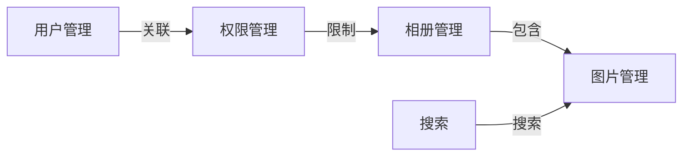

## 1.背景介绍
在现代校园信息化的背景下，数据的管理与利用成为了一项重要的任务。其中，校园相册管理系统是一种常见的应用，它能够有效地管理和展示学校的各种活动照片，为学校的宣传与教学提供强有力的支持。这种系统的设计与实现涉及到许多计算机科学中的基础知识，包括数据结构、算法、数据库技术、网络编程、图像处理等。

## 2.核心概念与联系
校园相册管理系统主要由以下几个模块组成：用户管理模块、相册管理模块、图片管理模块、权限管理模块和搜索模块。其中：

用户管理模块主要负责用户的注册、登录、修改个人信息等功能。

相册管理模块主要负责创建相册、编辑相册、删除相册等功能。

图片管理模块主要负责图片的上传、下载、编辑、删除等功能。

权限管理模块主要负责用户权限的设置与验证。

搜索模块主要负责对相册和图片进行搜索。

这些模块之间的关系可以用下面的Mermaid流程图来表示：



## 3.核心算法原理具体操作步骤
在校园相册管理系统中，我们采用了一些核心的算法。比如，在搜索模块中，我们使用了倒排索引来提高搜索效率；在图片管理模块中，我们使用了哈希算法来防止图片的重复上传。

### 3.1 倒排索引
倒排索引是一种常用于信息检索系统的数据结构，它将文档中出现的单词与包含这个单词的文档列表关联起来，从而能够快速地在大量文档中找到包含指定单词的文档。

对于我们的系统，我们可以将每个相册或者图片的描述看作一个文档，将其中的单词提取出来建立倒排索引。当用户进行搜索时，我们只需要在倒排索引中查找用户输入的单词，就能快速地找到包含这个单词的相册或者图片。

### 3.2 哈希算法
哈希算法可以将任意长度的输入通过散列过程转换成固定长度的输出，这个过程是不可逆的。在我们的系统中，我们可以将上传的图片通过哈希算法转换成一个唯一的哈希值，然后将这个哈希值作为图片在数据库中的唯一标识。当用户再次上传相同的图片时，我们只需要比较哈希值，就可以防止图片的重复上传。

## 4.数学模型和公式详细讲解举例说明
在这里，我们以哈希算法为例，来详细讲解其数学模型和公式。

哈希算法的数学模型可以表示为一个函数 $h$，它接受一个输入 $x$，产生一个固定长度的输出 $y$，即 $y=h(x)$。在理想情况下，不同的输入 $x$ 应该产生不同的输出 $y$，但在实际情况下，由于输出的长度是固定的，所以可能存在不同的输入产生相同的输出，这种情况称为哈希冲突。

对于一种常见的哈希算法MD5，它的输出长度是128位，所以理论上它可以产生 $2^{128}$ 个不同的输出。如果我们假设一个图片文件的大小是1MB，那么所有可能的图片文件的数量是 $2^{8*1024*1024}$。由鸽巢原理，当图片文件的数量超过 $2^{128}$ 时，就一定存在不同的图片文件产生相同的MD5值。然而，$2^{8*1024*1024}$ 远大于 $2^{128}$，所以在实际情况下，哈希冲突是无法避免的。

然而，由于哈希冲突的概率非常小，所以在实际应用中，我们通常忽略这种情况。我们可以用下面的公式来估计哈希冲突的概率：

设 $n$ 是输入的数量，$m$ 是输出的数量，$p$ 是哈希冲突的概率，那么有：
$$
p = 1 - \prod_{i=0}^{n-1} \frac{m-i}{m}
$$

当 $n \ll m$ 时，我们可以用泊松分布来近似这个公式：
$$
p \approx \frac{n^2}{2m}
$$

对于MD5算法，如果我们每天处理1亿张图片，那么一年后，哈希冲突的概率约为 $10^{-18}$，这个概率非常小，所以我们可以忽略哈希冲突的存在。

## 4.项目实践：代码实例和详细解释说明
在这个部分，我们以用户管理模块为例，展示一些具体的代码实例，并进行详细的解释说明。

用户管理模块主要包括用户的注册和登录两个功能，我们使用Python的Django框架来实现这个模块。

首先，我们需要定义用户的数据模型，如下所示：

```python
from django.contrib.auth.models import AbstractUser
from django.db import models

class User(AbstractUser):
    mobile = models.CharField(max_length=11, unique=True, blank=True)
    avatar = models.ImageField(upload_to='avatar/%Y%m%d/', blank=True)
    user_desc = models.CharField(max_length=500, blank=True)
```

在这个模型中，我们继承了Django提供的AbstractUser类，添加了mobile、avatar和user_desc三个字段，分别表示用户的手机号、头像和个人简介。

然后，我们定义注册和登录的视图函数，如下所示：

```python
from django.contrib.auth import authenticate, login
from django.http import JsonResponse
from django.views import View
from .models import User

class RegisterView(View):
    def post(self, request):
        username = request.POST.get('username')
        password = request.POST.get('password')
        mobile = request.POST.get('mobile')
        user = User.objects.create_user(username=username, password=password, mobile=mobile)
        return JsonResponse({'message': '注册成功'})

class LoginView(View):
    def post(self, request):
        username = request.POST.get('username')
        password = request.POST.get('password')
        user = authenticate(username=username, password=password)
        if user is not None:
            login(request, user)
            return JsonResponse({'message': '登录成功'})
        else:
            return JsonResponse({'message': '用户名或密码错误'})
```

在RegisterView中，我们接收用户的用户名、密码和手机号，然后调用Django提供的create_user方法创建一个新的用户。

在LoginView中，我们接收用户的用户名和密码，然后调用Django提供的authenticate方法验证用户名和密码，如果验证通过，我们调用login方法登录用户，否则返回错误信息。

## 5.实际应用场景
校园相册管理系统可以应用到各种场景中，例如：

学校宣传：通过展示学校的各种活动照片，增强学校的形象，吸引更多的学生和家长。

教学辅助：教师可以上传与课程相关的图片，帮助学生更好地理解课程内容。

社团活动：社团可以上传活动照片，记录社团的发展历程，增强社团的凝聚力。

毕业纪念：毕业生可以上传毕业照片，作为毕业纪念。

## 6.工具和资源推荐
在开发校园相册管理系统时，我们使用了以下工具和资源：

Python：一种易于学习且功能强大的编程语言。

Django：一种基于Python的开源Web开发框架。

MySQL：一种广泛使用的关系数据库管理系统。

Bootstrap：一种开源的前端开发框架。

jQuery：一种快速、小型且功能丰富的JavaScript库。

## 7.总结：未来发展趋势与挑战
随着信息技术的发展，校园相册管理系统面临着新的发展趋势与挑战：

趋势：

云存储：随着云计算的发展，更多的图片将被存储在云端，这提高了存储的可扩展性和可用性。

人工智能：人工智能可以用于图片的分类、标记和搜索，提高了系统的智能化程度。

社交媒体：校园相册管理系统可以与社交媒体进行集成，提高了系统的社交性。

挑战：

安全性：随着网络攻击的增多，如何保护用户的隐私和数据安全成为了一个重要的挑战。

性能：随着用户数量和数据量的增大，如何保证系统的性能成为了一个重要的挑战。

可用性：随着用户需求的多样化，如何提高系统的易用性和满足用户需求成为了一个重要的挑战。

## 8.附录：常见问题与解答
Q1：如何防止恶意用户上传不适当的图片？

A1：我们可以使用人工智能技术对上传的图片进行审核，识别出不适当的图片并进行拦截。同时，我们也需要提供一个举报机制，让用户可以举报不适当的图片。

Q2：如何处理大量的图片上传请求？

A2：我们可以使用云存储服务来存储图片，这样可以提高存储的可扩展性。同时，我们也可以使用负载均衡技术来分散用户的上传请求，保证系统的稳定性。

Q3：如何提高搜索的效率？

A3：我们可以使用倒排索引来提高搜索的效率。同时，我们也可以使用缓存技术来存储热门的搜索结果，减少数据库的查询次数。

Q4：如何保护用户的隐私？

A4：我们需要对用户的数据进行加密，保护用户的隐私。同时，我们也需要提供一个权限管理系统，让用户可以设置谁可以查看他们的相册。

Q5：如何处理哈希冲突？

A5：虽然哈希冲突的概率非常小，但我们仍然需要对其进行处理。一种常见的处理方法是使用链表来存储冲突的数据，这种方法被称为链地址法。