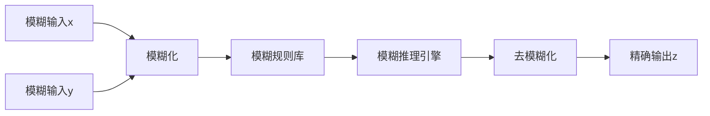

# 模糊专家系统：处理不确定性

## 1. 背景介绍

### 1.1 不确定性的挑战

在现实世界中,我们经常面临着不确定性的挑战。无论是天气预报、医疗诊断还是金融投资,都存在着一定程度的不确定性和模糊性。传统的基于精确逻辑和二元思维的计算机系统很难有效地处理这种不确定性,因为它们要求输入和输出都是精确的数值或布尔值。

### 1.2 模糊逻辑的兴起

为了解决这一问题,20世纪70年代,伊朗裔美国计算机科学家Lotfi A. Zadeh提出了模糊逻辑(Fuzzy Logic)的概念。模糊逻辑旨在用数学的方式来模拟人类处理模糊信息和不确定性的能力,从而使计算机系统能够更好地处理现实世界中的模糊性和不确定性。

### 1.3 模糊专家系统的重要性

模糊专家系统(Fuzzy Expert System)是将模糊逻辑与专家系统相结合的一种智能系统。它能够处理不精确、不完整或者不确定的信息,并基于人类专家的经验和知识进行推理和决策。模糊专家系统在许多领域得到了广泛应用,如控制系统、决策支持系统、数据挖掘等。

## 2. 核心概念与联系

### 2.1 模糊集合理论

模糊集合理论是模糊逻辑的基础。在classical集合理论中,一个元素要么完全属于一个集合,要么完全不属于。而在模糊集合理论中,一个元素可以部分地属于一个集合,用一个介于0和1之间的数值来表示其隶属程度。

$$
\mu_A(x): X \rightarrow [0, 1]
$$

其中, $\mu_A(x)$ 表示元素 $x$ 对模糊集合 $A$ 的隶属程度。

### 2.2 模糊逻辑运算

与经典布尔逻辑不同,模糊逻辑使用模糊运算来处理不确定性。常用的模糊运算包括:

- 模糊与(Fuzzy AND): $\mu_{A \cap B}(x) = \min(\mu_A(x), \mu_B(x))$
- 模糊或(Fuzzy OR): $\mu_{A \cup B}(x) = \max(\mu_A(x), \mu_B(x))$
- 模糊补(Fuzzy Complement): $\mu_{\neg A}(x) = 1 - \mu_A(x)$

### 2.3 模糊推理

模糊推理是模糊专家系统的核心,它通过模糊规则和模糊推理机制来进行推理和决策。常见的模糊推理方法有:

- Mamdani模糊推理
- Sugeno模糊推理
- Tsukamoto模糊推理

### 2.4 模糊化和去模糊化

模糊化(Fuzzification)是将精确输入值转换为模糊值的过程。去模糊化(Defuzzification)则是将模糊输出值转换为精确值的过程。常用的去模糊化方法有重心法、平均最大法等。

## 3. 核心算法原理具体操作步骤 

### 3.1 Mamdani模糊推理

Mamdani模糊推理是最常用的模糊推理方法之一,它的步骤如下:

1. **模糊化输入变量**
   - 确定输入变量的模糊集合
   - 计算每个输入值在对应模糊集合中的隶属度

2. **应用模糊运算**
   - 构建模糊规则库
   - 对每条规则,根据输入值的隶属度计算规则的激活度

3. **模糊规则评估**
   - 对于每个输出模糊集合,计算其联合隶属函数

4. **去模糊化** 
   - 将模糊输出转换为精确输出值,通常使用重心法

例如,一个简单的两输入一输出的Mamdani模糊推理系统:



### 3.2 Sugeno模糊推理

Sugeno模糊推理的输出是一个常量或线性方程,而不是模糊集合。它的步骤如下:

1. **模糊化输入变量**
2. **应用模糊运算得到每条规则的激活度**  
3. **计算每条规则的输出**
   - 对于常量输出: $z = k$
   - 对于线性输出: $z = ax + by + c$
4. **计算最终输出**
   - 对所有规则输出加权平均

Sugeno推理的优点是计算效率高,缺点是不够直观。

### 3.3 自适应模糊推理

传统的模糊推理系统需要人工指定模糊规则和隶属函数,这需要大量的专家知识。自适应模糊推理系统可以通过机器学习算法自动生成或调整模糊规则和隶属函数,提高系统的自适应性。

常用的自适应模糊推理方法包括:

- 基于神经网络的自适应模糊推理(ANFIS)
- 基于粒子群优化的自适应模糊推理
- 基于进化算法的自适应模糊推理

## 4. 数学模型和公式详细讲解举例说明

### 4.1 三角形模糊集

三角形模糊集是最常用的模糊集之一,它由三个参数 $(a, b, c)$ 定义,其隶属函数为:

$$
\mu(x; a, b, c) = \max\left(\min\left(\frac{x-a}{b-a}, \frac{c-x}{c-b}\right), 0\right)
$$

其中 $a$ 和 $c$ 分别是三角形的左右脚, $b$ 是三角形的顶点。

<center>
    
</center>

例如,对于一个描述"年龄"的模糊变量,我们可以定义三个模糊集"年轻"、"中年"和"老年":

- 年轻: (0, 0, 30)
- 中年: (25, 45, 65)  
- 老年: (60, 90, 90)

则一个年龄为35岁的人属于"年轻"的隶属度为0,属于"中年"的隶属度为0.5,属于"老年"的隶属度为0。

### 4.2 高斯模糊集

高斯模糊集的隶属函数由均值 $\mu$ 和标准差 $\sigma$ 定义:

$$
\mu(x; \mu, \sigma) = e^{-\frac{1}{2}\left(\frac{x-\mu}{\sigma}\right)^2}
$$

高斯模糊集常用于表示连续的模糊概念,如温度、压力等。

<center>
    
</center>

例如,对于一个描述"温度"的模糊变量,我们可以定义三个模糊集"冷"、"温暖"和"热":

- 冷: (10, 5)
- 温暖: (25, 5)
- 热: (40, 5)

则一个温度为30摄氏度的环境属于"冷"的隶属度为0.12,属于"温暖"的隶属度为0.61,属于"热"的隶属度为0.24。

### 4.3 Mamdani模糊推理实例

假设我们有一个控制冰箱温度的模糊系统,输入变量为"外界温度"和"食物数量",输出变量为"制冷强度"。

1. **模糊化输入变量**

   - 外界温度:
     - 低温: (0, 0, 15)
     - 室温: (10, 20, 30)
     - 高温: (25, 35, 35)
   - 食物数量:
     - 少: (0, 0, 30)
     - 中等: (20, 50, 80)
     - 多: (70, 100, 100)

   假设外界温度为25摄氏度,食物数量为60公斤。则隶属度为:

   - 外界温度: 
     - 低温: 0
     - 室温: 0.75  
     - 高温: 0.29
   - 食物数量:
     - 少: 0
     - 中等: 0.67
     - 多: 0.33
    
2. **模糊规则库**

   - 如果 (外界温度是低温) 且 (食物数量是少) 则 (制冷强度是低)
   - 如果 (外界温度是室温) 且 (食物数量是中等) 则 (制冷强度是中等)  
   - 如果 (外界温度是高温) 且 (食物数量是多) 则 (制冷强度是高)
   - ...

   假设制冷强度的模糊集为:
     - 低: (0, 0, 30)
     - 中等: (20, 50, 80)
     - 高: (70, 100, 100)
    
3. **模糊规则评估**

   对于规则"如果外界温度是室温且食物数量是中等则制冷强度是中等":
   - 前件激活度 = min(0.75, 0.67) = 0.67
   - 输出模糊集隶属度 = 0.67

   最终输出模糊集为:
   
   <center>
       
   </center>

4. **去模糊化**

   使用重心法去模糊化,得到最终输出为制冷强度60。

通过上述实例,我们可以看到Mamdani模糊推理是如何将模糊输入映射到模糊输出,并最终得到精确输出的过程。

## 5. 项目实践:代码实例和详细解释说明

以下是一个使用Python和scikit-fuzzy库实现的简单Mamdani模糊推理系统的示例:

```python
import numpy as np
import skfuzzy as fuzz

# 定义输入变量的模糊集
x_temperature = np.arange(0, 41, 1)
x_foodqty = np.arange(0, 101, 1)

temperature_low = fuzz.trimf(x_temperature, [0, 0, 15])
temperature_med = fuzz.trimf(x_temperature, [10, 20, 30])
temperature_high = fuzz.trimf(x_temperature, [25, 35, 35])

foodqty_low = fuzz.trimf(x_foodqty, [0, 0, 30])
foodqty_med = fuzz.trimf(x_foodqty, [20, 50, 80])  
foodqty_high = fuzz.trimf(x_foodqty, [70, 100, 100])

# 定义输出变量的模糊集
x_coolingval = np.arange(0, 101, 1)

cooling_low = fuzz.trimf(x_coolingval, [0, 0, 30])
cooling_med = fuzz.trimf(x_coolingval, [20, 50, 80])
cooling_high = fuzz.trimf(x_coolingval, [70, 100, 100])

# 建立模糊规则
rule1 = np.fmax(np.fmin(temperature_low, foodqty_low), cooling_low)
rule2 = np.fmax(np.fmin(temperature_med, foodqty_med), cooling_med)
rule3 = np.fmax(np.fmin(temperature_high, foodqty_high), cooling_high)

# 计算输出模糊集
output = np.fmax(rule1, np.fmax(rule2, rule3))

# 去模糊化
coolingval = fuzz.defuzz(x_coolingval, output, 'centroid')

print(f"Cooling value: {coolingval:.2f}")
```

上述代码定义了输入变量"外界温度"和"食物数量"的三角形模糊集,以及输出变量"制冷强度"的三角形模糊集。

接下来,我们使用np.fmin和np.fmax函数构建了三条模糊规则,分别对应于低温、室温和高温情况。

然后,我们使用np.fmax函数计算输出模糊集,即三条规则的并集。

最后,我们使用fuzz.defuzz函数对输出模糊集进行去模糊化,得到最终的"制冷强度"输出值。

该示例展示了如何使用Python和scikit-fuzzy库快速构建一个简单的模糊推理系统。在实际应用中,我们可以根据需要调整模糊集的形状、规则的数量和复杂度,以及去模糊化的方法。

## 6. 实际应用场景

模糊