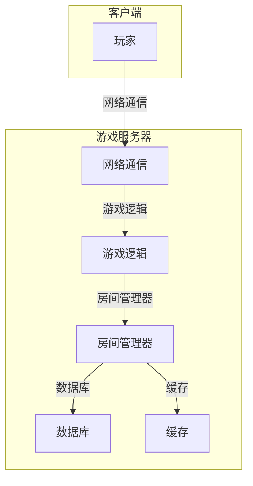

##  泡泡堂网络游戏系统详细设计与具体代码实现

**作者：禅与计算机程序设计艺术**

## 1. 背景介绍

### 1.1 泡泡堂游戏概述

泡泡堂是一款经典的休闲竞技类网络游戏，玩家操控角色在游戏地图中放置炸弹，炸毁障碍物，攻击对手，最终取得胜利。游戏以其简单的规则、可爱的角色、刺激的玩法，吸引了无数玩家的喜爱。

### 1.2 系统设计目标

本系统的设计目标是实现一个功能完善、性能稳定的泡泡堂网络游戏服务器，能够支持多人同时在线游戏，并提供良好的游戏体验。

### 1.3 技术选型

本系统采用Java语言开发，使用Netty框架实现网络通信，使用MySQL数据库存储游戏数据，使用Redis缓存加速数据访问。

## 2. 核心概念与联系

### 2.1 游戏对象

*   **玩家:**  参与游戏的用户，拥有唯一的ID、昵称、角色形象等属性。
*   **地图:**  游戏进行的场所，由多个格子组成，每个格子可以放置障碍物、炸弹、道具等。
*   **炸弹:**  玩家放置的攻击性道具，可以炸毁障碍物、攻击对手。
*   **道具:**  地图中随机出现的物品，可以增强玩家的能力，例如加速、增加炸弹数量等。

### 2.2 游戏流程

1.  玩家登录游戏服务器，选择游戏房间。
2.  服务器创建游戏房间，将玩家分配到房间中。
3.  玩家在房间中进行游戏，放置炸弹、攻击对手。
4.  当一方玩家所有角色都被消灭时，游戏结束。

### 2.3 系统架构



## 3. 核心算法原理具体操作步骤

### 3.1 地图生成算法

*   **随机地图生成:**  根据预设的地图模板，随机生成障碍物、道具的位置。
*   **自定义地图编辑:**  允许玩家自定义地图，设置障碍物、道具的分布。

### 3.2 炸弹爆炸算法

*   **爆炸范围计算:**  根据炸弹的威力，计算爆炸范围内的格子。
*   **障碍物破坏:**  炸毁爆炸范围内的障碍物。
*   **玩家伤害计算:**  对爆炸范围内的玩家造成伤害。

### 3.3 道具效果实现

*   **加速道具:**  增加玩家的移动速度。
*   **炸弹数量增加道具:**  增加玩家可以放置的炸弹数量。
*   **炸弹威力增加道具:**  增加炸弹的爆炸范围。

## 4. 数学模型和公式详细讲解举例说明

### 4.1 炸弹爆炸范围计算

假设炸弹的威力为 $n$，则爆炸范围为以炸弹位置为中心，半径为 $n$ 的圆形区域。

```
圆形区域面积 = π * n^2
```

### 4.2 玩家伤害计算

假设玩家与炸弹的距离为 $d$，炸弹的威力为 $n$，则玩家受到的伤害为：

```
伤害 = n - d
```

## 5. 项目实践：代码实例和详细解释说明

### 5.1 玩家移动

```java
// 玩家移动
public void move(Direction direction) {
    // 获取玩家当前位置
    int x = this.getX();
    int y = this.getY();

    // 根据移动方向计算新的位置
    switch (direction) {
        case UP:
            y--;
            break;
        case DOWN:
            y++;
            break;
        case LEFT:
            x--;
            break;
        case RIGHT:
            x++;
            break;
    }

    // 检查新位置是否合法
    if (isValidPosition(x, y)) {
        // 更新玩家位置
        this.setX(x);
        this.setY(y);
    }
}

// 检查位置是否合法
private boolean isValidPosition(int x, int y) {
    // 检查是否在地图范围内
    if (x < 0 || x >= map.getWidth() || y < 0 || y >= map.getHeight()) {
        return false;
    }

    // 检查是否与障碍物碰撞
    if (map.isObstacle(x, y)) {
        return false;
    }

    return true;
}
```

### 5.2 炸弹放置

```java
// 放置炸弹
public void placeBomb() {
    // 获取玩家当前位置
    int x = this.getX();
    int y = this.getY();

    // 检查是否可以放置炸弹
    if (canPlaceBomb(x, y)) {
        // 创建炸弹对象
        Bomb bomb = new Bomb(x, y, this.getBombPower());

        // 将炸弹添加到地图中
        map.addBomb(bomb);

        // 减少玩家可放置的炸弹数量
        this.decreaseBombCount();
    }
}

// 检查是否可以放置炸弹
private boolean canPlaceBomb(int x, int y) {
    // 检查该位置是否已经有炸弹
    if (map.hasBomb(x, y)) {
        return false;
    }

    // 检查玩家是否还有可放置的炸弹
    if (this.getBombCount() <= 0) {
        return false;
    }

    return true;
}
```

## 6. 实际应用场景

### 6.1 在线游戏平台

泡泡堂游戏可以作为在线游戏平台的一部分，为用户提供休闲娱乐服务。

### 6.2 教育教学

泡泡堂游戏可以作为编程教学的案例，帮助学生理解游戏开发的基本原理。

## 7. 工具和资源推荐

### 7.1 Netty框架

Netty是一个异步事件驱动的网络应用程序框架，用于快速开发可维护的高性能协议服务器和客户端。

### 7.2 MySQL数据库

MySQL是一个开源的关系型数据库管理系统，广泛应用于Web应用程序开发。

### 7.3 Redis缓存

Redis是一个开源的内存数据结构存储，用作数据库、缓存和消息代理。

## 8. 总结：未来发展趋势与挑战

### 8.1 趋势

*   **移动化:**  将泡泡堂游戏移植到移动平台，方便用户随时随地进行游戏。
*   **3D化:**  将泡泡堂游戏升级为3D版本，提供更加逼真的游戏体验。
*   **AI对战:**  引入人工智能技术，开发可以与玩家进行对战的AI角色。

### 8.2 挑战

*   **网络延迟:**  网络延迟会影响游戏的流畅度，需要优化网络通信效率。
*   **作弊行为:**  需要采取措施防止玩家作弊，保证游戏的公平性。
*   **用户体验:**  需要不断优化游戏体验，提高用户的满意度。

## 9. 附录：常见问题与解答

### 9.1 问题1：如何解决网络延迟问题？

**解答：**

*   使用高性能的网络框架，例如Netty。
*   优化游戏逻辑，减少网络传输的数据量。
*   使用CDN加速网络访问。

### 9.2 问题2：如何防止玩家作弊？

**解答：**

*   验证游戏数据，防止玩家篡改数据。
*   检测玩家的操作行为，识别作弊行为。
*   对作弊玩家进行惩罚，例如封号。
