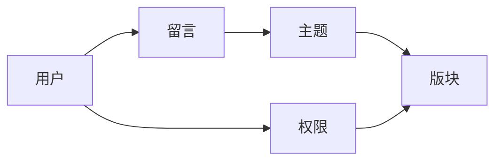

## 1. 背景介绍

### 1.1 留言板系统的起源与发展

留言板系统，又称论坛或BBS（Bulletin Board System），起源于上世纪70年代末，最初是作为一种电子公告牌的形式出现的。随着互联网技术的飞速发展，留言板系统逐渐演变为一种用户可以发布信息、交流观点的网络平台。从简单的文本留言到支持多媒体内容，从单一主题论坛到涵盖各种领域的综合性论坛，留言板系统经历了持续的演进和发展。

### 1.2 留言板系统的功能需求

现代留言板系统通常具备以下功能：

* **用户注册与登录**: 用户可以通过注册账号并登录系统来参与留言和讨论。
* **留言发布与回复**: 用户可以发布新的留言，并回复其他用户的留言。
* **主题分类与管理**: 留言板可以根据主题进行分类，方便用户查找和浏览感兴趣的内容。
* **用户权限管理**: 系统可以根据用户角色分配不同的权限，例如管理员可以管理留言、用户、版块等。
* **搜索功能**: 用户可以通过关键词搜索感兴趣的留言和主题。
* **通知提醒**: 系统可以向用户发送通知，提醒他们新的留言和回复。
* **数据统计与分析**: 系统可以收集用户行为数据，进行统计和分析，为运营决策提供支持。

### 1.3 留言板系统的技术架构

留言板系统的技术架构通常包括以下几个部分：

* **前端**: 负责用户界面展示和交互逻辑，通常采用HTML、CSS、JavaScript等技术实现。
* **后端**: 负责业务逻辑处理、数据存储和管理，通常采用Java、Python、PHP等编程语言和数据库技术实现。
* **数据库**: 负责存储留言、用户、版块等数据，通常采用MySQL、PostgreSQL、MongoDB等数据库管理系统。

## 2. 核心概念与联系

### 2.1 用户

用户是留言板系统的核心参与者，他们可以注册账号，发布留言，回复其他用户的留言，参与讨论和交流。

### 2.2 留言

留言是用户在留言板系统中发布的信息，它可以包含文本、图片、视频等多种形式的内容。

### 2.3 主题

主题是留言板系统中用于分类和组织留言的单元，它可以代表一个特定的讨论话题或领域。

### 2.4 版块

版块是留言板系统中用于组织主题的单元，它可以代表一个特定的主题分类或领域。

### 2.5 权限

权限是指用户在留言板系统中拥有的操作权限，例如发布留言、回复留言、管理用户、管理版块等。

### 2.6 核心概念关系图



## 3. 核心算法原理具体操作步骤

### 3.1 留言发布算法

1. 用户提交留言内容。
2. 系统验证用户登录状态和权限。
3. 系统对留言内容进行格式化和处理。
4. 系统将留言内容存储到数据库中。
5. 系统更新主题和版块的留言数量统计。
6. 系统向相关用户发送通知提醒。

### 3.2 留言回复算法

1. 用户提交回复内容。
2. 系统验证用户登录状态和权限。
3. 系统对回复内容进行格式化和处理。
4. 系统将回复内容存储到数据库中，并与对应的留言关联。
5. 系统更新留言的回复数量统计。
6. 系统向相关用户发送通知提醒。

### 3.3 留言搜索算法

1. 用户提交搜索关键词。
2. 系统对关键词进行分词和处理。
3. 系统根据关键词查询数据库中的留言内容。
4. 系统对查询结果进行排序和筛选。
5. 系统将搜索结果展示给用户。

## 4. 数学模型和公式详细讲解举例说明

留言板系统中，可以使用一些数学模型和公式来进行数据分析和统计，例如：

### 4.1 用户活跃度计算

可以使用以下公式计算用户的活跃度：

$$活跃度 = \frac{用户发布留言数量 + 用户回复留言数量}{用户注册时间}$$

例如，用户A注册时间为100天，发布了10条留言，回复了20条留言，则其活跃度为：

$$活跃度 = \frac{10 + 20}{100} = 0.3$$

### 4.2 主题热度计算

可以使用以下公式计算主题的热度：

$$热度 = \frac{主题留言数量 + 主题回复数量}{主题创建时间}$$

例如，主题B创建时间为50天，包含20条留言，30条回复，则其热度为：

$$热度 = \frac{20 + 30}{50} = 1$$

## 5. 项目实践：代码实例和详细解释说明

### 5.1 Python Flask框架实现留言板系统

以下是一个使用Python Flask框架实现留言板系统的简单示例：

```python
from flask import Flask, render_template, request, redirect, url_for
from flask_sqlalchemy import SQLAlchemy

app = Flask(__name__)
app.config['SQLALCHEMY_DATABASE_URI'] = 'sqlite:///message_board.db'
db = SQLAlchemy(app)


class Message(db.Model):
    id = db.Column(db.Integer, primary_key=True)
    content = db.Column(db.Text, nullable=False)


@app.route('/')
def index():
    messages = Message.query.all()
    return render_template('index.html', messages=messages)


@app.route('/create', methods=['POST'])
def create():
    content = request.form['content']
    message = Message(content=content)
    db.session.add(message)
    db.session.commit()
    return redirect(url_for('index'))


if __name__ == '__main__':
    db.create_all()
    app.run(debug=True)
```

### 5.2 代码解释

* `Flask`: Python Web框架，用于构建Web应用程序。
* `SQLAlchemy`: Python ORM框架，用于操作数据库。
* `Message`: 数据库模型，表示留言信息。
* `index()`: 处理首页请求，渲染留言列表。
* `create()`: 处理留言创建请求，将留言保存到数据库。

## 6. 实际应用场景

留言板系统广泛应用于各种场景，例如：

* **企业内部论坛**: 用于员工内部交流、信息发布、知识分享等。
* **学校论坛**: 用于学生、教师之间的交流、学习资源分享等。
* **社区论坛**: 用于社区居民之间的交流、信息发布、活动组织等。
* **电商平台**: 用于用户发布商品评论、咨询客服等。

## 7. 工具和资源推荐

### 7.1 Web框架

* **Flask**: Python Web框架，轻量级、易于学习，适合小型项目。
* **Django**: Python Web框架，功能强大、成熟稳定，适合大型项目。
* **Spring Boot**: Java Web框架，功能强大、生态丰富，适合企业级应用。

### 7.2 数据库

* **MySQL**: 关系型数据库，开源免费、性能优异，广泛应用于Web开发。
* **PostgreSQL**: 关系型数据库，功能强大、稳定可靠，适合复杂数据模型。
* **MongoDB**: NoSQL数据库，灵活可扩展、性能高，适合海量数据存储。

### 7.3 前端框架

* **React**: JavaScript前端框架，组件化开发、性能优异，适合构建复杂用户界面。
* **Vue.js**: JavaScript前端框架，易于学习、轻量级，适合小型项目。
* **Angular**: JavaScript前端框架，功能强大、成熟稳定，适合大型项目。

## 8. 总结：未来发展趋势与挑战

### 8.1 未来发展趋势

* **人工智能技术**: 将人工智能技术应用于留言板系统，例如自动识别垃圾留言、智能推荐相关内容等。
* **移动化**: 随着移动互联网的普及，留言板系统需要更好地支持移动设备访问。
* **社交化**: 将留言板系统与社交网络平台整合，例如分享留言到社交平台、使用社交账号登录等。

### 8.2 面临的挑战

* **信息安全**: 留言板系统需要有效防止垃圾留言、恶意攻击等安全问题。
* **用户体验**: 留言板系统需要提供良好的用户体验，例如简洁易用的界面、流畅的交互体验等。
* **内容质量**: 留言板系统需要鼓励用户发布高质量的留言，并有效管理低质量内容。

## 9. 附录：常见问题与解答

### 9.1 如何防止垃圾留言？

* 使用验证码机制验证用户身份。
* 使用机器学习算法识别垃圾留言。
* 设置留言审核机制，人工审核可疑留言。

### 9.2 如何提高用户活跃度？

* 提供优质的留言内容，吸引用户参与讨论。
* 组织线上线下活动，增强用户互动。
* 建立用户积分体系，鼓励用户积极参与。

### 9.3 如何选择合适的技术架构？

* 根据项目规模、功能需求、开发成本等因素选择合适的技术架构。
* 考虑技术的成熟度、社区支持、学习成本等因素。
* 进行技术选型评估，选择最优的技术方案。 
