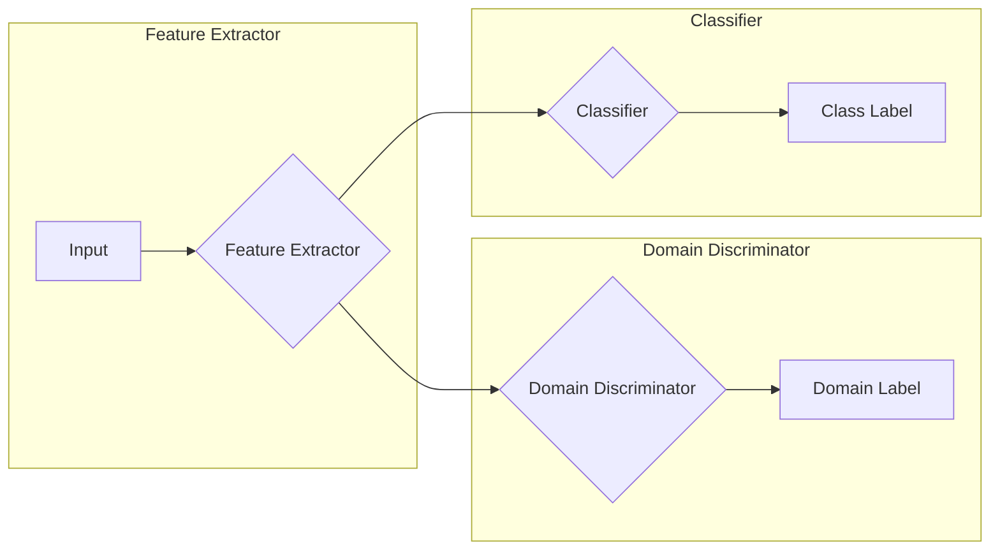
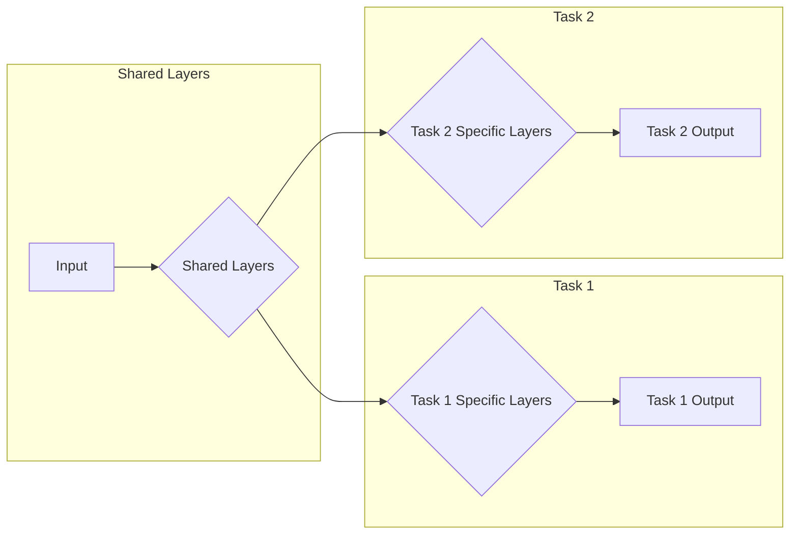
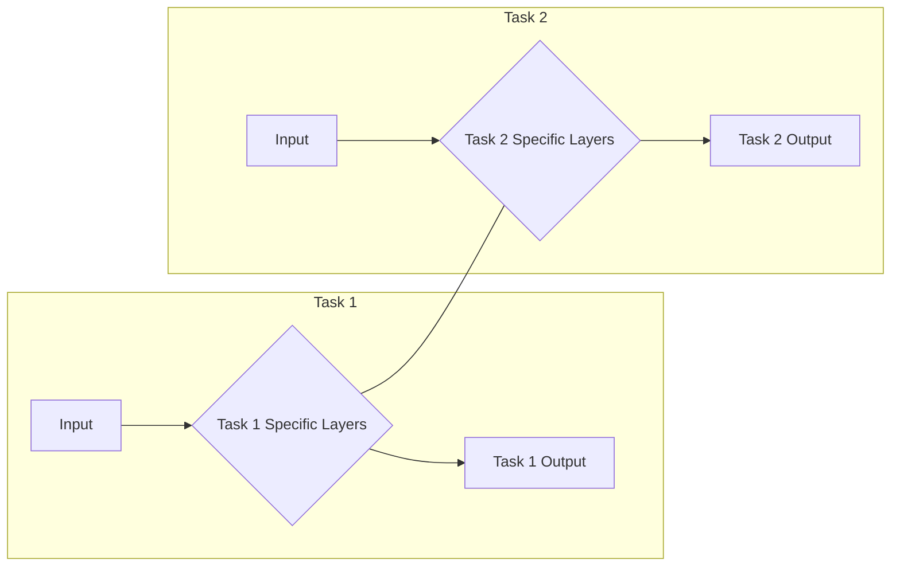

## 1. 背景介绍

### 1.1 人工智能的新纪元：数据驱动决策的崛起

近年来，人工智能（AI）浪潮席卷全球，其核心驱动力之一便是海量数据的积累和计算能力的提升。传统机器学习在处理结构化数据方面取得了巨大成功，例如图像分类、语音识别和自然语言处理等领域。然而，传统机器学习方法通常需要大量的标注数据才能获得理想的性能，这在实际应用中往往难以满足。

### 1.2 迁移学习：打破数据壁垒，开启知识迁移的旅程

迁移学习的出现为解决数据匮乏问题提供了一条新的途径。它打破了传统机器学习中“独立同分布”的假设，允许将知识从一个领域（源域）迁移到另一个相关但数据较少的领域（目标域）。这种知识迁移的模式不仅可以减少目标域的标注数据需求，还可以提升模型的泛化能力和学习效率。

### 1.3 思维方式的革命：从孤立学习到知识复用

迁移学习的出现标志着人工智能领域的一场思维方式的革命。传统机器学习强调从零开始学习，而迁移学习则倡导知识复用，将已有知识迁移到新任务中。这种思维方式的转变将极大地推动人工智能技术的发展，使其更加高效、灵活和实用。

## 2. 核心概念与联系

### 2.1 迁移学习的定义与分类

迁移学习是指将从一个领域学习到的知识应用到另一个相关领域的学习任务中。根据源域和目标域之间的数据分布和任务相似性，迁移学习可以分为以下几种类型：

* **归纳迁移学习 (Inductive Transfer Learning):** 源域和目标域的任务不同，但数据分布相似。
* **直推迁移学习 (Transductive Transfer Learning):** 源域和目标域的任务相同，但数据分布不同。
* **无监督迁移学习 (Unsupervised Transfer Learning):** 源域和目标域都没有标签数据。

### 2.2 迁移学习与传统机器学习的联系与区别

迁移学习和传统机器学习都是机器学习的子领域，它们的目标都是从数据中学习模型。然而，它们在学习方式和数据需求方面存在显著差异：

| 特征 | 传统机器学习 | 迁移学习 |
|---|---|---|
| 数据需求 | 大量标注数据 | 较少标注数据 |
| 学习方式 | 从零开始学习 | 知识复用 |
| 泛化能力 | 较弱 | 较强 |
| 学习效率 | 较低 | 较高 |

## 3. 核心算法原理具体操作步骤

### 3.1 基于特征的迁移学习

#### 3.1.1 原理

基于特征的迁移学习方法旨在学习一种共享的特征表示，该表示可以同时适用于源域和目标域。通过这种方式，源域的知识可以被迁移到目标域，从而提高目标域任务的性能。

#### 3.1.2 操作步骤

1. 在源域上训练一个特征提取器。
2. 将源域和目标域的数据输入特征提取器，得到特征表示。
3. 使用目标域的特征表示和标签数据训练目标域的分类器。

#### 3.1.3 典型算法

* **主成分分析 (PCA)**
* **线性判别分析 (LDA)**

### 3.2 基于实例的迁移学习

#### 3.2.1 原理

基于实例的迁移学习方法通过选择和加权源域中的实例来构建目标域的训练集。这些实例通常与目标域的数据分布相似，因此可以有效地提高目标域任务的性能。

#### 3.2.2 操作步骤

1. 计算源域和目标域实例之间的相似度。
2. 选择与目标域实例最相似的源域实例。
3. 使用选择的源域实例和目标域实例构建新的训练集。
4. 在新的训练集上训练目标域的分类器。

#### 3.2.3 典型算法

* **TrAdaboost**
* **实例加权学习**

### 3.3 基于模型的迁移学习

#### 3.3.1 原理

基于模型的迁移学习方法直接将源域的模型参数迁移到目标域，并进行微调以适应目标域的数据分布。这种方法可以有效地利用源域的知识，并减少目标域的训练时间。

#### 3.3.2 操作步骤

1. 在源域上训练一个模型。
2. 将源域模型的参数迁移到目标域模型。
3. 使用目标域的数据微调目标域模型的参数。

#### 3.3.3 典型算法

* **微调 (Fine-tuning)**
* **多任务学习 (Multi-task Learning)**

## 4. 数学模型和公式详细讲解举例说明

### 4.1 领域自适应

领域自适应是一种常用的迁移学习方法，其目标是减少源域和目标域之间的分布差异。

#### 4.1.1 最大均值差异 (MMD)

MMD 是一种常用的度量领域差异的方法，它通过计算两个分布的均值在再生核希尔伯特空间 (RKHS) 中的距离来衡量它们的差异。

$$
MMD(P, Q) = || \mathbb{E}_{x \sim P}[ \phi(x) ] - \mathbb{E}_{y \sim Q}[ \phi(y) ] ||^2
$$

其中，$P$ 和 $Q$ 分别表示源域和目标域的分布，$\phi(\cdot)$ 表示将样本映射到 RKHS 的特征映射。

#### 4.1.2 领域对抗神经网络 (DANN)

DANN 是一种基于对抗学习的领域自适应方法，它通过训练一个领域判别器来区分源域和目标域的数据，并同时训练一个特征提取器来混淆领域判别器。

**DANN 的目标函数:**

$$
\min_{G, C} \max_{D} L(G, C, D)
$$

其中，$G$ 表示特征提取器，$C$ 表示分类器，$D$ 表示领域判别器，$L$ 表示损失函数。

**DANN 的网络架构:**



### 4.2 多任务学习

多任务学习是一种同时学习多个相关任务的方法，其目标是利用任务之间的相关性来提高每个任务的性能。

#### 4.2.1 硬参数共享

硬参数共享是一种简单的多任务学习方法，它通过共享部分模型参数来学习多个任务。

**硬参数共享的网络架构:**



#### 4.2.2 软参数共享

软参数共享是一种更灵活的多任务学习方法，它允许每个任务学习自己的模型参数，但同时鼓励参数之间的相似性。

**软参数共享的网络架构:**



## 5. 项目实践：代码实例和详细解释说明

### 5.1 使用预训练模型进行图像分类

#### 5.1.1 代码实例

```python
import tensorflow as tf

# 加载预训练模型
base_model = tf.keras.applications.ResNet50(
    weights='imagenet', include_top=False
)

# 冻结预训练模型的权重
base_model.trainable = False

# 添加新的分类层
inputs = tf.keras.Input(shape=(224, 224, 3))
x = base_model(inputs, training=False)
x = tf.keras.layers.GlobalAveragePooling2D()(x)
outputs = tf.keras.layers.Dense(10, activation='softmax')(x)

# 构建模型
model = tf.keras.Model(inputs=inputs, outputs=outputs)

# 编译模型
model.compile(
    optimizer=tf.keras.optimizers.Adam(),
    loss=tf.keras.losses.CategoricalCrossentropy(),
    metrics=['accuracy']
)

# 训练模型
model.fit(
    x_train, y_train,
    epochs=10,
    validation_data=(x_val, y_val)
)
```

#### 5.1.2 解释说明

* `base_model`：加载预训练的 ResNet50 模型，并移除顶层分类器。
* `base_model.trainable = False`：冻结预训练模型的权重，防止在训练过程中更新。
* `tf.keras.layers.GlobalAveragePooling2D()`：对特征图进行全局平均池化，得到一个特征向量。
* `tf.keras.layers.Dense(10, activation='softmax')`：添加一个新的分类层，输出 10 个类别的概率分布。
* `model.compile()`：编译模型，指定优化器、损失函数和评估指标。
* `model.fit()`：训练模型，使用训练数据和验证数据进行训练和评估。

### 5.2 使用领域对抗神经网络进行情感分析

#### 5.2.1 代码实例

```python
import tensorflow as tf

# 定义特征提取器
def feature_extractor(inputs):
    x = tf.keras.layers.Embedding(vocab_size, embedding_dim)(inputs)
    x = tf.keras.layers.LSTM(128)(x)
    return x

# 定义领域判别器
def domain_discriminator(inputs):
    x = tf.keras.layers.Dense(128, activation='relu')(inputs)
    x = tf.keras.layers.Dense(1, activation='sigmoid')(x)
    return x

# 定义分类器
def classifier(inputs):
    x = tf.keras.layers.Dense(128, activation='relu')(inputs)
    x = tf.keras.layers.Dense(2, activation='softmax')(x)
    return x

# 构建模型
inputs = tf.keras.Input(shape=(max_len,))
features = feature_extractor(inputs)
domain_output = domain_discriminator(features)
class_output = classifier(features)

# 定义损失函数
domain_loss = tf.keras.losses.BinaryCrossentropy()
class_loss = tf.keras.losses.CategoricalCrossentropy()

# 定义优化器
optimizer = tf.keras.optimizers.Adam()

# 定义训练步骤
def train_step(source_inputs, source_labels, target_inputs):
    with tf.GradientTape() as tape:
        source_features = feature_extractor(source_inputs)
        target_features = feature_extractor(target_inputs)
        source_domain_output = domain_discriminator(source_features)
        target_domain_output = domain_discriminator(target_features)
        source_class_output = classifier(source_features)
        target_class_output = classifier(target_features)

        # 计算损失
        domain_loss_value = domain_loss(
            tf.concat([tf.ones_like(source_domain_output), tf.zeros_like(target_domain_output)], axis=0),
            tf.concat([source_domain_output, target_domain_output], axis=0)
        )
        class_loss_value = class_loss(source_labels, source_class_output)
        total_loss = domain_loss_value + class_loss_value

    # 计算梯度
    grads = tape.gradient(total_loss, model.trainable_variables)

    # 更新模型参数
    optimizer.apply_gradients(zip(grads, model.trainable_variables))

# 训练模型
for epoch in range(epochs):
    for source_batch, target_batch in zip(source_dataset, target_dataset):
        source_inputs, source_labels = source_batch
        target_inputs, _ = target_batch
        train_step(source_inputs, source_labels, target_inputs)
```

#### 5.2.2 解释说明

* `feature_extractor`：定义特征提取器，使用嵌入层和 LSTM 层提取文本特征。
* `domain_discriminator`：定义领域判别器，使用全连接层和 sigmoid 激活函数输出领域标签的概率。
* `classifier`：定义分类器，使用全连接层和 softmax 激活函数输出情感标签的概率分布。
* `domain_loss`：定义领域判别器的损失函数，使用二元交叉熵损失函数。
* `class_loss`：定义分类器的损失函数，使用分类交叉熵损失函数。
* `train_step`：定义训练步骤，计算损失、梯度和更新模型参数。
* 训练循环：迭代训练数据，并执行训练步骤。

## 6. 实际应用场景

### 6.1 计算机视觉

* **图像分类：** 使用 ImageNet 数据集训练的模型可以迁移到其他图像分类任务，例如医学图像分类、遥感图像分类等。
* **目标检测：** 使用 COCO 数据集训练的模型可以迁移到其他目标检测任务，例如人脸检测、车辆检测等。
* **图像分割：** 使用 Pascal VOC 数据集训练的模型可以迁移到其他图像分割任务，例如医学图像分割、遥感图像分割等。

### 6.2 自然语言处理

* **文本分类：** 使用大型文本语料库训练的模型可以迁移到其他文本分类任务，例如情感分析、主题分类等。
* **机器翻译：** 使用平行语料库训练的模型可以迁移到其他语言对的翻译任务。
* **问答系统：** 使用 SQuAD 数据集训练的模型可以迁移到其他问答任务。

### 6.3 语音识别

* **语音识别：** 使用 LibriSpeech 数据集训练的模型可以迁移到其他语音识别任务，例如方言识别、噪声环境下的语音识别等。
* **说话人识别：** 使用 VoxCeleb 数据集训练的模型可以迁移到其他说话人识别任务。

## 7. 工具和资源推荐

### 7.1 迁移学习框架

* **TensorFlow Hub:** 提供预训练模型和迁移学习工具。
* **PyTorch Hub:** 提供预训练模型和迁移学习工具。
* **AdaptNLP:** 基于 PyTorch 的领域自适应库。

### 7.2 数据集

* **ImageNet:** 大型图像分类数据集。
* **COCO:** 大型目标检测数据集。
* **Pascal VOC:** 图像分割数据集。
* **LibriSpeech:** 语音识别数据集。
* **VoxCeleb:** 说话人识别数据集。

## 8. 总结：未来发展趋势与挑战

### 8.1 更加高效的迁移学习算法

未来，迁移学习算法将更加高效，能够处理更加复杂的任务和数据分布。

### 8.2 可解释性

迁移学习模型的可解释性仍然是一个挑战，需要开发新的方法来解释模型的决策过程。

### 8.3 隐私和安全

迁移学习涉及到数据的迁移，因此需要解决隐私和安全问题。

## 9. 附录：常见问题与解答

### 9.1 什么是负迁移？

负迁移是指源域的知识对目标域任务产生负面影响的现象。

### 9.2 如何选择合适的迁移学习方法？

选择合适的迁移学习方法取决于源域和目标域之间的数据分布和任务相似性。

### 9.3 迁移学习的应用有哪些局限性？

迁移学习的应用仍然存在一些局限性，例如负迁移、可解释性和隐私安全等问题。
