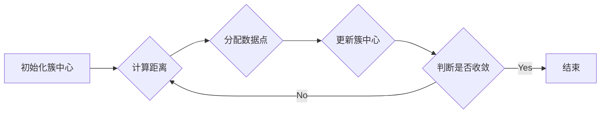
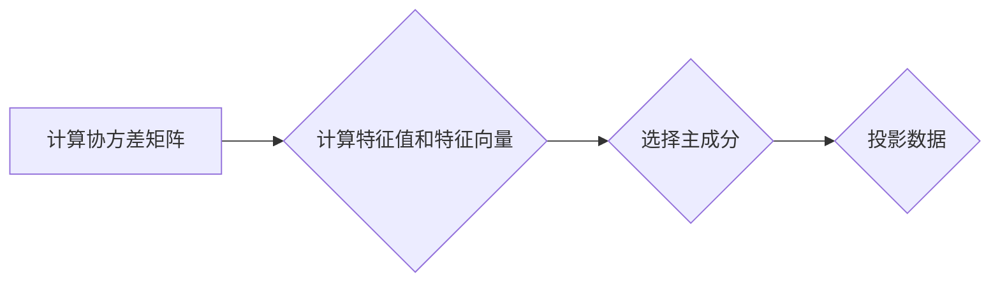

## 1. 背景介绍

### 1.1 机器学习的兴起与挑战

近年来，机器学习技术发展迅速，并在各个领域取得了显著成果。从图像识别、语音识别到自然语言处理，机器学习正在改变着我们生活、工作和娱乐的方式。然而，机器学习的成功应用往往依赖于大量的标注数据，而获取标注数据通常需要耗费大量的人力物力，这成为了制约机器学习进一步发展的瓶颈。

### 1.2 非监督学习的优势与应用

为了克服数据标注的难题，非监督学习应运而生。非监督学习是指在没有给定标签的情况下，让机器从数据中学习模式和结构的一种机器学习方法。与需要大量标注数据的监督学习相比，非监督学习具有以下优势：

* **减少数据标注成本:** 非监督学习不需要标注数据，可以节省大量人力物力。
* **发现隐藏模式:** 非监督学习可以发现数据中隐藏的模式和结构，这些模式和结构可能难以通过人工观察发现。
* **处理高维数据:** 非监督学习可以有效地处理高维数据，例如图像、文本和时间序列数据。

非监督学习在许多领域都有广泛的应用，例如：

* **聚类分析:** 将数据点分组到不同的簇中，例如客户细分、图像分割。
* **异常检测:** 识别数据中的异常点，例如信用卡欺诈检测、网络入侵检测。
* **降维:** 将高维数据映射到低维空间，同时保留数据的重要信息，例如主成分分析(PCA)、t-SNE。

### 1.3 非监督学习算法演示系统的意义

为了更好地理解和应用非监督学习算法，开发一个非监督学习算法演示系统具有重要的意义。该系统可以：

* **直观展示算法原理:** 通过可视化和交互式操作，帮助用户直观地理解非监督学习算法的原理和工作机制。
* **促进算法学习和研究:** 为研究人员和开发者提供一个平台，方便地测试和比较不同的非监督学习算法。
* **加速算法应用落地:** 为企业和机构提供一个工具，快速地将非监督学习算法应用到实际问题中。


## 2. 核心概念与联系

### 2.1 聚类分析

聚类分析是一种将数据点分组到不同簇中的非监督学习方法。其目标是使得同一簇内的数据点尽可能相似，而不同簇之间的数据点尽可能不同。

#### 2.1.1 K-Means算法

K-Means算法是一种常用的聚类算法，其基本步骤如下：

1. 随机选择K个点作为初始簇中心。
2. 将每个数据点分配到距离其最近的簇中心所在的簇中。
3. 重新计算每个簇的中心点。
4. 重复步骤2和3，直到簇中心不再发生变化或达到最大迭代次数。

#### 2.1.2 层次聚类

层次聚类是一种基于树状结构的聚类方法，其基本步骤如下：

1. 将每个数据点视为一个单独的簇。
2. 计算所有簇之间的距离。
3. 将距离最近的两个簇合并成一个新的簇。
4. 重复步骤2和3，直到所有数据点都属于同一个簇。

### 2.2 异常检测

异常检测是一种识别数据中异常点的非监督学习方法。异常点是指与其他数据点显著不同的数据点，例如信用卡欺诈交易、网络入侵行为。

#### 2.2.1 基于统计的方法

基于统计的方法假设正常数据服从某种统计分布，而异常点偏离该分布。例如，可以使用高斯分布来建模正常数据，并将偏离高斯分布的数据点视为异常点。

#### 2.2.2 基于距离的方法

基于距离的方法通过计算数据点之间的距离来识别异常点。例如，可以使用K近邻算法来计算每个数据点的K个最近邻居，并将距离K个最近邻居较远的数据点视为异常点。

### 2.3 降维

降维是一种将高维数据映射到低维空间的非监督学习方法，其目标是在保留数据重要信息的同时减少数据的维度。

#### 2.3.1 主成分分析(PCA)

PCA是一种常用的降维方法，其基本步骤如下：

1. 计算数据的协方差矩阵。
2. 计算协方差矩阵的特征值和特征向量。
3. 选择前K个特征值最大的特征向量作为主成分。
4. 将数据投影到主成分张成的低维空间中。

#### 2.3.2 t-SNE

t-SNE是一种非线性降维方法，其目标是将高维数据映射到低维空间，同时保持数据点的局部结构。


## 3. 核心算法原理具体操作步骤

### 3.1 K-Means算法

#### 3.1.1 算法流程图



#### 3.1.2 具体操作步骤

1. **初始化簇中心:** 随机选择K个数据点作为初始簇中心。
2. **计算距离:** 计算每个数据点到所有簇中心的距离。
3. **分配数据点:** 将每个数据点分配到距离其最近的簇中心所在的簇中。
4. **更新簇中心:** 重新计算每个簇的中心点，即计算该簇中所有数据点的平均值。
5. **判断是否收敛:** 如果簇中心不再发生变化或达到最大迭代次数，则算法结束；否则，重复步骤2到4。

#### 3.1.3 举例说明

假设有如下数据集：

```
X = [[1, 2], [1.5, 1.8], [5, 8], [8, 8], [1, 0.6], [9, 11]]
```

使用K-Means算法对该数据集进行聚类，设置K=2。

1. **初始化簇中心:** 随机选择两个数据点作为初始簇中心，例如[1, 2]和[5, 8]。
2. **计算距离:** 计算每个数据点到两个簇中心的距离。
3. **分配数据点:** 将每个数据点分配到距离其最近的簇中心所在的簇中，得到两个簇：

   * 簇1: [[1, 2], [1.5, 1.8], [1, 0.6]]
   * 簇2: [[5, 8], [8, 8], [9, 11]]

4. **更新簇中心:** 计算每个簇的中心点：

   * 簇1中心点: [1.17, 1.47]
   * 簇2中心点: [7.33, 9]

5. **判断是否收敛:** 簇中心发生变化，继续迭代。

重复步骤2到4，直到簇中心不再发生变化或达到最大迭代次数。

### 3.2 主成分分析(PCA)

#### 3.2.1 算法流程图



#### 3.2.2 具体操作步骤

1. **计算协方差矩阵:** 计算数据的协方差矩阵。
2. **计算特征值和特征向量:** 计算协方差矩阵的特征值和特征向量。
3. **选择主成分:** 选择前K个特征值最大的特征向量作为主成分。
4. **投影数据:** 将数据投影到主成分张成的低维空间中。

#### 3.2.3 举例说明

假设有如下数据集：

```
X = [[1, 2], [1.5, 1.8], [5, 8], [8, 8], [1, 0.6], [9, 11]]
```

使用PCA对该数据集进行降维，设置K=1。

1. **计算协方差矩阵:** 
   ```
   Cov(X) = [[10.33, 12.17],
            [12.17, 14.67]]
   ```

2. **计算特征值和特征向量:** 
   ```
   eigenvalues = [24.83, 0.17]
   eigenvectors = [[0.71, 0.71],
                  [-0.71, 0.71]]
   ```

3. **选择主成分:** 选择特征值最大的特征向量[0.71, 0.71]作为主成分。

4. **投影数据:** 将数据投影到主成分张成的低维空间中：

   ```
   X_pca = [[2.12], [2.42], [11.42], [13.42], [1.42], [14.12]]
   ```


## 4. 数学模型和公式详细讲解举例说明

### 4.1 K-Means算法

#### 4.1.1 目标函数

K-Means算法的目标是最小化簇内平方误差和(SSE):

$$
SSE = \sum_{i=1}^{K} \sum_{x_j \in C_i} ||x_j - \mu_i||^2
$$

其中，$K$是簇的数量，$C_i$是第$i$个簇，$x_j$是属于$C_i$的第$j$个数据点，$\mu_i$是$C_i$的中心点。

#### 4.1.2 迭代更新公式

簇中心$\mu_i$的更新公式为：

$$
\mu_i = \frac{1}{|C_i|} \sum_{x_j \in C_i} x_j
$$

其中，$|C_i|$是$C_i$中数据点的数量。

#### 4.1.3 举例说明

假设有如下数据集和簇分配：

```
X = [[1, 2], [1.5, 1.8], [5, 8], [8, 8], [1, 0.6], [9, 11]]
```

```
C_1 = [[1, 2], [1.5, 1.8], [1, 0.6]]
C_2 = [[5, 8], [8, 8], [9, 11]]
```

则簇中心$\mu_1$和$\mu_2$的更新公式为：

$$
\mu_1 = \frac{1}{3} ([1, 2] + [1.5, 1.8] + [1, 0.6]) = [1.17, 1.47]
$$

$$
\mu_2 = \frac{1}{3} ([5, 8] + [8, 8] + [9, 11]) = [7.33, 9]
$$

### 4.2 主成分分析(PCA)

#### 4.2.1 协方差矩阵

协方差矩阵表示不同变量之间的线性关系。对于一个$n \times p$的数据矩阵$X$，其协方差矩阵为：

$$
Cov(X) = \frac{1}{n-1} (X - \bar{X})^T (X - \bar{X})
$$

其中，$\bar{X}$是$X$的均值向量。

#### 4.2.2 特征值和特征向量

协方差矩阵的特征值和特征向量表示数据的主要变化方向和变化幅度。特征值越大，表示该方向上的数据变化越大。特征向量表示数据变化的方向。

#### 4.2.3 降维

PCA通过选择前K个特征值最大的特征向量作为主成分，将数据投影到主成分张成的低维空间中。投影后的数据保留了原始数据的主要信息。


## 5. 项目实践：代码实例和详细解释说明

### 5.1 K-Means算法实现

```python
import numpy as np

def kmeans(X, k, max_iters=100):
    """
    K-Means算法实现

    参数:
        X: 数据集，numpy数组，形状为(n_samples, n_features)
        k: 簇的数量
        max_iters: 最大迭代次数

    返回值:
        centroids: 簇中心，numpy数组，形状为(k, n_features)
        labels: 每个数据点所属的簇标签，numpy数组，形状为(n_samples,)
    """

    # 1. 初始化簇中心
    n_samples = X.shape[0]
    idx = np.random.choice(n_samples, k, replace=False)
    centroids = X[idx]

    # 2. 迭代更新簇中心
    for _ in range(max_iters):
        # 计算距离
        distances = np.linalg.norm(X[:, np.newaxis, :] - centroids, axis=2)
        # 分配数据点
        labels = np.argmin(distances, axis=1)
        # 更新簇中心
        new_centroids = np.array([X[labels == i].mean(axis=0) for i in range(k)])
        # 判断是否收敛
        if np.allclose(centroids, new_centroids):
            break
        centroids = new_centroids

    return centroids, labels
```

### 5.2 主成分分析(PCA)实现

```python
import numpy as np

def pca(X, k):
    """
    主成分分析(PCA)实现

    参数:
        X: 数据集，numpy数组，形状为(n_samples, n_features)
        k: 主成分的数量

    返回值:
        X_pca: 降维后的数据集，numpy数组，形状为(n_samples, k)
    """

    # 1. 计算协方差矩阵
    cov_matrix = np.cov(X.T)
    # 2. 计算特征值和特征向量
    eigenvalues, eigenvectors = np.linalg.eig(cov_matrix)
    # 3. 选择主成分
    idx = np.argsort(eigenvalues)[::-1][:k]
    principal_components = eigenvectors[:, idx]
    # 4. 投影数据
    X_pca = X @ principal_components

    return X_pca
```


## 6. 实际应用场景

### 6.1 客户细分

在市场营销中，可以使用K-Means算法将客户细分为不同的群体，以便制定更有针对性的营销策略。例如，可以根据客户的购买历史、浏览记录、人口统计信息等特征将客户分为高价值客户、潜在客户、流失客户等不同群体。

### 6.2 图像分割

在计算机视觉中，可以使用K-Means算法对图像进行分割，将图像分成不同的区域。例如，可以根据图像的像素颜色、纹理、形状等特征将图像分割成前景和背景、不同物体等区域。

### 6.3 异常检测

在网络安全、金融风控等领域，可以使用异常检测算法识别异常行为。例如，可以使用基于统计的方法识别信用卡欺诈交易，使用基于距离的方法识别网络入侵行为。

### 6.4 降维

在数据分析和机器学习中，可以使用降维算法将高维数据映射到低维空间，以便更好地理解数据、提高模型效率。例如，可以使用PCA将人脸图像降维，以便进行人脸识别。


## 7. 工具和资源推荐

### 7.1 Scikit-learn

Scikit-learn是一个开源的Python机器学习库，提供了丰富的机器学习算法，包括K-Means、PCA等非监督学习算法。

### 7.2 TensorFlow

TensorFlow是一个开源的机器学习平台，提供了灵活的API，可以用于构建和训练各种机器学习模型，包括非监督学习模型。

### 7.3 PyTorch

PyTorch是一个开源的机器学习框架，提供了动态计算图和自动求导功能，可以用于构建和训练各种机器学习模型，包括非监督学习模型。


## 8. 总结：未来发展趋势与挑战

### 8.1 深度学习与非监督学习的结合

深度学习近年来取得了巨大成功，其强大的特征提取能力可以用于提高非监督学习算法的性能。例如，可以使用卷积神经网络(CNN)提取图像特征，然后使用K-Means算法对图像进行聚类。

### 8.2 弱监督学习和自监督学习

弱监督学习和自监督学习是近年来兴起的新的学习范式，它们可以利用有限的标注数据或无标注数据来训练机器学习模型。例如，可以使用弱监督学习训练图像分类模型，使用自监督学习训练自然语言处理模型。

### 8.3 可解释性和可信赖性

随着机器学习应用的普及，可解释性和可信赖性变得越来越重要。非监督学习算法通常难以解释，其结果也难以评估。未来需要开发更加可解释和可信赖的非监督学习算法。


## 9. 附录：常见问题与解答

### 9.1 K-Means算法如何选择K值？

选择合适的K值是K-Means算法的关键。可以使用肘部法则、轮廓系数等方法来评估不同K值下的聚类效果，选择效果最好的K值。

### 9.2 PCA如何选择主成分数量？

选择合适的主成分数量是PCA的关键。可以根据特征值的累积贡献率来选择主成分数量，通常选择累积贡献率达到80%或90%的主成分。

### 9.3 如何评估非监督学习算法的性能？

评估非监督学习算法的性能比较困难，因为没有标注数据作为参考。可以使用轮廓系数、互信息等指标来评估聚类效果，使用重构误差来评估降维效果。
