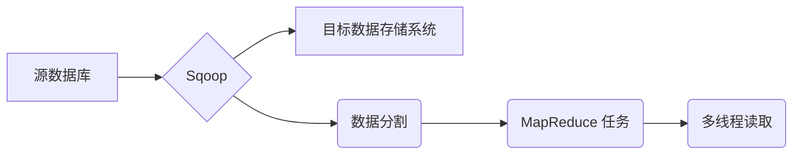

## 1. 背景介绍

### 1.1 大数据时代的数据迁移挑战
在当今大数据时代，海量数据的处理和分析成为了许多企业和组织的核心需求。数据通常分散在不同的数据源中，例如关系型数据库 (RDBMS)、 NoSQL 数据库、数据仓库等等。为了进行有效的数据分析和挖掘，我们需要将这些数据迁移到一个集中的平台，例如 Hadoop 分布式文件系统 (HDFS) 或其他大数据平台。

### 1.2 Sqoop: 连接关系型数据库与 Hadoop 的桥梁
Sqoop (SQL-to-Hadoop) 是一款专门用于在关系型数据库和 Hadoop 之间进行数据迁移的工具。它能够高效地将数据从 RDBMS 导入到 HDFS，或者将 HDFS 中的数据导出到 RDBMS。Sqoop 的出现极大地简化了数据迁移的过程，成为了大数据生态系统中不可或缺的一部分。

### 1.3 并行传输: 提升数据导入效率的关键
传统的数据导入方式通常采用单线程串行的方式，效率较低，尤其是在处理大规模数据集时。Sqoop 提供了并行传输机制，可以将数据分割成多个块，并利用多个线程同时进行数据导入，从而显著提高数据导入效率。

## 2. 核心概念与联系

### 2.1 Sqoop 工作原理
Sqoop 的工作原理可以概括为以下几个步骤：
1. 连接源数据库和目标数据存储系统。
2. 获取源数据库表结构和数据类型。
3. 根据配置将数据分割成多个块。
4. 创建多个 MapReduce 任务，每个任务负责处理一个数据块。
5. 并行读取源数据库数据，并写入目标数据存储系统。

### 2.2 并行传输机制
Sqoop 通过以下两种方式实现并行传输：
1. **数据分割:** Sqoop 可以根据主键或其他字段将数据分割成多个块，每个块对应一个 MapReduce 任务。
2. **多线程读取:** 每个 MapReduce 任务可以使用多个线程同时读取源数据库数据，从而提高数据读取效率。

### 2.3 核心概念联系图



## 3. 核心算法原理具体操作步骤

### 3.1 数据分割算法
Sqoop 支持多种数据分割算法，例如：
1. **主键分割:** 根据表的主键进行数据分割，确保每个数据块包含唯一的主键值。
2. **字段分割:** 根据指定的字段进行数据分割，例如日期、地区等。
3. **均匀分割:** 将数据均匀地分割成多个块，每个块包含相同数量的数据。

### 3.2 并行读取操作步骤
1. Sqoop 启动多个 MapReduce 任务，每个任务负责处理一个数据块。
2. 每个 MapReduce 任务使用多个线程同时读取源数据库数据。
3. 每个线程读取一部分数据，并将其写入目标数据存储系统。

## 4. 数学模型和公式详细讲解举例说明

### 4.1 数据分割公式
假设数据表包含 N 条记录，需要分割成 M 个数据块，则每个数据块包含的记录数为:

$$
blockSize = N / M
$$

### 4.2 并行读取效率公式
假设每个 MapReduce 任务使用 T 个线程进行数据读取，则并行读取效率为:

$$
efficiency = T * speed
$$

其中 speed 表示单个线程的数据读取速度。

### 4.3 举例说明
假设一个数据表包含 1 亿条记录，需要分割成 100 个数据块，每个 MapReduce 任务使用 10 个线程进行数据读取，单个线程的数据读取速度为 1000 条/秒，则:

* 每个数据块包含的记录数为 100 万条。
* 并行读取效率为 10 * 1000 = 10000 条/秒。

## 5. 项目实践：代码实例和详细解释说明

### 5.1 导入数据到 HDFS
以下代码示例演示了如何使用 Sqoop 将 MySQL 数据库中的数据导入到 HDFS:

```bash
sqoop import \
  --connect jdbc:mysql://localhost:3306/mydb \
  --username root \
  --password password \
  --table mytable \
  --target-dir /user/hadoop/mytable \
  --num-mappers 10
```

**参数说明:**

* `--connect`: 指定源数据库连接字符串。
* `--username`: 指定源数据库用户名。
* `--password`: 指定源数据库密码。
* `--table`: 指定要导入的表名。
* `--target-dir`: 指定 HDFS 目标路径。
* `--num-mappers`: 指定 MapReduce 任务数量，用于控制并行度。

### 5.2 导出数据到 MySQL
以下代码示例演示了如何使用 Sqoop 将 HDFS 中的数据导出到 MySQL 数据库:

```bash
sqoop export \
  --connect jdbc:mysql://localhost:3306/mydb \
  --username root \
  --password password \
  --table mytable \
  --export-dir /user/hadoop/mytable \
  --num-mappers 10
```

**参数说明:**

* `--connect`: 指定目标数据库连接字符串。
* `--username`: 指定目标数据库用户名。
* `--password`: 指定目标数据库密码。
* `--table`: 指定要导出的表名。
* `--export-dir`: 指定 HDFS 数据源路径。
* `--num-mappers`: 指定 MapReduce 任务数量，用于控制并行度。

## 6. 实际应用场景

### 6.1 数据仓库构建
Sqoop 可以用于将企业各个业务系统的数据导入到数据仓库中，为数据分析和挖掘提供基础数据。

### 6.2 ETL 流程
Sqoop 可以作为 ETL (Extract, Transform, Load) 流程的一部分，用于将数据从源系统提取到目标系统，并进行数据清洗和转换。

### 6.3 数据备份和恢复
Sqoop 可以用于将数据库中的数据备份到 HDFS，或者将 HDFS 中的数据恢复到数据库。

## 7. 工具和资源推荐

### 7.1 Sqoop 官方文档
https://sqoop.apache.org/docs/1.4.7/SqoopUserGuide.html

### 7.2 Hadoop 生态系统
https://hadoop.apache.org/

## 8. 总结：未来发展趋势与挑战

### 8.1 未来发展趋势
* 支持更多的数据源和目标系统。
* 提高数据传输效率和性能。
* 简化数据迁移流程，降低使用门槛。

### 8.2 面临的挑战
* 处理复杂数据类型和数据结构。
* 保证数据一致性和完整性。
* 应对大规模数据集的迁移需求。

## 9. 附录：常见问题与解答

### 9.1 如何选择合适的数据分割算法？
选择数据分割算法需要考虑数据表结构、数据量、数据分布等因素。

### 9.2 如何提高 Sqoop 数据导入效率？
可以通过增加 MapReduce 任务数量、使用更高效的数据分割算法、优化数据库配置等方式提高数据导入效率。

### 9.3 如何解决 Sqoop 数据导入过程中的错误？
可以通过查看 Sqoop 日志、检查数据库连接、调整 Sqoop 参数等方式解决数据导入过程中的错误。
