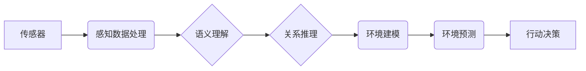

# AI Agent: AI的下一个风口 感知和解析环境的技术

作者：禅与计算机程序设计艺术

## 1. 背景介绍

### 1.1 人工智能的新浪潮：从感知到行动

近年来，人工智能 (AI) 取得了令人瞩目的成就，特别是在感知领域，如图像识别、语音识别和自然语言处理。然而，传统的 AI 系统大多局限于被动地接收和处理信息，缺乏主动感知、理解环境并做出决策的能力。AI Agent 的出现打破了这一瓶颈，将 AI 推向了一个新的高度——从感知到行动。

### 1.2  AI Agent：自主、智能、可交互的实体

AI Agent 是指能够感知环境、进行决策并采取行动以实现特定目标的智能体。与传统的 AI 系统不同，AI Agent 具备以下关键特征：

* **自主性 (Autonomy):**  AI Agent 能够独立地做出决策和采取行动，无需持续的人工干预。
* **智能性 (Intelligence):** AI Agent 能够学习、推理和解决问题，以适应不断变化的环境。
* **交互性 (Interactivity):** AI Agent 能够与环境和其他 Agent 进行交互，协作完成复杂的任务。

### 1.3 感知和解析环境：AI Agent 的核心挑战

为了实现自主、智能的行动，AI Agent 需要具备强大的环境感知和解析能力。这意味着 AI Agent 需要：

* **感知环境：** 通过传感器获取环境信息，如图像、声音、文本等。
* **解析环境：**  理解环境信息的语义，识别关键实体、关系和事件。
* **构建环境模型：**  建立对环境的内部表示，用于预测未来状态和规划行动。

## 2. 核心概念与联系

### 2.1 感知 (Perception)

#### 2.1.1 传感器 (Sensors)

传感器是 AI Agent 感知环境的窗口，用于收集各种类型的数据。常见的传感器包括：

* **视觉传感器 (Vision Sensors):**  例如摄像头，用于捕捉图像和视频信息。
* **听觉传感器 (Auditory Sensors):** 例如麦克风，用于捕捉声音信息。
* **触觉传感器 (Tactile Sensors):** 例如压力传感器，用于感知物体的形状、纹理和硬度。
* **距离传感器 (Range Sensors):** 例如激光雷达，用于测量物体之间的距离。

#### 2.1.2 感知数据处理 (Sensor Data Processing)

原始的传感器数据通常是高维、嘈杂和冗余的。AI Agent 需要对这些数据进行预处理，例如：

* **数据清洗 (Data Cleaning):**  去除噪声和异常值。
* **特征提取 (Feature Extraction):** 从原始数据中提取有用的特征。
* **数据融合 (Data Fusion):**  整合来自多个传感器的信息。

### 2.2 解析 (Parsing)

#### 2.2.1 语义理解 (Semantic Understanding)

AI Agent 需要理解环境信息的语义，例如：

* **物体识别 (Object Recognition):** 识别图像或视频中的物体，例如人、汽车、树木等。
* **场景理解 (Scene Understanding):**  理解图像或视频中的场景，例如街道、办公室、客厅等。
* **自然语言处理 (Natural Language Processing):**  理解文本信息的含义，例如情感分析、实体识别等。

#### 2.2.2 关系推理 (Relationship Reasoning)

AI Agent 需要识别环境中实体之间的关系，例如：

* **空间关系 (Spatial Relationships):** 例如“汽车在房子前面”、“桌子在椅子旁边”等。
* **语义关系 (Semantic Relationships):** 例如“猫是动物”、“苹果是水果”等。
* **因果关系 (Causal Relationships):** 例如“下雨导致地面湿滑”、“开车太快容易发生事故”等。

### 2.3 环境建模 (Environment Modeling)

#### 2.3.1 环境表示 (Environment Representation)

AI Agent 需要构建对环境的内部表示，常用的表示方法包括：

* **基于规则的表示 (Rule-based Representation):** 使用逻辑规则描述环境中的实体和关系。
* **基于概率的表示 (Probabilistic Representation):** 使用概率分布描述环境的不确定性。
* **基于神经网络的表示 (Neural Network-based Representation):** 使用神经网络学习环境的复杂模式。

#### 2.3.2 环境预测 (Environment Prediction)

基于环境模型，AI Agent 可以预测环境的未来状态，例如：

* **物体运动轨迹预测 (Object Trajectory Prediction):** 预测物体在未来一段时间内的运动轨迹。
* **环境状态变化预测 (Environment State Change Prediction):** 预测环境中各种因素的变化趋势，例如温度、湿度、交通状况等。

### 2.4  核心概念联系

下图展示了 AI Agent 感知和解析环境的核心概念及其联系：



## 3. 核心算法原理具体操作步骤

### 3.1  计算机视觉 (Computer Vision)

#### 3.1.1  图像分类 (Image Classification)

* **步骤 1：数据预处理**：对图像进行缩放、裁剪、归一化等操作。
* **步骤 2：特征提取**：使用卷积神经网络 (CNN) 提取图像特征。
* **步骤 3：分类器训练**：使用分类算法，例如支持向量机 (SVM) 或 softmax 回归，训练图像分类器。

#### 3.1.2  物体检测 (Object Detection)

* **步骤 1：区域建议**：使用算法，例如选择性搜索 (Selective Search) 或区域建议网络 (RPN)，生成候选物体区域。
* **步骤 2：特征提取**：使用 CNN 提取每个候选区域的特征。
* **步骤 3：边界框回归**：使用回归算法预测物体的边界框。
* **步骤 4：类别预测**：使用分类算法预测物体的类别。

### 3.2 自然语言处理 (Natural Language Processing)

#### 3.2.1  文本分类 (Text Classification)

* **步骤 1：文本预处理**：对文本进行分词、词干提取、停用词去除等操作。
* **步骤 2：特征提取**：使用词袋模型 (Bag-of-Words) 或词嵌入 (Word Embedding) 提取文本特征。
* **步骤 3：分类器训练**：使用分类算法，例如朴素贝叶斯 (Naive Bayes) 或支持向量机 (SVM)，训练文本分类器。

#### 3.2.2  命名实体识别 (Named Entity Recognition)

* **步骤 1：文本预处理**：对文本进行分词、词性标注等操作。
* **步骤 2：特征提取**：使用词嵌入或循环神经网络 (RNN) 提取文本特征。
* **步骤 3：序列标注**：使用序列标注算法，例如隐马尔可夫模型 (HMM) 或条件随机场 (CRF)，对文本中的每个词语进行标注，识别命名实体。

### 3.3 强化学习 (Reinforcement Learning)

#### 3.3.1  Q-learning

* **步骤 1：初始化 Q 表**：创建一个表格，用于存储每个状态-动作对的 Q 值。
* **步骤 2：选择动作**：根据当前状态和 Q 表，使用 ε-greedy 策略选择动作。
* **步骤 3：执行动作**：在环境中执行选择的动作，并观察新的状态和奖励。
* **步骤 4：更新 Q 值**：根据观察到的奖励和新的状态，更新 Q 表中对应的 Q 值。
* **步骤 5：重复步骤 2-4**：重复执行上述步骤，直到 Q 表收敛。

## 4. 数学模型和公式详细讲解举例说明

### 4.1 卷积神经网络 (Convolutional Neural Network, CNN)

#### 4.1.1 卷积层 (Convolutional Layer)

卷积层使用卷积核对输入数据进行卷积运算，提取局部特征。

**公式：**

$$
y_{i,j} = \sum_{m=1}^{M} \sum_{n=1}^{N} w_{m,n} x_{i+m-1,j+n-1} + b
$$

其中：

* $y_{i,j}$ 是输出特征图的第 $i$ 行第 $j$ 列的值。
* $x_{i+m-1,j+n-1}$ 是输入数据的第 $(i+m-1)$ 行第 $(j+n-1)$ 列的值。
* $w_{m,n}$ 是卷积核的第 $m$ 行第 $n$ 列的权重。
* $b$ 是偏置项。
* $M$ 和 $N$ 分别是卷积核的行数和列数。

**举例：**

假设输入数据是一个 $5 \times 5$ 的矩阵，卷积核是一个 $3 \times 3$ 的矩阵：

```
输入数据：
1  2  3  4  5
6  7  8  9  10
11 12 13 14 15
16 17 18 19 20
21 22 23 24 25

卷积核：
1  0  1
0  1  0
1  0  1
```

则输出特征图的第一个元素计算如下：

$$
y_{1,1} = (1 \times 1) + (0 \times 2) + (1 \times 3) + (0 \times 6) + (1 \times 7) + (0 \times 8) + (1 \times 11) + (0 \times 12) + (1 \times 13) + 1 = 37
$$

#### 4.1.2 池化层 (Pooling Layer)

池化层对输入数据进行下采样，减少参数数量，提高模型鲁棒性。

**常见的池化操作：**

* 最大池化 (Max Pooling)：选择池化窗口中的最大值。
* 平均池化 (Average Pooling)：计算池化窗口中所有值的平均值。

**举例：**

假设输入数据是一个 $4 \times 4$ 的矩阵，使用 $2 \times 2$ 的最大池化窗口：

```
输入数据：
1  2  3  4
5  6  7  8
9  10 11 12
13 14 15 16

输出特征图：
6  8
14 16
```

### 4.2 循环神经网络 (Recurrent Neural Network, RNN)

#### 4.2.1 隐藏状态 (Hidden State)

RNN 使用隐藏状态存储历史信息，用于处理序列数据。

**公式：**

$$
h_t = f(W_{xh} x_t + W_{hh} h_{t-1} + b_h)
$$

其中：

* $h_t$ 是时刻 $t$ 的隐藏状态。
* $x_t$ 是时刻 $t$ 的输入数据。
* $W_{xh}$ 是输入到隐藏状态的权重矩阵。
* $W_{hh}$ 是隐藏状态到隐藏状态的权重矩阵。
* $b_h$ 是偏置项。
* $f$ 是激活函数，例如 sigmoid 函数或 tanh 函数。

#### 4.2.2 输出 (Output)

RNN 的输出基于当前时刻的隐藏状态。

**公式：**

$$
y_t = g(W_{hy} h_t + b_y)
$$

其中：

* $y_t$ 是时刻 $t$ 的输出。
* $W_{hy}$ 是隐藏状态到输出的权重矩阵。
* $b_y$ 是偏置项。
* $g$ 是激活函数，例如 softmax 函数。

## 5. 项目实践：代码实例和详细解释说明

### 5.1 基于深度学习的图像分类

```python
import tensorflow as tf

# 加载 CIFAR-10 数据集
(x_train, y_train), (x_test, y_test) = tf.keras.datasets.cifar10.load_data()

# 数据预处理
x_train = x_train.astype('float32') / 255.0
x_test = x_test.astype('float32') / 255.0
y_train = tf.keras.utils.to_categorical(y_train, num_classes=10)
y_test = tf.keras.utils.to_categorical(y_test, num_classes=10)

# 构建 CNN 模型
model = tf.keras.models.Sequential([
    tf.keras.layers.Conv2D(32, (3, 3), activation='relu', input_shape=(32, 32, 3)),
    tf.keras.layers.MaxPooling2D((2, 2)),
    tf.keras.layers.Conv2D(64, (3, 3), activation='relu'),
    tf.keras.layers.MaxPooling2D((2, 2)),
    tf.keras.layers.Flatten(),
    tf.keras.layers.Dense(10, activation='softmax')
])

# 编译模型
model.compile(optimizer='adam',
              loss='categorical_crossentropy',
              metrics=['accuracy'])

# 训练模型
model.fit(x_train, y_train, epochs=10, batch_size=32)

# 评估模型
loss, accuracy = model.evaluate(x_test, y_test)
print('Loss:', loss)
print('Accuracy:', accuracy)
```

**代码解释：**

1. 首先加载 CIFAR-10 数据集，并进行数据预处理。
2. 然后构建一个简单的 CNN 模型，包括两个卷积层、两个池化层、一个扁平化层和一个全连接层。
3. 编译模型，指定优化器、损失函数和评估指标。
4. 训练模型，指定训练轮数和批次大小。
5. 最后评估模型，输出损失值和准确率。

### 5.2 基于强化学习的游戏 AI

```python
import gym

# 创建 CartPole 环境
env = gym.make('CartPole-v1')

# 初始化 Q 表
q_table = {}
for state in range(env.observation_space.n):
    for action in range(env.action_space.n):
        q_table[(state, action)] = 0.0

# 设置超参数
learning_rate = 0.1
discount_factor = 0.95
exploration_rate = 1.0
max_exploration_rate = 1.0
min_exploration_rate = 0.01
exploration_decay_rate = 0.01

# 训练智能体
for episode in range(10000):
    # 初始化环境
    state = env.reset()

    # 循环执行步骤，直到游戏结束
    done = False
    while not done:
        # 选择动作
        if random.uniform(0, 1) < exploration_rate:
            action = env.action_space.sample()  # 随机选择动作
        else:
            action = max(list(range(env.action_space.n)), key=lambda x: q_table[(state, x)])  # 选择 Q 值最大的动作

        # 执行动作
        next_state, reward, done, _ = env.step(action)

        # 更新 Q 值
        q_table[(state, action)] = (1 - learning_rate) * q_table[(state, action)] + learning_rate * (reward + discount_factor * max(q_table[(next_state, a)] for a in range(env.action_space.n)))

        # 更新状态
        state = next_state

    # 更新探索率
    exploration_rate = min_exploration_rate + (max_exploration_rate - min_exploration_rate) * np.exp(-exploration_decay_rate * episode)

# 测试智能体
state = env.reset()
done = False
while not done:
    # 选择 Q 值最大的动作
    action = max(list(range(env.action_space.n)), key=lambda x: q_table[(state, x)])

    # 执行动作
    next_state, reward, done, _ = env.step(action)

    # 更新状态
    state = next_state

    # 渲染环境
    env.render()
```

**代码解释：**

1. 首先创建 CartPole 环境。
2. 然后初始化 Q 表，存储每个状态-动作对的 Q 值。
3. 设置超参数，包括学习率、折扣因子、探索率等。
4. 训练智能体，在每一轮游戏中，根据当前状态和 Q 表选择动作，执行动作，观察新的状态和奖励，并更新 Q 值。
5. 最后测试智能体，选择 Q 值最大的动作，执行动作，并渲染环境。

## 6. 实际应用场景

### 6.1 自动驾驶 (Autonomous Driving)

AI Agent 可以用于开发自动驾驶汽车，感知周围环境、做出驾驶决策并控制车辆行驶。

### 6.2 游戏 (Gaming)

AI Agent 可以用于开发游戏 AI，例如 NPC (Non-Player Character) 和 Boss，与玩家进行交互，提供更具挑战性和趣味性的游戏体验。

### 6.3  机器人 (Robotics)

AI Agent 可以用于开发智能机器人，例如家庭服务机器人、工业机器人等，执行各种任务，例如清洁、搬运、组装等。

### 6.4  虚拟助手 (Virtual Assistant)

AI Agent 可以用于开发虚拟助手，例如 Siri、Alexa 等，