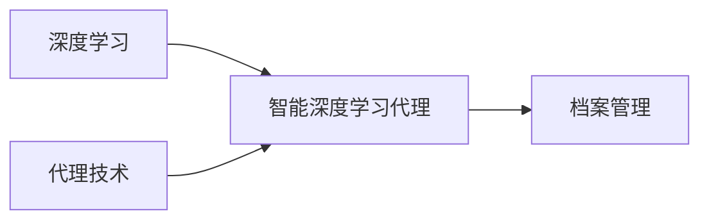

# AI人工智能深度学习算法：智能深度学习代理在档案管理中的应用

作者：禅与计算机程序设计艺术

## 1. 背景介绍

### 1.1 档案管理的挑战

随着信息技术的快速发展和社会信息化程度的不断提高，各行各业积累了海量的档案数据。传统的档案管理方式面临着诸多挑战，例如：

* **海量数据处理困难：** 档案数量庞大，人工处理效率低下，难以满足日益增长的管理需求。
* **信息检索效率低：** 传统的基于关键词检索的方式存在局限性，难以实现精准、高效的信息检索。
* **数据安全风险高：** 档案资料存储分散，安全管理难度大，存在数据泄露的风险。

### 1.2 深度学习技术的兴起

近年来，深度学习技术在图像识别、语音识别、自然语言处理等领域取得了突破性进展，为解决档案管理领域面临的挑战提供了新的思路和方法。

### 1.3 智能深度学习代理的应用前景

智能深度学习代理（Intelligent Deep Learning Agent）是深度学习技术与代理技术相结合的产物，能够模拟人类专家进行智能决策和操作。在档案管理领域，智能深度学习代理可以应用于以下方面：

* **智能分类和标引：** 自动对档案进行分类和标引，提高档案管理效率和信息检索精度。
* **智能检索：** 基于语义理解的智能检索，实现精准、高效的信息获取。
* **智能预警：** 对档案数据进行分析，识别潜在风险，及时预警，保障数据安全。

## 2. 核心概念与联系

### 2.1 深度学习

深度学习是一种机器学习方法，通过构建多层神经网络，对数据进行特征提取和模式识别，从而实现对复杂问题的智能处理。

### 2.2 代理技术

代理技术是一种软件工程方法，通过创建代理程序，代表用户或其他程序执行特定任务，实现自动化操作和智能决策。

### 2.3 智能深度学习代理

智能深度学习代理是深度学习技术与代理技术相结合的产物，它利用深度学习模型对数据进行分析和学习，并根据学习到的知识，自主地执行特定任务，实现智能化操作和决策。

### 2.4 档案管理

档案管理是指对档案进行收集、整理、保管、鉴定、统计和提供利用的活动，是保证档案完整与安全、充分发挥档案作用的重要手段。

### 2.5 概念联系图



## 3. 核心算法原理具体操作步骤

### 3.1 数据预处理

* **数据清洗：** 对原始档案数据进行清洗，去除噪声数据，例如重复数据、缺失数据等。
* **数据转换：** 将非结构化数据（例如图像、音频、视频）转换为结构化数据，以便于深度学习模型进行处理。
* **数据标注：** 对数据进行标注，例如对图像进行目标检测标注，对文本进行情感分类标注等，以便于训练深度学习模型。

### 3.2 模型构建

* **选择合适的深度学习模型：** 根据具体的应用场景选择合适的深度学习模型，例如卷积神经网络（CNN）适用于图像识别，循环神经网络（RNN）适用于自然语言处理。
* **模型训练：** 使用标注好的数据对深度学习模型进行训练，不断调整模型参数，提高模型的准确率和泛化能力。
* **模型评估：** 使用测试集对训练好的模型进行评估，评估指标包括准确率、召回率、F1值等。

### 3.3 代理设计

* **定义代理目标：** 明确代理需要完成的任务，例如智能分类、智能检索、智能预警等。
* **设计代理行为：** 设计代理的行为策略，例如如何获取数据、如何处理数据、如何做出决策等。
* **实现代理功能：** 使用编程语言实现代理的功能，例如使用 Python 语言实现一个智能分类代理。

### 3.4 系统集成

* **将训练好的深度学习模型集成到代理中。**
* **将代理部署到档案管理系统中。**
* **对系统进行测试和优化。**

## 4. 数学模型和公式详细讲解举例说明

### 4.1 卷积神经网络（CNN）

卷积神经网络是一种常用于图像识别的深度学习模型，其核心是卷积层和池化层。

**卷积层** 通过卷积核对输入数据进行卷积运算，提取数据的局部特征。

**池化层** 对卷积层的输出进行降维操作，保留数据的主要特征，减少计算量。

**公式：**

$$
\sigma(b + \sum_{l=0}^{L-1} W_l * x_{l + (i-1)S})
$$

其中：

* $\sigma$ 为激活函数，例如 ReLU 函数。
* $b$ 为偏置项。
* $W_l$ 为第 $l$ 个卷积核。
* $x_{l + (i-1)S}$ 为输入数据的第 $l + (i-1)S$ 个元素。
* $L$ 为卷积核的大小。
* $S$ 为步长。

**举例：**

假设输入图像大小为 $5 \times 5$，卷积核大小为 $3 \times 3$，步长为 $1$，则卷积层的输出大小为 $3 \times 3$。

### 4.2 循环神经网络（RNN）

循环神经网络是一种常用于自然语言处理的深度学习模型，其核心是循环单元。

**循环单元** 能够记忆历史信息，并将历史信息与当前输入信息相结合，进行预测。

**公式：**

$$
h_t = f(W_{xh}x_t + W_{hh}h_{t-1} + b_h)
$$

其中：

* $h_t$ 为当前时刻的隐藏状态。
* $f$ 为激活函数，例如 tanh 函数。
* $W_{xh}$ 为输入权重矩阵。
* $x_t$ 为当前时刻的输入。
* $W_{hh}$ 为隐藏状态权重矩阵。
* $h_{t-1}$ 为上一时刻的隐藏状态。
* $b_h$ 为偏置项。

**举例：**

假设输入文本序列为 "I love deep learning"，则循环神经网络可以根据历史信息预测下一个单词为 "algorithms"。

## 5. 项目实践：代码实例和详细解释说明

### 5.1 智能档案分类系统

**目标：** 自动对档案进行分类。

**技术方案：**

* 使用卷积神经网络（CNN）对档案图像进行特征提取。
* 使用 Softmax 分类器对档案进行分类。

**代码实例：**

```python
# 导入必要的库
import tensorflow as tf
from tensorflow.keras import layers

# 定义 CNN 模型
model = tf.keras.Sequential([
  layers.Conv2D(32, (3, 3), activation='relu', input_shape=(150, 150, 3)),
  layers.MaxPooling2D((2, 2)),
  layers.Conv2D(64, (3, 3), activation='relu'),
  layers.MaxPooling2D((2, 2)),
  layers.Conv2D(128, (3, 3), activation='relu'),
  layers.MaxPooling2D((2, 2)),
  layers.Flatten(),
  layers.Dense(10, activation='softmax')
])

# 编译模型
model.compile(optimizer='adam',
              loss=tf.keras.losses.SparseCategoricalCrossentropy(from_logits=True),
              metrics=['accuracy'])

# 训练模型
model.fit(train_images, train_labels, epochs=10)

# 评估模型
test_loss, test_acc = model.evaluate(test_images,  test_labels, verbose=2)
print('\nTest accuracy:', test_acc)
```

**解释说明：**

* 代码首先定义了一个 CNN 模型，该模型包含多个卷积层、池化层和全连接层。
* 然后使用 `compile` 方法编译模型，指定优化器、损失函数和评估指标。
* 接着使用 `fit` 方法训练模型，指定训练数据、训练轮数等参数。
* 最后使用 `evaluate` 方法评估模型，输出测试集上的损失值和准确率。

### 5.2 智能档案检索系统

**目标：** 实现基于语义理解的智能档案检索。

**技术方案：**

* 使用循环神经网络（RNN）对检索词和档案文本进行编码。
* 计算检索词编码和档案文本编码之间的相似度。
* 返回相似度最高的档案。

**代码实例：**

```python
# 导入必要的库
import tensorflow as tf
from tensorflow.keras import layers

# 定义 RNN 模型
model = tf.keras.Sequential([
  layers.Embedding(input_dim=vocab_size, output_dim=embedding_dim),
  layers.LSTM(units=128),
  layers.Dense(units=1)
])

# 编译模型
model.compile(optimizer='adam',
              loss='mse')

# 训练模型
model.fit(x_train, y_train, epochs=10)

# 预测
predictions = model.predict(x_test)
```

**解释说明：**

* 代码首先定义了一个 RNN 模型，该模型包含嵌入层、LSTM 层和全连接层。
* 然后使用 `compile` 方法编译模型，指定优化器和损失函数。
* 接着使用 `fit` 方法训练模型，指定训练数据、训练轮数等参数。
* 最后使用 `predict` 方法对测试数据进行预测，输出预测结果。

## 6. 实际应用场景

### 6.1 政府机关

* **电子政务档案管理：** 实现电子公文、电子签章等电子档案的智能化管理。
* **人事档案管理：** 实现干部人事档案的智能化管理，提高人事管理效率。

### 6.2 企业单位

* **合同档案管理：** 实现合同文本的智能化分类、检索和风险预警。
* **财务档案管理：** 实现财务报表的智能化处理和分析。

### 6.3 科研机构

* **科研项目档案管理：** 实现科研项目资料的智能化管理，促进科研成果的共享和交流。
* **文献档案管理：** 实现学术论文、专利文献等文献资料的智能化管理。

## 7. 工具和资源推荐

### 7.1 深度学习框架

* TensorFlow：Google 开源的深度学习框架。
* PyTorch：Facebook 开源的深度学习框架。

### 7.2 档案管理软件

* 金蝶 EAS：国内知名的企业管理软件，提供档案管理模块。
* 用友 NC：国内知名的企业管理软件，提供档案管理模块。

### 7.3 学习资源

* TensorFlow 官方文档：https://www.tensorflow.org/
* PyTorch 官方文档：https://pytorch.org/

## 8. 总结：未来发展趋势与挑战

### 8.1 未来发展趋势

* **智能化程度不断提高：** 随着深度学习技术的发展，智能深度学习代理的智能化程度将不断提高，能够处理更加复杂的档案管理任务。
* **应用场景不断扩展：** 智能深度学习代理将应用于更多的档案管理场景，例如档案数字化、档案安全管理等。
* **与其他技术的融合：** 智能深度学习代理将与云计算、大数据、区块链等技术深度融合，构建更加智能化的档案管理系统。

### 8.2 面临的挑战

* **数据质量问题：** 深度学习模型的性能依赖于数据的质量，而档案数据往往存在着质量参差不齐、标注不准确等问题。
* **模型解释性问题：** 深度学习模型 often 被认为是“黑盒”，其决策过程难以解释，这给档案管理工作带来了一定的风险。
* **安全隐私问题：** 档案数据往往包含着敏感信息，如何保障数据安全和用户隐私是智能档案管理系统需要重点关注的问题。

## 9. 附录：常见问题与解答

### 9.1 问：智能深度学习代理与传统档案管理软件有什么区别？

**答：** 智能深度学习代理利用深度学习技术对档案数据进行分析和处理，能够实现更加智能化的操作和决策，例如自动分类、语义检索、风险预警等。而传统档案管理软件主要依赖于人工操作和规则设置，智能化程度相对较低。

### 9.2 问：如何评估智能深度学习代理的性能？

**答：** 可以使用准确率、召回率、F1值等指标来评估智能深度学习代理的性能。此外，还可以根据具体的应用场景，设计相应的评估指标。

### 9.3 问：如何保障智能档案管理系统的安全？

**答：** 可以采取数据加密、访问控制、安全审计等措施来保障智能档案管理系统的安全。此外，还需要加强对用户隐私的保护，例如对用户数据进行脱敏处理。