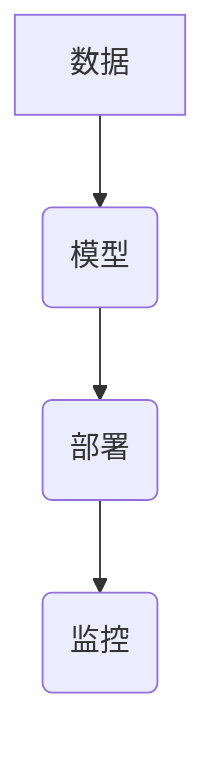

## 1. 背景介绍

### 1.1 人工智能的崛起与工程化需求

人工智能近年来取得了显著的进展，其应用已经渗透到各个领域，如图像识别、自然语言处理、机器学习等。然而，随着人工智能应用的不断深入，传统的软件开发模式已经难以满足其需求。为了更好地管理和开发人工智能项目，AI工程应运而生。

### 1.2 AI工程的定义与目标

AI工程是指将系统化、规范化的工程原理应用于人工智能项目的开发、部署和维护过程。其目标是提高人工智能项目的效率、可靠性和可维护性。

### 1.3 AI工程与传统软件工程的区别

AI工程与传统软件工程既有相似之处，也有显著区别。传统软件工程主要关注软件的开发过程，而AI工程则更关注数据的收集、处理、模型训练和部署等环节。

## 2. 核心概念与联系

### 2.1 数据

数据是人工智能的基石。高质量的数据是构建有效人工智能模型的关键。

#### 2.1.1 数据采集

数据采集是指从各种来源收集数据的过程。常见的数据源包括数据库、传感器、文本文件、图像和视频等。

#### 2.1.2 数据清洗

数据清洗是指对原始数据进行预处理，去除噪声、填充缺失值、纠正错误等。

#### 2.1.3 数据标注

数据标注是指为数据添加标签或注释，以便于机器学习模型理解数据的含义。

### 2.2 模型

模型是人工智能的核心。它是由算法和数据训练得到的，用于对新的数据进行预测或分类。

#### 2.2.1 模型选择

模型选择是指根据具体问题选择合适的机器学习模型。常见的模型包括线性回归、逻辑回归、支持向量机、决策树、神经网络等。

#### 2.2.2 模型训练

模型训练是指使用数据对模型进行优化，使其能够更好地拟合数据。

#### 2.2.3 模型评估

模型评估是指使用测试数据评估模型的性能，常用的指标包括准确率、召回率、F1值等。

### 2.3 部署

部署是指将训练好的模型应用于实际场景。

#### 2.3.1 模型部署方式

常见的模型部署方式包括云部署、边缘部署和嵌入式部署。

#### 2.3.2 模型监控

模型监控是指对部署后的模型进行持续监控，及时发现和解决问题。

## 3. 核心算法原理具体操作步骤

### 3.1 线性回归

线性回归是一种用于预测连续目标变量的算法。它假设目标变量与特征之间存在线性关系。

#### 3.1.1 算法原理

线性回归的目标是找到一条直线，使得所有数据点到直线的距离最小。

#### 3.1.2 操作步骤

1. 收集数据
2. 清洗数据
3. 将数据分为训练集和测试集
4. 使用训练集训练线性回归模型
5. 使用测试集评估模型性能

### 3.2 逻辑回归

逻辑回归是一种用于预测二元分类问题的算法。它将线性回归模型的输出通过sigmoid函数转换为概率值。

#### 3.2.1 算法原理

逻辑回归的目标是找到一条决策边界，将数据分为两类。

#### 3.2.2 操作步骤

1. 收集数据
2. 清洗数据
3. 将数据分为训练集和测试集
4. 使用训练集训练逻辑回归模型
5. 使用测试集评估模型性能

### 3.3 决策树

决策树是一种用于分类和回归问题的算法。它通过一系列 if-else 规则对数据进行分类。

#### 3.3.1 算法原理

决策树的目标是构建一棵树，使得每个叶节点对应一个类别或一个预测值。

#### 3.3.2 操作步骤

1. 收集数据
2. 清洗数据
3. 将数据分为训练集和测试集
4. 使用训练集构建决策树模型
5. 使用测试集评估模型性能

### 3.4 支持向量机

支持向量机是一种用于分类和回归问题的算法。它通过找到一个最优超平面将数据分为两类。

#### 3.4.1 算法原理

支持向量机的目标是找到一个超平面，使得两类数据之间的间隔最大。

#### 3.4.2 操作步骤

1. 收集数据
2. 清洗数据
3. 将数据分为训练集和测试集
4. 使用训练集训练支持向量机模型
5. 使用测试集评估模型性能

### 3.5 神经网络

神经网络是一种模仿人脑神经元结构的算法。它由多个神经元层组成，每个神经元层包含多个神经元。

#### 3.5.1 算法原理

神经网络的目标是通过学习数据中的模式来进行预测或分类。

#### 3.5.2 操作步骤

1. 收集数据
2. 清洗数据
3. 将数据分为训练集和测试集
4. 使用训练集训练神经网络模型
5. 使用测试集评估模型性能

## 4. 数学模型和公式详细讲解举例说明

### 4.1 线性回归

线性回归模型的数学公式如下：

$$ y = w_0 + w_1 x_1 + w_2 x_2 + ... + w_n x_n $$

其中：

* $y$ 是目标变量
* $x_1, x_2, ..., x_n$ 是特征
* $w_0, w_1, w_2, ..., w_n$ 是模型参数

#### 4.1.1 例子

假设我们要预测房价，特征包括房屋面积、卧室数量和浴室数量。线性回归模型可以表示为：

$$ 房价 = w_0 + w_1 * 房屋面积 + w_2 * 卧室数量 + w_3 * 浴室数量 $$

### 4.2 逻辑回归

逻辑回归模型的数学公式如下：

$$ p = \frac{1}{1 + e^{-(w_0 + w_1 x_1 + w_2 x_2 + ... + w_n x_n)}} $$

其中：

* $p$ 是目标变量的概率值
* $x_1, x_2, ..., x_n$ 是特征
* $w_0, w_1, w_2, ..., w_n$ 是模型参数

#### 4.2.1 例子

假设我们要预测用户是否点击广告，特征包括用户年龄、性别和浏览历史。逻辑回归模型可以表示为：

$$ p(点击广告) = \frac{1}{1 + e^{-(w_0 + w_1 * 用户年龄 + w_2 * 性别 + w_3 * 浏览历史)}} $$

## 5. 项目实践：代码实例和详细解释说明

### 5.1 图像分类项目

#### 5.1.1 项目目标

构建一个图像分类模型，能够识别不同种类的动物。

#### 5.1.2 代码实例

```python
import tensorflow as tf

# 加载数据集
(x_train, y_train), (x_test, y_test) = tf.keras.datasets.cifar10.load_data()

# 构建模型
model = tf.keras.models.Sequential([
  tf.keras.layers.Conv2D(32, (3, 3), activation='relu', input_shape=(32, 32, 3)),
  tf.keras.layers.MaxPooling2D((2, 2)),
  tf.keras.layers.Conv2D(64, (3, 3), activation='relu'),
  tf.keras.layers.MaxPooling2D((2, 2)),
  tf.keras.layers.Flatten(),
  tf.keras.layers.Dense(10, activation='softmax')
])

# 编译模型
model.compile(optimizer='adam',
              loss='sparse_categorical_crossentropy',
              metrics=['accuracy'])

# 训练模型
model.fit(x_train, y_train, epochs=10)

# 评估模型
test_loss, test_acc = model.evaluate(x_test, y_test, verbose=2)
print('\nTest accuracy:', test_acc)
```

#### 5.1.3 代码解释

* `tf.keras.datasets.cifar10.load_data()` 用于加载 CIFAR-10 数据集。
* `tf.keras.models.Sequential()` 用于构建一个顺序模型。
* `tf.keras.layers.Conv2D()` 用于添加卷积层。
* `tf.keras.layers.MaxPooling2D()` 用于添加最大池化层。
* `tf.keras.layers.Flatten()` 用于将多维数据展平为一维数据。
* `tf.keras.layers.Dense()` 用于添加全连接层。
* `model.compile()` 用于编译模型，指定优化器、损失函数和评估指标。
* `model.fit()` 用于训练模型。
* `model.evaluate()` 用于评估模型性能。

## 6. 实际应用场景

### 6.1 图像识别

图像识别技术应用广泛，如人脸识别、物体识别、医学影像分析等。

### 6.2 自然语言处理

自然语言处理技术应用于机器翻译、文本摘要、情感分析等领域。

### 6.3 机器学习

机器学习技术应用于推荐系统、风险控制、欺诈检测等领域。

## 7. 工具和资源推荐

### 7.1 TensorFlow

TensorFlow 是一个开源机器学习平台，提供了丰富的工具和资源，用于构建和部署人工智能模型。

### 7.2 PyTorch

PyTorch 是另一个开源机器学习平台，以其灵活性和易用性而闻名。

### 7.3 scikit-learn

scikit-learn 是一个用于机器学习的 Python 库，提供了各种算法和工具，用于数据预处理、模型训练和评估。

## 8. 总结：未来发展趋势与挑战

### 8.1 AI工程的未来发展趋势

* 自动化机器学习 (AutoML)
* 云原生 AI
* 边缘人工智能
* 可解释人工智能 (XAI)

### 8.2 AI工程面临的挑战

* 数据隐私和安全
* 模型偏差和公平性
* 模型可解释性和可信度
* 人工智能伦理

## 9. 附录：常见问题与解答

### 9.1 如何选择合适的机器学习模型？

选择合适的机器学习模型取决于具体问题和数据特征。可以参考以下因素：

* 数据类型
* 问题类型
* 模型复杂度
* 可解释性

### 9.2 如何提高模型性能？

可以通过以下方法提高模型性能：

* 收集更多数据
* 清洗数据
* 特征工程
* 模型调参
* 模型集成

### 9.3 如何部署人工智能模型？

人工智能模型的部署方式取决于具体需求。常见的部署方式包括：

* 云部署
* 边缘部署
* 嵌入式部署

### 9.4 如何监控人工智能模型？

可以通过以下方法监控人工智能模型：

* 性能监控
* 数据漂移检测
* 模型解释

## 10. 核心概念原理和架构的 Mermaid 流程图


