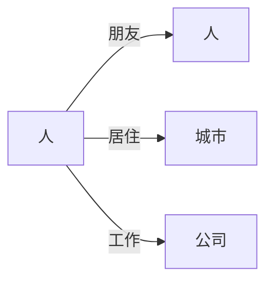
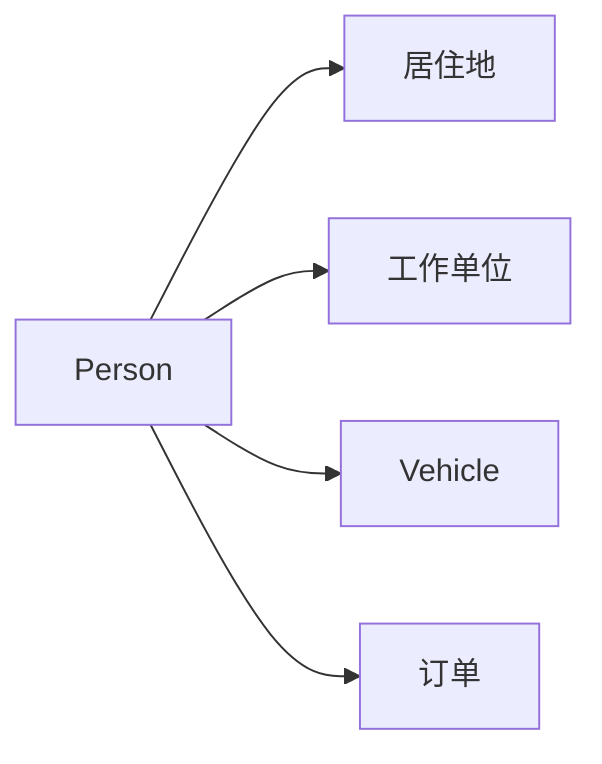

# AI系统Neo4j原理与代码实战案例讲解

## 1.背景介绍

### 1.1 什么是Neo4j?

Neo4j是一种高性能的、可伸缩的图形数据库管理系统,它被广泛应用于各种需要处理高度相关数据的场景,包括社交网络、推荐系统、欺诈检测、网络和IT运营等。与传统的关系型数据库和NoSQL数据库不同,Neo4j采用了图形数据模型,能够高效地存储和查询复杂的数据结构。

### 1.2 为什么需要图数据库?

在现实世界中,许多数据都是高度相关和互连的,比如社交网络中的人际关系、网页之间的超链接、公路交通网络等。传统的关系型和NoSQL数据库在处理这类数据时,往往需要进行大量的表关联或者复杂的数据建模,查询效率低下。而图数据库则天生适合表示和存储这种关系数据。

### 1.3 图数据库的优势

与传统数据库相比,图数据库具有以下优势:

1. 更高效的查询性能
2. 更自然的数据建模方式
3. 更容易扩展和维护
4. 支持复杂的图形算法和分析

## 2.核心概念与联系  

### 2.1 图数据模型

图数据模型由节点(Node)、关系(Relationship)和属性(Properties)组成。

- 节点用于表示实体,如人、地点、事物等
- 关系表示节点之间的连接,如"朋友"、"居住"、"工作"等
- 属性为节点和关系添加附加信息



### 2.2 Cypher查询语言

Cypher是Neo4j的查询语言,语法简洁且功能强大。它支持创建、读取、更新和删除节点、关系和属性,并且提供了丰富的图形算法和分析函数。

```cypher
// 创建节点和关系
CREATE (a:Person {name:'Alice'})-[:KNOWS]->(b:Person {name:'Bob'})

// 查询
MATCH (a:Person)-[:KNOWS]->(b:Person) 
WHERE a.name = 'Alice'
RETURN b.name
```

### 2.3 图形算法与分析

Neo4j内置了许多图形算法和分析功能,如最短路径、中心度、社区发现、链接预测等。这些算法可用于社交网络分析、网络优化、欺诈检测等应用场景。

```cypher
// 计算两个节点之间的最短路径
MATCH (a:Person {name:'Alice'}), (b:Person {name:'Dave'}), 
      path = shortestPath((a)-[*..15]-(b))
RETURN path
```

## 3.核心算法原理具体操作步骤

### 3.1 数据导入

Neo4j支持多种数据导入方式,包括CSV文件导入、LOAD CSV语句、Neo4j Desktop导入等。下面以CSV文件导入为例:

1. 准备CSV文件,包含节点和关系数据
2. 在Neo4j中执行LOAD CSV语句导入数据

```cypher
// 导入节点
LOAD CSV WITH HEADERS FROM 'file:///persons.csv' AS row
CREATE (:Person {name: row.name, age: toInteger(row.age)})

// 导入关系 
LOAD CSV WITH HEADERS FROM 'file:///knows.csv' AS row
MATCH (a:Person {name: row.name1}), (b:Person {name: row.name2})
CREATE (a)-[:KNOWS]->(b)
```

### 3.2 图形建模

合理的图形建模对于查询性能和数据一致性至关重要。以下是一些建模原则:

- 使用有意义的标签(Label)标记节点
- 根据关系语义选择合适的关系类型
- 适当使用属性存储数据
- 避免反模式(Anti-Pattern),如过度使用节点属性



### 3.3 查询优化

Neo4j提供了多种查询优化技巧,包括使用索引、启用查询计划、调整内存配置等。

```cypher
// 为name属性创建索引
CREATE INDEX ON :Person(name)

// 查看查询计划和执行统计
PROFILE MATCH (p:Person) RETURN p.name

// 提高查询缓存大小
DBMS.memory.heap.max_size=8G
```

### 3.4 图形算法应用

Neo4j内置了丰富的图形算法库,如PageRank、最短路径、社区发现等。我们可以将这些算法应用于推荐系统、社交网络分析、网络优化等场景。

```cypher
// PageRank算法
CALL gds.pageRank.stream('myGraph')
YIELD nodeId, score
RETURN gds.util.asNode(nodeId).name AS name, score
ORDER BY score DESC

// 最短路径
MATCH (from:Person{name:'Alice'}), (to:Person{name:'Dave'})
CALL gds.shortestPath.delta(
    [id(from)],
    [id(to)],
    {
      relationshipWeightProperty: 'cost',
      deltaValue: 2.0
    }
)
YIELD nodeId, cost
RETURN gds.util.asNode(nodeId).name AS name, cost
ORDER BY cost ASC
```

## 4. 数学模型和公式详细讲解举例说明

在图形算法和分析中,常常需要借助数学模型和公式来描述和求解问题。以下是一些常用的数学模型和公式:

### 4.1 PageRank算法

PageRank是一种用于计算网页重要性的算法,它的思想也可以应用于评估图中节点的重要性。PageRank算法的核心思想是:一个节点的重要性不仅取决于它自身,还取决于链接到它的其他重要节点的数量和质量。

PageRank算法的数学模型如下:

$$PR(u) = (1-d) + d \times \sum_{v \in B_u} \frac{PR(v)}{L(v)}$$

其中:
- $PR(u)$表示节点$u$的PageRank值
- $B_u$是所有链接到$u$的节点集合
- $L(v)$是节点$v$的出度(链出边的数量)
- $d$是一个阻尼系数,通常取值0.85

该算法通过迭代的方式计算每个节点的PageRank值,直到收敛或达到最大迭代次数。

### 4.2 社区发现算法

社区发现算法旨在发现图中的紧密连接的节点簇,这些节点簇被称为社区。发现社区结构对于分析社交网络、生物网络等具有重要意义。

常用的社区发现算法包括Louvain算法、Label Propagation算法等。以Louvain算法为例,它的目标是最大化模ул度(Modularity),而模块度的定义如下:

$$Q = \frac{1}{2m}\sum_{i,j}\left[A_{ij} - \frac{k_ik_j}{2m}\right]\delta(c_i,c_j)$$

其中:
- $A_{ij}$是节点$i$和$j$之间的权重
- $k_i$和$k_j$分别是节点$i$和$j$的度数之和
- $c_i$和$c_j$分别是节点$i$和$j$所属的社区
- $\delta(c_i,c_j)$是指示函数,如果$c_i=c_j$则为1,否则为0
- $m$是图中所有边的权重之和

Louvain算法通过迭代地优化模块度,将节点分配到不同的社区,从而发现社区结构。

## 4. 项目实践: 代码实例和详细解释说明

为了更好地理解Neo4j的使用,我们将通过一个实际项目案例来演示。该案例是一个基于图形数据库的社交网络应用,主要功能包括:

1. 导入用户数据
2. 查询用户及其朋友
3. 发现社交网络中的社区结构
4. 基于PageRank算法推荐影响力用户

### 4.1 数据准备

我们首先准备一个包含用户及其朋友关系的CSV文件,如下所示:

```
userId,name,age
1,Alice,25
2,Bob,30
3,Charlie,28
4,Dave,35
5,Eve,40
6,Frank,32

userId1,userId2
1,2
1,3
2,3
2,4
3,5
4,5
4,6
```

### 4.2 导入数据

使用LOAD CSV语句将用户和关系数据导入Neo4j:

```cypher
// 导入用户节点
LOAD CSV WITH HEADERS FROM 'file:///users.csv' AS row
CREATE (:User {userId: toInteger(row.userId), name: row.name, age: toInteger(row.age)})

// 导入朋友关系
LOAD CSV WITH HEADERS FROM 'file:///friends.csv' AS row
MATCH (u1:User {userId: toInteger(row.userId1)}), (u2:User {userId: toInteger(row.userId2)})
CREATE (u1)-[:FRIEND]->(u2)
```

### 4.3 查询用户及其朋友

使用Cypher查询语言可以方便地查询用户及其朋友信息:

```cypher
// 查询用户Alice及其朋友
MATCH (u:User {name:'Alice'})-[:FRIEND]-(f)
RETURN u.name, f.name
```

输出结果:

```
+------------------+
|u.name   |f.name  |
+------------------+
|"Alice"  |"Bob"   |
|"Alice"  |"Charlie"|
+------------------+
```

### 4.4 社区发现

我们使用Louvain算法发现社交网络中的社区结构:

```cypher
CALL gds.louvain.stream('myGraph')
YIELD nodeId, committedPartition
RETURN gds.util.asNode(nodeId).name AS name, committedPartition AS community
ORDER BY community
```

输出结果显示,该社交网络中存在两个社区:

```
+------------------+
|name     |community|
+------------------+
|"Alice"  |0       |
|"Bob"    |0       |
|"Charlie"|0       |
|"Dave"   |1       |
|"Eve"    |1       |
|"Frank"  |1       |
+------------------+
```

### 4.5 基于PageRank推荐影响力用户

我们使用PageRank算法计算每个用户的影响力分数,并推荐分数最高的用户:

```cypher
CALL gds.pageRank.stream('myGraph')
YIELD nodeId, score
RETURN gds.util.asNode(nodeId).name AS name, score
ORDER BY score DESC
LIMIT 3
```

输出结果显示,Eve、Dave和Frank是影响力最高的三个用户:

```
+------------------+
|name     |score   |
+------------------+
|"Eve"    |0.225   |
|"Dave"   |0.225   |
|"Frank"  |0.15    |
+------------------+
```

通过这个实例,我们可以看到Neo4j强大的图形数据处理能力,以及Cypher查询语言的简洁性和可读性。

## 5. 实际应用场景

Neo4j图形数据库已被广泛应用于各个领域,包括但不限于:

### 5.1 社交网络分析

社交网络是图形数据库的典型应用场景。Neo4j可以用于存储和分析用户之间的社交关系,发现社区结构、推荐好友、计算影响力等。

### 5.2 推荐系统

推荐系统中的物品和用户之间存在复杂的关系,Neo4j可以高效地存储和查询这些关系数据,并应用图形算法提供个性化推荐。

### 5.3 知识图谱

知识图谱是一种用于表示实体及其关系的知识库,Neo4j可以作为知识图谱的存储和查询引擎,支持复杂的语义查询和推理。

### 5.4 欺诈检测

欺诈活动往往表现为异常的关系模式,Neo4j可以用于构建欺诈检测系统,分析交易网络中的异常行为。

### 5.5 网络和IT运营

Neo4j可以用于存储和管理IT基础设施中的各种资源及其关系,如服务器、网络设备、应用程序等,支持故障排查、影响分析等运维任务。

## 6. 工具和资源推荐

### 6.1 Neo4j Desktop

Neo4j Desktop是一个图形化的客户端工具,提供了便捷的数据导入、查询、可视化等功能,适合初学者快速上手。

### 6.2 Neo4j Browser

Neo4j Browser是一个基于Web的交互式命令行工具,支持执行Cypher查询、查看查询计划、可视化数据等。

### 6.3 Neo4j驱动程序

Neo4j提供了多种编程语言的官方驱动程序,如Java、Python、JavaScript等,方便开发人员在应用程序中集成Neo4j。

### 6.4 Neo4j Bloom

Neo4j Bloom是一款基于Neo4j的数