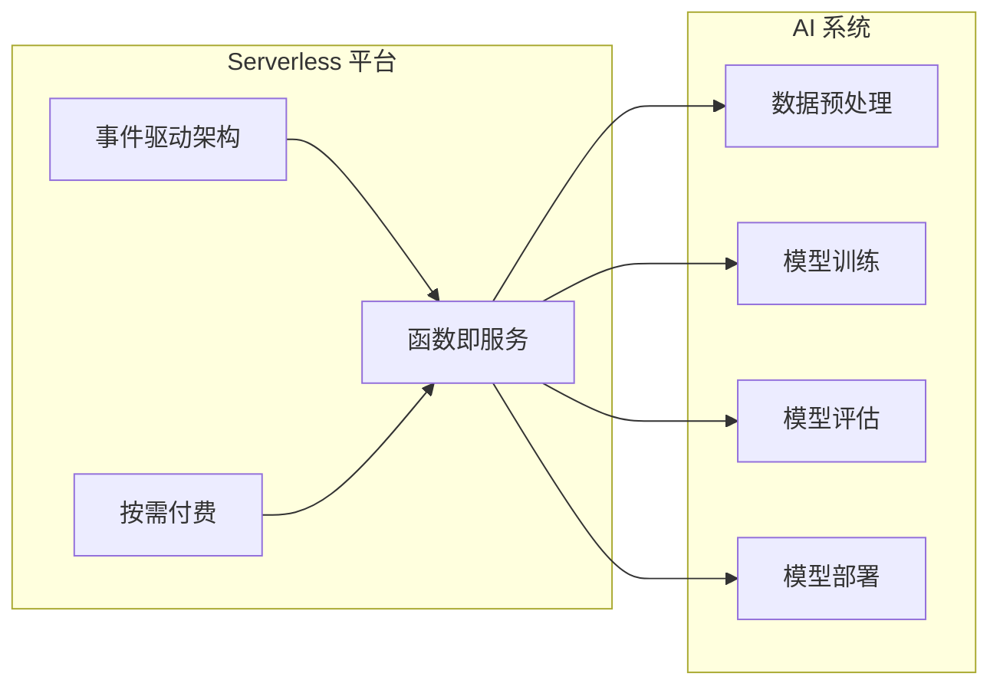

# AI系统Serverless原理与代码实战案例讲解

作者：禅与计算机程序设计艺术

## 1. 背景介绍

### 1.1 人工智能发展浪潮与挑战

近年来，人工智能（AI）技术取得了突飞猛进的发展，从图像识别、自然语言处理到机器学习，AI 已经渗透到我们生活的方方面面。然而，随着 AI 应用的普及和数据规模的爆炸式增长，传统的 AI 系统架构面临着越来越大的挑战：

* **资源管理复杂：** 训练和部署 AI 模型需要大量的计算资源，包括 CPU、GPU、内存和存储等。如何高效地管理和调度这些资源成为了一项艰巨的任务。
* **可扩展性受限：** 传统的 AI 系统架构通常难以应对突发的流量高峰，例如电商平台的促销活动或社交媒体上的热点事件。
* **部署维护成本高：** 构建和维护一个完整的 AI 系统需要专业的技术团队和大量的资金投入。

### 1.2 Serverless 计算的兴起

Serverless 计算作为一种新兴的云计算模式，为解决上述挑战提供了新的思路。与传统的服务器租赁模式不同，Serverless 计算允许用户无需关心底层服务器的运维和管理，只需专注于业务逻辑的开发和部署。其核心思想是将应用程序拆分成一个个独立的函数，并根据实际需求动态地分配计算资源，从而实现自动化的弹性伸缩和按需付费。

### 1.3 Serverless AI：释放人工智能的无限潜力

将 Serverless 计算应用于 AI 系统，可以有效地解决传统 AI 系统架构面临的挑战。Serverless AI 具有以下优势：

* **简化资源管理：** 用户无需关心底层服务器的运维和管理，可以将精力集中在 AI 模型的开发和优化上。
* **提高可扩展性：** Serverless 平台可以根据实际需求自动地扩展或缩减计算资源，轻松应对流量高峰。
* **降低部署维护成本：** Serverless 计算采用按需付费的模式，用户只需为实际使用的资源付费，可以有效地降低成本。

## 2. 核心概念与联系

### 2.1 Serverless 计算核心概念

* **函数即服务（Function-as-a-Service，FaaS）：**  FaaS 是 Serverless 计算的核心概念，它允许用户将应用程序拆分成一个个独立的函数，并独立地部署和运行这些函数。
* **事件驱动架构（Event-Driven Architecture，EDA）：** Serverless 应用程序通常采用事件驱动架构，即函数的执行由事件触发，例如 HTTP 请求、消息队列或数据库更新等。
* **按需付费（Pay-as-You-Go）：**  Serverless 计算采用按需付费的模式，用户只需为实际使用的资源付费。

### 2.2 AI 系统核心组件

* **数据预处理：** 对原始数据进行清洗、转换和特征提取，为模型训练做好准备。
* **模型训练：** 使用预处理后的数据训练 AI 模型。
* **模型评估：**  使用测试集评估模型的性能，例如准确率、召回率等。
* **模型部署：** 将训练好的模型部署到生产环境，提供预测服务。

### 2.3 Serverless AI 架构

Serverless AI 架构将 Serverless 计算的优势与 AI 系统的各个组件相结合，形成了一种高效、灵活、低成本的 AI 系统解决方案。



## 3. 核心算法原理具体操作步骤

### 3.1 使用 Serverless 函数进行数据预处理

以图像分类任务为例，介绍如何使用 Serverless 函数进行数据预处理。

1. **创建 Serverless 函数：** 在 Serverless 平台上创建一个函数，用于接收原始图像数据。
2. **图像解码和缩放：** 在函数中使用图像处理库（例如 OpenCV）对原始图像进行解码和缩放。
3. **数据增强：**  为了提高模型的泛化能力，可以对图像进行数据增强操作，例如随机裁剪、旋转和翻转等。
4. **特征提取：**  使用预训练的卷积神经网络（CNN）模型（例如 ResNet、VGG）对图像进行特征提取。
5. **数据存储：** 将预处理后的特征数据存储到对象存储服务中，供模型训练使用。

### 3.2 使用 Serverless 函数进行模型训练

1. **创建 Serverless 函数：** 在 Serverless 平台上创建一个函数，用于执行模型训练任务。
2. **加载训练数据：** 从对象存储服务中加载预处理后的特征数据。
3. **构建模型：**  使用深度学习框架（例如 TensorFlow、PyTorch）构建模型结构。
4. **模型训练：** 使用训练数据对模型进行训练，并保存训练好的模型参数。
5. **模型评估：**  使用测试集评估模型的性能，例如准确率、召回率等。

### 3.3 使用 Serverless 函数进行模型部署

1. **创建 Serverless 函数：** 在 Serverless 平台上创建一个函数，用于提供模型预测服务。
2. **加载模型参数：** 从对象存储服务中加载训练好的模型参数。
3. **接收预测请求：**  函数接收预测请求，例如图像数据。
4. **模型预测：**  使用加载的模型参数对输入数据进行预测。
5. **返回预测结果：**  将预测结果返回给客户端。

## 4. 数学模型和公式详细讲解举例说明

### 4.1 卷积神经网络（CNN）

卷积神经网络（CNN）是一种专门用于处理图像数据的深度学习模型。其核心思想是使用卷积核对输入图像进行卷积操作，提取图像的特征。

**卷积操作：**

$$
(f * g)(t) = \int_{-\infty}^{\infty} f(\tau)g(t-\tau)d\tau
$$

其中，$f$ 是输入图像，$g$ 是卷积核，$*$ 表示卷积操作。

**池化操作：**

池化操作用于降低特征图的维度，常用的池化操作包括最大池化和平均池化。

**最大池化：**

$$
maxpool(x) = max(x_1, x_2, ..., x_n)
$$

**平均池化：**

$$
avgpool(x) = \frac{1}{n} \sum_{i=1}^{n} x_i
$$

### 4.2 循环神经网络（RNN）

循环神经网络（RNN）是一种专门用于处理序列数据的深度学习模型。其核心思想是使用循环结构来记忆之前的输入信息。

**RNN 隐藏状态更新公式：**

$$
h_t = f(W_{xh}x_t + W_{hh}h_{t-1} + b_h)
$$

其中，$h_t$ 是当前时刻的隐藏状态，$x_t$ 是当前时刻的输入，$W_{xh}$ 是输入到隐藏状态的权重矩阵，$W_{hh}$ 是隐藏状态到隐藏状态的权重矩阵，$b_h$ 是偏置项，$f$ 是激活函数。

## 5. 项目实践：代码实例和详细解释说明

### 5.1 使用 Serverless Framework 部署 AI 模型

```python
# serverless.yml

service: image-classification

provider:
  name: aws
  runtime: python3.8

functions:
  classify:
    handler: handler.classify
    events:
      - http:
          path: /classify
          method: post

# handler.py

import json
import boto3
import tensorflow as tf

# 加载模型参数
s3 = boto3.client('s3')
s3.download_file('my-bucket', 'model.h5', '/tmp/model.h5')
model = tf.keras.models.load_model('/tmp/model.h5')

def classify(event, context):
  # 获取图像数据
  image_data = json.loads(event['body'])['image_data']

  # 模型预测
  predictions = model.predict(image_data)

  # 返回预测结果
  return {
    'statusCode': 200,
    'body': json.dumps({
      'predictions': predictions.tolist()
    })
  }
```

### 5.2 使用 AWS Lambda 和 AWS Fargate 部署 AI 模型

```python
# main.py

import boto3
import tensorflow as tf

# 加载模型参数
s3 = boto3.client('s3')
s3.download_file('my-bucket', 'model.h5', '/tmp/model.h5')
model = tf.keras.models.load_model('/tmp/model.h5')

# 创建 Fargate 任务定义
ecs = boto3.client('ecs')
response = ecs.register_task_definition(
  family='image-classification',
  containerDefinitions=[
    {
      'name': 'image-classification-container',
      'image': 'my-docker-image',
      'portMappings': [
        {
          'containerPort': 8080,
          'hostPort': 8080
        }
      ],
      'environment': [
        {
          'name': 'MODEL_PATH',
          'value': '/tmp/model.h5'
        }
      ]
    }
  ]
)

# 创建 Lambda 函数
lambda_client = boto3.client('lambda')
response = lambda_client.create_function(
  FunctionName='image-classification-lambda',
  Runtime='python3.8',
  Role='arn:aws:iam::123456789012:role/lambda-role',
  Handler='main.handler',
  Code={
    'ZipFile': open('main.zip', 'rb').read()
  },
  Timeout=30,
  MemorySize=128
)

# 创建 API Gateway 端点
api_client = boto3.client('apigateway')
response = api_client.create_rest_api(
  name='image-classification-api'
)

# 部署 API
response = api_client.create_deployment(
  restApiId=response['id'],
  stageName='prod'
)
```

## 6. 实际应用场景

### 6.1 图像识别

* **目标检测：** 在自动驾驶、安防监控等领域，可以使用 Serverless AI 实现实时目标检测。
* **图像分类：** 在电商平台、社交媒体等领域，可以使用 Serverless AI 对图像进行分类，例如识别商品、识别人物等。
* **图像生成：** 在游戏、设计等领域，可以使用 Serverless AI 生成逼真的图像。

### 6.2 自然语言处理

* **机器翻译：**  可以使用 Serverless AI 实现实时机器翻译。
* **情感分析：**  可以使用 Serverless AI 对文本进行情感分析，例如识别用户评论的情感倾向。
* **聊天机器人：**  可以使用 Serverless AI 构建智能聊天机器人，例如客服机器人、娱乐机器人等。

### 6.3 机器学习

* **欺诈检测：**  可以使用 Serverless AI 构建欺诈检测模型，例如识别信用卡欺诈、保险欺诈等。
* **个性化推荐：**  可以使用 Serverless AI 构建个性化推荐系统，例如推荐商品、推荐音乐等。
* **预测分析：**  可以使用 Serverless AI 进行预测分析，例如预测股票价格、预测销售额等。


## 7. 工具和资源推荐

### 7.1 Serverless 平台

* **AWS Lambda:**  亚马逊云服务提供的 Serverless 计算服务。
* **Google Cloud Functions:** 谷歌云平台提供的 Serverless 计算服务。
* **Azure Functions:** 微软 Azure 云平台提供的 Serverless 计算服务。

### 7.2 AI 工具和框架

* **TensorFlow:**  谷歌开源的深度学习框架。
* **PyTorch:**  Facebook 开源的深度学习框架。
* **Keras:**  基于 TensorFlow 和 Theano 的高级神经网络 API。

### 7.3 数据集

* **ImageNet:**  大规模图像数据集，包含超过 1400 万张图片。
* **COCO:**  大规模目标检测、分割和字幕数据集。
* **GLUE:**  自然语言理解任务的基准数据集。


## 8. 总结：未来发展趋势与挑战

Serverless AI 作为一种新兴的技术趋势，正在快速发展，并将在未来几年内对 AI 领域产生深远的影响。

### 8.1 未来发展趋势

* **更细粒度的资源调度：**  Serverless 平台将提供更细粒度的资源调度能力，例如按函数执行时间、内存使用量等进行计费。
* **更丰富的 AI 服务：**  Serverless 平台将提供更丰富的 AI 服务，例如预训练的模型、数据预处理工具等。
* **更广泛的应用场景：**  Serverless AI 将应用于更广泛的场景，例如边缘计算、物联网等。

### 8.2 面临的挑战

* **冷启动问题：**  Serverless 函数在首次调用时，需要加载代码和依赖库，这会导致一定的延迟。
* **状态管理：**  Serverless 函数是无状态的，如何管理函数之间的状态信息是一个挑战。
* **安全性：**  Serverless AI 系统需要考虑数据的安全性和模型的安全性。

## 9. 附录：常见问题与解答

### 9.1 什么是冷启动？

冷启动是指 Serverless 函数在首次调用时，需要加载代码和依赖库，这会导致一定的延迟。

**解决方法：**

* **使用预热函数：**  可以定期调用函数，使其保持活跃状态，减少冷启动的概率。
* **减小代码包大小：**  减小代码包的大小可以缩短加载时间。
* **使用预加载库：**  可以将常用的库预加载到函数运行环境中，减少加载时间。

### 9.2 如何管理 Serverless 函数之间的状态信息？

Serverless 函数是无状态的，如果需要在函数之间共享状态信息，可以使用外部存储服务，例如数据库、缓存等。

**推荐方案：**

* **使用数据库：**  可以使用关系型数据库或 NoSQL 数据库存储状态信息。
* **使用缓存：**  可以使用缓存服务（例如 Redis）存储 frequently accessed 状态信息。

### 9.3 如何保证 Serverless AI 系统的安全性？

* **数据安全：**  对敏感数据进行加密存储和传输。
* **模型安全：**  对模型进行身份验证和授权，防止未经授权的访问和修改。
* **平台安全：**  选择安全可靠的 Serverless 平台，并配置相应的安全策略。
