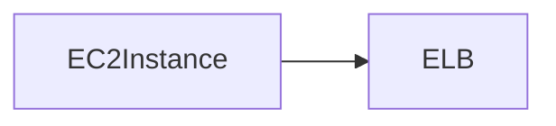

# AI系统Terraform原理与代码实战案例讲解

## 1.背景介绍

### 1.1 什么是Terraform

Terraform是一种开源的基础设施即代码(Infrastructure as Code, IaC)工具,由HashiCorp公司开发和维护。它允许用户使用简单的配置语言描述和预配所需的资源,从而实现云资源的构建、更改和版本管理。

Terraform支持多种云服务提供商,如AWS、Azure、Google Cloud等,以及本地虚拟化解决方案,如VMware、OpenStack等。它使用声明式配置文件,描述期望的资源状态,然后Terraform计算出如何达到该状态并执行相应操作。

### 1.2 为什么需要Terraform

传统的基础设施供应通常是手动操作,存在以下一些问题:

- 效率低下且容易出错
- 缺乏版本控制和可重复性 
- 跨云环境部署困难
- 缺乏基础设施自动化

Terraform通过IaC的方式解决了上述问题,提供了以下主要优势:

- 提高效率,减少人为错误
- 版本控制和可重复部署
- 云环境无缝迁移
- 基础设施全生命周期管理

## 2.核心概念与联系  

### 2.1 Terraform核心概念

Terraform包含以下几个核心概念:

1. **Resources**
   
   资源是Terraform中最重要的概念。每个资源对应实际的一个基础设施组件,如EC2实例、VPC网络等。资源由资源类型(如aws_instance)和名称唯一标识。

2. **Providers**  

   Provider是Terraform与底层云服务提供商API交互的组件。每个Provider对应一个云平台或服务,如AWS、Azure、Google Cloud等。

3. **State**

   State文件记录了当前资源的元数据,如资源ID、依赖关系等。State用于计划和创建资源。

4. **Configuration**

   配置文件使用HashiCorp配置语言(HCL)定义所需的资源。它描述了期望的资源状态。

5. **Execution Plan**

   执行计划描述Terraform将执行的操作,以将实际状态转变为期望状态。

6. **Apply**  

   Apply步骤根据执行计划创建、修改或销毁资源。

### 2.2 Terraform工作流程

Terraform的基本工作流程如下:

1. 编写配置文件,定义所需资源
2. 运行`terraform init`初始化工作目录和Provider插件
3. 运行`terraform plan`预览将执行的操作
4. 运行`terraform apply`应用执行计划,创建或修改资源
5. 修改配置文件,重复步骤3和4
6. 运行`terraform destroy`销毁资源


## 3.核心算法原理具体操作步骤

Terraform的核心算法包括以下几个主要步骤:

### 3.1 配置文件解析

Terraform首先解析配置文件,将HCL语法解析为内部数据结构。这个过程包括词法分析、语法分析和语义分析。

### 3.2 资源依赖关系构建

Terraform分析配置文件中资源之间的隐式和显式依赖关系,构建依赖关系图。这确保资源按正确顺序创建、修改或销毁。

### 3.3 状态文件读取

Terraform读取现有的状态文件,获取当前资源的元数据信息,如资源ID、属性等。如果是首次运行,则创建新的空状态文件。

### 3.4 执行计划生成

Terraform根据配置文件和状态文件,计算出将要执行的操作,生成执行计划。执行计划描述了将要创建、修改或销毁的资源,以及操作顺序。

### 3.5 资源操作

Terraform根据执行计划,与Provider API交互,执行对应的创建、修改或销毁资源操作。

### 3.6 状态文件更新  

操作完成后,Terraform更新状态文件,记录新的资源元数据,以备将来使用。

这个过程是增量式的,Terraform只修改必要的部分,而不是每次都重建整个基础设施。

## 4.数学模型和公式详细讲解举例说明

Terraform在生成执行计划时,需要计算资源之间的依赖关系。这是一个图理论问题,可以使用拓扑排序算法来解决。

### 4.1 拓扑排序算法

给定一个有向无环图G=(V,E),拓扑排序是将图中所有顶点排成一个线性序列,使得对于任意连接自顶点u到顶点v的有向边(u,v),在该线性序列中u都排在v之前。

拓扑排序算法可以用来确定资源的创建、修改和销毁顺序,确保依赖资源先于被依赖资源执行操作。

#### 4.1.1 Kahn算法

Kahn算法是一种高效的拓扑排序算法,时间复杂度为O(V+E)。算法步骤如下:

1. 统计所有顶点的入度,将入度为0的顶点放入队列Q
2. 从Q中取出一个顶点u,将u放入拓扑序列
3. 遍历u的所有邻接顶点v,将v的入度减1。如果v的入度变为0,则将v放入Q
4. 重复步骤2和3,直到Q为空

$$
\begin{array}{l}
\textbf{算法:} \text{Kahn拓扑排序}(G) \\
\qquad n \gets \text{图G的顶点数量}\\  
\qquad \text{入度数组} indegree[1\ldots n] \gets \{0\} \\
\qquad \textbf{for } \text{每个顶点} v \\
\qquad\qquad \textbf{for }\text{每个以} v \text{为起点的边} (v, w) \\
\qquad\qquad\qquad indegree[w] \gets indegree[w] + 1 \\
\qquad Q \gets \text{空队列} \\  
\qquad \textbf{for } i=1 \textbf{ to } n \\
\qquad\qquad \textbf{if } indegree[i] = 0 \\
\qquad\qquad\qquad \text{将顶点} i \text{插入队列} Q \\  
\qquad \textbf{while } Q \not= \emptyset\\
\qquad\qquad u \gets \text{从队列} Q \text{中删除一个顶点} \\
\qquad\qquad \text{输出顶点} u \\
\qquad\qquad \textbf{for } \text{每个以} u \text{为起点的边} (u, v)\\
\qquad\qquad\qquad indegree[v] \gets indegree[v] - 1\\
\qquad\qquad\qquad \textbf{if } indegree[v] = 0\\
\qquad\qquad\qquad\qquad \text{将顶点} v \text{插入队列} Q\\
\textbf{end}
\end{array}
$$

使用Kahn算法,Terraform可以高效地确定资源的操作顺序,避免由于违反依赖关系而导致错误。

### 4.2 示例:EC2实例和ELB的依赖关系

假设我们需要创建一个EC2实例和一个ELB负载均衡器,其中ELB依赖于EC2实例。我们可以使用有向无环图来表示它们的依赖关系:



应用Kahn算法:

1. 统计入度:EC2Instance入度为0,ELB入度为1
2. 将EC2Instance入队Q
3. 从Q取出EC2Instance,输出EC2Instance
4. 遍历EC2Instance的邻接顶点ELB,将ELB入度减1,变为0
5. 将ELB入队Q 
6. 从Q取出ELB,输出ELB
7. Q为空,算法结束

因此,Terraform会先创建EC2实例,再创建依赖它的ELB。

通过拓扑排序,Terraform可以正确处理复杂的资源依赖关系,确保资源按正确顺序供应。

## 5. 项目实践:代码实例和详细解释说明  

接下来,我们通过一个实际项目案例,展示如何使用Terraform创建AWS基础设施。

### 5.1 准备工作

1. 安装Terraform
2. 配置AWS凭证
3. 创建工作目录

### 5.2 定义Provider

首先,我们需要定义AWS Provider,以便Terraform与AWS API交互:

```hcl
provider "aws" {
  region = "us-west-2"
}
```

这里指定了AWS区域为`us-west-2`。

### 5.3 创建VPC

接下来,我们定义一个VPC资源:

```hcl
resource "aws_vpc" "main" {
  cidr_block = "10.0.0.0/16"

  tags = {
    Name = "Main VPC"
  }
}
```

这将创建一个CIDR为`10.0.0.0/16`的VPC,并添加名称标签。

### 5.4 创建公有子网

然后,我们定义两个公有子网,分别位于不同的可用区:

```hcl
resource "aws_subnet" "public_1" {
  vpc_id            = aws_vpc.main.id
  cidr_block        = "10.0.1.0/24"
  availability_zone = "us-west-2a"

  tags = {
    Name = "Public Subnet 1"
  }
}

resource "aws_subnet" "public_2" {
  vpc_id            = aws_vpc.main.id
  cidr_block        = "10.0.2.0/24"
  availability_zone = "us-west-2b"

  tags = {
    Name = "Public Subnet 2"
  }
}
```

这两个子网依赖于之前创建的VPC。

### 5.5 创建Internet网关

为了让公有子网能够访问Internet,我们需要创建一个Internet网关:

```hcl
resource "aws_internet_gateway" "gw" {
  vpc_id = aws_vpc.main.id

  tags = {
    Name = "Main IGW"
  }
}
```

### 5.6 创建路由表

接下来,我们创建一个路由表,并将其与Internet网关相关联:

```hcl
resource "aws_route_table" "public" {
  vpc_id = aws_vpc.main.id

  route {
    cidr_block = "0.0.0.0/0" 
    gateway_id = aws_internet_gateway.gw.id
  }

  tags = {
    Name = "Public Route Table"
  }
}
```

这个路由表包含一个默认路由,将所有流量发送到Internet网关。

### 5.7 将子网与路由表关联

最后,我们将两个公有子网与路由表关联,以便它们能够访问Internet:

```hcl
resource "aws_route_table_association" "public_1" {
  subnet_id      = aws_subnet.public_1.id
  route_table_id = aws_route_table.public.id
}

resource "aws_route_table_association" "public_2" {
  subnet_id      = aws_subnet.public_2.id
  route_table_id = aws_route_table.public.id
}
```

### 5.8 应用配置

完成配置后,我们可以运行以下命令来创建资源:

```
terraform init
terraform plan
terraform apply
```

`init`命令初始化工作目录和下载Provider插件。`plan`命令显示将执行的操作。`apply`命令实际创建资源。

Terraform会按照依赖关系正确地创建资源。例如,它会先创建VPC,然后创建子网、Internet网关、路由表等。

### 5.9 销毁资源

如果需要销毁创建的资源,可以运行:

```
terraform destroy
```

Terraform会按相反顺序销毁资源,确保依赖资源在被依赖资源之后销毁。

通过这个示例,我们可以看到Terraform如何简化AWS基础设施的创建和管理。它提供了一种声明式、可重复的方式来供应云资源。

## 6.实际应用场景

Terraform可以广泛应用于各种场景,用于供应和管理云资源。以下是一些常见的应用场景:

### 6.1 基础设施供应

Terraform最常见的用途是自动供应云基础设施,如虚拟机、网络、存储等。它支持多种云平台,如AWS、Azure、GCP等,使团队能够跨云环境一致地管理基础设施。

### 6.2 基础设施升级和变更

除了创建新资源,Terraform也可以用于修改和升级现有基础设施。通过修改配置文件并应用更改,Terraform会计算出所需的操作,确保平稳过渡到新状态。

### 6.3 基础设施测试和