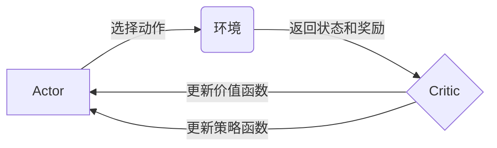

## Actor-Critic Methods原理与代码实例讲解

作者：禅与计算机程序设计艺术

## 1. 背景介绍

### 1.1 强化学习概述

强化学习（Reinforcement Learning, RL）是机器学习的一个重要分支，它关注智能体（agent）如何在与环境的交互中学习最佳策略，以最大化累积奖励。与监督学习不同，强化学习不需要预先提供标记数据，而是通过试错的方式进行学习。

### 1.2 Actor-Critic 方法的起源与发展

Actor-Critic 方法是强化学习中一类重要的方法，它结合了基于价值的学习方法（如 Q-learning）和基于策略的学习方法（如 Policy Gradient）的优点。其核心思想是将策略函数（actor）和价值函数（critic）分开进行学习，actor 负责根据当前状态选择动作，critic 负责评估当前状态的价值或动作的优劣。

### 1.3 Actor-Critic 方法的优势与应用

Actor-Critic 方法相较于其他强化学习方法具有以下优势：

* **能够处理连续动作空间**：Policy Gradient 方法通常难以处理连续动作空间，而 Actor-Critic 方法可以通过 actor 网络输出连续动作。
* **学习效率更高**：Critic 网络的引入可以提供更准确的价值估计，从而加速 actor 网络的学习过程。
* **更适用于复杂环境**：Actor-Critic 方法可以更好地处理具有高维状态空间和复杂动态特性的环境。

Actor-Critic 方法已广泛应用于机器人控制、游戏 AI、推荐系统等领域。

## 2. 核心概念与联系

### 2.1 Actor

Actor 是一个策略函数，它接收当前状态 $s_t$ 作为输入，输出一个动作 $a_t$。Actor 可以是一个神经网络，也可以是其他类型的函数逼近器。

### 2.2 Critic

Critic 是一个价值函数，它接收当前状态 $s_t$ 和动作 $a_t$ 作为输入，输出一个标量值，表示在当前状态下采取该动作的价值。Critic 通常也是一个神经网络。

### 2.3 Actor 与 Critic 的交互

在 Actor-Critic 方法中，actor 和 critic 相互配合，共同完成学习任务。具体来说：

1. Actor 根据当前状态 $s_t$ 选择一个动作 $a_t$。
2. 环境根据该动作 $a_t$ 返回下一个状态 $s_{t+1}$ 和奖励 $r_t$。
3. Critic 根据当前状态 $s_t$、动作 $a_t$ 和奖励 $r_t$ 更新价值函数。
4. Actor 根据 Critic 提供的价值估计更新策略函数。

### 2.4 核心概念联系图



## 3. 核心算法原理具体操作步骤

### 3.1 Actor-Critic 算法流程

1. 初始化 actor 网络和 critic 网络的参数。
2. 循环迭代，直到满足终止条件：
    * 在当前状态 $s_t$ 下，actor 网络选择一个动作 $a_t$。
    * 环境根据该动作 $a_t$ 返回下一个状态 $s_{t+1}$ 和奖励 $r_t$。
    * Critic 网络计算 TD 目标值：$y_t = r_t + \gamma * V(s_{t+1})$，其中 $\gamma$ 是折扣因子，$V(s_{t+1})$ 是 critic 网络对下一个状态 $s_{t+1}$ 的价值估计。
    * Critic 网络根据 TD 误差 $y_t - V(s_t)$ 更新参数。
    * Actor 网络根据 critic 网络提供的价值估计更新参数，目标是最大化累积奖励。

### 3.2 Actor 网络更新

Actor 网络的目标是学习一个策略函数，使得在每个状态下都能选择最优动作。在 Actor-Critic 方法中，actor 网络通常使用策略梯度方法进行更新。

策略梯度方法的基本思想是：如果一个动作获得了比预期更高的奖励，那么就应该增加选择该动作的概率；反之，则应该减少选择该动作的概率。

### 3.3 Critic 网络更新

Critic 网络的目标是学习一个价值函数，能够准确估计每个状态的价值。在 Actor-Critic 方法中，critic 网络通常使用时间差分（TD）学习方法进行更新。

TD 学习方法的基本思想是：利用当前时刻的奖励和对未来奖励的估计来更新对当前状态的价值估计。

## 4. 数学模型和公式详细讲解举例说明

### 4.1 策略梯度

策略梯度方法的目标是最大化累积奖励的期望值：

$$
J(\theta) = \mathbb{E}_{\pi_\theta} [\sum_{t=0}^\infty \gamma^t r_t]
$$

其中，$\theta$ 是策略函数的参数，$\pi_\theta$ 是参数为 $\theta$ 的策略函数，$r_t$ 是在时刻 $t$ 获得的奖励，$\gamma$ 是折扣因子。

策略梯度的计算公式如下：

$$
\nabla_{\theta} J(\theta) = \mathbb{E}_{\pi_\theta} [\sum_{t=0}^\infty \nabla_{\theta} \log \pi_\theta(a_t | s_t) A(s_t, a_t)]
$$

其中，$A(s_t, a_t)$ 是优势函数，表示在状态 $s_t$ 下采取动作 $a_t$ 的优势。

### 4.2 时间差分学习

时间差分学习方法的目标是最小化 TD 误差的平方和：

$$
\min_{\theta} \sum_{t=0}^\infty (y_t - V(s_t))^2
$$

其中，$y_t$ 是 TD 目标值，$V(s_t)$ 是 critic 网络对状态 $s_t$ 的价值估计。

TD 目标值的计算公式如下：

$$
y_t = r_t + \gamma * V(s_{t+1})
$$

### 4.3 举例说明

假设有一个简单的迷宫环境，如下图所示：

```
+---+---+---+
| S |   | G |
+---+---+---+
|   | X |   |
+---+---+---+
```

其中，`S` 表示起点，`G` 表示终点，`X` 表示障碍物。智能体每走一步会得到 -1 的奖励，到达终点会得到 10 的奖励。

我们可以使用 Actor-Critic 方法来训练一个智能体，让它学会如何从起点走到终点。

* **Actor 网络**: 可以使用一个简单的神经网络，输入是当前状态（迷宫格子的坐标），输出是四个方向的概率分布（上、下、左、右）。
* **Critic 网络**: 可以使用一个简单的神经网络，输入是当前状态（迷宫格子的坐标），输出是该状态的价值估计。

训练过程中，智能体会不断与环境交互，根据获得的奖励和 critic 网络提供的价值估计来更新 actor 网络和 critic 网络的参数。最终，智能体将学会如何选择最佳路径，以最大化累积奖励。

## 5. 项目实践：代码实例和详细解释说明

### 5.1 CartPole 环境

本节将以 OpenAI Gym 中的 CartPole 环境为例，演示如何使用 PyTorch 实现一个简单的 Actor-Critic 算法。

CartPole 环境的目标是控制一根杆子，使其保持直立并防止小车滑出屏幕。

### 5.2 代码实现

```python
import gym
import torch
import torch.nn as nn
import torch.optim as optim

# 定义 Actor 网络
class Actor(nn.Module):
    def __init__(self, state_dim, action_dim):
        super(Actor, self).__init__()
        self.fc1 = nn.Linear(state_dim, 64)
        self.fc2 = nn.Linear(64, action_dim)

    def forward(self, state):
        x = torch.relu(self.fc1(state))
        x = torch.softmax(self.fc2(x), dim=-1)
        return x

# 定义 Critic 网络
class Critic(nn.Module):
    def __init__(self, state_dim):
        super(Critic, self).__init__()
        self.fc1 = nn.Linear(state_dim, 64)
        self.fc2 = nn.Linear(64, 1)

    def forward(self, state):
        x = torch.relu(self.fc1(state))
        x = self.fc2(x)
        return x

# 定义 Actor-Critic 算法
class ActorCritic(nn.Module):
    def __init__(self, state_dim, action_dim, lr=1e-3, gamma=0.99):
        super(ActorCritic, self).__init__()
        self.actor = Actor(state_dim, action_dim)
        self.critic = Critic(state_dim)
        self.optimizer = optim.Adam(self.parameters(), lr=lr)
        self.gamma = gamma

    def forward(self, state):
        action_probs = self.actor(state)
        value = self.critic(state)
        return action_probs, value

    def update(self, state, action, reward, next_state, done):
        # 计算 TD 目标值
        with torch.no_grad():
            next_value = self.critic(next_state)
            target_value = reward + self.gamma * next_value * (1 - done)

        # 计算 Critic 损失函数
        value = self.critic(state)
        critic_loss = nn.MSELoss()(value, target_value)

        # 计算 Actor 损失函数
        action_probs = self.actor(state)
        log_prob = torch.log(action_probs.gather(1, action.unsqueeze(1)))
        advantage = (target_value - value).detach()
        actor_loss = -(log_prob * advantage).mean()

        # 更新网络参数
        self.optimizer.zero_grad()
        actor_loss.backward()
        critic_loss.backward()
        self.optimizer.step()

# 创建 CartPole 环境
env = gym.make('CartPole-v1')

# 初始化 Actor-Critic 算法
state_dim = env.observation_space.shape[0]
action_dim = env.action_space.n
agent = ActorCritic(state_dim, action_dim)

# 训练模型
for episode in range(1000):
    state = env.reset()
    done = False
    total_reward = 0
    while not done:
        # 选择动作
        state_tensor = torch.from_numpy(state).float().unsqueeze(0)
        action_probs, _ = agent(state_tensor)
        action = torch.multinomial(action_probs, num_samples=1).item()

        # 与环境交互
        next_state, reward, done, _ = env.step(action)

        # 更新模型
        agent.update(
            state_tensor,
            torch.tensor([action]),
            torch.tensor([reward]),
            torch.from_numpy(next_state).float().unsqueeze(0),
            done
        )

        # 更新状态和奖励
        state = next_state
        total_reward += reward

    print(f'Episode: {episode+1}, Total Reward: {total_reward}')

# 保存模型
torch.save(agent.state_dict(), 'actor_critic_model.pth')

# 加载模型
agent.load_state_dict(torch.load('actor_critic_model.pth'))

# 测试模型
state = env.reset()
done = False
total_reward = 0
while not done:
    # 选择动作
    state_tensor = torch.from_numpy(state).float().unsqueeze(0)
    action_probs, _ = agent(state_tensor)
    action = torch.multinomial(action_probs, num_samples=1).item()

    # 与环境交互
    next_state, reward, done, _ = env.step(action)

    # 更新状态和奖励
    state = next_state
    total_reward += reward

print(f'Test Total Reward: {total_reward}')
```

### 5.3 代码解释

* **Actor 网络**: 使用两层全连接神经网络，输出层使用 softmax 函数将输出转换为概率分布。
* **Critic 网络**: 使用两层全连接神经网络，输出层输出一个标量值，表示状态的价值估计。
* **Actor-Critic 算法**:
    * `forward()` 方法：接收状态作为输入，输出动作概率分布和状态价值估计。
    * `update()` 方法：接收状态、动作、奖励、下一个状态和 done 标志作为输入，更新网络参数。
* **训练过程**:
    * 创建 CartPole 环境。
    * 初始化 Actor-Critic 算法。
    * 循环迭代，每个迭代称为一个 episode。
        * 重置环境状态。
        * 循环迭代，直到 episode 结束。
            * 选择动作。
            * 与环境交互。
            * 更新模型。
            * 更新状态和奖励。
    * 保存模型。
* **测试过程**:
    * 加载模型。
    * 重置环境状态。
    * 循环迭代，直到 episode 结束。
        * 选择动作。
        * 与环境交互。
        * 更新状态和奖励。

## 6. 实际应用场景

### 6.1 游戏 AI

Actor-Critic 方法在游戏 AI 中有着广泛的应用，例如：

* **AlphaGo**: AlphaGo 使用了 Actor-Critic 方法来训练围棋 AI，并在与人类顶尖棋手的对弈中取得了胜利。
* **OpenAI Five**: OpenAI Five 使用了 Actor-Critic 方法来训练 Dota 2 AI，并在与人类职业战队的比赛中取得了胜利。

### 6.2 机器人控制

Actor-Critic 方法也可以用于机器人控制，例如：

* **机械臂控制**: Actor-Critic 方法可以训练机械臂完成各种复杂的任务，例如抓取物体、组装零件等。
* **无人驾驶**: Actor-Critic 方法可以用于训练无人驾驶汽车，使其能够安全、高效地在道路上行驶。

### 6.3 推荐系统

Actor-Critic 方法还可以用于推荐系统，例如：

* **个性化推荐**: Actor-Critic 方法可以根据用户的历史行为和兴趣偏好，推荐用户可能感兴趣的商品或服务。
* **广告推荐**: Actor-Critic 方法可以根据用户的特征和行为，推荐用户可能感兴趣的广告。

## 7. 总结：未来发展趋势与挑战

### 7.1 未来发展趋势

* **更强大的函数逼近器**: 随着深度学习技术的不断发展，我们可以使用更强大的函数逼近器来表示 actor 网络和 critic 网络，例如深度神经网络、图神经网络等。
* **更高效的探索策略**: 探索-利用困境是强化学习中的一个 fundamental 问题，未来需要开发更高效的探索策略，以加速学习过程。
* **更广泛的应用领域**: 随着 Actor-Critic 方法的不断发展，它将被应用于更广泛的领域，例如医疗诊断、金融投资等。

### 7.2 挑战

* **训练效率**: Actor-Critic 方法的训练效率通常较低，需要大量的训练数据和计算资源。
* **超参数调整**: Actor-Critic 方法的性能对超参数比较敏感，需要进行精细的调整才能获得良好的性能。
* **泛化能力**: Actor-Critic 方法的泛化能力通常较差，需要针对不同的任务进行训练。

## 8. 附录：常见问题与解答

### 8.1 Actor-Critic 方法与 Policy Gradient 方法的区别？

Policy Gradient 方法直接对策略函数进行参数化，并通过梯度上升方法来更新参数，以最大化累积奖励的期望值。而 Actor-Critic 方法则将策略函数和价值函数分开进行学习，actor 负责根据当前状态选择动作，critic 负责评估当前状态的价值或动作的优劣。

### 8.2 Actor-Critic 方法与 Q-learning 方法的区别？

Q-learning 方法是一种基于价值的学习方法，它学习一个 Q 函数，该函数接收状态和动作作为输入，输出在该状态下采取该动作的预期累积奖励。而 Actor-Critic 方法则将策略函数和价值函数分开进行学习，actor 负责根据当前状态选择动作，critic 负责评估当前状态的价值或动作的优劣。

### 8.3 Actor-Critic 方法有哪些变种？

Actor-Critic 方法有很多变种，例如：

* **Advantage Actor-Critic (A2C)**
* **Asynchronous Advantage Actor-Critic (A3C)**
* **Proximal Policy Optimization (PPO)**
* **Deep Deterministic Policy Gradient (DDPG)**

### 8.4 如何选择合适的 Actor-Critic 方法？

选择合适的 Actor-Critic 方法取决于具体的应用场景和需求。例如，如果环境具有高维状态空间和复杂动态特性，则可以选择 A3C 或 PPO 等方法；如果需要处理连续动作空间，则可以选择 DDPG 等方法。